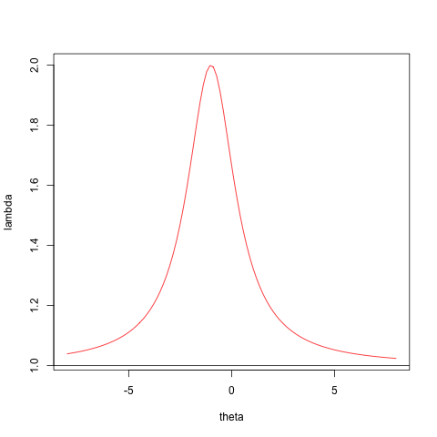
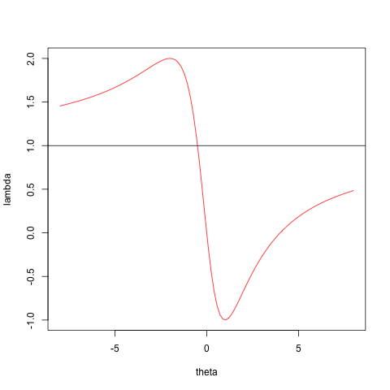

# Coordinate Descent{#coordinatedescent}

## Introduction{#coordinatedescent:introduction}

We discuss coordinate descent and ascent in a separate chapter, because it is a very important special case of block relaxation, with many really interesting examples.

## Convergence rate{#coordinatedescent:convergencerate}

The product form of the derivative of the algorithmic map for coordinate descent is
$$
\mathcal{M}(x)=\left[I-\frac{e_pe_p'\mathcal{D}^2f(x)}
{e_p'\mathcal{D}^2f(x)e_p}\right]
\times\cdots\times
\left[I-\frac{e_1e_1'\mathcal{D}^2f(x)}{e_1'\mathcal{D}^2f(x)e_1}\right],
$$
where the $e_s$ are unit vectors (all elements zero, except for element $s$, which is equal to one).

## Examples{#coordinatedescent:examples}

### The Cartesian Folium{#coordinatedescent:examples:thecartesianfolium}

The ``folium cartesii'' (letter of Descartes to Mersenne, August 23, 1638) is the
function $$f:\mathbb{R}^2\rightarrow\mathbb{R}$$ defined by
$$
f(x,y)=x^3+y^3-3xy.
$$

The gradient is
$$
\mathcal{D}f(x,y)=\begin{bmatrix}3x^2-3y\\3y^2-3x\end{bmatrix},
$$
and the Hessian is
$$
\mathcal{D}^2f(x,y)=\begin{bmatrix}6x&-3\\-3&6y\end{bmatrix}.
$$
It follows that $f(x,y)$ has a saddle point at $(0,0)$ and an isolated local minimum
at $(1,1)$. These are the only two stationary points.  At $(0,0)$ the eigenvalues of the Hessian are $+3$ and $-3$, at $(1,1)$ they are $9$ and $3$.

The Hessian is singular
if and only if $(x,y)$ is on the hyperbola $xy=\frac14$. It is positive definite
if and only if $(x,y)$ is above the branch of the hyperbola in the positive orthant.

See Figure 1 for contour plots of sections of $f$ on two different scales.
<hr>

```{r folium, echo = FALSE, cache = TRUE, fig.align = "center"}
folium <- function (x, y) {
    z <- outer (x ^ 3, y ^ 3, "+")- 3 * outer (x,y)
}

par(mfrow=c(1,2))
x <- y <- seq (-2, 2, by = .01)
contour (x, y, folium (x, y), nlevels = 50, col = "RED", lwd = 2)
x <- y <- seq (0, 2, by = .01)
contour (x, y, folium (x, y), nlevels = 50, col = "RED", lwd = 2)
par(mfrow=c(1,1))
```
<center>
Figure 1: Folium, two scales, two sections
</center>
<hr>


Now apply coordinate descent (@deleeuw_U_07e).
The minimum over $x$ for fixed  $y$ only exists if $y>0$, in which case it is attained at $\sqrt{y}$. In the same way,
the minimum over $y$ for fixed $x>0$ is attained at $\sqrt{x}$. Thus the algorithm is simply
\begin{align*}
x^{(k+1)}&=\sqrt{y^{(k)}},\\
y^{(k+1)}&=\sqrt{x^{(k+1)}},
\end{align*}
and the algorithmic map is
$$
\mathcal{A}(x,y)=\begin{bmatrix}\sqrt{y}\\\sqrt[4]{y}\end{bmatrix}.
$$
The algorithm can only work if we start
with $y^{(0)}>0$. It
then converges, linearly and monotonically, to $(1,1)$ with convergence rate $\frac14$. If we start
with $y^{(0)}\leq 0$ then $x^3+(y^{(0)})^3-3xy^{(0)}$ is unbounded below
and thus coordinate descent fails.


### A Family of Quadratics{#coordinatedescent:examples:afamilyofquadratics}

This example shows some of the properties of coordinate relaxation. We
want to minimize
$$
\psi_{\lambda}(x,y)=\frac{1}{2}x^2+\frac{1}{2}y^2-\lambda xy.
$$
For each $\lambda$ this is a quadratic in $x$ and $y$. If we fix $y$ and $\lambda$, the resulting function is a convex quadratic
in $x$. And if we fix $x$
and $\lambda$, the resulting function is a convex quadratic
in $y$. Thus coordinate relaxation can always be carried out, with
a unique minimum in each substep.

The partials are given by
\begin{align*}
\frac{\partial\psi_{\lambda}}{\partial x}&=x-\lambda y,\\
\frac{\partial\psi_{\lambda}}{\partial y}&=y-\lambda x,
\end{align*}
and the Hessian is the matrix
$$
\begin{bmatrix}
1 & -\lambda\\
-\lambda & 1
\end{bmatrix}.
$$
Thus the eigenvalues of the Hessian are $1+\lambda$ and $1-\lambda$.

If $-1<\lambda<+1$ then the function has a unique isolated minimum equal to zero at $(0,0)$. If $\lambda=+1$ it has a minimum equal to zero on the line $x-y=0$ and
if $\lambda=-1$ it has a minimum equal to zero on the line $x+y=0$.
If $\lambda^{2}>1$ the unique stationary point at $(0,0)$ is a saddle point, and there are no minima or maxima.

Coordinate relaxation gives the algorithm
\begin{align*}
    y^{(k+1)}&=\lambda x^{(k)}=\lambda^2 y^{(k)},\\
    x^{(k+1)}&=\lambda y^{(k+1)}=\lambda^2 x^{(k)},
\end{align*}
or
\begin{align*}
    x^{(k)}&=\lambda^{2k}x^{(0)},\\
    y^{(k)}&=\lambda^{2k-1}x^{(0)}.
\end{align*}
Thus we have convergence to $(0,0)$ if
and only if $\lambda^2<1.$
In that case convergence is linear, with rate $\lambda^2,$
Convergence is immediate, to $(x^{(0)},x^{(0)})$ or $(x^{(0)},-x^{(0)})$, if $\lambda^2=1.$

For the function values we have
$$
\psi^{(k)}=\frac{1}{2}(1-\lambda^{2})\lambda^{4k-2}[x^{(0)}]^{2},
$$
If $\lambda^2>1$ then the function values $\psi^{(k)}$
decrease, and diverge to $-\infty$. Also, $(x^{(k)},y^{(k)})$ diverges to infinity. By defining $\tilde\psi=\exp\psi,$ we easily change the problem into an
equivalent one with the same iterates, for which function
values converge to zero,
but since $(x^{(k)},y^{(k)})$ is the same sequence as before it still diverges to infinity.

Note that
$$
\frac{\psi^{(k+1)}}{\psi^{(k)}}=\lambda^4,
$$
while
$$
\frac{x^{(k+1)}}{x^{(k)}}=\frac{y^{(k+1)}}{y^{(k)}}=
\lambda^2.
$$
Thus function values converge twice as fast as the coordinates of the solution vector.

### Loglinear Models{#coordinatedescent:examples:loglinearmodels}

Let
$$
\mathcal{L}(\theta)=\sum_{k=1}^K n_k\log\lambda_k(\theta)-\lambda_k(\theta),
$$
be a Poisson-log-likelihood with
$$
\lambda_k(\theta)=\exp\sum_{j=1}^m x_{kj}\theta_j.
$$
We see that
$$
\mathcal{D}_j\mathcal{L}(\theta)=\sum_{k=1}^n n_kx_{kj}-\sum_{k=1}^n \lambda_k(\theta)x_{kj},
$$
and
$$
\mathcal{D}_{j\ell}\mathcal{L}(\theta)=-\sum_{k=1}^n\lambda_k(\theta)x_{kj}x_{k\ell}.
$$
Thus the log-likelihood is concave. Normally we would apply a safe-guarded version of Newton's method, but here we want to illustrate CCA.

Now suppose $X=\left\{x_{kj}\right\}$ is a design-type matrix, with elements
equal to $0$ or $1.$ Let
$$
\mathcal{K}_j\mathop{=}\limits^{\Delta}\left\{k\mid x_{kj}=1\right\}.
$$
Then the likelihood equations are
$$
\sum_{k\in\mathcal{K}_j}n_k=\sum_{k\in\mathcal{K}_j}\lambda_k(\theta).
$$
Solving each of these in turn is CCA (since we are maximizing),
which is  also known in this context as
the _iterative propertional fitting_ or _IPF_ algorithm.

We have, using $e_j$ for the coordinate directions,
$$
\lambda_k(\theta+\tau e_j)=\begin{cases}
\lambda_k(\theta)& \text{if $k\not\in\mathcal{K}_j$,}\\
\mu\lambda_k(\theta)& \text{if $k\in\mathcal{K}_j$},
\end{cases}
$$
with $\mu=\exp\tau.$ This explains the name of the algorithm, because the $\lambda_k$
in $\mathcal{K}_j$ are adjusted with the same proportionality factor.

Thus the optimal $\mu$ is simply
$$
\mu={\frac{\sum_{k\in\mathcal{K}_j}n_k}{\sum_{k\in\mathcal{K}_j}\lambda_k(\theta)}}.
$$

This example can be extended to the case in which the elements of the design matrix
are $-1,0,$
and $+1.$ We define
$$
\mathcal{K}_j^+\mathop{=}\limits^{\Delta}\left\{k\mid x_{kj}=1\right\},
$$
and
$$
\mathcal{K}_j^-\mathop{=}\limits^{\Delta}\left\{k\mid x_{kj}=-1\right\}.
$$
We now have to solve the quadratic equation
$$
\mu^2\sum_{k\in\mathcal{K}_j^+}\lambda_k(\theta)-\mu\Delta_j-\sum_{k\in\mathcal{K}_j^-}\lambda_k(\theta)=0,
$$
with
$$
\Delta_j\mathop{=}\limits^{\Delta}\sum_{k\in\mathcal{K}_j^+}n_k-\sum_{k\in\mathcal{K}_j^-}n_k
$$
for the proportionality factor. If $\mathcal{K}_j^-=\emptyset$ then
$$
\mu={\frac{\sum_{k\in\mathcal{K}_j^+}n_k}{\sum_{k\in\mathcal{K}_j^+}\lambda_k(\theta)}}
$$
as before. If $\mathcal{K}_j^+=\emptyset$ then
$$
\mu={\frac{\sum_{k\in\mathcal{K}_j^-}\lambda_k(\theta)}{\sum_{k\in\mathcal{K}_j^-}n_k}}
$$
If the positive and negative index sets are both nonempty, then the quadratic always has one positive and one negative root, and we select the positive one.

Basically the same CCA/IPF technique can also be applied if the elements of $X$ are arbitrary integers. To avoid trivialities we assume each column of $X$ has at least one non-zero element. In that case solving for $\mu$ amounts to solving a higher degree polynomial equation. Suppose the non-zero elements of column $j$ of $X$ are from a
set $\mathcal{I}_j$ of integers. Elements of $\mathcal{I}_j$
can be positive or negative. Define
\begin{align*}
\overline{n}_{ij}&\mathop{=}\limits^{\Delta}\sum\{n_k\mid x_{kj}=i\},\\
\overline{\lambda}_{ij}(\theta)&\mathop{=}\limits^{\Delta}
\sum\{\lambda_k(\theta)\mid x_{kj}=i\}.
\end{align*}
Also define
$$
\Delta_j\mathop{=}\limits^{\Delta}\sum_{i\in\mathcal{I}_j}i\overline{n}_{ij}.
$$
To find the optimal $\mu$ for coordinate $j$ we must
solve $g_j(\mu)=\Delta_j$, where
$$
g_j(\mu)\mathop{=}\limits^{\Delta}\sum_{i\in\mathcal{I}_j}\mu^i i\overline{\lambda}_{ij}(\theta).
$$
Note that $\mathcal{D}g_j(\mu)>0$ for all $\mu>0$, i.e. $g_j$ is strictly increasing. Let $i_j^+$ be the maximum of the $i\in\mathcal{I}_j$ and let $i_j^-$ be the minimum.
We can distinguish three different behaviors of  $g_j$ on the positive reals.

1. If $i_j^->0$ then $g_j$ increases from 0 to $+\infty$.
2. If $i_j^+<0$ then $g_j$ increases from $-\infty$ to 0.
3. If $i_j^-<0$ and $i_j^+>0$ then $g_j$ increases from $-\infty$ to $+\infty$.

In all three cases there is a unique positive root of the equation $g_j(\mu)=\Delta_j$. To solve we note that if $i_j^->0$ we need to find the unique positive real root of a polynomial of degree $i_j^+$. If $i_j^+<0$ we solve the equation for $\frac{1}{\mu}$, again finding the unique positive real root of a polynomial of degree $-i_j^-$. In case 3, in which $\mathcal{I}_j$ has both negative and positive elements, we multiply both sides of the equation by $\mu^{-{i_j}^-}$ to get
$$\sum_{i\in\mathcal{I}_j}\mu^{i-{i_j}^-} i\overline{\lambda}_{ij}(\theta)=\Delta_j\mu^{-{i_j}^-},$$
which is a polynomial equation of degree $i_j^+-i_j^-$, again with a single positive real root. I have written an `R` program for this general case.
The function `polyLogLinF()` does the computations, the function `polyLogLin()` is the driver for the iterations.

<hr>
<center>
[Insert polyLoglin.R Here](../code/polyLoglin.R)
</center>
<hr>
Consider the example with
```r
> x
      [,1] [,2] [,3] [,4]
 [1,]    1    1   -1    0
 [2,]    1    1    1    0
 [3,]    1    1   -1    0
 [4,]    1    2    1    0
 [5,]    1    2   -1    0
 [6,]    1    2    1   -1
 [7,]    1    3   -1   -1
 [8,]    1    3    1   -1
 [9,]    1    3   -1   -1
[10,]    1    0    1   -1
```
and ```n``` equal to ```1:10```. We find, for the final iterations,
```r
Iteration:   34 fold:    4.83068380 fnew:    4.83068066
Iteration:   35 fold:    4.83068066 fnew:    4.83067878
Iteration:   36 fold:    4.83067878 fnew:    4.83067765
Iteration:   37 fold:    4.83067765 fnew:    4.83067697
$lbd
 [1] 3.049407 2.988786 3.049407 2.925556 2.984896 7.968232 7.957861 7.799660
 [9] 7.957861 8.316384

$f
[1] 4.830677

$theta
[1]  1.12628967 -0.02138247 -0.01004005 -1.00197798
```
Note that if we say
```r
polyLogLin(n,x+3)
```
then we find the same solution, although much more slowly,
```r
Iteration:  428 fold:    4.83072092 fnew:    4.83071986
Iteration:  429 fold:    4.83071986 fnew:    4.83071882
Iteration:  430 fold:    4.83071882 fnew:    4.83071780
Iteration:  431 fold:    4.83071780 fnew:    4.83071681
$lbd
 [1] 3.049790 2.993221 3.049790 2.932093 2.987506 7.967771 7.952558 7.805050
 [9] 7.952558 8.303460

$f
[1] 4.830717

$theta
[1]  1.053848982 -0.020633792 -0.009361352 -0.999688396
```

### Rayleigh Quotient{#coordinatedescent:examples:rayleighquotient}

The problem is to minimize the Rayleigh quotient
$$
\lambda(x)=\frac{x'Ax}{x'Bx}
$$
over all $x$. Here $A$ and $B$ are known matrices,
with $B$ positive definite.

If we update $x$
to $\tilde x=x+\theta e_i,$
with $e_i$ a unit vector, then
$$
\lambda(\tilde x)=
\frac{\theta^2a_{ii}+2\theta x'a_i+x'Ax}
{\theta^2b_{ii}+2\theta x'b_i+x'Bx}.
$$
Think of this as a continous rational function $\gamma$ of the single variable $\theta$, which we have to minimize.
Clearly $\gamma$ has a horizontal asymptote, with
$$
\lim_{\theta\rightarrow+\infty}\gamma(\theta)=
\lim_{\theta\rightarrow-\infty}\gamma(\theta)=\frac{a_{ii}}{b_{ii}}.
$$
Also
$$
\mathcal{D}\gamma(\theta)=\frac{2Q(\theta)}{P^2(\theta)},
$$
with
$$
P(\theta)\mathop{=}\limits^{\Delta}\theta^2b_{ii}+2\theta x'b_i+x'Bx,
$$
and
$$
Q(\theta)\mathop{=}\limits^{\Delta}\theta^2(a_{ii}x'b_i-b_{ii}x'a_i)
+\theta(a_{ii}x'Bx-b_{ii}x'Ax)+
(x'a_ix'Bx-x'b_ix'Ax).
$$
In addition
$$
\mathcal{D}^2\gamma(\hat\theta)=2\frac{P^2(\theta)\mathcal{D}Q(\theta)-Q(\theta)\mathcal{D}P^2(\theta)}{P^4(\theta)},
$$
and thus $\mathbf{sign}(\mathcal{D}\gamma(\theta))=
\mathbf{sign}(Q(\theta))$ and at values
where $Q(\theta)=0$ we have $\mathbf{sign}(\mathcal{D}^2\gamma(\theta))=
\mathbf{sign}(\mathcal{D}Q(\theta))$.

We now distinguish three cases.
1. First, $\gamma$ can be a constant function, everywhere equal to $\frac{a_{ii}}{b_{ii}}$. This happens only
if $x=0$ or $x=e_i$, which makes $Q(\theta)=0$ for
all $\theta$. In this case we do not update, and just go to the next $i$.
2. Second, $Q$ can have a zero quadratic term. If we make sure that $\frac{x'Ax}{x'Bx}<\frac{a_{ii}}{b_{ii}}$
then the unique solution of the linear equation $Q(\theta)=0$
satisfies $\mathcal{D}^2\gamma(\theta)>0$, and consequently corresponds with the unique minimum of $\gamma$. Updating $x$ guarantees that we will have $\frac{x'Ax}{x'Bx}<\frac{a_{ii}}{b_{ii}}$ for all subsequent iterations. If we happen to start with or wind up in a point with a zero quadratic term and with $\frac{x'Ax}{x'Bx}>\frac{a_{ii}}{b_{ii}}$ then $\gamma$ does not have a minimum and coordinate descent fails.
3. If $Q$ is a proper quadratic then $\gamma$ is either increasing at both infinities or decreasing at both infinities. In the first case, when $Q$ is a convex quadratic, $\gamma$ increases from the horizontal asymptote to the maximum, then decreases to the minimum, and then increases again to the horizontal asymptote. In the second case, with $Q$ a concave quadratic, $\gamma$ decreases from the horizontal asymptote to the minimum, then increases to the maximum, and then decreases again to the horizontal asymptote. In either case it has two extremes, one minimum and one maximum, corresponding to the roots of the quadratic $Q$. This also shows that if $Q$ is a proper quadratic, then it always has two distinct real roots.

Here is some simple code to illustrate the cases distinguished above. We have a simple function to compute $\lambda$.
<hr>
<center>
[Insert fRayleigh.R Here](../code/fRayleigh.R)
</center>
<hr>
Case 2, with the zero quadratic term,
and Case 3, the proper quadratic,
are illustrated with
```r
a <-  matrix (-1, 3, 3)
diag (a) <- 1
b <-  diag (3)
x <- c(1, 1, -1)
zseq <- seq (-8, 8, length = 100)
png("myOne.png")
plot (zseq, fRayleigh (zseq, 1, x, a, b),type="l",cex=3,col="RED",xlab="theta",ylab="lambda")
abline(h=a[1,1] / b[1,1])
dev.off()
x <- c(1,0,1)
png("myTwo.png")
plot (zseq, fRayleigh (zseq, 2, x, a, b),type="l",cex=3,col="RED",xlab="theta",ylab="lambda")
abline(h=a[2,2] / b[2,2])
dev.off()
```
For Case 2 we see that $$\gamma$$ has no minimum, and CCD fails. For Case 3, which is of course the usual case, there are no problems.

$$
\fbox{Insert Figure 1 here}
$$
$$
\fbox{Insert Figure 2 here}
$$


The coordinate descent method can obviously take sparseness into account, and it can easily be generalized
to separable constraints on the elements of $x,$ such as non-negativity. Note that it also can be used to _maximize_ the Rayleigh quotient, simply by taking the other root of the quadratic. Or, alternatively, we can interchange $A$ and $B$.
<hr>
<center>
[Insert gevCCA.R Here](../code/gevCCA.R)
</center>
<hr>

The second derivative of the Rayleigh quotient at a stationary point normalized
by $x'Bx=1$ is simply
$$
\mathcal{D}^2\lambda(x)=2(A-\lambda(x)B).
$$
This is singular and thus the product form of the derative of the algorithmic map has largest eigenvalue equal to one, corresponding with the eigenvector $x$. Singularity of the Hessian is due, of course, to the fact that $\lambda$ is homogenous of degree zero, and rescaling $x$ does not change the value of the objective function. We can use this to our advantage. Suppose we normalize $x$ to $x'Bx=1$, after each coordinate descent
cycle. This will not change the function values computed by the algorithm, but is changes the algorithmic map. The derivative of the modified map is
$$
\overline{\mathcal{M}}(x)=(I-yy'B)\mathcal{M}(x),
$$
which has the same eigenvalues and eigenvectors as $\mathcal{M}(x)$, except
for $\overline{\mathcal{M}}(x)x=0$, while $\mathcal{M}(x)x=1$.

```{r rcase2, fig.align = "center", echo = FALSE, fig.cap = "Case 2 -- CCA Fails"}

```

```{r rcase3, fig.align = "center", echo = FALSE, fig.cap = "Case 3 -- CCA Works"}

```

### Squared Distance Scaling{#coordinatedescent:examples:squareddistancescaling}

In ALSCAL [Takane, Young, De Leeuw, 1977] we find multidimensional scaling solutions by minimizing the loss function _sstress_, defined by
$$
\sigma_2(X)\mathop{=}\limits^{\Delta}\frac12\sum_{i=1}^n\sum_{j=1}^nw_{ij}(\delta_{ij}-d_{ij}^2(X))^2.
$$
Thus known dissimilarities $\delta_{ij}$ are approximated by squared Euclidean distances between points, which have coordinates in an $n\times p$ matrix $X$.
Both dissimilarities $\Delta=\{\delta_{ij}\}$ and the weights $W=\{w_{ij}\}$ are non-negative, symmetric, and hollow. Thus
$$
d_{ij}^2(X)=\sum_{s=1}^p (x_{is}-x_{js})^2.
$$

Takane et al. discuss different block relaxation approaches to
minimizing $\sigma_2$. Because the loss function is a multivariate quartic
the stationary equations obtained by setting the partials equal to zero are a system of $np$ cubic equations in $np$ unknowns. So, at least theoretically, we could use algebraic methods to solve the stationary equations and find the global minimum
of  _sstress_. This corresponds with the case in which there is only a single block of coordinates, but in the ALSCAL context other blocks are introduced by optimally transforming the dissimilarities and by incorporating weights for individual difference MDS models. At the other extreme of the block relaxation spectrum we could introduce $np$ blocks for the $np$ coordinates, which means we would use coordinate descent. Takane et al. ultimately decide to use a generalized block relaxation method with $n$ blocks of the $p$ coordinates of a single point, with a safeguarded Newton method used to minimize over a single block.

In this section we study coordinate descent in detail. If we modify coordinate $(k,t)$ then only the squared distances $d_{ik}^2$ and $d_{ki}^2$ with $i\not= k$ will change. Adding $\theta$ to $x_{kt}$ with change $d_{ik}^2$
to $d_{ik}^2-2\theta(x_{it}-x_{kt})+\theta^2$. Thus the part of _sstress_ that depends on $\theta$ is 
$$
\sum_{i=1}^n w_{kj}((\delta_{kj}-d_{ik}^2)+2\theta(x_{it}-x_{kt})-\theta^2)^2.
$$
Differentiating this and setting the derivative to zero gives the cubic equation
$$
\sum_{i=1}^n w_{kj}((\delta_{kj}-d_{ik}^2)+2\theta(x_{it}-x_{kt})-\theta^2)((x_{it}-x_{kt})-\theta)=0
$$

\begin{multline*}
\sum_{i=1}^n w_{kj}(\delta_{kj}-d_{ik}^2)(x_{it}-x_{kt})+2\theta\sum_{i=1}^n w_{kj}(x_{it}-x_{kt})^2-\theta^2\sum_{i=1}^n w_{kj}(x_{it}-x_{kt})\\
-\theta\sum_{i=1}^n w_{kj}(\delta_{kj}-d_{ik}^2)+2\theta^2\sum_{i=1}^n w_{kj}(x_{it}-x_{kt})-\theta^3\sum_{i=1}^n w_{kj}
\end{multline*}


### Least Squares Factor Analysis{#coordinatedescent:examples:leastsquaresfactoranalysis}


