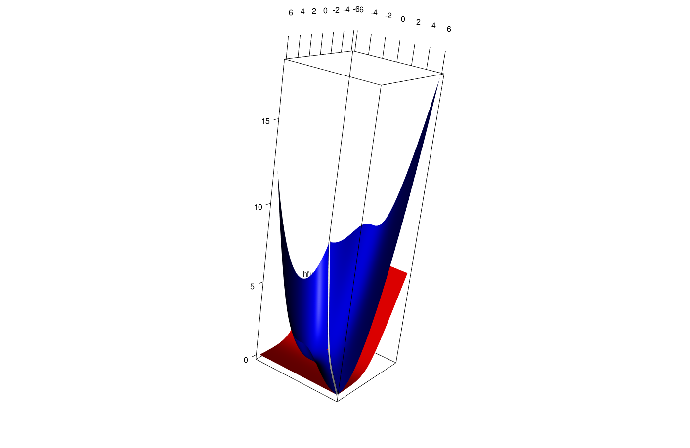

# Majorization Methods

## Introduction

The next step (history again) was to find _systematic ways_ to do
augmentation (which is an art, remember). We start with examples.

An early occurrence of majorization, in the specific context of finding a suitable step size for descent methods,
is in @ortega_rheinboldt_70a). They call this
approach the _Majorization Principle_, which exists alongside other step size principles such as the _Curry-Altman Principle_,
the _Goldstein Principle_, and the _Minimization Principle_.

Suppose we have a current solution $x^{(k)}$ and a descent direction $p^{(k)}$.
Consider the function
$$
g(\alpha):=f(x^{(k)}-\alpha p^{(k)}).
$$
Suppose we can find a function $h$ such that $g(\alpha)\leq h(\alpha)$
for all $0<\alpha<\overline{\alpha}$ and such that $g(0)=h(0)$. Now set
$$
\alpha^{(k)}:=\mathop{\mathbf{argmin}}_{0\leq\alpha\leq\overline{\alpha}}h(\alpha).
$$
Then the sandwich inequality says
$$
g(\alpha^{(k)})\leq h(\alpha^{(k)})\leq h(0)=g(0),
$$
and thus $f(x^{(k)}-\alpha^{(k)}p^{(k)})\leq f(x^{(k)}).$

Ortega and Rheinboldt point out that if the derivative of $f$ is Hölder continuous, i.e. if for some $0<\lambda\leq 1$
$$
\|\mathcal{D}f(x)-\mathcal{D}f(y)\|\leq\gamma\|x-y\|^\lambda,
$$
then we can choose
$$
h(\alpha)=h(0)-\alpha\langle p^{(k)},\mathcal{D}f(x^{(k)})\rangle+\frac{\gamma}{1+\lambda}(\alpha\|p^{(k)}\|)^{1+\lambda},
$$
which implies
$$
\alpha^{(k)}=\frac{1}{\|p^{(k)}\|}\left[\frac{\langle p^{(k)},\mathcal{D}f(x^{(k)})\rangle}{\gamma\|p^{(k)}\|}\right]^{\frac{1}{\lambda}}.
$$


## Definitions

### Majorization at a Point

Suppose $f$ and $g$ are real-valued functions on $\mathcal{X}\subseteq\mathbb{R}^{n}$. We say
that $g$ _majorizes_ $f$  _over_ $\mathcal{X}$ _at_ $y\in\mathcal{X}$ if

* $g(x)\geq f(x)$ for all $x\in\mathcal{X}$,
* $g(y)=f(y)$.

If the first condition can be replaced by

* $g(x)$ > $f(x)$ for all $x\in\mathcal{X}$ with $x\not= y$,

we say that majorization at $y\in\mathcal{X}$ is _strict_.

Equivalently majorization is strict if the second condition can be replaced by

* $g(x)=f(x)$ if and only if $x=y$.

<hr>
Since we formulate all optimization problems we encounter as minimization problems, we only use _majorization_, not
_minorization_. But just for completeness, if $g$ majorizes $f$ at $y$ over $\mathcal{X}$, then $f$ _minorizes_ $g$ at $y$ over $\mathcal{X}$.
<hr>

<hr>
We will see plenty of examples as we go on, but for now a simple one suffices. Figure 1 shows the logarithm
on $\mathbb{R}^+$ strictly majorized at $+1$ by the linear
function $g:x\rightarrow x-1.$
<hr>
```{r loog,fig.align="center", echo = FALSE, cache = TRUE}
x<-seq(0.1,3,by=.01)
plot(x,log(x),type="l",col="RED",lwd=3)
lines(x,x-1,col="BLUE",lwd=2)
```
<center>
Figure 1: Linear Majorizer of the Log at +1
</center>
<hr>
Note that the definition of majorization at a point always has to take the set $\mathcal{X}$ into account.
If $g$ majorizes $f$ over $\mathcal{X}$ at $y$,
then it may very well not majorize over a larger set. But, of course, it does majorize $f$ at $y$ over any subset of $\mathcal{X}$ containing $y$.

In most of our examples and applications $\mathcal{X}$
will be equal to $\mathbb{R}$, $\mathbb{R}^+$, or $\mathbb{R}^n$ but in some cases we consider majorization over an interval or, more generally, a convex subset of $\mathbb{R}^n.$ If we do not explicitly mention the set on which $g$ majorizes $f$, then we implicitly mean the whole domain of $f$. But we'll try to be as explicit as possible, because our treatment, unlike some earlier ones, does not just discuss majorization over the whole space where $f$ is defined.

As an example, consider the cubic $f:x\rightarrow\frac13 x^3-4x$ which is majorized
at $+1$ on the half-open interval $(-\infty,4]$ by the quadratic $g: x\rightarrow\frac43-7x+2x^2$. This particular quadratic is constructed, by the way, by solving the
equations $f(1)=g(1), f'(1)=g'(1),$ and $f(4)=g(4)$. On the other hand it is easy to see that a non-trivial cubic $f$ cannot be
majorized at any $y$ by a quadratic $g$ on the whole real line, because $g-f$, which is again a non-trivial cubic, would have to be non-negative for all $x,$ which is impossible.
<hr>
```{r cubby,fig.align="center", echo = FALSE, cache = TRUE}
x<-seq(-4,6,by=.01)
plot(x,(x^3)/3-4*x,type="l",col="RED",lwd=3)
lines(x,2*x^2-7*x+4/3,col="BLUE",lwd=2)
```
<center>
Figure 2: Quadratic Majorizer of a Cubic on an Interval
</center>
<hr>

It follows directly from the definition that $g$ majorizes $f$ at $y$ if and only if  $g-f$ has a global minimum over $\mathcal{X}$, equal to zero, at $y$. And majorization is strict if this minimum is unique. Thus a necessary and sufficient condition for majorization at $y\in\mathcal{X}$ is
$$
\min_{x\in\mathcal{X}}\ (g(x)-f(x))=g(y)-f(y)=0.
$$
Since a global minimum is also a local minimum, it follows that if $g$ majorizes $f$ at $y\in\mathcal{X}$ then $g-f$ has a local minimum , equal to zero, over $\mathcal{X}$ at $y$. This is a convenient necessary condition for majorization.
A sufficient condition for $g$ to majorize $f$ at $y$ is that $g-f$ is a convex function with a minimum at $y$ equal to zero. Because of convexity this minimum is then necessarily the global minimum.
<hr>
If $g$ majorizes $f$ at $y\in\mathcal{X}$ then the points $y\in\mathcal{X}$ where $g(y)=f(y)$ are called _support points_. If majorization is strict there is only one support point. There can, however, be arbitrarily many.

Consider $f:x\rightarrow x^2-10\sin^2(x)$ and $g:x\rightarrow x^2$.
Then $g$ majorizes $f$ on the real line, with support points at all integer multiples of $\pi$. This is illustrated in Figure 3.
<hr>
```{r infty,fig.align="center", echo = FALSE, cache = TRUE}
x<-seq(-10,10,by=.01)
plot(x,x^2-10*(sin(x))^2,type="l",col="RED",lwd=3)
lines(x,x^2,col="BLUE",lwd=2)
```
<center>
Figure 3: Quadratic Majorizer with an Infinite Number of Support Points
</center>
<hr>
In fact if $f:x\rightarrow\max(x,0)$ and $g:x\rightarrow|x|$ then $g$ majorizes $f$ at all $y\leq 0$, and thus there even is a continuum of support points. And actually $f$ itself majorizes $f$ at all $y\in\mathcal{X}.$

### Majorization on a Set

We can have different majorizations of $f$ on $\mathcal{X}$ at different points $y_1,\cdots,y_n\in\mathcal{X}$. Now consider the situation in which we have a different majorization for each point $y\in\mathcal{X}$.
<hr>
Suppose $f$ is a real-valued function on $\mathcal{X}$ and $g$ is a real-valued function on $\mathcal{X}\otimes\mathcal{X}$. We say
that $g$ is a  _majorization scheme_ for $f$ _on_ $\mathcal{X}$ if

* $g(x,y)\geq f(x)$ for all $x,y\in\mathcal{X}$,
* $g(y,y)=f(y)$ for all $y\in\mathcal{X}$.

Majorization is _strict_ if the first condition can be replaced by

* $g(x,y)>f(x)$ for all $x,y\in\mathcal{X}$ with $x\not= y$.

Or, equivalently, if the second condition can be replaced by

* $g(x,y)=f(x)$ if and only if $x=y$.

<hr>

We call $g$ a _majorization scheme_ for $f$ on $\mathcal{X}$, because $g$ automatically gives a majorization for $f$ for every $y\in\mathcal{X}$. Thus a majorization of $f$ on $\mathcal{X}$ at $y$ is a real-valued function $g$ on $\mathcal{X}$, a majorization scheme for $f$ on $\mathcal{X}$ is a real-valued function on $\mathcal{X}\otimes\mathcal{X}$.

Because $g(x,y)\geq g(x,x)=f(x)$ for all $x,y\in\mathcal{X}$ we see that
$$
f(x)=\min_{y\in\mathcal{X}}g(x,y)
$$
for all $x\in\mathcal{X}$. Thus $g$ majorizes $f$ if and only if $f(x)=\min_{y\in\mathcal{X}} g(x,y)$ and the minimum is attained for $y=x.$ Strict majorization means the minimum is unique. It follows that the majorization relation between functions is a special case of the augmentation relation.

As an example of a majorization scheme for $f:x\rightarrow -\log(1+\exp(-x))$ we use
$$
g(x,y)=f(y)+f'(y)(x-y)+\frac18(x-y)^2.
$$
Also define the function $h$ by $h(x,y)=f(x)$.

Function $g$ is plotted in figure \@ref(fig:logitcouple) in blue, function $h$ is in red.

```{r logitcouple, fig.align = "center", echo = FALSE, fig.cap = "Majorization Scheme for log(1+exp(x))"}

```
Note that the intersection of the graph of both $g$ and $h$ with the diagonal vertical plane $x=y$ is the set of $(x,y,z)$ such that $x=y$ and $z=g(x,x)=h(x,x)=f(x)$. This is the white line in the plot.

Graphs of the intersection of the graphs of $g$ and $h$ with the vertical planes $y=c$ parallel to the $x$-axes at $y=-5,-2,0,2,5$ are in Ffigure \@ref(fig.interplanes). The red lines are the intersections with $h$, i.e. the
function $f$, the blue lines are the quadratics majorizing $f$ at $y=-5,-2,0,2,5$.
```{r logitcomp, echo=FALSE}
pfunc <- function(x) 1 / (1 + exp (-x))
ffunc <- function (x) -log (pfunc (x))
dfunc <- function (x) pfunc (x) - 1
gfunc <- function(x,y) ffunc (y) + dfunc (y) * (x - y) + ( (x - y) ^ 2) / 8
hfunc <- function(x,y) ffunc (x)
xseq <- yseq <- seq(-6, 6, by = .01)
qts <- c(-5,-2,0,2,5)
```

<hr>
```{r interplanes, echo=FALSE, fig.align="center", fig.cap="Intersections of $g$ with $y=c$ planes"}
plot (xseq, ffunc(xseq), type ="l", col = "RED", lwd =3, xlab = "x", ylab = "g and h")
for (y in qts) {
    lines (xseq, gfunc (xseq, y), col = "BLUE", lwd = 2)
    abline (v = y)
}
```

Graphs of intersection of the graphs of $g$ and $h$ with the vertical planes $x=c$ parallel to the $y$-axes at $x=-5,-2,0,2,5$ are in figure
\@ref{fig.logitother}. They illustrate that $\min_y g(x,y)=f(x)$. The horizontal red lines are the intersections of the planes $x=c$ with the graph of $h$ at $f(-5),f(-2),f(0),f(2),$ and $f(5)$.

```{r logitother, echo = FALSE, fig.align="center", fig.cap = "Intersections of $g$ with $x=c$ planes"}
plot (xseq, ffunc(xseq), type = "n", xlab = "y", ylab = "g and h")
for (x in qts) {
    lines (yseq, gfunc (x, yseq), col = "BLUE", lwd = 2)
    abline (h = ffunc (x), col = "RED", lwd = "3")
}
```

The code to produce all three figures is in `logitcouple.R`.
<hr>
<center>
[Insert logitcouple.R Here](../code/logitcouple.R)
</center>
<hr>

### Majorization Algorithm

The basic idea of a _majorization algorithm_ is simple: it is the augmentation algorithm applied to the majorization function.

Suppose our current best
approximation to the minimum of $f$ is $x^{(k)}$, and we have a $g$ that majorizes $f$ on $\mathcal{X}$ in $x^{(k)}$. If $x^{(k)}$ already minimizes $g$ we stop, otherwise we update $x^{(k)}$ to $x^{(k+1)}$ by minimizing $g$ over $\mathcal{X}$.

If we do not stop, we have the _sandwich inequality_
$$
f(x^{(k+1)})\leq g(x^{(k+1)})<g(x^{(k)})=f(x^{(k)}),
$$
and in the case of strict majorization even
$$
f(x^{(k+1)})<g(x^{(k+1)})<g(x^{(k)})=f(x^{(k)}).
$$

We then select a new function $g$ that majorizes $f$ on $\mathcal{X}$ at $x^{(k+1)}$. Repeating these steps produces a decreasing sequence of function values, and the usual compactness and continuity conditions guarantee convergence of both sequences $x^{(k)}$ and $f(x^{(k)})$.

Here is an artificial example, chosen because of its simplicity.
Consider $f(x)=x^4-10x^2.$ Because $x^2\geq y^2+2y(x-y)=2yx-y^2$
we see that $g(x,y)=x^4-20yx+10y^2$
is a suitable majorization function. The majorization
algorithm is $x^{(k+1)}=\sqrt[3]{5x^{(k)}}.$

The first iterations of the algorithm are illustrated in Figure 1. We
start with $x^{(0)}=3,$ where $f$ is $-9$. Then $g(x,3)$ is
the blue function.
It is minimized at $x^{(1)}\approx 2.4662,$
where $g(x^{(1)},3)\approx -20.9795,$
and $f(x^{(1)})\approx -23.8288.$ We then majorize by using
the green function $g(x,x^{(1)})$, which has
its minimum at about $2.3103,$
equal to about $-24.6430.$ The
corresponding value of $f$ at this point
is about $-24.8861.$ Thus we are rapidly getting close to the local
minimum at $\sqrt{5}\approx 2.2361,$ with value $-25.$ The linear
convergence rate at the stationary point is $\frac{1}{3}.$
<hr>

```{r bookfig5, fig.align="center", echo = FALSE, cache = TRUE}
x<-seq(0,3,by=.01)
plot(x,x^4-10*x^2,col="RED",type="l",lwd=3,ylim=c(-25,1))
y0<-3
lines(x,x^4-20*x*y0+10*y0^2,col="BLUE",lwd=2)
y1<-(5*y0)^(1/3)
lines(c(y1,y1),c(y1^4-20*y1*y0+10*y0^2,y1^4-10*y1^2))
lines(x,x^4-20*x*y1+10*y1^2,col="GREEN",lwd=2)
y2<-(5*y1)^(1/3)
lines(c(y2,y2),c(y2^4-20*y2*y1+10*y1^2,y2^4-10*y2^2))
```
<center>
Figure 1: Toy example, first iterations
</center>
<hr>
Table 1 show the iterations to convergence, with an estimate of the iteration radius in the last column.
<hr>

```{r tabexample, echo=FALSE, cache = TRUE}
f<-function (x) x^4-10*x^2
g<-function(x,y) x^4-20*x*y+10*y^2
xold<-3
fold <- f(xold)
eold <- Inf
rold <-  0
for (i in 1:15) {
    xnew <- (5*xold)^(1/3)
    fnew <- f(xnew)
    enew <- xnew - sqrt(5)
    rnew <- enew / eold
     cat( "Iteration: ", formatC (i, width = 3, format = "d"),
            "fold: ", formatC (fold, digits = 8, width = 12, format = "f"),
            "fnew: ", formatC (fnew, digits = 8, width = 12, format = "f"),
            "xold: ", formatC (xold, digits = 8, width = 12, format = "f"),
            "xnew: ", formatC (xnew, digits = 8, width = 12, format = "f"),
            "ratio: ", formatC (rnew, digits = 8, width = 12, format = "f"),
            "\n")
    xold <- xnew
    fold <- fnew
    eold <- enew
    rold <- rnew
}
```
<center>
Table 1: Toy example, iterations to convergence
</center>
<hr>
We also show the cobwebplot (see [section 14.11.2](../background/cobweb.html)) for the iterations, which illustrates the decrease of the difference between subsequent iterates.
<hr>

```{r cobexample, fig.align="center", echo = FALSE, cache = TRUE}
cobwebPlotter <- function (xold, func, lowx = 0, hghx = 1, lowy = lowx, hghy = hghx,
                      eps = 1e-10, itmax = 25, ...) {
     x <- seq (lowx, hghx, length = 100)
     y <- sapply (x, function (x) func (x, ...))
     plot (x, y, xlim = c(lowx ,hghx), ylim = c(lowy,hghy),
           type = "l", col = "RED", lwd = 2)
     abline (0, 1, col = "BLUE")
     base <- 0
     itel <- 1
     repeat {
         xnew <- func (xold, ...)
         if (itel > 1) {
             lines (matrix(c(xold,xold,base,xnew),2,2))
         }
         lines (matrix(c(xold,xnew,xnew,xnew),2,2))
         if ((abs (xnew - xold) < eps) || (itel == itmax)) {
             break ()
         }
         base <- xnew
         xold <- xnew
         itel <- itel + 1
    }
 }
cobwebPlotter(3,function(x) (5*x)^(1/3),lowx=2,hghx=3)
```
<center>
Figure 2
</center>
<hr>

###  Alternative Definitions

Suppose $f$ and $g$ are arbitrary real-valued functions on $\mathcal{X}$. Define
\begin{align*}
\mathcal{S}_-(f,g):=&\{x\in\mathcal{X}\mid f(x)\leq g(x)\},\\
\mathcal{S}_0(f,g):=&\{x\in\mathcal{X}\mid f(x)=g(x)\}.
\end{align*}
Thus $\mathcal{S}_0(f,g)\subseteq\mathcal{S}_-(f,g).$
Then if
\begin{align*}
x&\in\mathcal{S}_0(f,g),\\
y&\in\mathop{\mathbf{argmin}}_{x\in\mathcal{S}_-(f,g)}g(x),
\end{align*}
we have
$$
f(y)\leq g(y)\leq g(x)=f(x).
$$

```{r strange, fig.align="center",cache = TRUE,echo=FALSE}
x<-seq(0.5,2.5,by=.01)
plot(x,x^2,col="RED",type="l",lwd=2, ylab="f and g")
lines(x,3*x-2,col="BLUE",lwd=2)
```

## Relatives

### The Concave-Convex Procedure

The Concave-Convex Procedure (CCCP) was first proposed by @yuille_rangarajan_03. Its global convergence was studied using the Zangwill theory by @sriperumbudur_lanckriet_12, and its rate of convergence using block relaxation theory by @yen_peng_wang_lin_12. The CCCP was discussed in a wider optimization context by @lipp_boyd_15.

The starting point of Yuille and Rangarajan, in the context of energy functions for discrete dynamical systems, is the decomposition of a function $f$ with bounded Hessian into a sum of a convex and a concave function. As we shall show in [section 9.2.1](../linear/dc.html) on differences of convex
functions any function on  a compact set with continuous second derivatives can be decomposed in this way. If $f=u+v$ with $u$ convex and $v$ concave, then the CCCP is the algorithm
$$
\mathcal{D}u(x^{(k+1)})=-\mathcal{D}v(x^{(k)}).
$$
Now, by tangential majorization, $f(x)\leq g(x,y)$ with
$$
g(x,y) = u(x)+v(y)+(x-y)'\mathcal{D}v(y).
$$
The function $g$ is convex in $x$, and consequently the majorization algorithm in this case is exactly the CCCP.

### Generalized Weiszfeld Methods

We discuss Weiszfeld's algorithm for the single facility location problem, or equivalently for the spatial median problem, in [section 7.3.2](../inequalities/location.md). But, in an important early article, @vosz_eckhardt_80 pointed out that Weiszfeld's
algorithm is a member of a much more general class of algorithms, whch they called _Generalized Weiszfeld Methods_.

The problem Voß and Eckhardt consider is to minimize a twice continuously differentiable $f$ over a
polyhedron $\mathcal{X}\subseteq\mathbb{R}^n$, defined by a number of linear inequalities. They assume that $f$ is bounded from below on $\mathcal{X}$ and that the sublevel sets $\{x\mid f(x)\leq\gamma\}$ have a empty of bounded intersection with $\mathcal{X}$. They
define the quadratic approximation
$$
g(x,y)=f(y)+(x-y)'\mathcal{D}f(y)+\frac12(x-y)'A(y)(x-y)
$$
for which they assume that $g(x,y)\geq f(x)$ for all $x\in\mathcal{X}.$ In addition the spectral norm $\|A(y)\|$ is must be bounded from above on $\mathcal{X}$ by $A_\infty$, and the smallest eigenvalue of $A(y)$ must be bounded from below on $\mathcal{X}$ by a positive number $\gamma_0$. Their algorithm is
$$
x^{(k+1)}=\mathop{\mathbf{argmin}}\limits_{x\in\mathcal{X}} g(x,x^{(k)}).
$$

This, of course, is a majorization algorithm. In fact, it is an example of the quadratic mjaorization algorithms we discuss in detail in [chapter 10](../quadratic/README.html). Voß and Eckhardt proceed to prove global convergence, which actually follows directly from Zangwill's theory, and local linear convergence, which follows from Ostrowski's theorem.

### The EM Algorithm

### The Lower-Bound Principle

### Dinkelbach Majorization


Suppose $f$ is defined on $X$ and $g$ on $X\otimes X$. Then we
say that $g$ _G-majorizes_ $f$ at $y\in X$ if
\begin{align*}
f(x)&\leq g(x,y),\\
f(y)&= g(y,y),
\end{align*}
We say that $g$ G-majorizes $f$ on $X$ if it majorizes $f$ for each $y\in X$.


Suppose $f$ is defined on $X$ and $h$ on $X\otimes X$. Then we
say that $h$ _H-majorizes_ $f$ at $y\in X$ if
\begin{align*}
f(x)-f(y)&\leq h(x,y),\\
h(y,y)&=0.
\end{align*}

**Theorem:** If $h$ H-majorizes $f$ at $y$, then $g$ defined by $g(x,y)=f(y)+h(x,y)$ G-majorizes $f$ at $y$. Conversely,
if $g$ G-majorizes $f$ at $y$, then $h$ defined
by $h(x,y)=g(x,y)-f(y)$ H-majorizes $f$ at $y$.

Suppose $f$ is defined on $X$ and $h$ on $X\otimes X$. Then we
say that $h$ _D-majorizes_ $f$ at $y\in X$ if
\begin{align*}
h(x,y) < 0 &\Rightarrow  f(x)<f(y),\\
h(y,y)&=0.
\end{align*}

**Theorem**
If $h$ H-majorizes $f$ at $y$, then $h$
D-majorizes $f$ at $y$.

The difference between D-majorization and H-majorization
is that if $h(x,y)>0$ we can have $f(x)-f(y)>h(x,y)$.

Quick note: D-majorization is also
$$
g(x,y)=f(y)+h(x,y)<f(y)=g(y,y)\Rightarrow f(x)<f(y)
$$

If $f(x)=a(x)/b(x)$, with $b(x)>0$ for all $x\in X$,
then $h(x,y)=a(x)-f(y)b(x)$ D-majorizes $f(x)$ at $y$.

## Further Results

### Rate of Convergence

Majorization is a special case of our results for augmentation
previous theory, because $\mathcal{X}=\mathcal{Y}$ and because $y(x)=x$.

This implies that $\mathcal{D}_2(x,x)=0$
for all $x,$ and
consequently $\mathcal{D}_{12}=-\mathcal{D}_{22}.$
Thus $\mathcal{M}(x)=-\mathcal{D}_{11}^{-1}\mathcal{D}_{12}^{\ }.$

Again, to some extent, finding a majorization function is an art. Many
of the classical inequalities can be used (Cauchy-Schwarz, Jensen, H\"older,
Young, AM-GM, and so on).

### Univariate and Separable Functions

Many of our examples are majorizations of a real-valued function $f$ of a single real variable over the real line $\mathbb{R}.$ This is partly for
mathematical convenience, because many results are simpler in the univariate case. And partly for didactic reasons, because plots and tables are
more easy to visualize and interpret.

As pointed out by
@deleeuw_lange_A_09 looking at the univariate case is obviously restrictive, but not as restrictive as it seems. Many
of the functions in optimization and statistics are _separable_, which means they are of the form
$$
f(x)=\sum_{i=1}^n f_i(x_i),
$$
and majorizing each of the univariate $f_i$ gives a majorization of $f$.
Note that if $f(x)=\prod_{i=1}^n f_i(x)$, where the $f_i$ are positive,
can be turned into a separable problem by taking logarithms.

In addition it is often possible to majorize a non-separable function by a separable one. Suppose, for example, that
$$
f(x)=\frac12\sum_{i=1}^n\sum_{j=1}^n w_{ij}f_i(x_i)f_j(x_j),
$$
where $W=\{w_{ij}\}$ is positive semi-definite. Suppose we can find a diagonal $D$ such that $W\lesssim D$ then for any two vectors $u$
and $v$ in $\mathbb{R}^n$

\begin{multline*}
u'Wu=(v+(u-v))'W(v+(u-v))\leq \\v'Wv+(u-v)'Wv+(u-v)'D(u-v)=\\
(u-z)'D(u-z)+v'(W-WD^{-1}W)v,
\end{multline*}

where $z\mathop{=}\limits^{\Delta}(I-D^{-1}W)v.$ Thus
$$
f(x)\leq\frac12\sum_{i=1}^n d_i(f_i(x)-z_i(y))^2+
\frac12\sum_{i=1}^n\sum_{j=1}^nh_{ij}f_i(y)f_j(y),
$$
with $H\mathop{=}\limits^{\Delta}W-WD^{-1}W.$ The majorizer we have constructed is separable.

### Differentiable Functions

We first show that differentiable majorizations of differentiable functions must have certain properties at the
support point.
<hr>
**Theorem**: Suppose $f$ and $g$ are differentiable at $y$. If $g$ majorizes $f$ at $y$, then

* $g(y)=f(y)$,
* $g'(y)=f'(y)$,

If $f$ and $g$ are twice differentiable at $y$, then in addition

* $g''(y)\geq f''(y)$,

and if $g$ majorizes $f$ strictly

* $g''(y)>f''(y)$.

**Proof:**
If $g$ majorizes $f$ at $y$ then $g-f$ has a minimum at $y$. Now use the
familiar necessary conditions for the minimum of a differentiable function, which say
the derivative at the minimum is zero and the second derivative is non-negative.
**QED**
<hr>

The conditions in the theorem are only necessary because they are local, they only say something about the value of $g$ and its derivatives at $y$. But majorization is a global relation to make global statements we need conditions like convexity. We already know that if $g-f$ is convex with a minimum at $y$ equal to zero,
then $g$ majorizes $f$ at $y$. For differentiable $f$ and $g$ this means that if $f-g$ is convex
then $g$ majorizes $f$ at $y$ if and only if $f(y)=g(y)$ and $f'(y)=g'(y)$. And for twice-differentiable $f$ and $g$ with $f''(x)\geq 0$ for all $x$ again $g$ majorizes $f$ at $y$ if and only if $f(y)=g(y)$ and $f'(y)=g'(y)$.

In the case of majorization at a single $y$ we have $f'(y)=g'(y)$ for differentiable functions. If $g$ majorizes $f$ on $\mathcal{Y}\subseteq\mathcal{X}$
then $g(x,y)-f(x)\geq 0$ for all $x\in\mathcal{X}$
and all $y\in\mathcal{Y}$. Thus
$$
0=g(y,y)-f(y)=\min_{x\in\mathcal{X}}g(x,y)-f(x)
$$
for each $y\in\mathcal{Y}$. In addition
$$
f(x)=g(x,x)=\min_{y\in\mathcal{Y}}g(x,y).
$$
<hr>
In the case of majorization at a single $y$ we had $f'(y)=g'(y)$ for differentiable functions. In general
the function $f$ defined by $f(x)=\min_{y\in\mathcal{Y}} g(x,y)$ is not differentiable. If the partials $\mathcal{D}_1g$ are continuous then the derivative at $x$ in the direction $z$ satisfies
$$
df_z(x)=\min_y\{z'D_1g(x,y)\mid f(x)=g(x,y)\}.
$$
In the case of strict majorization this gives
$$
\mathcal{D}f(x)=\mathcal{D}_1g(x,x).
$$


<hr>
Theorem \ref{T:nes} can be generalized in many directions if differentiability fails.
If $f$ has a left and right derivatives in $y$, for instance, and $g$ is differentiable, then
$$
f'_R(y)\leq g'(y)\leq f'_L(y).
$$

If $f$ is convex, then $f'_L(y) \leq f'_R(y)$, and $f'(y)$ must exist in order for a differentiable $g$ to majorize $f$ at $y$. In this case $g'(y)=f'(y)$.

For nonconvex $f$ more general differential inclusions are possible using the four Dini derivatives of $f$ at $y$ [see, for example, McShane, 1944, Chapter V].

Locally Lipschitz functions, Proximinal and Frechet and Clarke subgradients, sandwich and squeeze theorems


One-sided Chebyshev. Find $g\in\mathcal{G}$ such that $g\geq f$,
$g(y)=f(y)$ and $\sup_x|g(x)-f(x)|$ is minimized.
For instance $\mathcal{G}$ can be the convex functions, or the polynomials of a certain degree, 
or piecewise linear functions or splines.

### Composition


**Theorem: [Sum of functions]**
Suppose $h$ is defined on $\mathcal{X}\otimes\mathcal{U}$ and $f(x)=\int_U h(x,u)dF(u)$. Suppose $k$ is defined on $\mathcal{X}\otimes\mathcal{X}\otimes\mathcal{U}$ and satisfies
$$
h(x,u)=k(x,x,u)=\min_{y\in\mathcal{X}} k(x,y,u)
$$
for all $x\in\mathcal{X}$ and $u\in\mathcal{U}$. Then $g$ defined by
$$
g(x,y)=\int_U k(x,y,u)dF(u)
$$
satisfies
$$
f(x)=\min_{y\in\mathcal{X}} g(x,y)
$$

**Proof:** $h(x,u)=k(x,x,u)\leq k(x,y,u)$. Integrate to get $f(x)=g(x,x)\leq g(x,y)$.
**QED**
<hr>
**Theorem: [Inf of functions]**
Suppose $f=\inf_{u} v(\bullet,u)$ and let $X(u)=\{x|f(x)=v(x,u)\}$.
Suppose $y\in X(u)$ and $g$ majorizes $v(\bullet,u)$ at $y$. Then $g$ majorizes $f$ at $y$.

**Proof:** $g(x)\geq v(x,u)\geq\inf_{u} v(x,u)=f(x)$, and because $y\in X(u)$
also $g(y)=v(y,u)=f(y)$.
**QED**
<hr>
Observe the theorem is not true for $sup$, and also we cannot say that
if $w(\bullet,u )$ majorizes $v(\bullet,u)$ for all $u$ at $y$, then $g=\inf_{u} w(\bullet,u)$
majorizes $f$ at $y$.
<hr>
**Theorem: [Composition of functions]**
If $g$ majorizes $f$ at $y$ and $\gamma:\mathbb{R}\rightarrow \mathbb{R}$ is non-decreasing, then $\gamma\circ g$ majorizes $\gamma\circ f$ at $y$. If, in addition, $\gamma$ majorizes
the non-decreasing $\eta:\mathbb{R}\rightarrow \mathbb{R}$ at  $g(y)$, then $\gamma\circ g$
majorizes $\eta\circ f$.

**Proof:** $g(x)\geq f(x)$ and thus $\gamma(g(x))\geq\gamma(f(x))$. Also $g(y)=f(y)$ and thus $\gamma(g(y))=\gamma(f(y))$. For the second part
we have $\gamma(g(x))\geq\eta(g(x))\geq\eta(f(x))$ and $\gamma(g(y))=\eta(g(y))=\eta(f(y))$.
**QED**
<hr>

**Theorem: **
Suppose  $f=\min_{k} f_{k}$ and let $S_{i}$ be the set where $f=f_{i}$.
If $y\in S_{i}$ and $g$ majorizes $f_{i}$ at $y$, then $g$ majorizes $f$ at $y$.


**Proof:**
First $g(x)\geq f_{i}(x)\geq\min_{k} f_{k}(x)=f(x)$.
Because $y\in S_{i}$ also $g(y)=f_{i}(y)=f(y)$.
**QED**
<hr>

This implies that if  $f=\min_{k} f_{k}$ has a quadratic majorizer at each $y$, if each of the $f_{k}$ has a quadratic majorizer at each $y$.
<hr>

### Majorization Duality

Because $g(x,y)\geq g(x,x)=f(x)$ for all $x,y\in\mathcal{X}$ we have seen that
$$
f(x)=\min_{y\in\mathcal{X}}g(x,y)
$$
for all $x\in\mathcal{X}$.
Thus
$$
\min_{x\in\mathcal{X}}f(x)=\min_{x\in\mathcal{X}}\min_{y\in\mathcal{X}}g(x,y)=\min_{y\in\mathcal{X}}h(y).
$$
where 
$$
h:y\rightarrow \min_{x\in\mathcal{X}}g(x,y).
$$

Suppose, for example, that our majorization on $\mathcal{X}$ is of the form
$$
g(x,y)=f(y)+(x-y)'\mathcal{D}f(y)+\frac12(x-y)'A(y)(x-y),
$$
with $A(y)$ positive definite for all $y$. This can be rewritten as
\begin{align*}
g(x,y)&=f(y)-\frac12(\mathcal{D}f(y))'A^{-1}(y)\mathcal{D}f(y)+\\
&+(x-z(y))'A(y)(x-z(y)),
\end{align*}
with $z(y)\mathop{=}\limits^{\Delta}y-A^{-1}(y)\mathcal{D}f(y)$, and thus
\begin{align*}
h(y)=\min_{x\in\mathcal{X}}g(x,y)&=f(y)-\frac12(\mathcal{D}f(y))'(A(y))^+\mathcal{D}f(y)+\\&+\min_{x\in\mathcal{X}}(x-z(y))'A(y)(x-z(y)).
\end{align*}

### Necessary Conditions by Majorization

Suppose $g$ on $\mathcal{X}\otimes\mathcal{X}$ majorizes $f$ on $\mathcal{X}$. We show that a necessary condition for $\hat x$ to be a minimizer of $f$ on $\mathcal{X}$ is that $\hat x$ minimizes the majorization function $g(\bullet,\hat x)$ on $\mathcal{X}$.

**Theorem:**
If
$$
\hat x\in\mathbf{Arg}\mathop{\mathbf{min}}\limits_{x\in\mathcal{X}}f(x),
$$
then
$$
\hat x\in\mathbf{Arg}\mathop{\mathbf{min}}\limits_{x\in\mathcal{X}}g(x,\hat x).
$$

**Proof:** Suppose $\overline x\in\mathcal{X}$ is such that $g(\overline x,\hat x)<g(\hat x,\hat x).$
Then
$$
f(\overline x)\leq g(\overline x,\hat x)< g(\hat x,\hat x)=f(\hat x),
$$
which contradicts that $\hat x$ minimizes $f$.
**QED**

As an example, suppose that we have a quadratic majorization of the form
$$
f(x)\leq f(y)+
(x-y)'\mathcal{D}f(y)+\frac12(x-y)'A(x-y),
$$
with $A$ positive definite.
If $\hat x$ minimizes $f$ over $\mathcal{X}$, then we must have
$$
\hat x\in\mathbf{Arg}\mathop{\mathbf{min}}\limits_{x\in\mathcal{X}}\ (x-\hat z)'A(x-\hat z),
$$
with $\hat z\mathop{=}\limits^{\Delta}\hat x-A^{-1}\mathcal{D}f(\hat x)$. Thus $\hat x$ must be the weighted least squares projection of $\hat z$ on $\mathcal{X}$. If $\mathcal{X}$ is all of $\mathbb{R}^n$
then we must have $\hat x=\hat z$, which means $\mathcal{D}f(\hat x)=0$.

For a concave function $f$ on a bounded set we
have $g(x,y)=f(y)+(x-y)'\mathcal{D}f(y)$, and thus
the necessary condition for a minimum is
$$
\hat x\in\mathbf{Arg}\mathop{\mathbf{min}}\limits_{x\in\mathcal{X}}x'\mathcal{D}f(\hat x).
$$

### Majorizing Constraints

Consider the nonlinear programming problem of minimizing $f_0$  over $x\in\mathcal{X}$
under the _functional constraints_ $f_i(x)\leq 0$ for $i=1,\cdots,n$.

Suppose $g_i$ majorizes $f_i$ on $\mathcal{X}$. Consider the algorithm
$$
x^{(k+1)}\in\mathop{\mathbf{argmin}}\limits_{x\in\mathcal{X}}\{g_0(x,x^{(k)})\mid g_i(x,x^{(k)})\leq 0\}.
$$
Lipp and Boyd [2014] propose this algorthm for the case in which
the $f_i$ are DC (differences of convex functions), as a generalization of the Convex-Concave procedure of II.1.3.2. We show the algorithm is stable. Remember that $x\in\mathcal{X}$ is _feasible_ if it satisfies the functional constraints.

**Result:**
If $x^{(k)}$ is feasible, then $x^{(k+1)}$ is feasible
and $f_0(x^{(k+1)})\leq f_0(x^{(k)})$.

**Proof:**
By majorization, for $i=1,\cdots,n$ we have
$$
f_i(x^{(k+1)})\leq
g_i(x^{(k+1)},x^{(k)})\leq 0.
$$
Second, the sandwich inequality says
$$
f_0(x^{(k+1)})\leq g_0(x^{(k+1)},x^{(k)})\leq g_0(x^{(k)},x^{(k)})=f_0(x^{(k)}).
$$
**QED**

Note that it may not be necessary to majorize all functions $f_i$. Or, in other words, for some we can choose the trivial majorization $g_i(x,y)=f_i(x)$.

### Majorizing Value Functions

Suppose $f(x)=\max_{y\in\mathcal{Y}} g(x,y)$
and $g(x,y)=\min_{z\in\mathcal{X}} h(x,y,z)$,
i.e. $h(x,y,z)\geq g(x,y)$ for all $x,z\in\mathcal{X}$ and $y\in\mathcal{Y}$
and $h(x,y,x)=g(x,y)$ for all $x\in\mathcal{X}$
and $y\in\mathcal{Y}$. Then, by weak duality,
$$
f(x)=\max_{y\in\mathcal{Y}}\min_{z\in\mathcal{X}} h(x,y,z)\leq\min_{z\in\mathcal{X}}\max_{y\in\mathcal{Y}}
h(x,y,z)=\min_{z\in\mathcal{X}} k(x,z),
$$
where
$$
k(x,z)\mathop{=}\limits^{\Delta}\max_{y\in\mathcal{Y}}h(x,y,z).
$$
Note that
$$
k(x,x)=\max_{y\in\mathcal{Y}}h(x,y,x)=\max_{y\in\mathcal{Y}}g(x,y)=f(x),
$$
which means that actually
$$
f(x)=\min_{z\in\mathcal{X}} k(x,z)
$$
and thus $k$ majorizes $f$ in $z$.
<hr>
Note: See how the following fits in 03/07/15. Or does it ?
<hr>
Suppose the problem we want to solve is minimizing $g(x,y)$ over $x\in X$
and $y\in Y$. If both minimizing $g(x,y)$ over $x\in X$ for fixed $y\in Y$
and minimizing $g(x,y)$ over $y\in Y$ for fixed $x\in X$ is easy, then we
often use block-relaxation, alternating the two conditional minimization
problems until convergence.

But now suppose only one of the two problems, say
minimizing $g(x,y)$ over $y\in Y$ for fixed $x\in X$, is easy. Define
$$
f(x)=\min_{y\in Y} g(x,y)
$$
and let $y(x)$ be any $y\in Y$ such that $f(x)=g(x,y(x))$.

Suppose we have a majorizing function $h(x,z)$ for $f(x)$. Thus
\begin{align*}
f(x)&\leq h(x,z)\qquad\forall x,z\in X,\\
f(x)&= h(x,x)\qquad\forall x\in X.
\end{align*}
Suppose our current best solution for $x$ is $\tilde x$, with corresponding $\tilde y=y(\tilde x)$. Let $x^+$ be any minimizer of $h(x,\tilde x)$ over $x\in X$. Now
$$
g(x^+,y(x^+))=f(x^+)\leq h(x^+,\tilde x)\leq h(\tilde x,\tilde x)=f(\tilde x)=g(\tilde x,y(\tilde x))
$$
which means that $(x^+,y(x^+))$ gives a lower loss function value than $(\tilde x,y(\tilde x))$. Thus we have, under the usual conditions, a convergent algorithm.
<hr>
Note: See how the following fits in 03/13/15. Or does it ?
<hr>
Suppose $g(x)=\min_{y\in\mathcal{Y}}f(x,y)$ and $f(x,y)=\min_{z\in\mathcal{X}}h(x,z,y)$. Define $k(x,z)\mathop{=}\limits^{\Delta}\min_{y\in\mathcal{Y}}h(x,z,y)$. Then
$$
g(x)=\min_{y\in\mathcal{Y}} f(x,y)=\min_{y\in\mathcal{Y}}\min_{z\in\mathcal{X}}h(x,z,y)=\min_{z\in\mathcal{X}}\min_{y\in\mathcal{Y}}\min_{z\in\mathcal{X}}h(x,z,y)=\min_{z\in\mathcal{X}}k(x,z).
$$
$$
k(x,x)=\min_{y\in\mathcal{Y}}h(x,x,y)=\min_{y\in\mathcal{Y}}f(x,y)=g(x)
$$
Not necessary that $\mathcal{Y}=\mathcal{X}$. Only $h$ has to majorize $f$ for $k$ to majorize, $f$ can be anything. This may be in the composition section.

## Some Examples

### The Reciprocal

Minimizing the function $f(x)=ax-\log(x)$, where $a>0$ is a constant, over $x>0$ is trivial. The first and second derivatives of $f$ are
$$
f'(x)=a-\frac{1}{x},
$$
and
$$
f''(x)=\frac{1}{x^2}.
$$
We see from $f''(x)>0$ that $f$ is strictly convex on the positive reals. It has its unique minimum for $a-1/x=0$, i.e. for $x=1/a$, and the minimum value is $1+\log(a)$.

Thus iterative algorithms to minimize the function, which can also be thought of as iterative algorithms to compute the reciprocal of a positive number $a$, are of little interest in themselves. But it is of some interest to compare various algorithms, such as different majorization methods, in terms of robustness, speed of convergence, and so on.

Here are plots of the function $f$ for $a=1/3$ and for $a=3/2$.
<hr>

```{r afuncs,fig.align="center",echo=FALSE,cache=TRUE}
par(mfrow=c(1,2))
x<-seq(0.01,10,by=.01)
a<-1/3
y<-a*x-log(x)
plot(x,y,ylab="x/3+log(x)",type="l",lwd=3,col="RED")
x<-seq(0.01,5,by=.01)
a<-3/2
y<-a*x-log(x)
plot(x,y,ylab="3x/2+log(x)",type="l",lwd=3,col="RED")
par(mfrow=c(1,1))
```
<center>
Figure 1: ax+log(x) for a = 1/3 (left) and a=3/2 (right)
</center>
<hr>
Because $-\log(x)=\log(1/x)$  the concavity of the logarithm shows
that
$$
\log(\frac{1}{x})\leq\log(\frac{1}{y})+y\left(\frac{1}{x}-\frac{1}{y}\right),
$$
or
$$
-\log(x)\leq-\log(y)+\frac{y}{x}-1.
$$
Thus
$$
g(x,y)=ax-\log(y)+\frac{y}{x}-1
$$
majorizes $f$, and minimizing the majorizer gives the very simple algorithm
$$
x^{(k+1)}= \sqrt{\frac{x^{(k)}}{a}}.
$$
The derivative of the update function $h(x)\mathop{=}\limits^{\Delta}\sqrt{x/a}$ at $1/a$
is $1/2$. Thus our majorization iterations have linear convergence, with
ratio $1/2$.
If $x^{(0)}<1/a$ the algorithm generates an increasing sequence converging to $1/a$. If $x^{(0)}>1/a$ we have a decreasing sequence converging to $1/a$.
Because $ax^{(k+1)}=\sqrt{ax^{(k)}}$ we have the explicit expression
$$
x^{(k)}=a^{\left(\frac{1}{2^k}-1\right)}\left(x^{(0)}\right)^{\left(\frac{1}{2^k}\right)}.
$$

Here we show the majorization for $a=3/2$ and $y$ equal to $1/10, 1$ and $3/2$.
<hr>
```{r maj3,echo=FALSE,fig.align="center",cache=TRUE}
x<-seq(0.01,2,by=.01)
a<-3/2
y<-a*x-log(x)
plot(x,y,ylab="3x/2+log(x)",type="l",lwd=3,col="RED")
z<-1/10
lines(x, a*x-log(z)+z/x-1, lwd =2, col="BLUE")
z<-1
lines(x, a*x-log(z)+z/x-1, lwd =2, col="BLUE")
z<-3/2
lines(x, a*x-log(z)+z/x-1, lwd =2, col="BLUE")
abline(v=1/10)
abline(v=1)
abline(v=3/2)
```
<center>
Figure 2: Majorization of 3x/2+log(x) at y=1/10,1, and 3/2
</center>
<hr>

### Cubics and Quartics

Suppose $f$ is a cubic, which is non-trivial in the sense that its third derivative is non-zero. Thus $f$ has no minimum or maximum, because it is unbounded below and above.
This immediately shows there can be no linear or quadratic majorizer $g$ of $f$, because if there was then $g-f$ would be a non-trivial cubic, which does not have a minimum.

For a quadratic $g$ to majorize a non-trivial quartic $f$ at $y$ we must have

\begin{multline*}
f(y)+f'(y)(x-y)+\frac12f''(y)(x-y)^2+\frac16f'''(y)(x-y)^3+\frac{1}{24}f^{iv}(x-y)^4\leq\\ f(y)+f'(y)(x-y)+\frac12c(x-y)^2,
\end{multline*}

for all $x$. Of course $f^{iv}(y)$ is a constant, independent of $y$, for a quartic. This can be written as $\frac12(x-y)^2q(x)\leq 0$ for all $x$, where
$$
q(x)\mathop{=}\limits^{\Delta}(f''(y)-c)+\frac13f'''(y)(x-y)+\frac{1}{12}f^{iv}(y)(x-y)^2.
$$
If $f^{iv}>0$ no quadratic majorization exists. If $f^{iv}<0$ we complete the square to
$$
q(x)=\frac{1}{12}f^{iv}\left(x-y+2\frac{f'''(y)}{f^{iv}}\right)^2+\left(f''(y)-\frac13\frac{(f'''(y))^2}{f^{iv}}-c\right),
$$
and see we must have
$$
c\geq c(y)\mathop{=}\limits^{\Delta}f''(y)-\frac13\frac{(f'''(y))^2}{f^{iv}}.
$$

**Example 1:** In our first example we use the polynomial $f(x)=1+5x+5x^2-5x^3-6x^4$, and we show quadratic
majorizers using $c=c(y)$ for $y$ equal to $-.75, -.25, +.25,$ and $+.75$.

<hr>
```{r qcm, echo=FALSE, fig.align="center",cache=TRUE}
library(polynom)
quarticCubicMe  <- function (f0 = p, yy = z, x = g, d = 0) {
    f1 <- deriv (f0)
    f2 <- deriv (f1)
    f3 <- deriv (f2)
    f4 <- deriv (f3)
    ff <- f2 - ((f3 - d) ^ 2) / (f4 * 3)
    plot (x, predict (f0, x), type = "l", col = "RED", lwd = 3,  xlab = "x", ylab = "f(x)")
    for (y in yy) {
        y0 <- predict (f0, y)
        y1 <- predict (f1, y)
        y2 <- predict (f2, y)
        y3 <- predict (f3, y)
        y4 <- predict (f4, y)
        dd <- predict (ff, y) / 2
        bn <- polynomial (c(y0, y1, dd, d / 6))
        lines (x, predict (bn, x - y), type = "l", col = "BLUE", lwd = 1)
        abline (v = y)
    }
}
z <- c(-3,-1,1,3) / 4
g <- seq(-1,1,length=100)
p <- polynomial(c(1,1))*polynomial(c(1,-1))*polynomial(c(1,2))*polynomial(c(1,3))
quarticCubicMe (p, z, g, d = 0)
```
<center>
Figure 1: Quadratic Majorization of a Quartic
</center>
<hr>

Note that the quadratic majorizer for $y=.75$ is concave, which means it does not have a minimum and we cannot carry out a majorization step. All four majorizers have two support points, one at $y$ and the other at $y-2\frac{f'''(y)}{f^{iv}(y)}$, which is the solution of $q(x)=0$ if $c=c(y)$.
The `R` code for drawing the figures is in `quarticCubicMe.R`. Note the function `quarticCubicMe` does not return anything, it is merely used for its graphical side effects.
<hr>
<center>
[Insert quarticCubicMe.R Here](../code/quarticCubicMe.R)
</center>
<hr>
The majorization algorithm corresponding to our quadratic majorization is
$$
x^{(k+1)}=x^{(k)}-\frac{f'(x^{(k)})}{c(x^{(k)})}.
$$
If it converges to a stationary point at $x$ with $f'(x)=0$
and $f''(x)\geq 0$ then the iteration radius is
$$
\kappa(x)=1-\frac{f''(x)}{c(x)}.
$$
Note that in the quartic case both $f''$ and $c$ are quadratics, so the
convergence rate $\lambda$ is a ratio of two quadratics. If $f''(x)>0$
and $f'''(x)\not= 0$ then $0<\lambda(x)<1$. If $f'''(x)=0$ then $\lambda(x)=0$ and we have superlinear convergence.
If $f''(x)=0$ and $f'''(x)\not= 0$ we have $\lambda(x)=1$ and convergence is sublinear.

**Example 2:** We illustrate this with the quartic
$$
f(x)=+\frac56 x+\frac34 x^2+\frac16 x^3-\frac{1}{24}x^4
$$
which has both $f'(-1)=0$ and $f''(-1)=0$. Quadratic majorizers are shown in Figure 2.
```{r ex2,echo=FALSE,cache=TRUE,fig.align="center"}
p<-polynomial(c(0,5/6,3/4,1/6,-1/24))
z<-c(-2.5,-1.5,-.5,.5,1.5,2.5,3.5)
g<-seq(-3,5,by=.01)
quarticCubicMe(p,z,g,d=0)
```
<center>
Figure 2: Quadratic Majorization of a Quartic at a Saddlepoint
</center>
<hr>
The iterative majorization algorithm in `itQuartic.R`, which stops if we have reached a solution to within 1e-10, has not converged after 100,000 iterations.
```
Iteration:  100000 xold:   -0.99998667 xnew:   -0.99998667 fold:   -0.29166667 fnew:   -0.29166667 lbd:    0.99998000
$x
[1] -0.9999867

$lbd
[1] 0.99998
```
<hr>
<center>
[Insert itQuartic.R Here](../code/itQuartic.R)
</center>
<hr>

**Example 3:** The next quartic has $f'(1)=0$ and $f'''(1)=0$. This implies that $f(1+x)=f(1-x)$
for all $x$, which in turn implies that quadratic majorizers using $c=c(y)$ have their minima or maxima at 1. We identify the polynomial by requiring $f(0)=0$, $f''(1)=1$ and $f^{iv}(1)=1$. This gives
$$
f(x)=-\frac56 x+\frac14 x^2+\frac16 x^3-\frac{1}{24} x^4.
$$
Quadratic majorizers are in Figure 3.
<hr>
```{r symq,echo=FALSE,fig.align="center",cache=TRUE}
p0 <- polynomial(c(0, -5/6, 1/4, 1/6, -1/24))
quarticCubicMe(p0,yy=c(-2.5,-1.5,-.5,.5,1.5,2.5,3.5,4.5),x=seq(-3,5,by=.01))
```
<center>
Figure 3: Quadratic Majorization of a Symmetric Quartic
</center>
<hr>

In this case the majorization algorithm converges to the solution $x=1$ in a single iteration, no matter where we start. This is true even if the quadratic is concave, because then the update actually goes to the _maximum_ of the majorizing quadratic (which means that, strictly speaking, we do not make a majorization step).

If we want to majorize a quartic $f$ by a cubic
$$
g(x)=f(y)+f'(y)(x-y)+\frac12 c(x-y)^2+\frac16 d(x-y)^3,
$$
then we can use the same reasoning as before to come up with
$$
c\geq c_d(y)\mathop{=}\limits^{\Delta}f''(y)-\frac13\frac{(f'''(y)-d)^2}{f^{iv}}.
$$
In each iteration we have to minimize the cubic $g$ over $x$. This needs to be qualified, of course, because the cubic does not have a minimum. So we modify the rule to choosing the local minimum of the cubic, if there is one. Differentiating the implicit function for the update $x^+$ gives
$$
\mathcal{D}x^+(y)=1-\frac{f''(y)}{c+d(x^+(y)-y)},
$$
and thus at a fixed point $x$ the iteration radius, using $c=c_d(y)$, it is
$$
\lambda(x)=1-\frac{f''(x)}{c_d(x)}.
$$
We have fast convergence if $d$ is close to $f'''(x)$, and  superlinear convergence if $d=f'''(x)$.

**Example 4:** In Figure 4 we use the quartic $1+5x+5x^2-5x^3-6x^4$ again to illustrate cubic majorization with $d$ cleverly chosen to be  $f'''(x_\infty)$. The cubic majorization functions are much closer than the quadratic  ones in Figure 1.
<hr>
```{r qcub,echo=FALSE,fig.align="center",cache=TRUE}
p0 <- polynomial(c(1,5,5,-5,-6))
x<-seq(-1,1,by=.01)
y<-c(-.75,-.25,.25,.75)
quarticCubicMe(p0,yy=y,x=x,d=29.50256)
```
<center>
Figure 4: Cubic Majorization of a Quartic
</center>
<hr>

Table 1 shows different iteration counts for different values of $d.$ In this case
we have $f'''(x)=29.50256$, where $x=-0.4132122$.
<hr>
$$
\begin{matrix}
\hline
d&iterations&rate\\
\hline
\ 0&11&0.16627\\
\ 5&11&0.12093\\
10&10&0.08016\\
15&09&0.04598\\
20&08&0.02027\\
25&06&0.00462\\
30&04&0.00005\\
\hline
\end{matrix}
$$
<center>
Table 1: Cubic Majorization of a Quartic
<hr>

###  Normal PDF and CDF

For a nice regular example we use the celebrated functions
\begin{align*}
\phi(x)& = \frac{1}{\sqrt{2\pi}}e^{-z^2/2},\\
\Phi(x)& = \int_{-\infty}^{x} \phi(z)\,dz.
\end{align*}
Of course $\Phi'(x)=\phi(x).$ And consequently
\begin{align*}
\Phi''(x)&=\phi'(x)=-x\phi(x), \\
\Phi'''(x)&=\phi''(x)=-(1-x^{2})\phi(x),\\
\Phi^{iv}(x)&=\phi'''(x)=-x(x^{2}-3)\phi(x).
\end{align*}
To obtain quadratic majorizers we must bound the second derivatives. We can bound $\Phi''(x)$ by setting its derivative equal to zero.
We have $\Phi'''(x)=0$ for $x=\pm 1$, and thus $|\Phi''(x)|\leq\phi(1)$. In the same way $\phi'''(x)=0$ for $x=0$ and $x=\pm\sqrt{3}$. At those values $|\phi''(x)|\leq 2\phi(\sqrt{3}).$
More precisely, it follows that
\begin{align*}
0&\leq\Phi'(x)=\phi(x)\leq \phi(0),\\
-\phi(1)&\leq\Phi''(x)=\phi'(x)\leq\phi(1),\\
-\phi(0)&\leq\Phi'''(x)=\phi''(x)\leq 2\phi(\sqrt{3}).
\end{align*}
Thus we have the quadratic majorizers
$$
\Phi(x)\leq\Phi(y)+\phi(y)(x-y)+\frac12\phi(1)(x-y)^{2},
$$
and
$$
\phi(x)\leq\phi(y)-y\phi(y)(x-y)+\phi(\sqrt{3})(x-y)^{2}.
$$
The majorizers are illustrated for both $\Phi$ and $\phi$ at the points $y=0$ and $y=-3$ in Figure 1.
<hr>
```{r normal,fig.align="center",echo=FALSE,cache=TRUE}
par(mfrow=c(1,2))
x<-seq(-4,2,by=.01)
plot(x,dnorm(x),type="l",lwd=3,col="RED",ylim=c(0,1))
y<--3
z<-dnorm(y)-y*dnorm(y)*(x-y)+dnorm(sqrt(3))*(x-y)^2
lines(x,z,lwd=2,col="BLUE")
y<-0
z<-dnorm(y)-y*dnorm(y)*(x-y)+dnorm(sqrt(3))*(x-y)^2
lines(x,z,lwd=2,col="BLUE")
plot(x,pnorm(x),type="l",lwd=3,col="RED")
y<--3
z<-pnorm(y)+dnorm(y)*(x-y)+0.5*dnorm(1)*(x-y)^2
lines(x,z,lwd=2,col="BLUE")
y<-0
z<-pnorm(y)+dnorm(y)*(x-y)+0.5*dnorm(1)*(x-y)^2
lines(x,z,lwd=2,col="BLUE")
par(mfrow=c(1,1))
```
<center>
Figure 1: Quadratic Majorization of Normal PDF and CDF
</center>
<hr>

The inequalities in this section may be useful in majorizing multivariate functions involving $\phi$ and $\Phi$.
They are mainly intended, however, to illustrate construction of quadratic majorizers in the smooth case.

### Logistic PDF and CDF

