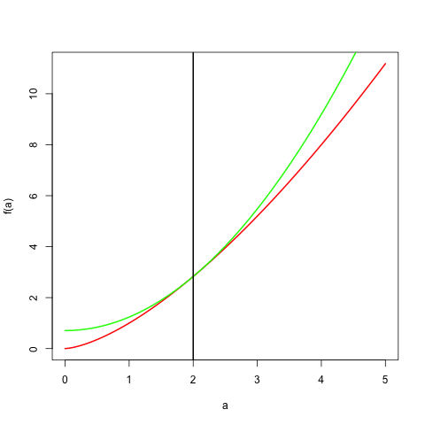
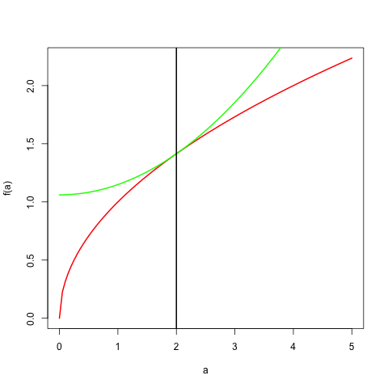

# Majorization Inequalities

## Introduction

## The AM/GM Inequality

### Absolute Values

Suppose the problem we have to solve is to minimize
$$
f(x)=\sum_{i=1}^nw_i|h_i(x)|
$$
over $x\in\mathcal{X}.$
Here $h_i(x)$ is supposed to be differentiable. In statistics it typically is
a residual,
for instance $h_i(x)=y_i-z_i'x.$ Suppose, for the time being, that $h_i(x)\not= 0$. Then we have the majorization
$$
\sum_{i=1}^nw_i|h_i(x)|\leq
\frac{1}{2}\sum_{i=1}^n\frac{w_i}{|h_i(y)|}
(h^2_i(x)+h^2_i(y)),
$$
and we must minimize
$$
g(x,y):=\sum_{i=1}^n\frac{w_i}{|h_i(y)|}h^2_i(x),
$$
which is a weighted least squares problem.

The simplest case of this is the one-dimensional example
is $h_i(x)=y_i-x$,
which means we want to compute the weighted median. The algorithm is simply
$$
x^{(k+1)}=\frac{\sum_{i=1}^n u_i(x^{(k)})y_i}{\sum_{i=1}^n u_i(x^{(k)})},
$$
where
$$
u_i(x)=\frac{w_i}{\mid y_i-x\mid}.
$$

We have assumed, so far, in this example that $h_i(y)\not= 0$.
If $h_i(y)=0$ at some point in the iterative process then the majorization function does not exist, and we cannot compute the upgrade. One easy way out of this problem is to minimize
$$
f_\epsilon(x)=\sum_{i=1}^nw_i\sqrt{h_i^2(x)+\epsilon^2}
$$
for small values of $\epsilon$. Clearly if $\epsilon_1>\epsilon_2$
then
$$
\min_x f_{\epsilon_1}(x)=f_{\epsilon_1}(x_1)>f_{\epsilon_2}(x_1)\geq\min_x f_{\epsilon_2}(x).
$$
It follows that

The function $f_\epsilon$ is differentiable. We find
$$
\mathcal{D}f_\epsilon(x)=\sum_{i=1}^n w_i\frac{h_i(x)}{\sqrt{h_i^2(x)+\epsilon^2}}\mathcal{D}h_i(x),
$$
and
$$
\mathcal{D}^2f_\epsilon(x)=\sum_{i=1}^n w_i\frac{1}{\sqrt{h_i^2(x)+\epsilon^2}}
\left\{\frac{\epsilon^2}{h_i^2(x)+\epsilon^2}\left(\mathcal{D}h_i(x)\right)^2+h_i(x)\mathcal{D}^2h_i(x)\right\}.
$$
With obvious modifications the same formulas apply if $x$ is a vector of unknowns, for instance  if  $h(x)=y-Zx$.

By the implicit function theorem the function $x(\epsilon)$ defined
by $\mathcal{D}f_\epsilon(x(\epsilon))=0$ is differentiable, with derivative
$$
\mathcal{D}x(\epsilon)=\epsilon\frac{\sum_{i=1}^nw_i\left[h_i^2(x(\epsilon))^2+\epsilon^2\right]^{-\frac32}h_i(x(\epsilon))\mathcal{D}h_i(x(\epsilon))}{\mathcal{D}^2f_\epsilon(x(\epsilon))}
$$

For the weighted median the iterates are still the same weighted averages, but now with weights
$$
u_i(x,\epsilon)=\frac{w_i}{\sqrt{(y_i-x)^2+\epsilon^2}}.
$$
Differentiating the algorithmic map gives the convergence ratio
$$
\kappa_\epsilon(x)\mathop{=}\limits^{\Delta}\frac{\sum_{i=1}^n u_i(x,\epsilon)\frac{(y_i-x)^2}{(y_i-x)^2+\epsilon^2}}{\sum_{i=1}^n u_i(x,\epsilon)}.
$$
Clearly
$$
\min_i\frac{(y_i-x)^2}{(y_i-x)^2+\epsilon^2}\leq\kappa_\epsilon(x)\leq\max_i\frac{(y_i-x)^2}{(y_i-x)^2+\epsilon^2},
$$
which implies $\kappa_\epsilon(x)< 1.$ If $y_i\not=x$ for all $i$, then $\lim_{\epsilon\rightarrow 0}\kappa_\epsilon(x)=1$ and convergence is asymptotically sublinear.

<hr>
<center>
[Insert mediJan.R Here](../code/mediJan.R)
</center>
<hr>

### Gini Mean Difference

Alternatively, we can minimize the Gini Mean Difference of the $f_i(\theta).$
Now

\begin{multline*}
\sum_{i=1}^n\sum_{j=1}^n\mid f_i(\theta)-f_j(\theta)\mid \leq\\
\sum_{i=1}^n\sum_{j=1}^n\frac{1}{\mid f_i(\xi)-f_j(\xi)\mid}
(f_i(\theta)-f_j(\theta))^2 + \text{terms},
\end{multline*}

which can be rewritten as
$$
\cdots=\sum_{i=1}^n\sum_{j=1}^n
w_{ij}(\xi)f_i(\theta)f_j(\theta)+\text{terms},
$$
minimization of which is a weighted least squares problem.

### Location Problems

The _Fermat-Weber problem_ is to find a point $x\in\mathbb{R}^m$ such that the sum of the Euclidean distances to $m$ given points $y_1,\cdots,y_m$ is minimized. Thus our loss function is
$$
f(x)=\sum_{j=1}^m w_jd(x,y_j),
$$
where the $w_j$ are positive weights. Other names are the _single facility location problem_ or the _spatial median_ problem.

An early iterative algorithm to solve the Fermat-Weber problem was proposed by @weiszfeld_37. For a translation see
@weiszfeld_plastria_09.

Here we show how to use the arithmetic mean-geometric
mean inequality for majorization. Suppose our problem is to
minimize
$$
f(X)=\sum_{i=1}^n\sum_{j=1}^n w_{ij}d_{ij}(X),
$$
where the $w_{ij}$ are non-negative weights, and the $d_{ij}(X)$ are again Euclidean distances. This is a
_location problem_. To make it interesting, we suppose that some of the points (facilities) are fixed, others are the variables we
have to minimize over. Observe that this is a convex, but non-differentiable, optimization problem.

We use the AM-GM
inequality in the form
$$
d_{ij}(X)d_{ij}(Y)\leq\frac{1}{2}(d_{ij}^2(X)+d_{ij}^2(Y)).
$$
If $d_{ij}(Y)>0$ then
$$
d_{ij}(X)\leq\frac{1}{2}\frac{d_{ij}^2(X)+d_{ij}^2(Y)}
{d_{ij}(Y)}.
$$
Using the notation from Example a.a we now find
$$
\phi(X)\leq\frac{1}{2}(\hbox{tr }X'B(Y)X+\hbox{tr }Y'B(Y)Y),
$$
which gives us a quadratic majorization.

If $X$ is partitioned
into $X_1$ and $X_2,$ with rows which are fixed and rows which are to be determined
(facilities which have to be located), and $B$ is partitioned
correspondingly, then the algorithm we find is
$$
X_2^{(k+1)}=B_{22}(X^{(k)})^{-1}B_{21}(X^{(k)})X_1.
$$

### The Lasso and the Bridge

## Polar Norms and the Cauchy-Schwarz Inequality

### Rayleigh Quotient

Rewrite for minimizing 02/22/15, by maximizing x'Bx over x'Ax=1.

We go back to maximizing the Rayleigh quotient
$$
\lambda(x)=\frac{x'Ax}{x'Bx},
$$
where we now assume that both $A$ and $B$ are
positive definite.
Maximizing $\lambda$
is equivalent to
maximizing $\sqrt{x'Ax}$
on the condition that $\sqrt{x'Bx}=1$. By
Cauchy-Schwartz
$$
\sqrt{x'Ax}\geq\frac{1}{\sqrt{y'Ay}}x'Ay,
$$
and thus for the majorization we maximize $x'Ax$ over $x'Bx=1.$ This defines an algorithmic
map which sets the update of $x$ proportional
to $B^{-1}Ax,$ i.e. we have a shown global
convergence of the power method to compute the
largest generalized eigenvalue.

We can also establish the linear convergence rate
quite easily, using @ostrowski_66. For definiteness
we normalize in each iteration, and set
$$
\mathcal{A}(\omega)=\frac{B^{-1}A\omega}{\|B^{-1}A\omega\|}.
$$
At a point $\omega$ which
has $B^{-1}A\omega=\lambda_1\omega,$
and $\omega'\omega=1$ we have
$$
\mathcal{M}(\omega)=\frac{1}{\lambda_1}(I-\omega\omega')B^{-1}A.
$$
It follows that $\mathcal{M}$ has eigenvalues $0$
and $\frac{\lambda_s}{\lambda_1}$,
with $\lambda_s$ the ``remaining'' eigenvalues of $B^{-1}A.$
Thus if $\lambda_1$ is the largest eigenvalue, we find a linear
rate of $\rho=\frac{\lambda_1}{\lambda_2}.$

There are several things in this analysis which may go wrong, and they are all quite instructive.

### The Majorization Method for MDS


The first is an algorithm for multidimensional
scaling, developed by @deleeuw_C_77.
We want to minimize
$$
\sigma(X)=\frac{1}{2}\sum_{i=1}^m\sum_{j=1}^m w_{ij}(\delta_{ij}-d_{ij}(X))^2,
$$
with $d_{ij}(X)$ again Euclidean distance, i.e.
$$
d_{ij}(X)=\sqrt{(x_i-x_j)'(x_i-x_j)}.ƒ
$$
We suppose weights $w_{ij}$ and dissimilarities $\delta_{ij}$
are symmetric and hollow (zero diagonal), and satisfy
$$
\frac{1}{2}\sum_{i=1}^m\sum_{j=1}^m w_{ij}\delta_{ij}^2=1.
$$
We now define the following objects
\begin{align}
\eta^2(X)&\mathop{=}\limits^{\Delta}\sum_{i=1}^m\sum_{j=1}^m w_{ij}d_{ij}(X)^2,\\
\rho(X)&\mathop{=}\limits^{\Delta}\sum_{i=1}^m\sum_{j=1}^m w_{ij}\delta_{ij}d_{ij}(X).
\end{align}
Thus
$$
\sigma(X)=1-2\rho(X)+\frac{1}{2}\eta^2(X).
$$
The next step is to use matrices. Let
\begin{align}
v_{ij}&=
\begin{cases}-w_{ij}& \text{if $i\not= j,$}\\
\sum_{k\not=i}^m w_{ik}& \text{if $i=j$,}
\end{cases}\\
b_{ij}(X)&=
\begin{cases}
-\frac{w_{ij}\delta_{ij}}{d_{ij}(X)}& \text{if $i\not= j,$}\\
\sum_{k\not=i}^m\frac{w_{ik}\delta_{ik}}{d_{ik}(X)}& \text{if $i=j$.}
\end{cases}
\end{align}
Now
$$\sigma(X)=1-\hbox{tr}X'B(X)X+\frac{1}{2}\text{tr}X'VX.$$
By Cauchy-Schwarz,
$$
d_{ij}(X)\geq\frac{(x_i-x_j)'(y_i-y_j)}{d_{ij}(Y)},
$$
which implies
$$
\hbox{tr}X'B(X)X\geq\hbox{tr}X'B(Y)Y.
$$
Now let 
$$
\overline X=V^+B(X)X.
$$
This is called the _Guttman-transform_ of a matrix $X.$
Using this transform we see that for all pairs of
configurations $(X,Y)$
\begin{align}
\sigma(X)&\leq 1-\hbox{tr }X'B(Y)Y+\frac{1}{2}\text{tr }X'VX=\\
&=1-\hbox{tr }XV\overline Y+\frac{1}{2}\text{tr }X'VX=\\
&=1-\frac{1}{2}\text{tr }\overline Y'V\overline Y+
\frac{1}{2}\text{tr }(X-\overline Y)'V(X-\overline Y),
\end{align}
while for all configurations $$X$$ we have
$$
\sigma(X)=1-\frac{1}{2}\text{tr }\overline X'V\overline X+
\frac{1}{2}\text{tr }(X-\overline X)'V(X-\overline X).
$$

## Conjugates and Young's Inequality

**Example:** Let $0<r<2$, $p=\frac{2}{r}$, and $q=\frac{2}{2-r}$. Then the previous result, applied to $x^r$ and $y^{2-r}$, becomes
$$
x^ry^{2-r}\leq\frac{r}{2}x^2+\frac{2-r}{2}y^2,
$$
which provides us with a quadratic majorization
for $x^r$ for all $0<r<2.$ We have equality if and only if $x=y$.

```{r young_example}
showMe <- function (b, r, up = 5) {
    a <- seq (0, up, length = 100)
    ar <- a ^ r
    plot (a, ar, type = "l", col = "RED",
          ylab="f(a)", lwd = 2)
    br <- (r * (a ^ 2)) / 2 + (((2 - r)  * (b ^ 2))/ 2)
    br <- br / (b ^ (2 - r))
    lines (a, br, col = "GREEN", lwd = 2)
    abline (v = b, lwd = 2)
}
```

Here is an example with $y=2$ and $r=1.5$.

```{r ozo, fig.align = "center", echo = FALSE}

```


```{r aza, fig.align = "center", echo = FALSE}

```

One important application of these results is majorization of powers of Euclidean distances $(\sqrt{x'Ax})^r$ by quadratic forms. We find, for $0<r<2$,
$$
(\sqrt{x'Ax})^r\leq\frac{1}
{(\sqrt{y'Ay})^{(2-r)}}\left\{\frac{r}{2}x'Ax+\frac{2-r}{2}y'Ay\right\}
$$

### Support Vector Machines

