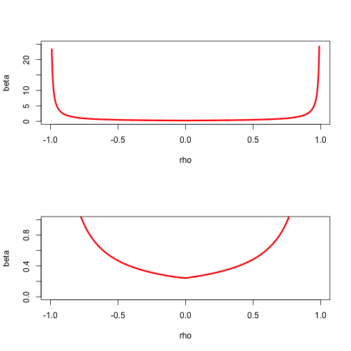

# Quadratic Majorization

## Introduction

As we said, it is desirable that the subproblems in which we minimize the majorization function are simple. One way to guarantee this is to try to find a _convex quadratic majorizer_. We mostly limit ourselves to convex quadratic majorizers because on $\mathbb{R}^n$ concave ones have no minima and are of little use for algorithmic purposes. Of course on compact sets minimizers of concave quadratics do exist,
and may be useful in some circumstances.

A quadratic $g$ majorizes $f$ at $y$ on $\mathbb{R}^n$ if $g(y)=f(y)$ and $g(x)\geq f(x)$ for all $x$. If we write it in the form
$$
g(x)=f(y)+(x-y)'b+\frac12 (x-y)'A(x-y)
$$
then $g(y)=f(y)$. For differentiable $f$ we have in
addition $b=\mathcal{D}f(y)$ and for twice-differentiable $f$
we have $A\gtrsim\mathcal{D}f^2(y).$ If we limit ourselves to convex quadratic majorizers, we must also have $A\gtrsim 0$.


We mention some simple properties of quadratic majorizers on $\mathbb{R}^n$.

1. If a quadratic $g$ majorizes a twice-differentiable convex function $f$ at $y$, then $g$ is a convex quadratic. This follows from $g''(y)\geq f''(y)\geq 0$.

2. If a concave quadratic $g$ majorizes a twice-differentiable function $f$
at $y$, then $f$ is concave at $y$. This follows from $0\geq g''(y)\geq f''(y)$.

3. Quadratic majorizers are not necessarily convex. In fact, they can even be concave. Take $f(x)=-x^2$ and $g(x)=-x^2+\frac12(x-y)^2$.

4. For some functions quadratic majorizers may not exist. Suppose, for example, that $f$ is a cubic. If $g$ is quadratic and majorizes $f$, then we must have $d=g-f\geq 0$. But $d=g-f$ is a cubic, and thus $d<0$ for at least one value of $x$.

5. Quadratic majorizers may  exist almost everywhere, but not everywhere. Suppose, for example, that $f(x)=|x|$. Then $f$ has a quadratic majorizer at each $y$ except for $y=0$. If $y\not= 0$ we can use, following @heiser_86, the arithmetic mean-geometric mean inequality in the form
$$
\sqrt{x^{2}y^{2}}\leq\frac{1}{2}(x^{2}+y^{2}),
$$
and find
$$
|x|\leq\frac{1}{2|y|}x^{2}+\frac{1}{2}|y|.
$$
If $g$ majorizes $|x|$ at 0, then we must have $ax^{2}+bx\geq |x|$ for all $x\not= 0$, and thus $a|x|+b\mathbf{sign}(x)\geq 1$ for all $x\not= 0$.
But for $|x|<\frac{1+|b|}{a}$ and $\mathbf{sign}(x) = -\mathbf{sign}(b)$,
we have $a|x|+b\,\mathbf{sign}(x)<1$.

##Existence of Quadratic Majorizers

We first study the univariate case, following @deleeuw_lange_A_09. If a quadratic $g$ majorizes a differentiable $f$ over $\mathcal{X}$ at $y$ then we must have
$$
g(x,y)=f(y)+f'(y)(x-y)+\frac12 a(y)(x-y)^2\geq f(x)
$$
for all $x\in\mathcal{X}.$ Define
$$
\delta(x,y):=\frac{f(x)-f(y)-f'(y)(x-y)}{\frac12(x-y)^2}
$$
with, for continuity, $\delta(y,y)=f''(y).$ Then we must have
$$
a(y)\geq\sup_{x\in\mathcal{X}}\delta(x,y),
$$
and consequently a quadratic majorizer exists if and only if
$$
a^\star(y):=\sup_{x\in\mathcal{X}}\delta(x,y)<\infty.
$$

By the mean value theorem there is some $z$ between $x$ and $y$ such that $\delta(x,y)=f''(z).$ Thus if $f''$ is bounded on $\mathcal{X}$ a quadratic majorizer exists. And if $f''$ is unbounded
on $\mathcal{X}$ a quadratic majorizer does not exist.

From Taylor's theorem with integral form of the remainder
$$
\delta(x,y)=2\int_0^1\lambda f''(\lambda y+(1-\lambda)x) d\lambda,
$$
which gives, by differentiating under the integral sign,
$$
\mathcal{D}_1\delta(x,y)=2\int_0^1\lambda(1-\lambda)f'''(\lambda y+(1-\lambda)x)d\lambda.
$$
<hr>
We now generalize some of these results to the multivariate case.
If a quadratic $g$ majorizes a differentiable $f$ at $y$ then we must have
$$
g(x,y)=f(y)+(x-y)'\mathcal{D}f(y)+\frac12(x-y)'A(x-y)\geq f(x)
$$
for all $x.$ This can be rewritten as the infinite system of linear inequalities
in the elements of $A$
\begin{equation}
(x-y)'A(x-y)\geq 2b(x,y),\label{E:infeq}
\end{equation}
with
$$
b(x,y):=f(x)-f(y)-(x-y)'\mathcal{D}f(y).
$$
If $A$ satisfies the inequalities $(1)$, then clearly any $B\gtrsim A$ also satifies them, and the set of all matrices satisfying $\eqref{E:infeq}$ is a closed convex set $\mathcal{A}(y)$. Quadratic majorizers at $y$ exist if and only if $\mathcal{A}(y)$ is non-empty. Moreover if $B\gtrsim\mathcal{D}^2f(x)$ for all $x$ then $B\in\mathcal{A}(y)$ for all $y.$ Thus uniform boundedness of the second derivatives is sufficient for quadratic majorizers to exist. Note that if $f$ is concave then $b(x,y)\leq 0$ for all $x$, and thus any $A\gtrsim 0$, including $A=0$, satisfies $\eqref{E:infeq}$.

Although $\mathcal{A}(y)$ is convex and closed, it is generally not a simple object. We can give a simple necessary and sufficient condition for it to be non-empty. Choose an arbitrary positive definite $V$.
Define
$$
\delta_V(x,y):=\frac{b(x,y)}{\frac12(x-y)'V(x-y)},
$$
and
$$
\beta_V(y):=\sup_x\delta_V(x,y).
$$
Suppose $\beta_V(y)<\infty$. Take $A=\beta_V(y)V$.  Then for all $x$ we have
$$
(x-y)'A(x-y)=\beta_V(y)(x-y)'V(x-y)\geq 2b(x,y)
$$
and thus $A$ is a solution of $\eqref{E:infeq}$. In fact, any $A\gtrsim\beta_V(y)V$ is a solution. Conversely suppose $\beta_V(y)=\infty$ and $A$ is a solution to $\eqref{E:infeq}$, with largest eigenvalue $\lambda_{\text{max}}$. Then there is a $x$ such that $\delta_V(x,y)>\lambda_{\text{max}}$, and thus $2b(x,y)>\lambda_{\text{max}}(x-y)'V(x-y)$, and  $(x-y)'A(x-y)>\lambda_{\text{max}} (x-y)'V(x-y)$, a contradiction. It follows that $\beta_V(y)<\infty$ is necessary and sufficient for $\eqref{E:infeq}$ to be solvable and for $f$ to have a quadratic majorization at $y$.

Nothing in this argument assumes that $A$ is positive semidefinite or that $\beta_V(y)\geq 0$. In fact, for concave $f$ we have $\beta_V(y)\leq 0$. Also, of course, there is nothing that implies that the $\sup$ is actually attained at some $z$. Note that the condition $\beta_V(y)<\infty$ is independent of $V$, although the value $\beta_V(y)$, if finite, depends on both $V$ and $y.$

We do know, from Taylor's Theorem (see section III.14.2.3), that if $f$ is twice continuously differentiable at $y$ then
$$
\delta_V(x,y)=2\frac{(x-y)'\left\{\int_0^1(1-\tau)\mathcal{D}^2f(x+\tau(y-x))d\tau\right\}(x-y)}{(x-y)'V(x-y)}.
$$
It follows that
$$
\beta_V(y)\geq\limsup_{x\rightarrow y}\delta_V(x,y)=\lambda_{\text{max}}(V^{-1}\mathcal{D}^2f(y)).
$$
Also, because of the concavity of the minimum eigenvalue,
$$
\delta_V(x,y)\geq\lambda_{\text{min}}\left(2\int_0^1(1-\tau)\mathcal{D}^2f(x+\tau(y-x))d\tau\right)\geq\min_{0\leq\tau\leq 1}\lambda_{\text{min}}\left(\mathcal{D}^2f(x+\tau(y-x))\right),
$$
and thus quadratic majorizations do not exist for any $y$ if $\lambda_{\text{min}}\left(\mathcal{D}^2f(x)\right)$ is unbounded.

**Example:** As an example, consider $f$ defined by $f(x)=\sum_{i=1}^n\log(1+\exp(r_i'x)).$
The function is convex, and as we have shown $\mathcal{D}^2f(x)\leq\frac14 R'R.$ Let's look at the case in which $x$ has only two elements (as in simple logistic regression). We first study a simple subset of $\mathcal{A}(y)$, those matrices which are positive definite and have equal diagonal elements. Thus
$$
A=\beta\begin{bmatrix}1&\rho\\\rho&1\end{bmatrix},
$$
with $\beta>0$ and $-1<\rho<+1.$ Simply choose a $\rho$ and then numerically compute the corresponding $\beta_\rho(y).$ This will give
a convex region that is within $\mathcal{A}(y).$

```{r cali, echo = FALSE, fig.align = "center", fig.cap = "Set A(y) for logistic example"}

```

More generally we can parametrize $A$ by using
$$
A=\beta\begin{bmatrix}\alpha&\gamma\\\gamma&1-\alpha\end{bmatrix},
$$
with $\beta>0$, $0<\alpha<1$, and $\gamma^2<\alpha(1-\alpha).$ The constraints
on $\alpha$ and $\gamma$ define the interior of a circle in the plane with center $(\frac12,0)$
and radius $\frac12.$ For each element in the circle we can compute the corresponding $\beta_V(y)$, which will give a complete description of $\mathcal{A}(y).$

##Convergence

Suppose $a$ is such that
\begin{equation}
g(x,y)=f(y)+f'(y)(x-y)+\frac{1}{2}a(x-y)^2\label{E:qumaj}
\end{equation}
majorizes $f(x)$ for all $y$. The majorization algorithm is simply
$$
x^{(k+1)}=x^{(k)}-\frac{1}{a}f'(x^{(k)}),
$$
i.e. it is a gradient algorithm with constant step size.
From Ostrowski's Theorem the linear convergence rate is
\begin{equation}
\kappa(x_\infty)=1-\frac{f''(x_\infty)}{a}.\label{E:kap}
\end{equation}
Note that if $g$ in $\eqref{E:qumaj}$ majorizes $f$, then any $g$ of the same form with a larger $a$ also majorizes $f$. But $\eqref{E:kap}$ shows a smaller $a$ will generally lead to faster convergence.

For all $k$ we have
$$
f(x^{(k+1)})\leq g(x^{(k+1)},x^{(k)})=f(x^{(k)})-\frac12\frac{(f'(x^{(k)}))^2}{a}.
$$
Adding these inequalities gives
$$
f(x^{(k+1)})-f(x^{(0)})=\sum_{i=0}^k(f(x^{(i+1)})-f(x^{(i)})\leq-\frac{1}{2a}\sum_{i=0}^k(f'(x^{(i)}))^2,
$$
and thus, with $f_\star=\min f(x)$,
\begin{equation}
\frac{1}{2a}\sum_{i=0}^k(f'(x^{(i)}))^2\leq f(x^{(0)})-f_\star.\label{E:qrate}
\end{equation}
The left hand side of $\eqref{E:qrate}$ is an increasing sequence which is bounded above, and consequently converges. This implies
$$
\lim_{k\rightarrow\infty} f'(x^{(k)})=0
$$

Generalize to more variables, generalize to constraints.

##Bounding Second Derivatives

The first result, which has been widely applied, applies to functions with a continuous and uniformly bounded second derivative [@vosz_eckhardt_80, @boehning_lindsay_88].

**Theorem:**
If $f$ is twice differentiable and there is an $a>0$ such that $f''(x)\leq a$ for
all $x$, then for each $y$ the convex quadratic function
\begin{eqnarray*}
g(x)=f(y)+f'(y)(x-y)+\frac{1}{2}a(x-y)^2.
\end{eqnarray*}
majorizes $f$ at $y$.

**Proof:**
Use Taylor's theorem in the form
$$
f(x)=f(y)+f'(y)(x-y)+
\frac{1}{2}f''(\xi)(x-y)^2,
$$
with $\xi$ on the line connecting $x$ and $y$.
Because $f''(\xi)\leq a$, this implies $f(x)\leq g(x)$, where $g$ is defined above.
**QED**

This result is very useful, but it has some limitations. In the first place we would like a
similar result for functions that are not everywhere twice differentiable, or even those that are not everywhere differentiable. Second, the bound does take into account that we only need to bound the second derivative on the interval between $x$ and $y$ and not on the whole line. This may result in a bound which is not sharp. In particular we shall see below that substantial improvements can result from a non-uniform bound $a(y)$ that depends on the support point $y$.

If $\mathcal{D}^2f(x)\lesssim D$ for all $x\in\mathcal{X},$ then
$$
\phi(\omega)\leq\phi(\xi)+(\omega-\xi)'\nabla\phi(\xi)+
\frac{1}{2}(\omega-\xi)'D(\omega-\xi).
$$
Let $\eta(\xi)=\xi-D^{-1}\nabla\phi(\xi),$ then
$$
\phi(\omega)\leq\phi(\xi)-\frac{1}{2}\nabla\phi(\xi)'D^{-1}\nabla\phi(\xi)+
\frac{1}{2}(\omega-\eta(\xi))'D(\omega-\eta(\xi)).
$$
Thus here we have quadratic majorizers.

###Normal Density and Distribution

For a nice regular example we use the celebrated functions
\begin{align*}
\phi(x)& =  \frac{1}{\sqrt{2\pi}}e^{-z^2/2},\\
\Phi(x)& =  \int_{-\infty}^{x} \phi(z)\,dz.
\end{align*}
Then
\begin{align*}
\Phi'(x)&=\phi(x),\\
\Phi''(x)& =  \phi'(x) \;\;\, = \;\; -x\phi(x), \\
\Phi'''(x)&=\phi''(x) \;\, = \;\; -(1-x^{2})\phi(x),\\
\Phi''''(x)&=\phi'''(x)\; = \;\: -x(x^{2}-3)\phi(x).
\end{align*}
To obtain quadratic majorizers we must bound the second derivatives. We can bound $\Phi''(x)$ by setting its derivative equal to zero. We have $\Phi'''(x)=0$ for $x=\pm 1$, and
thus $|\Phi''(x)|\leq\phi(1)$.
In the same way $\phi'''(x)=0$ for $x=0$ and $x=\pm\sqrt{3}$. At those values $|\phi''(x)|\leq 2\phi(\sqrt{3})$.
More precisely, it follows that
\begin{align*}
0&\leq\Phi'(x) \;\;\, = \; \phi(x)\; \leq \; \phi(0),\\
-\phi(1)&\leq\Phi''(x)\;\, = \; \phi'(x)\; \leq \; \phi(1),\\
-\phi(0)&\leq\Phi'''(x) \, = \; \phi''(x) \; \leq \; 2\phi(\sqrt{3}).
\end{align*}
Thus we have the quadratic
majorizers
$$
\Phi(x)\leq\Phi(y)+\phi(y)(x-y)+\frac12\phi(1)(x-y)^{2},
$$
and
$$
\phi(x)\leq\phi(y)-y\phi(y)(x-y)+\phi(\sqrt{3})(x-y)^{2}.
$$
The majorizers are illustrated for both $\Phi$ and $\phi$ at the points $y=0$ and $y=-3$ in Figures
1 and 2.
The inequalities in this section may be useful in majorizing multivariate functions involving $\phi$ and $\Phi$.
They are mainly intended, however, to illustrate construction of quadratic majorizers in the smooth case.}
<hr>
```{r pnorm, echo = FALSE, fig.align = "center", cache = TRUE}
x <- seq(-4, 2, by = .01)
plot (x, pnorm (x), type = "l", col = "RED", lwd = 3)
y3 <- pnorm (-3)+ dnorm(-3) * (x + 3)+0.5*dnorm(1) * ((x+3) ^ 2)
y0 <- pnorm (0) + dnorm (0) * x + 0.5 * dnorm(1) * (x ^ 2)
lines (x, y3, col = "BLUE", lwd = 2)
lines (x, y0, col = "BLUE", lwd = 2)
```
<center>
Figure 1: Quadratic Majorization of Normal Distribution</center>
</center>
<hr>
<hr>
```{r dnorm, echo = FALSE, fig.align = "center", cache = TRUE}
plot (x, dnorm (x), type = "l", ylim = c(0, 1), col = "RED", lwd = 3)
y3 <- dnorm (-3) + 3 * dnorm(-3) * (x + 3)+ dnorm (sqrt (3)) * ((x+3) ^ 2)
y0 <- dnorm (0) + dnorm (sqrt (3))* (x ^ 2)
lines (x, y3, col = "BLUE", lwd = 2)
lines (x, y0, col = "BLUE", lwd = 2)
```
<center>Figure 2: Quadratic Majorization of Normal Density</center>
<hr>

The drawings are made by the code in `normal.R`.
<hr>
<center>Insert [normal.R](../code/normal.R) here</center>
<hr>

### Nondiagonal Weights in Least Squares

An even simpler example of quadratic majorization of
a quadratic function is the following. Suppose we want
to solve the problem of minimizing
$$
\phi(\omega)=
(y-\omega)'W(y-\omega),
$$
over $\omega\in\Omega,$
where $\Omega$ is the cone of isotonic vectors. This
problem can be solved by general quadratic programming
techniques (compare, for example, @lawson_hanson_74), but
it is easier in many respects to use iterated monotone
regression.

Suppose we can find a diagonal $D$ such that $W\lesssim D.$
A simple choice
would be $D=\lambda_+I,$
with $\lambda_+$
the largest eigenvalue of $W,$ but sometimes other choices
may be more appropriate.

This idea can be generalized. Suppose we want to minimize
$$
f(x)=\sum_{i=1}^n\sum_{j=1}^m w_{ij}(y_{ij}-h_{ij}(x))^2
$$
Then, using 
$$
y_{ij}-h_{ij}(x)=(y_{ij}-h_{ij}(\tilde x))+(h_{ij}(\tilde x)-h_{ij}(x))
$$
we find
$$
f(x)=f(\tilde x)+2\sum_{i=1}^n\sum_{j=1}^mw_{ij}(y_{ij}-h_{ij}(\tilde x))(h_{ij}(\tilde x)-h_{ij}(x))+\sum_{i=1}^n\sum_{j=1}^mw_{ij}(h_{ij}(\tilde x)-h_{ij}(x))^2.
$$
Now suppose we can find $a_i\geq 0$ and $b_j\geq 0$ such that $w_{ij}\leq a_ib_j$ for all $i,j$. Then
$$
\sum_{i=1}^n\sum_{j=1}^mw_{ij}(h_{ij}(\tilde x)-h_{ij}(x))^2\leq\sum_{i=1}^n\sum_{j=1}^ma_ib_j(h_{ij}(\tilde x)-h_{ij}(x))^2,
$$
and
$$
f(x)\leq f(\tilde x)+\sum_{i=1}^n\sum_{j=1}^ma_ib_j(\tilde y_{ij}-h_{ij}(x))^2-
$$
$$
\tilde y_{ij}=\frac{w_{ij}}{a_ib_j}y_{ij}+(1-\frac{w_{ij}}{a_ib_j})h_{ij}(\tilde x)
$$


###Quadratic on a Sphere

Suppose we want to minimize
$$
f(x)=x'Ax+2b'x+c
$$
over $x$ satisfying $x'Dx=1$, with $D$ positive definite. In addition, we require $x\in\mathcal{K}$, with $\mathcal{K}$ a convex cone. This problem is important in several optimal scaling problems. It can be solved by using the modified eigenvalue methods of section [III.1.9.7](http://jandeleeuw.gitbooks.io/bras3/content/background/qcircle.html), or by the decomposition method of [I.6.5.1](http://jandeleeuw.gitbooks.io/bras1/content/augmentationmethods/quadsphere.html), but here we give a simple majorization method.

Find $\lambda$ such that $D^{-\frac12}AD^{-\frac12}\lesssim \lambda I.$ Then
$$
x'Ax\leq y'Ay+2(x-y)'Ay+\lambda(x-y)'D(x-y)
$$
and thus
$$
g(x,y):=c+y'Ay+2(x-y)'Ay+2b'x+\lambda(x-y)'D(x-y)
$$
majorizes $f$.

Minimizing $g$ over $x'Dx=1$
and $x\in\mathcal{K}$ amounts to minimizing
$$
h(x):=(x-z)'D(x-z)
$$
with
$$
z:=-D^{-1}((A-\lambda D)y+b)
$$
over $x\in\mathcal{K}$ and then normalizing the solution such that $x'Dx=1$.

The function `quadSphere` solves the problem from this section. Note that the cone can be the whole space, in which case we minimize the quadratic on the ellipsoid $x'Dx=1$, and we can have $b=0$, in which case we compute the generalized eigenvector corresponding with the smallest generalized eigenvalue of the pair $(A,D)$. Also note that $A$ can be indefinite.
<hr>
<center>
[Insert quadSphere.R Here](../code/quadSphere.R)
</center>
<hr>

### Gifi Goes Logistic

### A Matrix Example

@kiers_90 considers the problem of minimizing a function
of the form
$$
\phi(X)=c+\text{tr }AX + \sum_{j=1}^m\text{tr }B_jXC_jX',
$$
over all $n\times p$ matrices $X,$ possibly with restrictions.
He shows that this covers a large number of matrix problems
commonly considered in psychometrics.

### Gauss-Newton Majorization

The least squares loss function was defined [here](../alternatingleastsquares/introduction.html).
It has the form
$$
f(x)=\frac12\sum_{j=1}^m\sum_{\ell=1}^m w_{j\ell}g_j(x)g_\ell(x),
$$
where $W$ is an $m\times m$ positive semi-definite matrix of _weights_, and we minimize $f$ over $x\in\mathcal{X}$.

Now
$$
\mathcal{D}f(x)=\sum_{j=1}^m\sum_{\ell=1}^m w_{j\ell}g_j(x)\mathcal{D}g_\ell(x),
$$
and
$$
\mathcal{D}^2f(x)=\sum_{j=1}^m\sum_{\ell=1}^m w_{j\ell}\left\{g_j(x)\mathcal{D}^2g_\ell(x)+\mathcal{D}g_j(x)(\mathcal{D}g_\ell(x))'\right\}.
$$
The structure of the Hessian suggest to define
\begin{align*}
A(x)&\mathop{=}\limits^{\Delta}\sum_{j=1}^m\sum_{\ell=1}^m w_{j\ell}g_j(x)\mathcal{D}^2g_\ell(x),\\
B(x)&\mathop{=}\limits^{\Delta}\sum_{j=1}^m\sum_{\ell=1}^m w_{j\ell}\mathcal{D}g_j(x)(\mathcal{D}g_\ell(x))'.
\end{align*}
We have $\mathcal{D}^2f(x)=A(x)+B(x)$. Note that $B(x)$ is positive semi-definite for all $x$.

In the classical Gauss-Newton method we make the approximation
$$
f(x)\approx f(y)+(x-y)'\mathcal{D}f(y)+\frac12 (x-y)'B(y)(x-y),
$$
and the corresponding iterative algorithm is
$$
x^{(k+1)}=x^{(k)}-B^{-1}(x^{(k)})\mathcal{D}f(x^{(k)}).
$$
If the algorithm converges to $x$, and the $g_j(x)$ are small, then the least squares loss function will be small,
and $A(x)$ will be small as well. Since the iteration matrix is
$$
\mathcal{M}(x)=I-B^{-1}(x)\mathcal{D}^2f(x)=-B^{-1}(x)A(x),
$$
we can expect rapid convergence. But convergence is not guaranteed, and consequently we need safeguards. Majorization provides one such safeguard.

If we can find $\gamma(y)$ such that
$$
\sup_{0\leq\lambda\leq 1}z'A(y+\lambda z)z\leq\gamma(y)z'z
$$

Note: Use Nesterov's Gauss-Newton paper 03/13/15

### Marginal Functions

