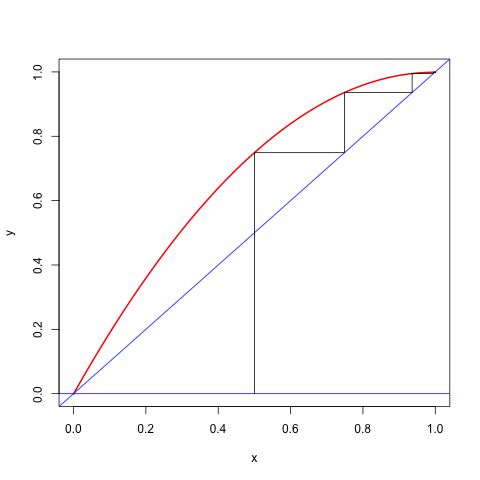
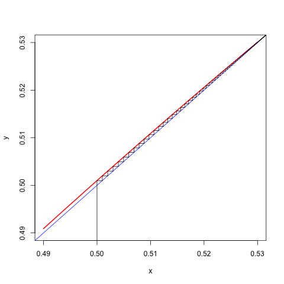

# Local and Localized Majorization

## Introduction

### Majorization in a Neighborhood

Consider the cubic $f(x)=2x-x^2+\frac16 x^3$. It is an increasing function on the real line, with a root at $x=0$, and a saddle point at $x=2$.

We know that cubics do not have quadratic majorizers, but we can try to find a quadratic
$$
g(x,y)=f(y)+f'(y)(x-y)+\frac12 a(x-y)^2
$$
such that $g(x,y)\geq f(x)$ for all $x\geq 2$ and such that
$$
y-\frac{f'(y)}{a}\geq 2
$$
if $y\geq 2$.

The condition $g(x,y)\geq f(x)$ for all $x\geq 2$ is
$$
a\geq f''(y)+\frac13 f'''(y)(2-y),
$$
which is in our case
$$
a\geq \frac23(y-2).
$$
We have
$$
y-\frac{f'(y)}{a}\geq 2
$$
for
$$
a\geq\frac12(y-2).
$$

<hr>

<hr>
If $|\mathcal{D}_{ij}f(x)|\leq K$ for all $i,j$ and $x$ then
$$
z'\mathcal{D}^2f(x)z\leq \sum_{i=1}^n\sum_{i=1}^n K|z_i||z_j]=
K(\sum_{i=1}^n |z_i|)^2\leq n^2Kz'z
$$
This can be extended easily to higher order partials
$$
<\mathcal{D}^p(x),z\otimes\cdots\otimes z>\leq K(\sum_{i=1}^n|z_i|)^p\leq
n^p(z'z)^p
$$
<hr>

Minimize $f:x\rightarrow x^4$ on $[-1,+1]$, where $f''(x)\leq 12$, and thus
if $-1\leq x\leq +1$ and $-1\leq y\leq +1$
$$
f(x)\leq g(x,y)=y^4+4y^3(x-y)+6(x-y)^2.
$$
The majorizer is minimized at $x=y-\frac13 y^3$. Thus the majorization algorithm is
$$
x^{(k+1)}=x^{(k)}-\frac13 (x^{(k)})^3,
$$
which converges monotonically to zero if started with $-1\leq x^{(0)}\leq +1$.
Because
$$
\lim_{k\rightarrow\infty}\frac{x^{(k+1)}}{x^{(k)}}=1
$$
convergence is sublinear.

### Cartesian Folium

If we minimize
$$
f(x,y)=x^3+y^3-3xy
$$
on the rectangle defined by $0\leq x\leq K$
and $0\leq y\leq K$ then we can apply quadratic majorization
\begin{align*}
x^3&\leq x_0^3+3x_0^2(x-x_0)+3K(x-x_0)^2,\\
y^3&\leq y_0^3+3y_0^2(y-y_0)+3K(y-y_0)^2,
\end{align*}
and thus the algorithmic map is
$$
\mathcal{A}(x,y)=\frac{1}{2K}\begin{bmatrix}-x^2+2Kx+y\\-y^2+2Ky+x\end{bmatrix}.
$$
The linear convergence rate is $1-\frac{1}{2K}$.

### Univariate Cubics

Suppose the problem is to minimize the cubic
$$
f(x)=\alpha+\beta x+\frac12\gamma x^2+\frac16\delta x^3
$$
with $\delta\not= 0$. Since the cubic has no majorizers, we will find a local majorizer on the interval $[A,B]$.

From $f''(x)=\gamma+\delta x$
we see that
$$
K(A,B)\mathop{=}\limits^{\Delta}\max_{A\leq z\leq B} f''(z)=\gamma+\begin{cases}\delta B&\text{ if }\delta>0,\\
\delta A&\text{ if }\delta<0.\end{cases}
$$
and thus, if $y\in[A,B]$,
$$
f(x)\leq f(y)+f'(y)(x-y)+\frac12 K(A,B)(x-y)^2
$$
over $A\leq x\leq B$.

If $K(A,B)>0$ the majorizing quadratic has a minimum at
$$
x=y-\frac{\beta+\gamma y+\frac12\delta y^2}{K(A,B)}
$$
This minimum can, of course, be outside the interval $[A,B]$, in which case the minimum of the quadratic is attained at one of the end-points. The minimum of the quadratic can be in the interval, but the function value at the minimum of the quadratic can be larger than the function value at one of the end-points. In that case, again, the majorization algorithm chooses one of the end-points. If $K(A,B)\leq 0$ the majorizer does not have a minimum
and thus the minimum on the interval is attained at either $A$ or $B$. Code in ```R``` is in the file ```cubicBound.R```.

<hr>
<center>
[Insert cubicBound.R Here](../code/cubicBound.R)
</center>
<hr>


If the iterations stay in the interior of the interval they converge to a local minimum at $\hat x$ with rate
$$
\kappa=1-\frac{\gamma+\delta\hat x}{K(A,B)}
$$

<hr>
Consider, for example, the cubic $f(x)=\frac13 x^3-\frac12 x^2+cx$,
where $0\leq c\leq\frac14$. The function has a local maximum at $\frac12-\frac12\sqrt{1-4c}$ and a local minimum at $\frac12+\frac12\sqrt{1-4c}$.
Both are in the unit interval. The majorization algorithm, using $K(0,1)=1$,
has the update rule
$$
x^{(k+1)}=-(x^{(k)})^2+2x^{(k)}-c.
$$
If started in the interval $(\frac12-\frac12\sqrt{1-4c},\frac12+\frac12\sqrt{1-4c})$ the algorithm converges monotonically to the local minimum at $\frac12+\frac12\sqrt{1-4c}$ with rate $\kappa=1-\sqrt{1-4c}$, which is close to zero if $c$ is close to zero and close to one if $c$ is close to $\frac14$.
Here are two runs, the first one is fast, with $c=.001$, the second one is slow, with $c=.249$.
<hr>
```
> cubicBound(c(0,.001,-.5,1/3),0,1)
Iteration:    1 fold:   -0.08283333 fnew:   -0.13968825 xold:    0.50000000 xnew:    0.74900000
Iteration:    2 fold:   -0.13968825 fnew:   -0.16376999 xold:    0.74900000 xnew:    0.93599900
Iteration:    3 fold:   -0.16376999 fnew:   -0.16565882 xold:    0.93599900 xnew:    0.99490387
Iteration:    4 fold:   -0.16565882 fnew:   -0.16566717 xold:    0.99490387 xnew:    0.99897403
Iteration:    5 fold:   -0.16566717 fnew:   -0.16566717 xold:    0.99897403 xnew:    0.99899895
Iteration:    6 fold:   -0.16566717 fnew:   -0.16566717 xold:    0.99899895 xnew:    0.99899900
$itel
[1] 6

$f
[1] -0.1656672

$x
[1] 0.998999
```
<hr>
```
> cubicBound(c(0,.249,-.5,1/3),0,1)
Iteration:    1 fold:    0.04116667 fnew:    0.04116567 xold:    0.50000000 xnew:    0.50100000
Iteration:    2 fold:    0.04116567 fnew:    0.04116467 xold:    0.50100000 xnew:    0.50199900
Iteration:    3 fold:    0.04116467 fnew:    0.04116368 xold:    0.50199900 xnew:    0.50299500
Iteration:    4 fold:    0.04116368 fnew:    0.04116270 xold:    0.50299500 xnew:    0.50398603
Iteration:    5 fold:    0.04116270 fnew:    0.04116174 xold:    0.50398603 xnew:    0.50497015
...
...
Iteration:   89 fold:    0.04114559 fnew:    0.04114559 xold:    0.53141255 xnew:    0.53142580
Iteration:   90 fold:    0.04114559 fnew:    0.04114559 xold:    0.53142580 xnew:    0.53143822
Iteration:   91 fold:    0.04114559 fnew:    0.04114559 xold:    0.53143822 xnew:    0.53144986
Iteration:   92 fold:    0.04114559 fnew:    0.04114559 xold:    0.53144986 xnew:    0.53146077
Iteration:   93 fold:    0.04114559 fnew:    0.04114559 xold:    0.53146077 xnew:    0.53147099
Iteration:   94 fold:    0.04114559 fnew:    0.04114559 xold:    0.53147099 xnew:    0.53148056
$itel
[1] 94

$f
[1] 0.04114559

$x
[1] 0.5314806
```
<hr>
We can also make cobweb plots for these two runs. They are in the figures below.

```{r cobweb001, fig.align = "center", fig.cap = "Cobweb Plot for c=0.001", echo = FALSE}

```

```{r cobweb249, fig.align = "center", fig.cap = "Cobweb Plot for c=0.249", echo = FALSE}

```

### Majorization on the Sphere

The problem of minimizing $f$ over a closed
set $\mathcal{X}$ can be formulated as
$$
\inf_{r\geq 0}\min_{x\in\mathcal{X}\cap\mathcal{S}_r} f(x),
$$
where $\mathcal{S}_r\mathop{=}\limits^{\Delta}\{x\mid x'x=r\}$. The
set $\mathcal{X}\cap\mathcal{S}_r$ is compact
so the inner minimum $f_r=\min_{x\in\mathcal{X}\cap\mathcal{S}_r} f(x)$ is attained for continuous $f$.
<hr>

If $f$ is continuously differentiable on the ball  $\mathcal{T}_r\mathop{=}\limits^{\Delta}\{x\mid x'x\leq r\}$ then
$$
h_r(y)\mathop{=}\limits^{\Delta}\max_{z\in\mathcal{T}_r}\max_{0\leq\lambda\leq 1} z'\mathcal{D}^2f(y+\lambda z))z
$$
is well-defined. If $x,y\in\mathcal{S}_r$
then $y+\lambda(x-y)\in\mathcal{T}_r$ for
all $0\leq\lambda\leq 1$. So
$$
f(x)\leq f(y)+(x-y)'\mathcal{D}f(y)+h_r(y)(r-x'y),
$$
and we have a linear majorization on $\mathcal{S}_r$.
The corresponding majorization algorithm is
$$
x^{(k+1)}=\mathcal{P}_r(x^{(k)}-\frac{1}{h_r(x^{(k)})}\mathcal{D}f(x^{(k)})),
$$
with $\mathcal{P}_r$ projection on the sphere $\mathcal{S}_r$.

S-majorization by a quadratic. The sublevel set for
$$
g(x,y)=f(y)+(x-y)'b+\frac12(x-y)'A(x-y)
$$
with $A$ positive definite is the ellipse
$$
\mathcal{L}(y)=\{x\mid (x-z(y))'A(x-z(y))\leq b'A^{-1}b\},
$$
with $z\mathop{=}\limits^{\Delta}y-A^{-1}b.$ Thus for S-majorization we need to choosed $A$ and $b$ in such a way that $g$ majorizes $f$ on $\mathcal{L}(y).$ The problem is simplified, of course, if we choose $b=\mathcal{D}f(y).$

### Majorization on a Hyperrectangle

Here we discuss the work of @monnigmann_11 and others.

## Proximal Point Majorization

We usually write
$f(x) \leq g(x,y)$
for the key property of the majorizing function. One can also write
$f(x) \leq f(x) + d(x, y)$
with
$d(x, y):=g(x, y)-f(x)$
Thus $d(x,y)$ is non-negative, and $d(x,x)=0$, i.e. $d(x,y)$ is distance-like.

Bregman
<hr>

$$
f(x)\leq f(x)+\lambda\|x-y\|^2
$$

$$
x^{(k+1)}=\mathop{\mathbf{argmin}}\limits_{x} f(x)+\lambda_k\|x-x^{(k)}\|^2
$$
<hr>

The majorization algorithm updates by the rule
$$
x^{(k+1)}\in\mathop{\mathbf{argmax}}\limits_{x} f(x)+d(x,x^{(k)})
$$
This shows majorization algorithms are generalized proximal point
algorithms (for which there is a lot of theory). In the EM context this is used by Stephane Chretien, Alfred Hero, Paul Tseng and others to study algorithms. In fact, they often study
$$
x^{(k+1)}\in\mathop{\mathbf{argmax}}\limits_{x} f(x)+\lambda_kd(x,x^{(k)})
$$
with $\lambda_k$ a sequence of non-negative numbers.

## Sub-level Majorization

Stability of the majorization algorithm is guaranteed by the sandwich inequality, which says that
$$
f(x^{(k+1)})\leq g(x^{(k+1)},x^{(k)})\leq g(x^{(k)},x^{(k)})=f(x^{(k)}).
$$
The first inequality in the chain comes from the majorization condition $f(x)\leq g(x,y)$ for all $x,y\in X$. There is, however, a weaker condition which still implies the same inequality.

Suppose that we merely require that the majorization function $g$ satisfies
$$
g(x,y)\leq g(y,y)\Rightarrow f(x)\leq g(x,y).
$$
Then we still have $g(x^{(k+1)},x^{(k)})\leq g(x^{(k)},x^{(k)})=f(x^{(k)})$, and as a consequence also $f(x^{(k+1)})\leq g(x^{(k+1)},x^{(k)})$. The sandwich inequality still applies.

The weaker localized majorization condition, which we will call  _sublevel majorization_ (or simply _S-majorization_) from now on,
says that $g$ majorizes $f$ on the _sublevel set_
$$
\mathcal{L}(y)\mathop{=}\limits^{\Delta}\{x\in X\mid g(x,y)\leq g(y,y)=f(y)\},
$$
while for $x\not\in\mathcal{L}(y)$ we can have $f(x)>g(x,y)$.
In other words,  $g(x,y)-f(x)$ must have a global minimum equal to zero on $\mathcal{L}(y)$ at $y$.

S-majorization is easy to visualize for a univariate quadratic majorizer
$$
g(x,y)=f(y)+f'(y)(x-y)+\frac12 a(x-y)^2,
$$
which has $g(x,y)\leq f(y)$ if $x$ is in the interval with end-points $y$
and $y-\frac{2f'(y)}{a}$. For quadratic S-majorization of a cubic $f$, for example, we must have
$$
a\geq f''(y)+\frac13 f'''(y)(x-y)
$$
at both end-points of the interval $I(y)$, which means we must have both $a\geq f''(y)$ and
$$
a^2-af''(y)+\frac23 f'''(y)f'(y)\geq 0.\tag{1}
$$
If the quadratic $\text{(1)}$ has no real roots, or two equal real roots, then it is always non-negative, and
we have sub-level majorization of the cubic at $y$ if $a\geq f''(y)$.
Now suppose the quadratic $\text{(1)}$ has two different real roots, say $p(y)<q(y)$.
We have $p(y)+q(y)=f''(y)$. Thus if $p(y)$ and $q(y)$ are non-negative,
then $0\leq p(y)\leq q(y)\leq f''(y)$, and we have sub-level majorization
for $a\geq f''(y)$. If $p\leq 0$ and $q\geq 0$
then $q=f''(y)-p\geq f''(y)$  and thus $a\geq q(y)$. If both $p(y)\leq 0$
and $q(y)\leq 0$ then $f''(y)\leq p(y)<q(y)\leq 0$, and thus $\overline{a}(y)=0$ and
sub-level majorization is linear.

Near a local minimum, where $f''(y)\geq 0$ and $f'(y)$ is close to zero, the two roots
of the quadratic are approximately $q=f''(y)-\frac23 f'(y)$ and $p=\frac23 f'(y)$.

note: 030615 Add the example from the paper and the reference

Quadratic sub-level majorization in the multivariate case. We have
$$
g(x,y)=f(y)+(x-y)'\mathcal{D}f(y)+\frac12(x-y)'A(x-y)
$$
for some $A$ which we assume to be positive definite for now.
Then $g(x,y)\leq f(y)$ if and only if
$$
(x-z)'A(x-z)\leq (\mathcal{D}f(y))'A^{-1}\mathcal{D}f(y),
$$
with $z=y-A^{-1}\mathcal{D}f(y)$. For given $y$ and $A$
this means $x$ must be in an ellipse centered at $z$, but note that if $A$ changes then shape, radius, and center of the ellipse change.

If $A=aH$ with $H$ fixed, then we have the more manageable inequality
$$
\frac{1}{a^2}\geq \frac{(x-z)'H(x-z)}{(\mathcal{D}f(y))'H\mathcal{D}f(y)}
$$

## Dinkelbach Majorization


In S-majorization we make sure the sandwich inequality remains true by requiring that
$$
g(x,y)\leq g(y,y)=f(y)\Rightarrow f(x)\leq g(x,y).
$$
An alternative requirement, that also leads to a sandwich inequality, is
$$
g(x,y)\leq g(y,y)=f(y)\Rightarrow f(x)\leq f(y),
$$
or, in iteration terms,
If $g(x^{(k+1)},x^{(k)})\leq g(x^{(k)},x^{(k)})$
then $f(x^{(k+1)})\leq f(x^{(k)})$.

<hr>
Suppose $f$ is a real-valued function on $\mathcal{X}$ and $g$ is a real-valued function on  $\mathcal{X}\otimes\mathcal{X}$. We say
that $g$ _Dinkelbach majorizes_ $f$ _on_ $\mathcal{X}$ if
* if $g(x,y)\leq g(y,y)$ then $f(x)\leq f(y)$ for all $x,y\in\mathcal{X}$,
* $g(y,y)=f(y)$ for all $y\in\mathcal{X}$.

Dinkelbach Majorization is _strict_ if the first condition can be replaced by
* if $g(x,y)<g(y,y)$ then $f(x)<f(y)$ for all $x,y\in\mathcal{X}$.
<hr>

The D here stands for Dinkelbach, who proposed a forerunner of D majorization in a classic fractional programming article @dinkelbach_67. In S-majorization we require that $g$ majorizes $f$ on the sublevel set
$$
\mathcal{L}(y)=\{x\in\mathcal{X}\mid g(x,y)\leq g(y,y)\}.
$$
In D-majorization we require that $f$ attains its maximum on the sublevel set $\mathcal{L}(y)$ at $y$.
<hr>
Suppose $f$ is a fractional function of the form
$$
f(x)=\frac{a(x)}{b(x)},
$$
with $b(x)>0$ for $x\in\mathcal{X}$. Then
$$
g(x,y)=f(y)+a(x)-f(y)b(x)
$$
D-majorizes $f$ on $\mathcal{X}$.

Clearly
$$
g(y,y)=f(y)+a(y)-\frac{a(y)}{b(y)}b(y)=f(y).
$$
Moreover $g(x,y)\leq g(y,y)$ can be written as
$$
f(y)+a(x)-f(y)b(x)\leq f(y)
$$
which implies $f(x)\leq f(y)$.
<hr>
Suppose
$$
g(x,y)=f(y)+f'(y)(x-y)+\frac12 a(x-y)^2,
$$
with $a>0$. Now $g(x,y)\leq f(y)$ if and only if
$$
(x-y)(f'(y)+\frac12a(x-y))\leq 0,
$$
Or $x$ must be in the interval between $y$ and $y-\frac{2f'(y)}{a}$. For a cubic
$$
f(x)=f(y)+f'(y)(x-y)+\frac12 f''(y)(x-y)^2+\frac16 f'''(x-y)^3
$$
we require that
$$
(x-y)(f'(y)+\frac12 f''(y)(x-y)+\frac16 f'''(x-y)^2)\leq 0
$$
for all $x$ in the interval between $y$ and $y-\frac{2f'(y)}{a}$.
<hr>
Suppose $f$ is increasing and differentiable. We have $f'(y)\geq 0$ for all $y$.
Thus for any
$$
x\in[y-\frac{2f'(y)}{a},y]
$$
we have $x\leq y$ and consequently $f(x)\leq f(y)$. In other words: an increasing function is Dinkelbach majorized by any convex quadratic.
<hr>
Consider $f$ with $f(x)=\frac14 x^4$ and let us majorize at $y=1$ by a convex quadratic $g$ which has both $g(1)=f(1)=\frac14$
and $g'(1)=f'(1)=1.$ It follows that
$$
g(x)=ax^2+(1-2a)x+(a-\frac34)
$$
for some $a\geq 0$. Note that if we would also require that $g''(1)\geq h''(1)$ then we need $a\geq\frac32.$

If we compute $h=g-f$ we find
$$
h(x)=-\frac14(x-1)^2(x^2+2x+(3-4a)).
$$
Majorization at $y$ would mean $h(x)\geq 0$ for all $x$, which is clearly impossible because $h(x)$ will be negative for $x$ very large and $x$ very small.

We have $h(x)\geq 0$ if and only if $q(x)\mathop{=}\limits^{\Delta}x^2+2x+(3-4a)\leq 0$.The quadratic $q$ can only be non-positive if it has two real roots, which happens if $a\geq\frac12$, and then $q$ is  non-positive between its two real roots, which are $-1-\sqrt{4a-2}$ and $-1+\sqrt{4a-2}.$

The sublevel set $\mathcal{L}(1)=\{x\mid g(x)\leq\frac14\}$ is the interval $[\frac{a-1}{a},1]$. For S-majorization we need $h(x)\geq 0$  for
all $x\in\mathcal{L}(1)$, which means that interval $[\frac{a-1}{a},1]$ must be a subset of interval $[-1-\sqrt{4a-2},-1+\sqrt{4a-2}].$
Thus we must have $1\leq -1+\sqrt{4a-2}$ as well as $\frac{a-1}{a}\geq -1-\sqrt{4a-2}.$ The first inequality gives $a\geq\frac32$,
the second one $a\geq\frac12$. Thus we have S-majorization at $y=1$ if and only if $a\geq\frac32$. Figure 1 shows the S-majorization
with $a=3/2$, first globally, and then in closeup with $\mathcal{L}(1)=[\frac13,1]$ on the horizontal axis. Note that the S-majorizer is certainly not a majorizer. Also note that $a=3/2$ actually makes $g''(1)=f''(1)$, which means the quadratic S-majorizer is the quadratic approximation used in Newton's method.
<hr>
````{r qtwothree, echo = FALSE, fig.align = "center", cache = TRUE}
par(mfrow=c(1,2))
x <- seq (-3, 3, by = .001)
a <- 3/2
plot(x,(x^4)/4,type="l",col="RED",lwd=3)
lines(x, (a*x^2)+(x*(1-2*a))+(a-3/4), col="BLUE",lwd=2)
abline(h=1/4)
x<-seq(1/3,1,by=.001)
plot(x,(x^4)/4,type="l",col="RED",lwd=3)
lines(x, (a*x^2)+(x*(1-2*a))+(a-3/4), col="BLUE",lwd=2)
abline(h=1/4)
par(mfrow=c(1,1))
```
<center>
Figure 1: S-majorization at y = 1 for a = 1.5.
</center>
<hr>
For D-majorization we need $f(x)\leq f(1)=\frac14$ for all $x\in\mathcal{L}(1)$ which is the case if $\frac{a-1}{a}\geq -1$, i.e. $g$ D-majorizes $f$ at $y=1$ if and only if $a\geq\frac12.$ In figure 2 we see that a D-majorizer can actually be a minorizer ! Of course the S-majorization in figure 1 is also a D-majorization.
<hr>
```{r qhalf, echo = FALSE, fig.align = "center", cache = TRUE}
a <- 1/2
plot(x,(x^4)/4,type="l",col="RED",lwd=3,ylim=c(-1,5))
lines(x, (a*x^2)+(x*(1-2*a))+(a-3/4), col="BLUE",lwd=2)
abline(h=1/4)
```
<center>
Figure 2: D-majorization at y = 1 for a = 0.5.
</center>
<hr>