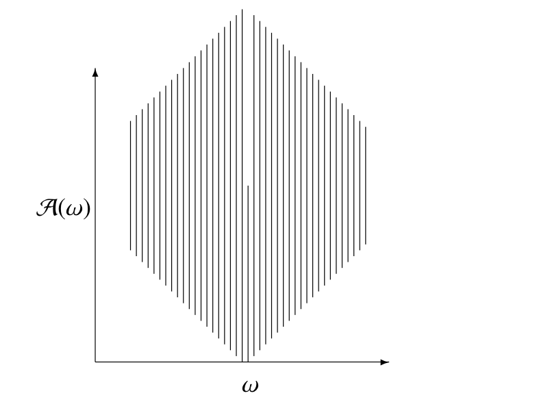

# Background

## Introduction

## Analysis

###SemiContinuities

The _lower limit_ or _limit inferior_ of a sequence $\{x_i\}$ is defined as
$$
\liminf_{i\rightarrow\infty}x_i=\lim_{i\rightarrow\infty}\left[\inf_{k\geq i} x_k\right]=\sup_{i\geq 0}\left[\inf_{k\geq i} x_k\right].
$$
Alternatively, the limit inferior is the smallest cluster point or subsequential limit
$$
\liminf_{i\rightarrow\infty}x_i=\min\{y\mid x_{i_\nu}\rightarrow y\}.
$$
In the same way
$$
\limsup_{i\rightarrow\infty}x_i=\lim_{i\rightarrow\infty}\left[\sup_{k\geq i} x_k\right]=\inf_{i\geq 0}\left[\sup_{k\geq i} x_k\right].
$$
We always have
$$
\inf_i x_i\leq\liminf_{i\rightarrow\infty} x_i\leq\limsup_{i\rightarrow\infty} x_i\leq\sup_i x_i.
$$
Also if $\liminf_{i\rightarrow\infty} x_i=\limsup_{i\rightarrow\infty} x_i$ then
$$
\lim_{i\rightarrow\infty}x_i=\liminf_{i\rightarrow\infty} x_i=\limsup_{i\rightarrow\infty} x_i.
$$
<hr>
The _lower limit_ or _limit inferior_ of a function at a point $\overline{x}$ is defined as
$$
\liminf_{x\rightarrow \overline{x}}f(x)=\sup_{\delta>0}\left[\inf_{x\in\mathcal{B}(\overline{x},\delta)}f(x)\right],
$$
where
$$
\mathcal{B}(\overline{x},\delta)\mathop{=}\limits^{\Delta}\{x\mid\|x-\overline{x}\|\leq\delta\}.
$$
Alternatively
$$
\lim_{i\rightarrow\infty} x_i=\liminf_{x\rightarrow \overline{x}}f(x)=\min\{y\mid
x_i\rightarrow \overline{x}\text { and }f(x_i)\rightarrow y\}.
$$
In the same way
$$
\limsup_{x\rightarrow \overline{x}}f(x)=\inf_{\delta>0}\left[\sup_{x\in\mathcal{B}(\overline{x},\delta)}f(x)\right],
$$

<hr>
A function is _lower semi-continuous_ at $\overline{x}$ if
$$
\liminf_{x\rightarrow \overline{x}}f(x)\geq f(\overline{x})
$$
Since we always have $\liminf_{x\rightarrow \overline{x}}f(x)\leq f(\overline{x})$
we can also define lower semicontinuity as
$$
\liminf_{x\rightarrow \overline{x}}f(x)=f(\overline{x}).
$$

A function is _upper semi-continuous_ at $\overline{x}$ if
$$
\limsup_{x\rightarrow \overline{x}}f(x)= f(\overline{x}).
$$
We have
$$
\liminf_{x\rightarrow \overline{x}}f(x)\leq\limsup_{x\rightarrow \overline{x}}f(x).
$$
A function is _continuous_
at $\overline{x}$ if and only if it is both lower semicontinuous and upper semicontinous, i.e. if
$$
f(\overline{x})=\lim_{x\rightarrow \overline{x}} f(x)=\liminf_{x\rightarrow \overline{x}}f(x)=\limsup_{x\rightarrow \overline{x}} f(x).
$$

###Directional Derivatives

The notation and terminology are by no means standard. We generally follow @demyanov_10.

The _lower Dini directional derivative_ of $f$ at $x$ in the direction $z$ is
$$
\delta^-f(x,z)\mathop{=}\limits^{\Delta}\liminf_{\alpha\downarrow 0}\frac{f(x+\alpha z)-f(x)}{\alpha}=\sup_{\delta>0}\inf_{0<\alpha<\delta}\frac{f(x+\alpha z)-f(x)}{\alpha}.
$$
and the corresponding _upper Dini directional derivative_ is
$$
\delta^+f(x,z)\mathop{=}\limits^{\Delta}\limsup_{\alpha\downarrow 0}\frac{f(x+\alpha z)-f(x)}{\alpha}=\inf_{\delta>0}\sup_{0<\alpha<\delta}\frac{f(x+\alpha z)-f(x)}{\alpha},
$$
If
$$
\delta f(x,z)=\lim_{\alpha\downarrow 0}\frac{f(x+\alpha z)-f(x)}{\alpha}
$$
exists, i.e. if $\delta^+f(x,z)=\delta^-f(x,z)$, then it we simply
write $\delta f(x,z)$ for the Dini directional derivative of $f$ at $x$ in the
direction $z$.@penot_13 calls this the _radial derivative_ and @schirotzek_07 calls it the _directional Gateaux derivative._ If $\delta f(x,z)$ exists $f$ is _Dini directionally differentiable_
at $x$ in the direction $z$, and if $\delta f(x,z)$ exists at $x$ for all $z$ we say that $f$ is _Dini directionally differentiable_ at $x.$ @delfour_12 calls $f$
_semidifferentiable_ at $x$.

In a similar way we can define the _Hadamard lower and upper directional derivatives_. They are
$$
d^-f(x,z)\mathop{=}\limits^{\Delta}\liminf_{\substack{\alpha\downarrow 0\\u\rightarrow z}}\frac{f(x+\alpha u)-f(x)}{\alpha}=
\sup_{\delta>0}\inf_{\substack{u\in\mathcal{B}(z,\delta)\\\alpha\in(0,\delta)}}\frac{f(x+\alpha u)-f(x)}{\alpha},
$$
and
$$
d^+f(x,z)\mathop{=}\limits^{\Delta}\limsup_{\substack{\alpha\downarrow 0\\u\rightarrow z}}\frac{f(x+\alpha u)-f(x)}{\alpha}=
\inf_{\delta>0}\sup_{\substack{u\in\mathcal{B}(z,\delta)\\\alpha\in(0,\delta)}}\frac{f(x+\alpha u)-f(x)}{\alpha},
$$
The Hadamard directional derivative $df(x,z)$ exists if both $d^+f(x,z)$ and $d^-f(x,z)$ exist and are equal. In that case $f$ is _Hadamard directionally differentiable_ at $x$ in the direction $z$, and if $df(x,z)$ exists at $x$ for all $z$ we say that $f$ is Hadamard directionally differentiable at $x.$

Generally we have
$$
d^-f(x,z)\leq\delta^-f(x,z)\leq\delta^+f(x,z)\leq d^+f(x,z)
$$

The _classical directional derivative_ of $f$ at $x$ in the direction $g$ is
$$
\Delta f(x,z)\mathop{=}\limits^{\Delta}\lim_{\alpha\rightarrow 0}\frac{f(x+\alpha z)-f(x)}{\alpha}.
$$
Note that for the absolute value function at zero we have $\delta f(0,1)=df(0,1)=1$, while $\Delta f(0,1)=\lim_{\alpha\rightarrow 0}\mathbf{sign}(\alpha)$ does not exist.
The classical directional derivative is not particularly useful in the context of optimization problems.

### Differentiability and Derivatives

The function $f$ is _Gateaux differentiable_ at $x$ if and only if  the Dini directional derivative $\delta f(x,z)$ exists for all $z$ and is linear in $z$. Thus $\delta f(x,z)=G(x)z$

The function $f$ is _Hadamard differentiable_ at $x$ if the Hadamard directional derivative $df(x,z)$ exists for all $z$ and is linear in $z$.

Function $f$ is _locally Lipschitz_ at $z$ if there is a ball $\mathcal{B}(z,\delta)$ and a $\gamma>0$ such that $\|f(x)-f(y)|\leq\gamma\|x-y\|$ for all $x,y\in\mathcal{B}(z,\delta).$

If $f$ is locally Lipschitz and Gateaux differentiable then it is Hadamard differentiable.

If the Gateaux derivative of $f$ is continuous then $f$ is Frechet differentiable.

Define Frechet differentiable

The function $f$ is Hadamard differentiable if and only if it is Frechet differentiable.

Gradient, Jacobian

###Taylor's Theorem

Suppose $f:\mathcal{X}\rightarrow\mathbb{R}$ is $p+1$ times continuously differentiable in the open set $\mathcal{X}\subseteq\mathbb{R}^n$. Define, for all $0\leq s\leq p$,
$$
h_s(x,y)\mathop{=}\limits^{\Delta}\frac{1}{s!}\langle\mathcal{D}^sf(y),(x-y)^{s}\rangle,
$$
as the inner product of the $s$-dimensional array
of partial derivatives $\mathcal{D}^sf(y)$ and the $s$-dimensional outer power of $x-y.$ Both arrays are super-symmetric, and have dimension $n^s.$ By convention $h_0(x,y)=f(y)$.

Also define the _Taylor Polynomials_
$$
g_p(x,y)\mathop{=}\limits^{\Delta}\sum_{s=0}^ph_s(x,y)
$$
and the _remainder_
$$
r_p(x,y)\mathop{=}\limits^{\Delta}f(x)-g_p(x,y).
$$
Assume $\mathcal{X}$ contains the line segment with endpoints $x$ and $y$. Then _Lagrange's form of the remainder_ says there is a $0\leq\lambda\leq 1$ such that
$$
r_p(x,y)=\frac{1}{(p+1)!}\langle\mathcal{D}^{p+1}f(x+\lambda(y-x)),(x-y)^{p+1}\rangle,
$$
and the _integral form of the remainder_ says
$$
r_p(x,y)=\frac{1}{p!}\int_0^1(1-\lambda)^p\langle\mathcal{D}^{p+1}f(x+\lambda(y-x)),(x-y)^p\rangle d\lambda.
$$

### Implicit Functions

The classical implicit function theorem is discussed in all analysis books. I am particularly fond of @spivak_65. The history of the theorem, and many of its variations, is discussed in @krantz_parks_03 and a comprenhensive modern treatment, using the tools of convex and variational analysis, is in @dontchev_rockafellar_14.


Suppose $f:\mathbb{R}^n\otimes\mathbb{R}^m\mapsto\mathbb{R}^m$ is continuously differentiable in an open set containing $(x,y)$ where $f(x,y)=0.$ Define the $m\times m$ matrix
$$
A(x,y)\mathop{=}\limits^{\Delta}\mathcal{D}_2f(x,y)
$$
and suppose that $A(x,y)$ is non-singular. Then there is an open set $\mathcal{X}$ containing $x$ and an open
set $\mathcal{Y}$ containing $y$ such that
for every $x\in\mathcal{X}$ there is a unique $y(x)\in\mathcal{Y}$ with $f(x,y(x))=0.$

The function $y:\mathbb{R}^n\mapsto\mathbb{R}^m$ is
differentiable. If we differentiate $f(x,y(x))=0$ we
find
$$
\mathcal{D}_1f(x,y(x))+\mathcal{D}_2(x,f(x))\mathcal{D}y(x),
$$
and thus
$$
\mathcal{D}y(x)=-[\mathcal{D}_2f(x,y(x))]^{-1}\mathcal{D}_1f(x,y(x)).
$$

As an example consider the eigenvalue problem
\begin{align*}
A(x)y&=\lambda y,\\
y'y&=1
\end{align*}
where $A$ is a function of a real parameter $x$. Then
$$
\begin{bmatrix}
A(x)-\lambda I&-x\\
x'&0
\end{bmatrix}
\begin{bmatrix}
\mathcal{D}y(x)\\
\mathcal{D}\lambda(x)
\end{bmatrix}
=
\begin{bmatrix}
-\mathcal{D}A(x)x\\
0
\end{bmatrix},
$$
which works out to
\begin{align*}
\mathcal{D}\lambda(x)&=y(x)'\mathcal{D}A(x)y(x),\\
\mathcal{D}y(x)&=-(A(x)-\lambda(x)I)^+\mathcal{D}A(x)y(x).
\end{align*}

### Necessary and Sufficient Conditions for a Minimum

Directional derivatives can be used to provide simple necessary or sufficient conditions for a minimum (@demyanov_09, propositions 8 and 9).

**Result:** If $x$ is a local minimizer of $f$ then $\delta^-f(x,z)\geq 0$ and $d^-f(x,z)\geq 0$ for all directions $z$. If $d^-f(x,z)>0$ for all $z\not= 0$ then $f$ has a strict local minimum at $x$.

<hr>
The special case of a quadratic deserves some separate study, because the quadratic model is so prevalent in optimization.
So let us look at $f(x)=c+b'x+\frac12 x'Ax$, with $A$ symmetric.
Use the eigen-decomposition $A=K\Lambda K'$ to change variables to $\tilde x\mathop{=}\limits^{\Delta}K'x$, also using $\tilde b\mathop{=}\limits^{\Delta}K'b$. Then $f(\tilde x)=c+\tilde b'\tilde x+\frac12\tilde x'\Lambda\tilde x$, which we can write as
\begin{align*}
f(\tilde x)=\ &c-\frac12\sum_{i\in I_+\cup I_-}\frac{\tilde b_i^2}{\lambda_i}\\
&+\frac12\sum_{i\in I_+}|\lambda_i|(\tilde x_i+\frac{\tilde b_i}{\lambda_i})^2+\\
&-\frac12\sum_{i\in I_-}|\lambda_i|(\tilde x_i+\frac{\tilde b_i}{\lambda_i})^2+\\
&+\sum_{i\in I_0}\tilde b_i\tilde x_i.
\end{align*}
Here
\begin{align*}
I_+&\mathop{=}\limits^{\Delta}\{i\mid\lambda_i>0\},\\
I_-&\mathop{=}\limits^{\Delta}\{i\mid\lambda_i<0\},\\
I_0&\mathop{=}\limits^{\Delta}\{i\mid\lambda_i=0\}.
\end{align*}
* If $I_-$ is non-empty we have $\inf_x f(x)=-\infty$.
* If $I_-$ is empty, then $f$
attains its minimum if and only if $\tilde b_i=0$ for all $i\in I_0$. Otherwise again $\inf_x f(x)=-\infty.$

If the minimum is attained, then
$$
\min_x f(x) = c-\frac12 b'A^+b,
$$
with $A^+$ the Moore-Penrose inverse. And the minimum is attained if and only if $A$ is positive semi-definite and $(I-A^+A)b=0$.

## Point-to-set Maps

###Continuities

### Marginal Functions and Solution Maps

Suppose $f:\mathbb{R}^n\otimes\mathbb{R}^n\rightarrow\mathbb{R}$ and $g(x)=\min_y f(x,y)$. Suppose the minimum is attained at a unique $y(x)$,
where $\mathcal{D}_2f(x,y(x))=0.$ Then
obviously $g(x)=f(x,y(x))$. Differentiating $g$ gives
$$
\mathcal{D}g(x)=\mathcal{D}_1f(x,y(x))+\mathcal{D}_2f(x,y(x))\mathcal{D}y(x)=\mathcal{D}_1f(x,y(x)).\tag{1}
$$

To differentiate the solution map we need second derivatives of $f$. Differentiating the implicit definition  $\mathcal{D}_2f(x,y(x))=0$ gives
$$
\mathcal{D}_{21}f(x,y(x))+\mathcal{D}_{22}f(x,y(x))\mathcal{D}y(x)=0,
$$
or
$$
\mathcal{D}y(x)=-[\mathcal{D}_{22}f(x,y(x))]^{-1}\mathcal{D}_{21}f(x,y(x)).\tag{2}
$$
Now combine both $(1)$ and $(2)$ to obtain
$$
\mathcal{D}^2g(x)=\mathcal{D}_{11}f(x,y(x))-\mathcal{D}_{12}f(x,y(x))[\mathcal{D}_{22}f(x,y(x))]^{-1}\mathcal{D}_{21}f(x,y(x)).\tag{3}
$$
We see that if $\mathcal{D}^2f(x,y(x))\gtrsim 0$ then $0\lesssim\mathcal{D}^2g(x)\lesssim\mathcal{D}_{11}f(x,y(x))$.
<hr>
Now consider minimization problem with constraints. Suppose $h_1,\cdots,h_p$ are twice continuously differentiable functions
on $\mathbb{R}^m$, and suppose
$$
\mathcal{Y}=\{y\in\mathbb{R}^m\mid h_1(y)=\cdots=h_p(y)=0\}.
$$
Define
$$
g(x)\mathop{=}\limits^{\Delta}\min_{y\in\mathcal{Y}}f(x,y),
$$
and
$$
y(x)\mathop{=}\limits^{\Delta}\mathop{\mathbf{argmin}}\limits_{y\in\mathcal{Y}} f(x,y),
$$
where again we assume the minimizer is unique and satisfies
\begin{align*}
\mathcal{D}_2f(x,y(x))-\sum_{s=1}^p\lambda_s(x)\mathcal{D}h_s(y(x))&=0,\\
h_s(y(x))&=0.
\end{align*}
Differentiate again, and define
\begin{align*}
A(x)&\mathop{=}\limits^{\Delta}\mathcal{D}_{22}f(x,y(x)),\\
H_s(x)&\mathop{=}\limits^{\Delta}\mathcal{D}^2h_s(y(x)),\\
E(x)&\mathop{=}\limits^{\Delta}-\mathcal{D}_{21}f(x,y(x)),\\
B(x)&\mathop{=}\limits^{\Delta}\mathcal{D}H(y(x)),
\end{align*}
and
$$
C(x)\mathop{=}\limits^{\Delta}A(x)-\sum_{s=1}^p\lambda_sH_s(x).
$$
Then
$$
\begin{bmatrix}
C(x)&-B(x)\\
B'(x)&0
\end{bmatrix}
\begin{bmatrix}\mathcal{D}y(x)\\\mathcal{D}\lambda(x)\end{bmatrix}=
\begin{bmatrix}E(x)\\0\end{bmatrix},
$$
which leads to
\begin{align*}
\mathcal{D}y(x)&=\left\{I-B(x)\left[B'(x)C^{-1}(x)B(x)\right]^{-1}B'(x)\right\}C^{-1}(x)E(x),\\
\mathcal{D}\lambda(x)&=\left[B'(x)C^{-1}(x)B(x)\right]^{-1}B'(x)C^{-1}(x)E(x).
\end{align*}
<hr>

There is an alternative way of arriving at basically the same result. Suppose the manifold $G(x)=0$ is parametrized locally as $x=F(w)$. Then
$$
y(z)=\mathbf{Arg}\mathop{\mathbf{min}}\limits_{w} f(F(w),z),
$$
and $G(F(w))=0$, i.e. $\mathcal{D}G(F(w))\mathcal{D}F(w)=0$. Let $h(w,z)=f(F(w),z)$. Then
$$
\mathcal{D}y(z)=-[\mathcal{D}_{11}f(F(w(z)),z)]^{-1}\mathcal{D}_{12}h(F(w(z)),z).
$$
$$
\mathcal{D}_{11}f(F(w(z)),z)=\mathcal{D}_1f\mathcal{D}^2F_i+(\mathcal{D}F)'\mathcal{D}_{11}\mathcal{D}F
$$

###Solution Maps

##Basic Inequalities

### Jensen's Inequality

### The AM-GM Inequality

The Arithmetic-Geometric Mean Inequality is simple, but quite useful for
majorization. For completeness, we give the statement and proof here.

**Theorem:**
If $x\geq 0$ and $y\geq 0$ then $\sqrt{xy}\leq\frac{1}{2}(x+y),$
with equality if and only if $x=y.$

**Proof:**
Expand $(\sqrt{x}-\sqrt{y})^2\geq 0,$ and collect terms.
**QED**

**Corollary:**
$\mid xy\mid\leq\frac{1}{2}(x^2+y^2)$

**Proof:** Just a simple rewrite of the theorem. **QED**

###Polar Norms and the Cauchy-Schwarz Inequality

**Theorem:**
Suppose $x,y\in\mathbb{R}^n.$ Then
$(x'y)^2\leq x'x.y'y,$
with equality if and only if $x$
and $y$ are proportional.

**Proof:**
The result is trivially true if either $x$ or $y$ is zero. Thus
we suppose both are non-zero.
We have $h(\lambda)\mathop{=}\limits^{\Delta}(x-\lambda y)'(x-\lambda y)\geq 0$ for
all $\lambda.$ Thus
$$
\min_\lambda h(\lambda)=x'x-\frac{(x'y)^2}{y'y}\geq 0,
$$
which is the required result.
**QED**

### Young's Inequality

The AM-GM inequality is a very special cases of Young's inequality. We derive it in a general form, using the coupling functions introduced by Moreau.
Suppose $f$ is a real-valued function on $\mathcal{X}$ and $g$ is a real-valued function on $\mathcal{X}\times\mathcal{Y}$, called the _coupling_ function. Here $\mathcal{X}$ and $\mathcal{Y}$ are arbitrary. Define the _$g$-conjugate_ of $f$ by
$$
f^\circ_g(y)\mathop{=}\limits^{\Delta}\sup_{x\in\mathcal{X}}\ \{g(x,y)-f(x)\}
$$
Then $g(x,y)-f(x)\leq f^\circ_g(y)$ and thus $g(x,y)\leq f(x)+f^\circ_g(y)$, which is the generalized Young's inequality. We can also write this in the form that directly suggests minorization
$$
f(x)\geq f^\circ_g(y)+g(x,y).
$$

The classical coupling function is $g(x,y)=xy$ with both $x$ and $y$ in the positive reals. If we
take $f(x)=\frac{1}{p}x^p$, with $p>1$, then
$$
f^\circ_g(y)=\sup_{x}\ \{xy-\frac{1}{p}x^p\}.
$$
The $\sup$ is attained for $x=y^{\frac{1}{p-1}}$, from which we find $f^\circ_g(y)=\frac{1}{q}y^q,$
with $q\mathop{=}\limits^{\Delta}\frac{p}{p-1}$.

Thus if $p,q>1$ such that
$$
\frac{1}{p}+\frac{1}{q}=1.
$$
Then for all $x,y>0$ we have
$$
xy\leq\frac{x^p}{p}+\frac{y^q}{q},
$$
with equality if and only if $y=x^{p-1}$.


## Fixed Point Problems and Methods{#background:fixedpoint}

As we have emphasized before, the algorithms discussed in this books are all special cases of block relation methods. But block relation methods are often appropriately analyzed as _fixed point methods_, which define an even wider class of iterative methods.
Thus we will not discuss actual fixed point algorithms that are not block relation methods, but we will use general results on fixed point methods to analyze block relaxation methods.

A (stationary, one-step) fixed point method on $\mathcal{X}\subseteq\mathbb{R}^n$ is defined as a map  $A:\mathcal{X}\rightarrow\mathcal{X}$.
Depending on the context we refer to $A$ as the _update map_ or _algorithmic map_.
Iterative sequences are generated by
starting with $x^{(0)}\in\mathcal{X}$ and then
setting
$$
x^{(k)}=A(x^{(k-1)})=A^k(x^{(0)}).
$$
for $k=1,2,\cdots$.
Such a sequence is also called the _Picard sequence_ generated by the map.

If the sequence $x^{(k)}$ converges to, say,  $x_\infty$, and if $A$ is continuous, then $x_\infty=A(x_\infty)$, and
thus $x_\infty$ is a _fixed point_ of $A$ on $\mathcal{X}$.
The set of all $x\in\mathcal{X}$ such that $x=A(x)$ is called the _fixed point set_ of $A$ on $\mathcal{X}$, and is written as $\mathcal{F}_\mathcal{X}$.

The literature on fixed point methods is truly gigantic. There are textbooks, conferences, and dedicated journals. A nice and compact treatment, mostly on  existence theorems for fixed points, is @smart_74. An excellent modern overview, concentrating on metrical fixed point theory and iterative computation, is @berinde_07.

The first key result in fixed point theory is the _Brouwer Fixed Point Theorem_, which says that for compact convex $\mathcal{X}$ and continuous $A$ there is at least one $x\in\mathcal{F}_\mathcal{X}(A)$.
The second is the _Banach Fixed Point Theorem_, which says that if $\mathcal{X}$ is a non-empty complete metric space and $A$ is a _contraction_, i.e. $d(A(x),A(y))<\kappa\ d(x,y)$ for some $0\leq\kappa<1$, then the Picard sequence $x^{(k)}$ converges from any starting point $x^{(0)}$ to the unique fixed point of $A$ in $\mathcal{X}$.

Much of the fixed point literature is concerned with relaxing the contraction assumption and choosing more general spaces on which the various mappings are defined. I shall discuss some of the generalizations that we will use later in this book.

First, we can generalize to point-to-set maps $A:\mathcal{X}\rightarrow 2^\mathcal{X}$, where $2^\mathcal{X}$ is the _power set_ of $\mathcal{X}$, i.e. the set of all subsets. Point-to-set maps are also called _correspondences_ or _multivalued maps_. The Picard sequence is now defined by $x^{(k)}\in A(x^{(k-1)})$ and we have a fixed point  $x\in\mathcal{F}_\mathcal{X}(A)$ if and only if  $x\in A(x)$. The generalization of the Brouwer Fixed Point Theorem is the _Kakutani Fixed Point Theorem_.
It assumes that $\mathcal{X}$ is non-empty, compact and convex and that $A(x)$ is non-empty and convex for each $x\in\mathcal{X}$.
In addition, the map $A$ must be _closed_ or _upper semi-continuous_ on $\mathcal{X}$,
i.e. whenever $x_n\rightarrow x_\infty$ and $y_n\in A(x_n)$ and $y_n\rightarrow y_\infty$ we have $y_\infty\in A(x_\infty)$.
Under these conditions Kakutani's Theorem asserts the existence of a fixed point.

Our discussion of the global convergence of block relaxation algorithms, in a later chapter, will be framed using fixed points of point-to-set maps, assuming the closedness of maps.

In another generalization of iterative algorithms we get rid of the one-step and the stationary assumptions. The iterative sequence is
$$
x^{(k)}\in A_k(x^{(0)},x^{(1)},\cdots,x^{(k-1)}).
$$
Thus the iterations have perfect memory, and the update map can change in each iteration. In
an $\ell$-step method, memory is less than perfect, because the update is a function of only the previous $\ell$ elements in the sequence. Formally, for $k\geq\ell$,
$$
x^{(k)}\in A_k(x^{(k-l)},\cdots,x^{(k-1)}),
$$
with some special provisions for $k<\ell$.

Any $\ell$-step method on $\mathcal{X}$ can be rewritten as a one-step method on
$$
\underbrace{\mathcal{X}\otimes\mathcal{X}\otimes\cdots\otimes\mathcal{X}}_{\ell\ \text{times}}.
$$
This makes it possible to limit our discussion to one-step methods. In fact, we will mostly discuss block-relaxation methods which are stationary one-step fixed point methods.

For non-stationary methods it is somewhat more complicated to define fixed points. In that case it is natural to define a set $\mathcal{S}\subseteq\mathcal{X}$ of _desirable points_ or _targets_, which for stationary algorithms will generally, but not necessarily, coincide with the fixed points of $A$.
The questions we will then have to answer are if and under what conditions our algorithms converge to desirable points, and if they converge how fast the convergence will take place.

### Subsequential Limits


##Convex Functions

##Composition

### Differentiable Convex Functions

If a function $f$ attains its minimum on
a convex set $\mathcal{X}$ at $x$, and $f$ is differentiable at $x$, then $(x-y)'\mathcal{D}f(x)\geq 0$ for all $y\in\mathcal{X}$.

If $f$ attains its minimum on $[a,b]$ at $a$,
and $f$ is differentiable at $a$, then $f'(a)\geq 0$. Or, more precisely, if $f$ is differentiable from the right at $a$ and $f'_R(a)\geq 0$.

Suppose $\mathcal{X}=\{x\mid x'x\leq 1\}$ is the unit ball and a differentiable $f$ attains its a minimum at $x$ with $x'x=1.$ Then $(x-y)'\mathcal{D}f(x)\geq 0$ for
all $y\in\mathcal{X}.$ This is true if and only if
\begin{align*}
\min_{y\in\mathcal{X}}(x-y)'\mathcal{D}f(x)&=
x'\mathcal{D}f(x)-\max_{y\in\mathcal{X}}y'\mathcal{D}F(x)=\\&=x'\mathcal{D}f(x)-\|\mathcal{D}f(x)\|=0.
\end{align*}
By Cauchy-Schwartz this means that $\mathcal{D}f(x)=\lambda x$, with $\lambda=
x'\mathcal{D}f(x)=\|\mathcal{D}f(x)\|.$

As an aside, if a differentiable function $f$ attains its minimum on the unit sphere $\{x\mid x'x=1\}$ at $x$
then $f(x/\|x\||)$ attains is minimum over $\mathbb{R}^n$ at $x$. Setting the derivative equal to zero shows that we must
have $\mathcal{D}f(x)(I-xx')=0$, which again translates to $\mathcal{D}f(x)=\lambda x$, with $\lambda=
x'\mathcal{D}f(x)=\|\mathcal{D}f(x)\|.$

##Zangwill Theory

### Algorithms as Point-to-set Maps

The theory studies iterative algorithms with the following properties.
An algorithm works in a space $\Omega.$ It consists of a triple $(\mathcal{A},\psi,\mathcal{P}),$
with $\mathcal{A}$ a mapping of $\Omega$ into the set
of nonempty subsets of $\Omega,$ with $\psi$ a real-valued
function on $\Omega,$ and with $\mathcal{P}$ a subset of $\Omega.$ We
call $\mathcal{A}$ the _algorithmic map_ or the _update_, $\psi$ the _evaluation function_ and $\mathcal{P}$ the _desirable points_.

The algorithm
works as follows.

1. start at an arbitrary $\omega^{(0)}\in\Omega,$
2. if $\omega^{(k)}\in\mathcal{P},$ then we stop,
3. otherwise we construct the _successor_
by the rule $\omega^{(k+1)}\in\mathcal{A}(\omega^k).$

We study properties of the sequences $\omega^{(k)}$ generated by the algorithm,
in particular their convergence.

### Convergence of Function Values

For this method we have our first (rather trivial) convergence theorem.

**Theorem:** If
* $\Omega$ is compact,
* $\psi$ is jointly continuous on $\Omega$,

then

* The sequence $\{\psi^{(k)}\}$ converges to, say, $\psi^\infty,$
* the sequence $\{\omega^{(k)}\}$ has at least one convergent subsequence,
* if $\omega^\infty$ is an accumulation point of $\{\omega^{(k)}\},$ then $\psi(\omega^\infty)=\psi^\infty.$

**Proof:**
Compactness and continuity imply that $\psi$ is bounded
below on $\Omega,$ and the minima
in each of the substeps exist. This means that $\{\psi^{(k)}\}$
is nonincreasing and bounded below, and thus convergent. Existence
of convergent subsequences is guaranteed by Bolzano-Weierstrass,
and if we have a subsequence $\{\omega^{(k)}\}_{k\in\mathcal{K}}$
converging to $\omega^\infty$ then by continuity $\{\psi(\omega^{(k)})\}_{k\in\mathcal{K}}$
converges to $\psi(\omega^\infty).$ But all subsequences of a convergent
sequence converge to the same point, and thus $\psi(\omega^\infty)=\psi^\infty.$
**QED**

**Remark:** The assumptions in the theorem can be relaxed. Continuity is not
necessary. Think of the function $\psi(x)=\sum_{s=1}^p\text{sign}(x_s),$
which clearly is minimized in a single cycle. Typically, however, statistical
problems exhibit continuity, so it may not be worthwhile to actually relax the assumption.

Compactness is more interesting. If we define the level sets
$$
\Omega_0\mathop{=}\limits^{\Delta}\{\omega\in\Omega\mid\psi(\omega)\leq\psi^{(0)}\},
$$
then obviously it is sufficient to assume that $\Omega_0$ is
compact. The same thing is true for the even weaker assumption
that the iterates $\omega^{(k)}$ are in a compact set.

We do not assume the sets $\Omega_s$ are connected, i.e. they could be
discrete. For instance, we could minimize $\|X\beta-y-\delta\|^2$
over $\beta$ and $\delta$, under the constraint that the elements of $\delta$ take only two different unspecified values.
This is not difficult to
do with block-relaxation, but generally problems with discrete
characteristics present us with special problems and complications.
Thus, in most instances, we have connected sets in mind. For discrete
components, the usual topology of $\mathbb{R}^s$ may not be the most natural
one to study convergence.

In several problems in statistics the sets $\Omega_s$ can be
infinite-dimensional. This is true, for instance, in much of semi-parametric
and non-parametric statistics. We mostly ignore the complications
arising from infinite dimensionality (again, of a topological nature),
because in actual computations we work with finite-dimensional
approximations anyway.

Theorem \ref{T:triv} is very general, but the conclusions are quite weak.
We have convergence of the function values, but about the
sequence $\{\omega^{(k)}\}$ we only know that it has one or
more accumulation points, and that all accumulation points
have the same function value. We have not established other desirable properties of these accumulation points.

In order to prove global convergence (i.e. convergence from
any initial point) we use the general theory
developed initially by @zangwill_69
(and later by @polak_69, @meyer_76,
@meyer_75, and others). The best introduction and overview
is perhaps the volume edited by Huard (@huard_79a).


### Convergence of Solutions


**Theorem: [Zangwill]**

* If $\mathcal{A}$ is _uniformly compact_ on $\Omega,$
i.e. there is a compact $\Omega_0\subseteq\Omega$
such that $\mathcal{A}(\omega)\subseteq\Omega_0$ for all $\omega\in\Omega,$
* If $\mathcal{A}$ is _upper-semicontinuous_ or  _closed_ on $\Omega-\mathcal{P},$
i.e. if $\xi_i\in\mathcal{A}(\omega_i)$
and $\xi_i\rightarrow\xi$
and $\omega_i\rightarrow\omega$
then $\xi\in\mathcal{A}(\omega),$
* If $\mathcal{A}$ is _strictly monotonic_ on $\Omega-\mathcal{P}$,
i.e. $\xi\in\mathcal{A}(\omega)$
implies $\psi(\xi)$ < $\psi(\omega)$ if $\omega$
is not a _desirable point_.
then
all accumulation points of
the sequence $\{\omega^{(k)}\}$ generated by the algorithm are desirable
points.

**Proof:**
Compactness implies that $\{\omega^{(k)}\}$ has a convergent subsequence. Suppose its index-set
is $\mathcal{K}=\{k_1,k_2,\cdots\}$ and that it converges to $\omega_\mathcal{K}.$
Since $\{\psi(\omega^{(k)})\}$ converges to, say $\psi_\infty,$
we see that also
$$
\{\psi(\omega^{(k_1)}),\psi(\omega^{(k_2)}),\cdots\}
\rightarrow\psi_\infty.
$$
Now consider $\{\omega^{(k_1+1)},\omega^{(k_2+1)},\cdots\},$
which must again have a convergent subsequence. Suppose its index-set
is $\mathcal{L}=\{\ell_1+1,\ell_2+1,\cdots\}$ and that it converges to $\omega_\mathcal{L}.$
Then $\psi(\omega_\mathcal{K})=\psi_(\omega_\mathcal{L})=\psi_\infty.$

Assume $\omega_\mathcal{K}$ is not a fixed point. Now
$$
\{\omega^{(\ell_1)},\omega^{(\ell_2)},\cdots\}
\rightarrow \omega_\mathcal{K}
$$
and
$$
\{\omega^{(\ell_1+1)},\omega^{(\ell_2+1)},\cdots\}
\rightarrow\omega_\mathcal{L},
$$
with $\omega^{(\ell_j+1)}\in\mathcal{A}(\omega^{(\ell_j+1)}.$ Thus, by
usc, $\omega_\mathcal{L}\in\mathcal{A}(\omega_\mathcal{K}).$
If $\omega_\mathcal{K}$ is not a fixed point, then strict monotonicity gives gives $\psi(\omega_\mathcal{L})$ < $\psi(\omega_\mathcal{K}),$ which contradicts our earlier $\psi(\omega_\mathcal{K})=\psi_(\omega_\mathcal{L}).$
**QED**

The concept of closedness of a map can be illustrated with the
following picture, showing a map which is not closed at at least
one point.

```{r bookfig3, fig.align = "center", fig.cap = "The map is not closed", echo = FALSE}

```

We have already seen another example: Powell's coordinate
descent example shows that the algorithm map is not closed at
six of the edges of the cube $\{\pm 1,\pm 1,\pm 1\}.$

It is easy to see
that desirable points are generalized fixed points, in the sense
that $\omega\in\mathcal{P}$ is equivalent to
that $\omega\in\mathcal{A}(\omega).$
According to Zangwill's theorem
each accumulation point is a generalized fixed point. This, however,
does not prove convergence, because there can be many accumulation
points. If we redefine fixed points as points such
that $\mathcal{A}(\omega)=\{\omega\},$
then we can strengthen the theorem [Meyer, 1976].

**Theorem: [Meyer]**
Suppose the conditions of Zangwill's theorem
are satisfied for the stronger definition of a fixed point,
i.e. $\xi\in\mathcal{A}(\omega)$
implies $\psi(\xi)$ < $\psi(\omega)$ if $\omega$
is not a fixed point,
then in addition to what we had
before $\{\omega^{(k)}\}$ is _asymptotically regular_, i.e. $\|\omega^{(k)}-\omega^{(k+1)}\|\rightarrow 0.$

**Proof:** Use the notation in the proof of Zangwill's theorem.
Suppose $\|\omega^{(\ell_i+1)}-\omega^{(\ell_i)}\|$ > $\delta$ > $0.$ Then $\|\omega_\mathcal{L}-\omega_\mathcal{K}\|\geq\delta.$ But $\omega_\mathcal{K}$ is a fixed point (in
the strong sense) and
thus $\omega_\mathcal{L}\in\mathcal{A}(\omega_\mathcal{K})=\{\omega_\mathcal{K}\},$ a
contradiction.
**QED**

**Theorem: [Ostrowski]**
If the bounded sequence $\Omega=\{\omega^{(k)}\}$ satisfies $\|\omega^{(k)}-\omega^{(k+1)}\|\rightarrow 0,$
then the derived set $\Omega'$ is either a point
or a continuum.

**Proof:**
We follow Ostrowski [1966, pages 203--204]. A _continuum_ is a closed
set, which is not the union of two or more disjoint closed
sets. Of course the derived set is closed. Suppose it is the
union of the disjoint closed sets $C_1$ and $C_2,$ which are
a distance of at least $p$ apart. We can
choose $k_0$
such that $\|\omega^{(k)}-\omega^{(k+1)}\|\leq\frac{p}{3}$ for all $k\geq k_0.$
**QED**

Only if the derived set is a single point, we have actual convergence.
Thus Meyer's theorem still does not prove actual
convergence, but it is close enough for all practical purposes.
Observe boundedness is essential in Theorem \ref{T:ostrow}, otherwise
the derived set may be empty, think
of the series $\sum\frac{1}{k}.$

## Rates of Convergence

The basic result we use is due to Perron and @ostrowski_66.

**Theorem:**
* If the iterative algorithm  $x^{(k+1)}=\mathcal{A}(x^{(k)}),$
converges to $x_\infty,$
* and $\mathcal{A}$ is differentiable at $x_\infty,$
* and $0<\rho=\|\mathcal{D}\mathcal{A}(\omega_\infty)\|<1,$

then the algorithm is linearly convergent with rate $\rho.$

**Proof:**

**QED**

The norm in the theorem is the spectral norm, i.e. the modulus of the
maximum eigenvalue. Let us call the derivative of $A$ the
_iteration matrix_ and write it as $\mathcal{M}.$
In general block relaxation methods have linear
convergence, and the linear convergence can be quite slow.
In cases where the accumulation points are a continuum
we have sublinear rates. The same things can be true if the local minimum
is not strict, or if we are converging to a saddle point.

Generalization to non-differentiable maps.

Points of attraction and repulsion.

Superlinear etc

### Over- and Under-Relaxation


### Acceleration of Convergence of Fixed Point Methods

## Matrix Algebra

### Eigenvalues and Eigenvectors of Symmetric Matrices

In this section we give a fairly complete introduction to eigenvalue problems and generalized eigenvalue problems. We use a constructive variational approach, basically using the Rayleigh quotient and deflation. This works best for positive semi-definite matrices, but after dealing with those we discuss several generalizations.

Suppose $A$ is a positive semi-definite matrix of order $n$.
Consider the problem of maximizing the quadratic form $f(x)=x'Ax$ on the sphere $x'x=1$. At the maximum, which is always attained,
we have $Ax=\lambda x$, with $\lambda$ a Lagrange multiplier, as well as $x'x=1$. It follows that $\lambda=f(x)$. Note that the maximum is not necessarily attained at a unique value. Also the maximum is zero if and only if $A$ is zero.

Any pair $(x,\lambda)$ such that $Ax=\lambda x$
and $x'x=1$ is called an _eigen-pair_ of $A$. The members of pair are the _eigenvector_ $x$ and the corresponding _eigenvalue_ $\lambda$.

**Result 1:** Suppose $(x_1,\lambda_1)$ and $(x_2,\lambda_2)$
are two eigen-pairs, with $\lambda_1\not=\lambda_2.$ Then premultiplying both sides of $Ax_2=\lambda_2x_2$
by $x_1'$ gives $\lambda_1x_1'x_2=\lambda_2x_1'x_2$,
and thus $x_1'x_2=0$. This shows that $A$ cannot have more than $n$ distinct eigenvalues. If there were $p>n$ distinct eigenvalues, then the $n\times p$ matrix $X$, which has the corresponding eigenvectors as columns, would have column-rank $p$ and row-rank $n$, which is impossible. In words: one cannot have more than $n$ orthonormal vectors in $n-$dimensional space. Suppose the distinct values are $\tilde\lambda_1>\cdots>\tilde\lambda_s$, with $s=1,\cdots,p.$ Thus each of the eigenvalues $\lambda_i$ is equal to one of the $\tilde\lambda_s.$

**Result 2:** If $(x_1,\lambda)$ and $(x_2,\lambda)$ are two
eigen-pairs with the same eigenvalue $\lambda$ then any linear combination $\alpha x_1+\beta x_2,$ suitably normalized,
is also an eigenvector with eigenvalue $\lambda$.
Thus the eigenvectors corresponding with an
eigenvalue $\lambda$ form a linear subspace of $\mathbb{R}^n$, with dimension, say, $1\leq n_s\leq n$.
This subspace can be given an orthonormal basis in
an $n\times n_s$ matrix $X_s$. The number $n_s$ is the _multiplicity_ of $\tilde\lambda_s,$ and by implication of the eigenvalue $\lambda_i$ equal to $\tilde\lambda_s$.

Of course these results are only useful if eigen-pairs exist. We have shown that at least one eigen-pair exists, the one corresponding to the maximum of $f$ on the sphere. We now give a procedure to compute additonal eigen-pairs.

Consider the following algorithm for generating
a sequence $A^{(k)}$ of matrices. We start
with $k=1$ and $A^{(1)}=A$.
1. **Test:** If $A^{(k)}=0$ stop.
2. **Maximize:** Computes the maximum of $x'A^{(k)}x$ over $x'x=1$. Suppose this is attained at an eigen-pair $(x^{(k)},\lambda^{(k)})$. If the maximizer is not unique, select an arbitrary one.
3. **Orthogonalize:** Replace $x^{(k)}$ by $x^{(k)}-\sum_{\ell=1}^{k-1}((x^{(\ell)})'x^{(k)})x^{(\ell)}.$
4. **Deflate:** Set $A^{(k+1)}=A^{(k)}-\lambda^{(k)}x^{(k)}(x^{(k)})'$,
5. **Update:** Go back to step 1 with $k$ replaced by $k+1$.

If $k=1$ then in step (2) we compute the largest eigenvalue of $A$ and a corresponding eigenvector. In that case there is no step (3). Step (4) constructs $A^{(2)}$ by _deflation_, which basically removes the
contribution of the largest eigenvalue and corresponding eigenvector.
If $x$ is an eigenvector of $A$ with eigenvalue $\lambda<\lambda^{(1)}$, then
$$
A^{(2)}x=Ax-\lambda^{(1)}x^{(1)}(x^{(1)})'x=Ax=\lambda x
$$
by result (1) above. Also, of course, $A^{(2)}x^{(1)}=0$, so $x^{(1)}$
is an eigenvector of $A^{(2)}$ with eigenvalue $0$. If $x\not= x^{(1)}$ is an eigenvector of $A$ with eigenvalue $\lambda=\lambda^{(1)}$, then by result (2) we can choose $x$ such
that $x'x^{(1)}=0,$ and thus
$$
A^{(2)}x=Ax-\lambda x^{(1)}(x^{(1)})'x=\lambda(I-x^{(1)}(x^{(1)})')x=\lambda x.
$$
We see that $A^{(2)}$ has the same eigenvectors as $A$, with the same multiplicities, except for $\lambda^{(1)}$, which now has
its old multiplicity $-1$, and zero, which now has its old multiplicity $+1$. Now if $x^{(2)}$ is the eigenvector corresponding with $\lambda^{(2)}$, the largest eigenvalue of $A^{(2)}$, then by result (1) $x^{(2)}$
is automatically orthogonal to $x^{(1)}$, which is an eigenvalue
of $A^{(2)}$ with eigenvalue zero. Thus step (3) is not ever necessary, although it will lead to more precise numerical computation.

Following the steps of the algorithm we see thatit defines $p$ orthonormal matrices $X_s$, which moreover satisfy $X_s'X_t=0$ for $s\not= t$, and with $\sum_{s=1}^p n_s=\mathbf{rank}(A)$. Also
$$
A=\sum_{s=1}^p \tilde\lambda_sP_s,\tag{1a}
$$
where $P_s$ is the projector $X_sX_s'$.  This is the
_eigen decomposition_ or the _spectral decomposition_ of a positive
semi-definite $A$.

Our algorithm stops when $A^{(k)}=0$, which is the same as $\sum_{s=1}^p n_s=\mathbf{rank}(A)$. If $\mathbf{rank}(A)<n$
then the minimum eigenvalue is zero, and has multiplicity $n-\mathbf{rank}(A)$. $P_s=I-P_1-\cdots-P_{s-1}=X_sX_s'$ is the orthogonal projector of the null-space of $A$, with $\mathbf{rank}(Q)=\mathbf{tr}(Q)=n-\mathbf{rank}(A)$. Using the
square orthonormal
$$
X=\begin{bmatrix}X_1&\cdots&X_s\end{bmatrix}
$$
we can write the eigen decomposition in the form
$$
A=X\Lambda X',\tag{1b}
$$
where the last $n-\mathbf{rank}(A)$ diagonal elements of $\Lambda$ are zero. Equation $(1b)$ can also be written as
$$
X'AX=\Lambda,\tag{1c}
$$
which says that the eigenvectors diagonalize $A$ and that $A$ is orthonormally similar to the diagonal matrix of eigenvalues,

We have shown that the largest eigenvalue and corresponding eigenvector exist, but we have not indicated , at least in this section, how to compute them. Conceptually the power method is the most obvious way. It is a tangential minorization method, using the inquality $x'Ax\geq y'Ay+2y'A(x-y)$, which means that
the iteration function is
$$
x^{(k+1)}=\frac{Ax^{(k)}}{\|Ax^{(k)}\|}.
$$
See the [Rayleigh Quotient](../inequalities/rayleigh.html) section for further details.

We now discuss a first easy generalization. If $A$ is real and symmetric but not necessarily positive semi-definite then we can apply our previous results to the matrix $A+kI$, with $k\geq\min_i\lambda_i$. Or we can apply it to $A^2=X\Lambda^2X'$. Or we can modify the algorithm if we run into an $A^{(k)}\not= 0$ with maximum eigenvalue equal to zero. If this happens we switch to finding the smallest eigenvalues, which will be negative. No matter how we modify the constructive procedure, we will still find an eigen decomposition of the same form $(1a)$ and $(1b)$ as in the positive semi-definite case.

The second generalization, also easy, are _generalized eigenvalues_ of a pair of real symmetric matrices $(A,B)$. We now maximize $f(x)=x'Ax$
over $x$ satisfying $x'Bx=1$. In data analysis, and the optimization problems associated with it, we almost invariably assume that $B$
is positive definite. In fact we might as well make the weaker assumption that $B$ is positive semi-definite, and $Ax=0$ for all $x$ such that $Bx=0.$ Suppose
$$
B=\begin{bmatrix}K&K_\perp\end{bmatrix}
\begin{bmatrix}\Lambda^2&0\\0&0\end{bmatrix}
\begin{bmatrix}K'\\K_\perp'\end{bmatrix}
$$
is an eigen decomposition of $B.$ Change variables by writing $X$
as $x=K\Lambda^{-1}u+K_\perp v$. Then $x'Bx=u'u$ and $x'Ax=u'\Lambda^{-1}K'AK\Lambda^{-1}u$. We can find the generalized eigenvalues and eigenvectors from the ordinary eigen decomposition
of $\Lambda^{-1}K'AK\Lambda^{-1}$. This defines the $u^{(s)}$
in $x^{(s)}=K\Lambda^{-1}u^{(s)}+K_\perp v$, and the choice of $v$ is completely arbitrary.

Now suppose $L$ is the square orthonormal matrix of eigenvectors
diagonalizing $\Lambda^{-1}K'AK\Lambda^{-1},$ with $\Gamma$ the corresponding eigenvalues,
and $S\mathop{=}\limits^{\Delta}K\Lambda^{-1}L$. Then $S'AS=\Gamma$ and $S'BS=I$.
Thus $S$ diagonalizes both $A$ and $B$. For the more general case,
in which we do not assume that $Ax=0$ for all $x$ with $Bx=0$,
we refer to @deleeuw_A_82b.

### Singular Values and Singular Vectors

Suppose $A_{12}$ is an $n_1\times n_2$ matrix, $A_{11}$ is an $n_1\times n_1$ symmetric
matrix, and $A_{22}$ is an $n_2\times n_2$ symmetric matrix. Define
$$
f(x_1,x_2)=\frac{x_1'A_{12}x_2}{\sqrt{x_1'A_{11}x_1}\sqrt{x_2'A_{22}x_2}}.
$$
Consider the problem of finding the maximum, the minimum, and other stationary values of $f$.

In order to make the problem well-defined and interesting we suppose that the symmetric partitioned matrix
$$
A\mathop{=}\limits^{\Delta}=\begin{bmatrix}A_{11}&A_{12}\\A_{21}&A_{22}\end{bmatrix}
$$
is positive semi-definite. This has some desirable consequences.

**Proposition:** Suppose the symmetric partitioned matrix
$$
A\mathop{=}\limits^{\Delta}=\begin{bmatrix}A_{11}&A_{12}\\A_{21}&A_{22}\end{bmatrix}
$$
is positive semi-definite. Then
* both $A_{11}$ and $A_{22}$ are positive semi-definite,
* for all $x_1$ with $A_{11}x_1=0$ we have $A_{21}x_1=0$,
* for all $x_2$ with $A_{22}x_2=0$ we have $A_{12}x_2=0$.

**Proof:** The first assertion is trivial. To prove the last two, consider the convex quadratic form
$$
q(x_2)=x_1'A_{11}x_1+2x_1'A_{12}x_2+x_2'A_{22}x_2
$$
as a function of $x_2$ for fixed $x_1$. It is bounded below by zero, and thus attains its minimum. At this minimum, which is attained at some $\hat x_2$, the derivative vanishes and we have $A_{22}\hat x_2=-A_{21}x_1$ and thus $q(\hat x_2)=x_1'A_{11}x_1-\hat x_2'A_{22}\hat x_2.$
If $A_{11}x_1=0$ then $q(\hat x_2)\leq 0$. But $q(\hat x_2)\geq 0$ because the quadratic form is positive semi-definite. Thus if $A_{11}x_1=0$ we must have $q(\hat x_2)=0$, which is true if and only if $A_{22}\hat x_2=-A_{21}x_1=0$.
**QED**


Now suppose
$$
A_{11}=\begin{bmatrix}K_1&\overline{K}_1\end{bmatrix}
\begin{bmatrix}\Lambda_1^2&0\\0&0\end{bmatrix}
\begin{bmatrix}K_1'\\\overline{K}_1'\end{bmatrix},
$$
and
$$
A_{22}=\begin{bmatrix}K_2&\overline{K}_2\end{bmatrix}
\begin{bmatrix}\Lambda_2^2&0\\0&0\end{bmatrix}
\begin{bmatrix}K_2'\\\overline{K}_2'\end{bmatrix}
$$
are the eigen-decompositions of $A_{11}$ and $A_{22}$. The $r_1\times r_1$
matrix $\Lambda_1^2$ and the $r_2\times r_2$ matrix $\Lambda_2^2$ have positive diagonal elements, and $r_1$ and $r_2$ are the ranks of $A_{11}$ and $A_{22}$.

Define new variables
\begin{align*}
x_1&=K_1\Lambda_1^{-1}u_1+\overline{K}_1v_1,\tag{1a}\\
x_2&=K_2\Lambda_2^{-1}u_2+\overline{K}_2v_2.\tag{1b}
\end{align*}
Then
$$
f(x_1,x_2)=\frac{u_1'\Lambda_1^{-1}K_1'A_{12}K_2\Lambda_2^{-1}u_2}{\sqrt{u_1'u_1}\sqrt{u_2'u_2}},
$$
which does not depend on $v_1$ and $v_2$ at all. Thus we can just consider $f$ as a function of $u_1$ and $u_2$, study its stationary values, and then translate back
to $x_1$ and $x_2$ using $(1a)$ and $(1b)$, choosing $v_1$ and $v_2$ completely arbitrary.

Define $H\mathop{=}\limits^{\Delta}\Lambda_1^{-1}K_1'A_{12}K_2\Lambda_2^{-1}$. The stationary equations we have to solve are
\begin{align*}
Hu_2&=\rho u_1,\\
H'u_1&=\rho u_2,
\end{align*}
where $\rho$ is a Lagrange multiplier, and we identify $u_1$ and $u_2$
by $u_1'u_1=u_2'u_2=1$. It follows that
\begin{align*}
HH'u_1&=\rho^2 u_1,\\
H'Hu_2&=\rho^2 u_2,
\end{align*}
and also $\rho=f(u_1,u_2)$.

### Canonical Correlation

Suppose $A_1$ is an $n\times m_1$ matrix and $A_2$ is an $n\times m_2$ matrix. The cosine of the angle between two linear combinations $A_1x_1$ and $A_2x_2$ is
$$
f(x_1,x_2)=\frac{x_1'A_1'A_2x_2}{\sqrt{x_1'A_1'A_1x_1}\sqrt{x_2'A_2'A_2x_2}}.
$$
Consider the problem of finding the maximum, the minimum, and possible other stationary values of $f$.


are two matrices of dimensions, respectiSpecifically there exists
a non-singular $K$ of order $n_1$ and a non-singular $L$ of order $n_2$ such that
\begin{align*}
K'A_1'A_1^{\ }K&=I_1,\\
L'A_2'A_2^{\ }L&=I_2,\\
K'A_1'A_2^{\ }L&=D.
\end{align*}
Here $I_1$ and $I_2$ are diagonal, with the $n_1$ and $n_2$ leading diagonal elements
equal to one and all other elements zero. $D$ is a matrix with the non-zero canonical correlations in non-increasing order along the diagonal and zeroes everywhere else.

http://en.wikipedia.org/wiki/Principal_angles
http://meyer.math.ncsu.edu/Meyer/PS_Files/AnglesBetweenCompSubspaces.pdf

###Eigenvalues and Eigenvectors of Asymmetric Matrices

If $A$ is a square but asymmetric real matrix the eigenvector-eigenvalue situation becomes quite different
from the symmetric case. We gave a variational treatment
of the symmetric case, using the connection between
eigenvalue problems and quadratic forms (or ellipses and other conic sections, if you have a geometric mind).That connection, howver, is lost in the asymmetric case, and there is no obvious variational problem associated with eigenvalues and eigenvectors.

Let us first define eigenvalues and eigenvectors in the asymmetric case. As before, an eigen-pair $(x,\lambda)$ is a solution to the equation $Ax=\lambda x$ with $x\not= 0$. This can also be written as $(A-\lambda I)x=0$, which shows that the eigenvalues are the solutions of the
equation $\pi_A(\lambda)=\mathbf{det}(A-\lambda I)=0$. Now the function $\pi_A$ is the
_characteristic polynomial_ of $A$. It is a polynomial of degree $n$, and by the fundamental theorem of algebra there are $n$ real and complex roots, counting multiplicities. Thus $A$ has $n$
eigenvalues, as before, although some of them can be complex

A first indication that something may be wrong, or least fundamentally different, is the matrix
$$
A=\begin{bmatrix}0&1\\0&0\end{bmatrix}.
$$
The _characteristic equation_ $\pi_A(\lambda)=\lambda^2=0$ has the root $\lambda=0$, with multiplicity 2. Thus an eigenvector
should satisfy
$$
\begin{bmatrix}0&1\\0&0\end{bmatrix}\begin{bmatrix}x_1\\x_2\end{bmatrix}=\begin{bmatrix}0\\0\end{bmatrix},
$$
which merely says $x_2=0$. Thus $A$ does not have
two linearly independent, let alone orthogonal, eigenvectors.

A second problem is illustrated by the anti-symmetric
matrix
$$
A=\begin{bmatrix}0&1\\-1&0\end{bmatrix}
$$
for which the characteristic polynomial
is $\pi_A(\lambda)=\lambda^2+1$. The characteristic equations has the two complex roots $+\sqrt{-1}$ and $-\sqrt{-1}$. The corresponding eigenvectors are the columns of
$$
\begin{bmatrix}1&1\\\sqrt{-1}&-\sqrt{-1}\end{bmatrix}.
$$
Thus both eigenvalues and eigenvectors may be complex.
In fact if we take complex conjugates on both sides of $Ax=\lambda x$, and remember that $A$ is real, we see that $\overline{Ax}=A\overline x=\overline{\lambda}\overline{x}.$
Thus $(x,\lambda)$ is an eigen-pair if and only if $(\overline{x},\overline{\lambda})$ is. If $A$ is real and of odd order it always has at least one real
eigenvalue. If an eigenvalue $\lambda$ is real and of multiplicity $m$, then there are $m$ corresponding real and linearly independent eigenvectors. They are simply a basis for the null space of $A-\lambda I$.

A third problem, which by definition did not come up in the symmetric case, is that we now have an eigen problem for both $A$ and its transpose $A'$.
Since for all $\lambda$ we have $\mathbf{det}(A-\lambda I)=\mathbf{det}(A'-\lambda I)$ it follows that $A$ and $A'$ have the same eigenvalues.
We say that $(x,\lambda)$ is a _right eigen-pair_ of $A$ if $Ax=\lambda x$, and $(y,\lambda)$ is a _left eigen-pair_ of $A$ if $y'A=\lambda y'$, which is of course the same as $A'y=\lambda y$.

A matrix $A$ is _diagonalizable_ if there exists a
non-singular $X$ such that $X^{-1}AX=\Lambda$, with $\Lambda$ diagonal. Instead of the spectral decomposition of symmetric matrices we have the decomposition $A=X\Lambda X^{-1}$
or $X^{-1}AX=\Lambda$. A matrix that is not diagonalizable is called _defective_.

**Result:** A matrix $A$ is _diagonalizable_ if and only if it has $n$ linearly independent right eigenvectors if and only if it has $n$ linearly independent left eigenvectors. We show this for right eigenvectors. Collect them in the columns of a matrix $X$. Thus $AX=X\Lambda$, with $X$ non-singular. This implies $X^{-1}A=\Lambda X^{-1}$, and thus the rows of $Y=X^{-1}$
are $n$ linearly independent left eigenvalues.
Also $X^{-1}AX=\Lambda$. Conversely if $X^{-1}AX=\Lambda$
then $AX=X\Lambda$ and $A'X^{-1}=X^{-1}\Lambda$, so we have
linearly independent left and right eigenvectors.


**Result:** If the $n$ eigenvalues $\lambda_j$ of $A$ are all diferent then the eigenvectors $x_j$ are linearly independent. We show this by contradiction. Select a maximally linearly independent subset from the $x_j$. Suppose there are $p<m$, so the eigenvectors are linearly dependent. Without loss of generality the maximally linearly independent subset can be
taken as the first $p$. Then for all $j>p$ there exist $\alpha_{js}$ such that
$$
x_j=\sum_{s=1}^p\alpha_{js} x_s.\tag{1}
$$
Premultiply $(1)$ with $\lambda_j$ to get
$$
\lambda_jx_j=\sum_{s=1}^p\alpha_{js} \lambda_jx_s.\tag{2}
$$
Premultiply $(1)$ by $A$ to get
$$
\lambda_jx_j=\sum_{s=1}^p\alpha_{js} \lambda_sx_s.\tag{3}
$$
Subtract $(2)$ from $(3)$ to get
$$
\sum_{s=1}^p\alpha_{js}(\lambda_s-\lambda_j)x_s = 0,
$$
which implies that $\alpha_{js}(\lambda_s-\lambda_j)=0,$
because the $x_s$ are linearly independent. Since the
eigenvalues are unequal, this implies $a_{js}=0$  and thus $x_j=0$ for all $j>p$, contradicting that the $x_j$
are eigenvectors. Thus $p=m$ and the $x_j$ are linearly independent.

**Note 030615** Add small amount on defective matrices. Add stuff
on characteristic and minimal polynomials. Take about using the
SVD instead.

### Modified Eigenvalue Problems

Suppose we know an eigen decomposition $B=K\Phi K'$ of a real symmetric matrix $B$ of order $n$, and we want to find an eigen decomposition of the rank-one modification $A=B+\gamma cc'$, where $\gamma\not= 0$. The problem was first discussed systematically by
@golub_73. Also see @bunch_nielsen_sorensen_78
for a more detailed treatment and implmentation.

Eigen-pairs of $A$ must satisfy
$$
(B+\gamma cc')x=\lambda x.
$$
Change variables to $y=K'x$ and define $d\mathop{=}\limits^{\Delta}K'c$.
For the time being suppose all elements of $d$ are non-zero and all elements of $\Phi$ are different,
with $\phi_1>\cdots>\phi_n$.

We must solve
$$
(\Phi+\gamma dd')y=\lambda y,
$$
which we can also write as
$$
(\Phi-\lambda I)y=-\gamma (d'y)d.
$$

Suppose $(y,\lambda)$ is a solution with $d'y=0$. Then $(\Phi-\lambda I)y=0$ and because all $\phi_k$ are different $y$ must be a vector with a single element, say $y_k$, not equal to zero. But then $d'y=y_kd_k$, which is non-zero. Thus $d'y$ is non-zero at a solution, and because eigenvectors are determined up to a scalar factor we may as well require $e'y=1$.

Now solve
\begin{align*}
(\Phi-\lambda I)y&=-\gamma d,\\
d'y&=1.
\end{align*}
At a solution we must have $\lambda\not=\phi_i$,
because otherwise $d_i$ would be zero. Thus
$$
y_i=-\gamma \frac{d_i}{\phi_i-\lambda},
$$
and we can find $\lambda$ by solving
$$
1+\gamma\sum_{i=1}^n\frac{d_i^2}{\phi_i-\lambda}=0.
$$
If we define
$$
f(\lambda)=\sum_{i=1}^n\frac{d_i^2}{\phi_i-\lambda},
$$
then we must solve $f(\lambda)=-\frac{1}{\gamma}$. Let's first look at a particular $f$.


```{r secular1, fig.align="center", echo = FALSE, cache = TRUE}
phi <- c(-3,-2,-1.5,-1.25,0,2,3)
esq <- rnorm(7) ^ 2
lbd <- seq(-5,5,by=.0001)
fun <- sapply (lbd, function (l) sum (esq / (phi - l)))
plot (lbd, fun, type = "l", col = "RED", lwd = 3, ylim=c(-20,20), xlim=c(-4,4))
abline(h=0)
for (l in phi) abline(v=l)
```
<hr>
<center>
Figure 1: Linear Secular Equation
</center>
<hr>
We have $f'(\lambda)>0$ for all $\lambda$, and
$$
\lim_{\lambda\rightarrow-\infty}f(\lambda)=\lim_{\lambda\rightarrow+\infty}f(\lambda)=0.
$$
There are vertical asymptotes at all $\phi_i$, and between $\phi_i$ and $\phi_{i+1}$ the function increases from $-\infty$ to $+\infty$.
For $\lambda<\phi_n$ the function increases from 0 to $+\infty$ and for $\lambda>\phi_1$ it increases from $-\infty$ to 0. Thus the
equation $f(\lambda)=-1/\gamma$ has  one solution in each of the $n-1$ open intervals between the $\phi_i$. If $\gamma<0$ it has an additional solution smaller than $\phi_n$ and if $\gamma>0$ it has a solution larger than $\phi_1$. If $\gamma<0$ then
$$
\lambda_n<\phi_n<\lambda_{n-1}<\cdots<\phi_2<\lambda_1<\phi_1,
$$
and if $\gamma>0$ then
$$
\phi_n<\lambda_n<\phi_{n-1}\cdots<\phi_2<\lambda_2<\phi_1<\lambda_1.
$$
Finding the actual eigenvalues in their intervals can be done with any root-finding method. Of course some will be better than other for solving this particular problem. See Melman  @melman_95, @melman_97, and @melman_98
for suggestions and comparisons.

We still have to deal with the assumptions that the elements of $d$ are non-zero and that all $\phi_i$
are different. Suppose $p$ elements of $d_i$ are zero,
without loss of generality it can be the last $p$.
Partition $\Phi$ and $d$ accordingly.
Then we need to solve the modified eigen-problem for
$$
\begin{bmatrix}
\Phi_1+\gamma d_1d_1'&0\\
0&\Phi_2
\end{bmatrix}.
$$
But this is a direct sum of smaller matrices and the
eigenvalues problems for $\Phi_2$ and $\Phi_1+\gamma d_1d_1'$ can be solved separately.

If not all $\phi_i$ are different we can partitioning the matrix into blocks corresponding with the, say, $p$ different eigenvalues.
$$
\begin{bmatrix}
\phi_1I+\gamma d_1d_1'&\gamma d_1d_2'&\cdots&\gamma d_1d_p'\\
\gamma d_2d_1'&\phi_2I+\gamma d_2d_2'&\cdots&\gamma d_2d_p'\\
\vdots&\vdots&\ddots&\vdots\\
\gamma d_pd_1'&\gamma d_pd_2'&\cdots&\phi_pI+d_pd_p'
\end{bmatrix}.
$$
Now use the $p$ matrices $L_s$ which are square orthonormal of order $n_s$, and have their first column equal to $d_s/\|d_s\|.$ Form the direct sum of the $L_s$ and compute $L_s'(\Phi+\gamma dd')L_s$. This gives
$$
\begin{bmatrix}
\phi_1I+\gamma\|d_1\|^2 e_1e_1'&\gamma\|d_1\|\|d_2\|e_1e_2'&\cdots&\gamma\|d_1\|\|d_p\|e_1e_p'\\
\gamma\|d_2\|\|d_1\|e_2e_1'&\phi_2I+\gamma\|d_2\|^2e_2e_2'&\cdots&\gamma\|d_2\|\|d_p\|e_2e_p'\\
\vdots&\vdots&\ddots&\vdots\\
\gamma \|d_p\|\|d_1\|e_pe_1'&\gamma \|d_p\|\|d_2\|e_pe_2'&\cdots&\phi_pI+\gamma\|d_p\|^2e_pe_p'
\end{bmatrix}
$$
with the $e_s$ unit vectors, i.e. vectors that are zero except for element $s$ that is one.

A row and column permutation makes the matrix a direct sum of the $p$ diagonal matrices $\phi_s I$ of
order $n_s-1$ and the $p\times p$ matrix
$$
\begin{bmatrix}
\phi_1+\gamma\|d_1\|^2 &\gamma\|d_1\|\|d_2\|&\cdots&\gamma\|d_1\|\|d_p\|\\
\gamma\|d_2\|\|d_1\|e_2e_1'&\phi_2+\gamma\|d_2\|^2&\cdots&\gamma\|d_2\|\|d_p\|\\
\vdots&\vdots&\ddots&\vdots\\
\gamma \|d_p\|\|d_1\|e_pe_1'&\gamma \|d_p\|\|d_2\|&\cdots&\phi_p+\gamma\|d_p\|^2
\end{bmatrix}
$$
This last matrix satisfies our assumptions of different  diagonal elements and nonzero off-diagonal elements, and consequently can be analyzed by using our previous results.

A very similar analysis is possible for modfied singular value decomposition, for which we refer to @bunch_nielsen_78).

### Quadratic on a Sphere

Another problem naturally leading to a different secular equation is finding stationary values of a quadratic function $f$ defined by
$$
f(x)=\frac12 x'Ax-b'x + c
$$
on the unit sphere $\{x\mid x'x=1\}$. This was first studied by @forsythe_golub_65. Their treatment was subsequently
simplified and extended by @spjotvoll_72 and @gander_81. The problem has recently received some attention because of the development of trust region methods for optimization, and, indeed, because of Nesterov majorization.

The stationary equations are
\begin{align*}
(A-\lambda I)x&=b,\\
x'x&=1.
\end{align*}
Suppose $A=K\Phi K'$ with the $\phi_1\geq\cdots\geq\phi_n$ , change variables to $y=K'x$, and define $d\mathop{=}\limits^{\Delta}K'b$. Then we must solve
\begin{align*}
(\Phi-\lambda I)y&=d,\\
y'y&=1.
\end{align*}
Assume for now that the elements of $d$ are non-zero. Then $\lambda$ cannot be equal to one of the $\phi_i$. Thus
$$
y_i=\frac{d_i}{\phi_i-\lambda}
$$
and we must have $h(\lambda)=1$, where
$$
h(\lambda)\mathop{=}\limits^{\Delta}\sum_{i=1}^n\frac{d_i^2}{(\phi_i-\lambda)^2}.
$$
Again, let's look at an example of a particular $h$. The plots in Figure 1 show both $f$ ad $h$. We see that $h(\lambda)=1$ has 12 solutions, so the remaining question is which one corresponds with the minimum of $f$.
<hr>
```{r secular2, fig.align="center",echo = FALSE,  cache = TRUE}
par(mfrow=c(1,2))
phi <- c(-3,-2,-1.5,-1.25,0,2,3)
esq <- c(1,1,3,3,3,2,2)/100
lbd <- seq(-5,5,by=.0001)
fun <- sapply (lbd, function (l) sum (esq / ((phi - l) ^ 2)))
plot (lbd, fun, type = "l", col = "RED", lwd = 2, ylim=c(0,5), xlim=c(-4,4),  xlab = "lambda", ylab = "h(y)")
abline(h=0)
abline(h=1)
for (l in phi) abline(v=l)
fan <- sapply (lbd, function (l) sum ((esq * (l - phi / 2)) / ((phi - l) ^ 2)  ))
plot(lbd, fan, type = "l", col = "RED", lwd = 2, ylim=c(-5,5), xlim=c(-4,4), xlab = "lambda", ylab = "f(y)")
abline(h=0)
for (l in phi) abline(v=l)
par(mfrow=c(1,2))
```
<hr>
<center>
Figure 1: Quadratic Secular Equation
</center>
<hr>
Again $h$ has vertical asympotes at the $\phi_i$. Beween two asymptotes $h$ decreases from $+\infty$ to a minimum, and then increases again to $+\infty$. Note that
$$
h'(\lambda)=2\sum_{i=1}^n\frac{d_i^2}{(\phi_i-\lambda)^3},
$$
and
$$
h''(\lambda)=6\sum_{i=1}^n\frac{d_i^2}{(\phi_i-\lambda)^4},
$$
and thus $h$ is convex in each of the intervals between asymptotes. Also $h$ is convex and increasing from zero to $+\infty$
on $(-\infty,\phi_n)$ and convex and decreasing from $+\infty$ to zero on $(\phi_1,+\infty)$.

### Generalized Inverses

### Partitioned Matrices

## Matrix Differential Calculus

### Matrix Derivatives

A matrix, of course, is just an element of a finite dimensional linear vector space. We write $X\in\mathbb{R}^{n\times m}$, and we use the
inner product $\langle X,Y\rangle=\mathbf{tr} X'Y,$ and corresponding norm $\|X\|=\sqrt{\mathbf{tr}\ X'X}.$ Thus derivatives of real-valued function of matrices, or derivatives of matrix-valued functions of matrices, are covered by the usual definitions and formulas. Nevertheless
there is a surprisingly huge literature on differential calculus for real-valued functions of matrices, and matrix-valued functions of matrices.

One of the reason for the proliferation of publications is that a matrix-valued function of matrices can be thought of a function of
for matrix space $\mathbb{R}^{n\times m}$ to matrix-space $\mathbb{R}^{p\times q}$, but also as a function of vector space $\mathbb{R}^{nm}$ to vector space $\mathbb{R}^{pq}$. There are obvious isomorphisms between the two representations, but
they naturally lead to different notations. We will consistently choose the matrix-space formulation, and consequently minimize the role of the $\mathbf{vec}()$ operator and the special constructs such as the commutation and duplication matrix.

The other choice


Nevertheless having a compendium of the standard real-valued and matrix-valued functions available is of some interest. The main reference is the book by @magnus_neudecker_99. We will avoid using differentials and the $\mathbf{vec}()$ operator.

Suppose $F$ is a matrix valued function of a single variable $x$. In other words $F:\mathbb{R}\rightarrow\mathbb{R}^{n\times m}$ is a matrix of functions, as in
$$
F(x)=
\begin{bmatrix}
f_{11}(x)&f_{12}(x)&\cdots&f_{1m}(x)\\
f_{21}(x)&f_{22}(x)&\cdots&f_{2m}(x)\\
\vdots&\vdots&\ddots&\vdots\\
f_{n1}(x)&f_{n2}(x)&\cdots&f_{nm}(x)
\end{bmatrix}.
$$
Now the derivatives of any order of $F$, if they exist, are also matrix valued functions
$$
\mathcal{D}^sF(x)=
\begin{bmatrix}
\mathcal{D}^sf_{11}(x)&\mathcal{D}^sf_{12}(x)&\cdots&\mathcal{D}^sf_{1m}(x)\\
\mathcal{D}^sf_{21}(x)&\mathcal{D}^sf_{22}(x)&\cdots&\mathcal{D}^sf_{2m}(x)\\
\vdots&\vdots&\ddots&\vdots\\
\mathcal{D}^sf_{n1}(x)&\mathcal{D}^sf_{n2}(x)&\cdots&\mathcal{D}^sf_{nm}(x)
\end{bmatrix}.
$$
If $F$ is a function of a vector $x\in\mathbb{R}^p$ then partial derivatives are defined similarly, as in
$$
\mathcal{D}_{i_1\cdots i_s}F(x)=
\begin{bmatrix}
\mathcal{D}_{i_1\cdots i_s}f_{11}(x)&\mathcal{D}_{i_1\cdots i_s}f_{12}(x)&\cdots&\mathcal{D}_{i_1\cdots i_s}f_{1m}(x)\\
\mathcal{D}_{i_1\cdots i_s}f_{21}(x)&\mathcal{D}_{i_1\cdots i_s}f_{22}(x)&\cdots&\mathcal{D}_{i_1\cdots i_s}f_{2m}(x)\\
\vdots&\vdots&\ddots&\vdots\\
\mathcal{D}_{i_1\cdots i_s}f_{n1}(x)&\mathcal{D}_{i_1\cdots i_s}f_{n2}(x)&\cdots&\mathcal{D}_{i_1\cdots i_s}f_{nm}(x)
\end{bmatrix},
$$
with $1\leq i_s\leq p.$
The notation becomes slightly more complicated if $F$ is a function of a $p\times q$  matrix $X$, i.e. an element of $\mathbb{R}^{p\times q}$. It then makes sense to write the partials as $\mathcal{D}_{(i_1,j_1)\cdots(i_s,j_s)}F(X)$
where $1\leq i_s\leq p$ and $1\leq j_s\leq q.$

### Derivatives of Eigenvalues and Eigenvectors

This appendix summarizes some of the results in @deleeuw_R_07c, @deleeuw_R_08b, and @deleeuw_sorenson_U_12b. We refer to those reports for more extensive calculations and applications.

Suppose $A$ and $B$ are two real symmetric matrices depending smoothly on a real parameter $\theta$. The notation below suppresses the dependence on $\theta$ of the various quantities we talk about, but it is important to remember that all eigenvalues and eigenvectors we talk about are functions of $\theta$.

The _generalized eigenvalue_ $\lambda_s$ and the corresponding _generalized eigenvector_ $x_s$ are defined implicitly by $Ax_s=\lambda_sBx_s$. Moreover the eigenvector is identified by $x_s'Bx_s^{\ }=1$.
We suppose that in a neighborhood of $\theta$ the eigenvalue $\lambda_s$ is unique and $B$ is positive definite. A precise discussion of the required assumptions is, for example, in @wilkinson_65 or @kato_76.

Differentiating $Ax_s=\lambda_sBx_s$ gives the equation
$$
(A-\lambda_sB)(\mathcal{D}x_s)=-((\mathcal{D}A)-\lambda_s(\mathcal{D}B))x_s+(\mathcal{D}\lambda_s)Bx_s, \tag{1}
$$
while $x_s'Bx_s=1$ gives
$$
x_s'B(\mathcal{D}x_s)=-\frac12 x_s'(\mathcal{D}B)x_s. \tag{2}
$$
Premultiplying $\mathbf{(1)}$ by $x_s'$ gives
$$
\mathcal{D}\lambda_s=x_s'((\mathcal{D}A)-\lambda_s(\mathcal{D}B))x_s
$$
Now suppose $AX=BX\Lambda$ with $X'BX=I$. Then from $\mathbf{(1)}$, for $t\not= s$, premultiplying by $x_t'$ gives
$$
(\lambda_t-\lambda_s)x_t'B(Dx_s)=-x_t'((\mathcal{D}A)-\lambda_s(\mathcal{D}B))x_s.
$$
If we define $g$ by
$$
g_t\mathop{=}\limits^{\Delta}\begin{cases}\frac{1}{\lambda_t-\lambda_s}x_t'((\mathcal{D}A)-\lambda_s(\mathcal{D}B))x_s&\text{ for }t\not= s,\\
\frac12 x_t'(\mathcal{D}B)x_t&\text{ for }t=s,
\end{cases}
$$
then $X'B(\mathcal{D}x_s)=-g$ and thus $\mathcal{D}x_s=-Xg$.
<hr>
A first important special case is the _ordinary eigenvalue problem_, in which $B=I,$ which obviously does not depend on $\theta$, and consequently has $\mathcal{D}B=0$.
Then
$$
\mathcal{D}\lambda_s=x_s'(\mathcal{D}A)x_s,
$$
while
$$
g_t\mathop{=}\limits^{\Delta}\begin{cases}\frac{1}{\lambda_t-\lambda_s}x_t'(\mathcal{D}A)x_s&\text{ for }t\not= s,\\
0&\text{ for }t=s.
\end{cases}
$$
If we use the Moore_Penrose inverse the derivatives of the eigenvector can be written as
$$
\mathcal{D}x_s=-(A-\lambda_s I)^+(\mathcal{D}A)x_s.
$$
Written in a different way this expression is
$$
\mathcal{D}x_s=\sum_{t\not =s}\frac{u_{st}}{\lambda_s-\lambda_t}x_t,
$$
with $U\mathop{=}\limits^{\Delta}X'(\mathcal{D}A)X$, so that $\mathcal{D}\lambda_s=u_{ss}$.
<hr>
In the next important special case is the _singular value problem_ The singular values and vectors of an $n\times m$ rectangular $Z$, with $n\geq m$, solve the equations $Zy_s=\lambda_s x_s$ and $Z'x_s=\lambda_s y_s$. It follows that $Z'Zy_s=\lambda_s^2y_s$, i.e. the right singular vectors are the eigenvectors and the singular values are the square roots of the eigenvalues of $A=Z'Z$.

Now we can apply our previous results on eigenvalues and eigenvectors. If $A=Z'Z$ then $\mathcal{D}A=Z'(\mathcal{D}Z)+(\mathcal{D}Z)'Z$. We
have, at an isolated singular value $\lambda_s$,
$$
\mathcal{D}\lambda_s^2=y_s'(Z'(\mathcal{D}Z)+(\mathcal{D}Z)'Z)y_s=2\lambda_s x_s'(\mathcal{D}Z)y_s,
$$
and thus
$$
\mathcal{D}\lambda_s=x_s'(\mathcal{D}Z)y_s.
$$
For the singular vectors our previous results on eigenvectors give
$$
\mathcal{D}y_s=-(Z'Z-\lambda_s^2 I)^+(Z'(\mathcal{D}Z)+(\mathcal{D}Z)'Z)y_s,
$$
and in the same way
$$
\mathcal{D}x_s=-(ZZ'-\lambda_s^2 I)^+(Z(\mathcal{D}Z)'+(\mathcal{D}Z)Z')x_s.
$$

Now let $Z=X\Lambda Y'$, with $X$ and $Y$ square orthonormal, and with $\Lambda$ and $n\times m$ diagonal matrix (with $\mathcal{rank}(Z)$ positive diagonal entries in non-increasing order along the diagonal).

Also define $U\mathop{=}\limits^{\Delta}X'(DZ)Y$. Then $\mathcal{D}\lambda_s=u_{ss}$, and
$$
\mathcal{D}y_s
=\sum_{t\not= s}\frac{\lambda_su_{st}+\lambda_t u_{ts}}{\lambda_s^2-\lambda_t^2} y_t,
$$
and
$$
\mathcal{D}x_s
=\sum_{t\not= s}\frac{\lambda_t u_{st}+\lambda_su_{ts}}{\lambda_s^2-\lambda_t^2} x_t.
$$
Note that if $Z$ is symmetric we have $X=Y$ and $U$ is symmetric, so we recover our previous result for eigenvectors.
Also note that if the parameter $\theta$ is actually
element $(i,j)$ of $Z$, i.e. if we are computing partial derivatives, then $u_{st}=x_{is}y_{jt}$.
<hr>
The results on eigen and singular value decomposition can be applied in many different ways. mostly by simply using the product rule for derivatives,  For a square symmetric $A$ or order $n$, for example, we have
$$
f(A)\mathop{=}\limits^{\Delta}\sum_{s=1}^n f(\lambda_s)x_sx_s'.
$$
and thus
$$
\mathcal{D}f(A)=\sum_{s=1}^nDf(\lambda_s)(\mathcal{D}\lambda_s)x_sx_s'+f(\lambda_s)(x_s(\mathcal{D}x_s)'+(\mathcal{D}x_s)x_s').
$$
The generalized inverse of a rectangular $Z$ is
$$
Z^+\mathop{=}\limits^{\Delta}\sum_{s=1}^r \frac{1}{\lambda_s}y_sx_s',
$$
where $r=\mathbf{rank}(Z)$. Summation is over the positive singular values, and for differentiability we must assume that the rank of $Z$ is constant in a neighborhood of $\theta$.

The Procrustus transformation of
a rectangular $Z$, which is the projection of $Z$ on the Stiefel manifold of orthonormal matrices, is
$$
\mathbf{proc}(Z)\mathop{=}\limits^{\Delta}Z(Z'Z)^{-\frac12}=\sum_{s=1}^m x_sy_s',
$$
where we assume for differentiability that $Z$ is of full column rank.

The projection of $Z$ on the set of all matrices of rank less than or equal to $r$, which is of key importance in PCA and MDS, is
$$
\Pi_r(Z)\mathop{=}\limits^{\Delta}\sum_{s=1}^r\lambda_s x_sy_s'=Z\sum_{s=1}^ry_sy_s',
$$
where summation is over the $r$ largest singular values.

## Graphics and Code

### Multidimensional Scaling

Many of the examples in the book are taken from the area of _multidimensional scaling (MDS)_. In this appendix we
describe the basic MDS notation and terminology. Our
approach to MDS is based on Kruskal [1964ab], using
terminology and notation of De Leeuw [1977] and De Leeuw and Heiser [1982].
For a more recent and more extensive discussion of
MDS see Borg and Groenen [2005].

The data in an MDS problem consist of information about
the _dissimilarities_ between pairs of $n$ _objects_. Dissimilarities are like distances, in the sense that they give some information about physical or psychological closeness, but they need not satisfy any of the distance axioms. In
metric MDS the dissimilarity between objects $i$ and $j$
is a given number $\delta_{ij}$, usually positive and symmetric, with possibly some of the dissimilarities missing. In non-metric MDS we only have a partial order on some or all of the $n^2$
dissimilarities. We want to represent the $n$
objects as $n$ points in a _metric space_ in such a way
that the _distances_ between the points approximate the dissimilarities between the objects.

An MDS loss function is typically of the form $\sigma(X,\Delta)=\|\Delta-D(X)\|$
for some norm, or pseudo-norm, on the space
of $n\times n$ matrices.
Here $X$ are the $n$ points in the metric space,
with $D(X)$ the symmetric, non-negative, and hollow matrix
of distances. The MDS problem is to minimize loss over all
mappings $X$ and all feasible $\Delta$. In the metric
MDS problems $\Delta$ is fixed at the observed data, in non-metric MDS
any monotone transformation of $\Delta$ is feasible.

The definition of MDS we have given leaves room for all kinds of metric spaces and all kinds of norms to measure loss. In almost
all applications both in this book and elsewhere, we are
interested in _Euclidean MDS_, where the metric space is $\mathbb{R}^p$, and in loss functions that use
the (weighted) sum of squares of
residuals $r_{ij}(X,\Delta)$. Thus the loss function has the general form
$$
\sigma(X,\Delta)=
\sum_{i=1}^n\sum_{j=1}^n w_{ij}^{\ }r_{ij}^2(X,\Delta),
$$
where $X$ is an $n\times p$ matrix called the
_configuration_.

The most popular choices for the residuals are
\begin{align*}
R_1(X,\Delta)&=\Delta-D(X),\\
R_2(X,\Delta)&=\Delta^2-D^2(X),\\
R_0(X,\Delta)&=\log\Delta-\log D(X),\\
R_S(X,\Delta)&=-\frac12 J_n(\Delta^2-D^2(X))J_n.
\end{align*}
Here $\Delta^2$ and $\log\Delta$ are _elementwise_
transformations of the dissimilarities, with corresponding
transformations $D^2$ and $\log D$ of the distances.
In $R_S$ we use the
centering operator $J_n=I-\frac{1}{n}ee'$. For Euclidean
distances, and centered $X$,
$$
R_S(X,\Delta)=\Gamma(\Delta)-XX',
$$
with $\Gamma(\Delta)\mathop{=}\limits^{\Delta}-\frac12 J_n\Delta^2J_n$. Metric Euclidean MDS, using $R_S$ with unit weights,
means finding the best rank $p$ approximation to $\Gamma(\Delta)$, which can be done finding
the $p$ dominant eigenvalues and corresponding eigenvectors.
This is also known as _Classical MDS_ [Torgerson, 1958].

The loss function $\sigma_1$
that uses $R_1$ is called _stress_ [Kruskal, 1964ab],
the function $\sigma_2$ that
uses $R_2$ is _sstress_ [Takane et al, 1977], and
loss $\sigma_S$ that uses $R_S$ is _strain_
[De Leeuw and Heiser, 1982]. $R_0$ has been nameless so far, but it has been proposed by
Ramsay [1977]. Because of its limiting properties (see below), we will call it _strull_.

Both $R_1$ ant $R_2$ are obviously special cases of
$$
R_r(X,\Delta)=\Delta^r-D^r(X),
$$
for which the corresponding loss function $\sigma_r$ is
called _r-stress_.
Because
$$
\lim_{r\rightarrow 0}\frac{R_r(X,\Delta)}{r}=
\log\Delta-\log D(X)
$$
we see that $\sigma_0$ is a limiting case of $\frac{1}{r^2}\sigma_r$.

There is some matrix notation that is useful in dealing with
Euclidean MDS. Suppose $e_i$ and $e_j$ are unit vectors,
with all elements equal to zero, except one element which is equal to one. Then
$$
d_{ij}^2(X)=(e_i-e_j)'XX'(e_i-e_j)=\mathbf{tr}\ X'A_{ij}X=\mathbf{tr}\ A_{ij}C(X),
$$
where $A_{ij}\mathop{=}\limits^{\Delta}(e_i-e_j)(e_i-e_j)'$ and $C(X)\mathop{=}\limits^{\Delta}XX'$. If we define
$$
A^{*p}_{ij}\mathop{=}\limits^{\Delta}\underbrace{A_{ij}\oplus\cdots\oplus A_{ij}}_{p\text{ times}},
$$
and $\overline{x}=\mathbf{vec}(X)$ then $d_{ij}^2(X)=\overline{x}'A^{*p}_{ij}\overline{x}$,
which allows us to work with vectors in $\mathbb{R}^{np}$ instead of matrices
in $\mathbb{R}^{n\times p}$.

### Cobweb Plots

Suppose we have a one-dimensional Picard sequence which starts at $x^{(0)}$, and then is defined by
$$
x^{(k+1)}=f(x^{(k)}).
$$

The cobweb plot draws the line $y=x$ and the function $y=f(x)$. A fixed point is a point where the line and the function intersect. We visualize the iteration by
starting at $(x^{(0)},f(x^{(0)}))=(x^{(0)},x^{(1)})$, then draw a horizontal line to $(f(x^{(0)}),f(x^{(0)}))=(x^{(1)},x^{(1)})$, then draw a vertical line to $(x^{(1)},f(x^{(1)}))=(x^{(1)},x^{(2)})$, and so on. For a convergent sequence we will see zig-zagging parallel to the axes in smaller and smaller steps to a point where the function and the line intersect.

An illustration will make this clear. The Newton iteration for the square root of $a$ is
$$
x^{(k+1)}=\frac12\left(x^{(k)}+\frac{a}{x^{(k)}}\right).
$$
The iterations for $a=.5$ starting with $x^{(0)}=.1$ are in the cobweb plot in figure \@ref(fig:cobnewton).

```{r cobnewton, fig.align = "center", fig.cap = "Cobweb plot for Newton Square Root Iteration", echo = FALSE}
par(pty="s")
cobwebPlotter (.1, function (x) .5 * (x + .5 / x), hghx = 3 )
```

In the code section there is `R` code for a general cobweb plotter with a variable number
of parameters.


