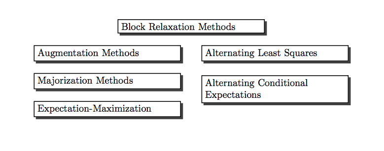
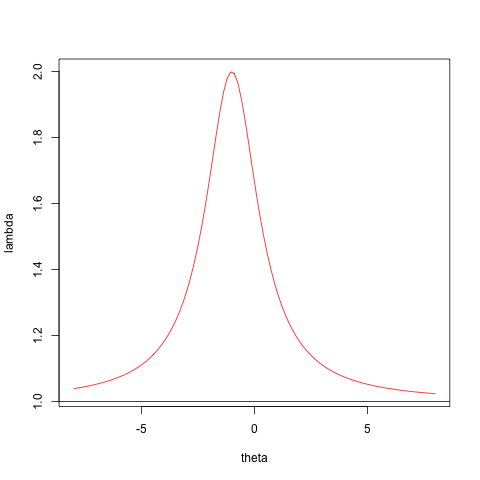
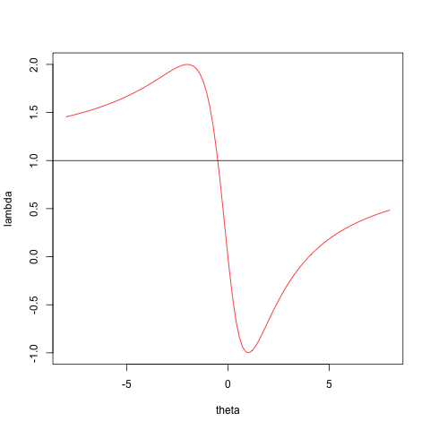
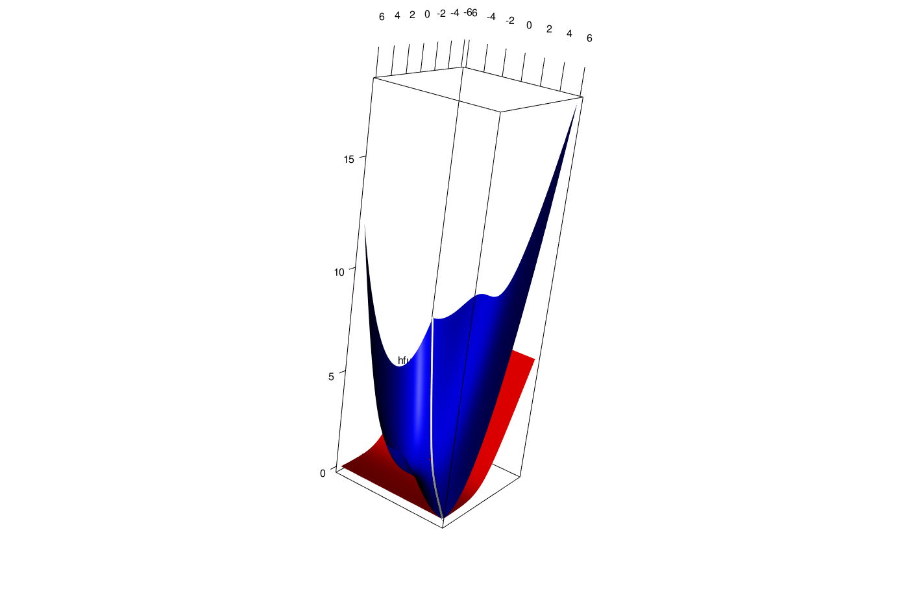
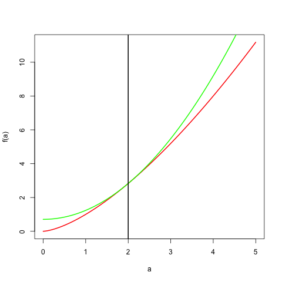
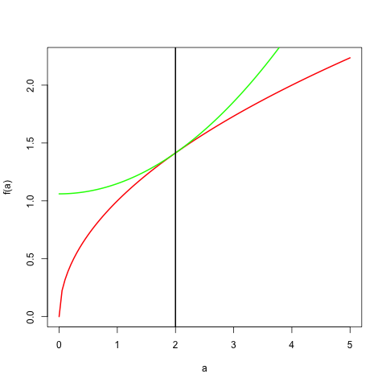
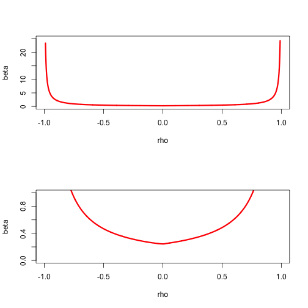
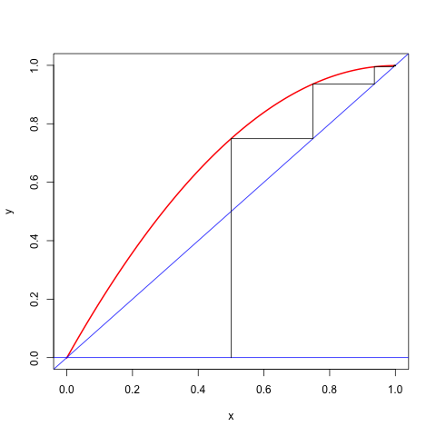
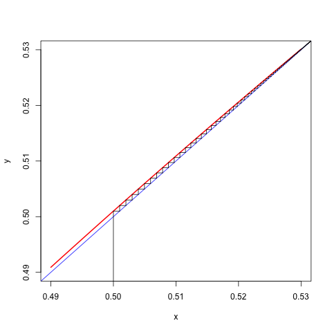
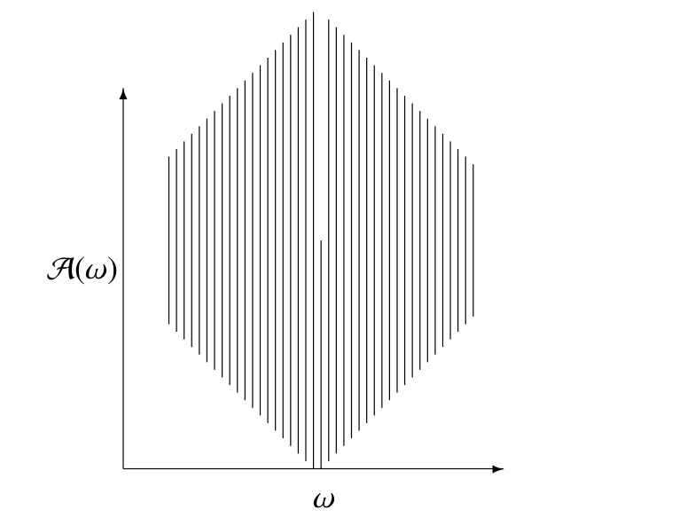

<style type="text/css">

body{ /* Normal  */
   font-size: 18px;
}
td {  /* Table  */
   font-size: 18px;
}
h1 { /* Header 1 */
 font-size: 28px;
 color: DarkBlue;
}
h2 { /* Header 2 */
 font-size: 22px;
 color: DarkBlue;
}
h3 { /* Header 3 */
 font-size: 18px;
 color: DarkBlue;
}
code.r{ /* Code block */
  font-size: 18px;
}
pre { /* Code block */
  font-size: 18px
}
</style>

```{r packages, echo = FALSE}
options (digits = 10) 
suppressPackageStartupMessages (library (captioner, quietly = TRUE))
suppressPackageStartupMessages (library (knitr, quietly = TRUE))
suppressPackageStartupMessages (library (microbenchmark, quietly = TRUE))
suppressPackageStartupMessages (library (numDeriv, quietly = TRUE))
```

```{r exec_code, eval = FALSE, echo = FALSE}
mprint <- function (x,
                    d = 6,
                    w = 8,
                    f = "") {
  print (noquote (formatC (
    x,
    di = d,
    wi = w,
    fo = "f",
    flag = f
  )))
}

blockRelax <-
  function (f,
            x,
            g,
            itmax = 100,
            eps = 1e-8,
            verbose = TRUE) {
    k <- split (1:length (x), g)
    m <- length (k)
    fold <- f (x)
    itel <- 1
    blockFun <- function (z,  g,  y, i) {
      y[i] <- z
      return (g (y))
    }
    repeat {
      for (i in 1:m) {
        kk <- k[[i]]
        o <-
          optim (
            x[kk],
            blockFun,
            gr = NULL,
            g = f,
            y = x,
            i = kk,
            method = "BFGS"
          )
        x[kk] <- o$par
        fnew <- o$value
      }
      if (verbose)
        cat(
          "Iteration: ",
          formatC (itel, width = 3, format = "d"),
          "fold: ",
          formatC (
            fold,
            digits = 8,
            width = 12,
            format = "f"
          ),
          "fnew: ",
          formatC (
            fnew,
            digits = 8,
            width = 12,
            format = "f"
          ),
          "\n"
        )
      if ((itel == itmax) || ((fold - fnew) < eps))
        break
      itel <- itel + 1
      fold <- fnew
    }
    return (list (x = x, f = fnew))
  }

blockRate <- function (f, x, blocks = as.list (1:length(x)), numerical = FALSE, product_form = FALSE) {
    if (numerical) {
        h <- hessian (f, x)
    } else {
        h <- f (x)
    }
    nvar <- length (x)
    nblocks <- length (blocks)
    nb <- 1:nblocks
    nn <- 1:nvar
    g <- sapply (nn, function (i) which (sapply (blocks, function (x) any (i==x))))
    if (product_form) {
        sder <- diag (nvar)
        for (i in nb) {
            bi <- blocks [[i]]
            ei <- ifelse (outer(nn, bi, "=="), 1, 0)
            sder <- (diag(nvar) - ei %*% solve (h[bi,bi], h[bi, , drop=FALSE])) %*% sder
            }
        } else {
            alow <- h * ifelse (outer (g, g, ">="), 1, 0)
            sder <- - solve (alow, h - alow)
        }
    return (sder)
}

cobwebPlotter <- function (xold, func, lowx = 0, hghx = 1, lowy = lowx, hghy = hghx,
                     eps = 1e-10, itmax = 25, ...) {
    x <- seq (lowx, hghx, length = 100)
    y <- sapply (x, function (x) func (x, ...))
    plot (x, y, xlim = c(lowx ,hghx), ylim = c(lowy,hghy),
          type = "l", col = "RED", lwd = 2)
    abline (0, 1, col = "BLUE")
    base <- 0
    itel <- 1
    repeat {
        xnew <- func (xold, ...)
        if (itel > 1) {
            lines (matrix(c(xold,xold,base,xnew),2,2))
        }
        lines (matrix(c(xold,xnew,xnew,xnew),2,2))
        if ((abs (xnew - xold) < eps) || (itel == itmax)) {
            break ()
        }
        base <- xnew
        xold <- xnew
        itel <- itel + 1
    }
}
```

```{r captioner, echo = FALSE}
figure_nums <- captioner (prefix = "Figure")
table_nums <- captioner (prefix = "Table")
lemma_nums <- captioner (prefix = "Lemma")
theorem_nums <- captioner (prefix = "Theorem")
corollary_nums <- captioner (prefix = "Corollary")
code_nums <- captioner (prefix = "Code Segment")
code_nums(name = "blockrelax", caption = "Block Relaxation", display = FALSE)
code_nums(name = "mls", caption = "Block Least Squares", display = FALSE)
code_nums(name = "blockrate", caption = "Block Rate", display = FALSE)
code_nums(name = "cobwebplotter", caption = "Cobweb Plotter", display = FALSE)
```

\newcommand{\ul}[1]{\underline{#1}}
\newcommand{\ol}[1]{\overline{#1}}
\newcommand{\bb}[1]{\mathbb{#1}}
\newcommand{\mc}[1]{\mathcal{#1}}
\newcommand{\df}{=:}
\newcommand{\am}[1]{\mathop{\text{argmin}}_{#1}}
\newcommand{\ls}[2]{\mathop{\sum\sum}_{#1}^{#2}}
\newcommand{\ijs}{\mathop{\sum\sum}_{1\leq i<j\leq n}}
\newcommand{\jis}{\mathop{\sum\sum}_{1\leq j<i\leq n}}
\newcommand{\sij}{\sum_{i=1}^n\sum_{j=1}^n}

# Note {-}

This book will be expanded/updated frequently and unpredictably. 
The directory [deleeuwpdx.net/pubfolders/stress](http://deleeuwpdx.net/pubfolders/stress) has a pdf version, the bib file, the complete Rmd file with the code chunks, the R and C source code, and whatever else is needed for perfect reproducibility.  Suggestions for improvement of text and code are welcome. All text and code are in the public domain and can be copied and used by anybody in any way they like. Attribution will be appreciated, but is not required. 

Just as an aside: "above" in the text refers to anything that comes earlier in the book and "below" refers to anything that comes later. This always confuses me, so I had to write it down. I also number *all* displayed equations. Equations are displayed if and only if they are important, are referred to in the text, or mess up the line spacing.

# Preface {-}

Many recent algorithms in computational statistics
are variations on a common theme. In this book we discuss four such classes of algorithms. Or, more precisely, we discuss a single large class of algorithms, and we show how various well-known classes of statistical algorithms fit into
this common framework. The types of algorithms we consider are, in logical order,

```{r bookfig1, fig.align = "center", fig.cap = "Algorithm Types", echo = FALSE}

```

There is not much statistics, in the sense of data analysis or inference, in this book. It is almost exclusively about deterministic optimization problems
(although we shall optimize a likelihood function or
two). Some of our results have been derived in the statistical literature in the context of maximizing a multinomial or multinormal likelihood function. In most cases statisticians have developed their own results, not relying on the more comprehensive results in the optimization literature. We will try, from the start, to use existing results and apply them to our specific optimization methods.

There are many, many excellent books on optimization and mathematical programming. Without a doubt the canonical reference for statisticians is, and will be for many years to come, the book by @lange_13. In particular his chapters 7,8, 9, and 12 have substantial overlap with this book. There is even more overlap with the book in progress _MM Optimization Algorithms_ [@lange_16].

For the record, the books that have been most useful to me throughout my personal optimization career are @ortega_rheinboldt_70b,
@ostrowski_66, @rockafellar_70, and, above all,  @zangwill_69. They were all published in a five year interval, at the end of the sixties. Around that time also started the ten-year period of my greatest intellectual curiosity and creativity.

Throughout the book we try to present our results in three different languages: the language of mathematics, the language of graphics, and the programming language `R`. We use `R` for all computations, tables, and figures [@r_core_16].
In fact, all figures and tables are dynamically generated by chunks of `R` code using `knitr` [@xie_15] and `bookdown` [@xie_16] .

There are many examples throughout the book. They are usually presented in considerable and sometimes exasperating detail, with code, computations, and figures. I like to work on such examples, so please indulge me. It is nice to have an infinite number of pages available. The examples are mostly in separate subsections, so if you do not like them you can easily skip them.

In many cases the examples are simple one-dimensional optimization problems, which is maybe surprising, because the techniques
we discuss are largely intended for high-dimensional problems. To further simplify the examples the functions involved are often cubic or quartic polynomials. Thus these small examples are not particularly representative for the types of applications we are interested in, but they are used to produce nice graphs, a more complete analysis, and illustrations of various general principles and properties. Also it sometimes makes sense to think of the polynomial examples as _models_, in the same sense in which the quadratic is a model for Newton's method.

Many of the remaining examples are taken from multivariate statistical analysis, which we define in the broadest possible sense. It includes data analysis using linear and bilinear algebra, and in particular it includes multidimensional scaling and cluster analysis. Given my history, it is probably not surprising that many examples have their origin in psychometrics, and more  specifically in publications of researchers directly or loosely associated with the Data Theory group at Leiden University, starting in 1968. See @vanderheijden_sijtsma_96.

We take the point of view in this book that having global convergence of an iterative algorithm, i.e. convergence from an arbitrary starting point, is a desirable property. But it is neither necessary nor sufficient for the usefulness of the algorithm, because in addition one needs information about its speed of convergence. We try to give as much information as possible about _convergence speed_ and _complexity_ in our presentation of the examples.

It should be noted that this book is a corrected, updated, and expanded version of a twenty-five year old chapter in a conference proceedings volume [@deleeuw_C_94c]. It will not be possible to erase all the traces of these humble beginnings. Specifically, references will often be to material from before 1994, and more recent work will probably be less completely covered.

Much of the material in this book is pasted together from published and unpublished papers and reports. This may lead to inconsistencies in the notation and to annoying duplications. Over time I will eliminate these blemishes as much as possible.

Items in the bibliography freely available on the
internet are hyperlinked by title to external pdf files. This includes all published and unpublished works authored or co-authored by me. They can also be found in my bibliography of about 750 items, most of them linked to pdf files, on my server [gifi.stat.ucla.edu](http://gifi.stat.ucla.edu/janspubs/0_bib_material/index.html).


<!--chapter:end:index.Rmd-->

# Introduction{#introduction}

## Some History{#introduction:somehistory}

The methods discussed in this book are special cases of what we shall call
_block-relaxation methods_, although other names such as _decomposition_ or _nonlinear Gauss-Seidel_ or _ping-pong_ or _seesaw_ methods have also been used. There are many areas of applied mathematics where methods of this type have been discussed. Mostly, of course, in optimization and mathematical programming, but also in control and numerical analysis, and in differential equations.

In this section we shall give some informal definitions to establish our terminology. We will give some of the historical context, but the main historical and technical details will be discussed in subsequent chapters.

In a _block relaxation method_ we minimize a real-valued function of several variables by partitioning the variables into blocks. We choose initial values for all blocks, and then minimize over one of the blocks, while keeping all other blocks fixed at their current values. We then replace the values of the active block by the minimizer, and proceed by choosing another block to become active. An iteration ofthe algorithm steps through all blocks in turn, each time keeping the non-active blocks fixed at current values, and each time replacing the active blocks by solving the minimization subproblems. If there are more than two blocks there are different ways to cycle through the blocks. If we use the same sequence of active blocks in each iteration then the block method is called _cyclic_.

In the special case in which blocks consist of only one coordinate we speak of the 
_ coordinate relaxation method_ or the
_coordinate descent_ (or _CD_) method. If we are maximizing then it is _coordinate ascent_ (or _CA_). The cyclic versions are _CCD_ and
_CCA_.

_Alternating Least Squares_ (or _ALS_) methods are block relaxation methods in which each minimization subproblem is a linear or nonlinear least squares problem. As far as we know, the term "Alternating Least Squares" was first used in @deleeuw_R_68d.
There certainly were ALS methods before 1968, but the systematic use of these techniques in psychometrics and multivariate analysis started around that time.
The inspiration clearly was the pioneering work of @kruskal_64a, @kruskal_64b in nonmetric scaling.
De Leeuw, Young, and Takane started the ALSOS system of techniques and programs around 1973
(see @young_deleeuw_takane_C_80), and De Leeuw, with many others, at Leiden University started the Gifi system around 1975 (see @gifi_B_90).

ALS works well for fitting the usual linear, bilinear, and multilinear forms to data. Thus it covers much of classical multivariate analysis and its extensions to higher dimensional arrays. But pretty early on problems arose in Euclidean multidimensional scaling, which required fitting quadratic forms or, even worse, square roots of quadratic forms to data. Straightforward ALS could not be used, because the standard matrix calculations of least squares and eigen decomposition did not apply. @takane_young_deleeuw_A_77 circumvented the problem by fitting squared distances using cyclic coordinate descent, which only involved unidimensional minimizations.

Around 1975, however, De Leeuw greatly extended the scope of ALS by using _majorization_. This was first applied to Euclidean multidimensional scaling by @deleeuw_C_77, but it became clear early on that majorization was a general technique for algorithm construction that also covered, for example, the EM algorithm, which was discovered around the same time (@dempster_laird_rubin_77). In each iteration of a majorization algorithm we construct a _surrogate function_ (@lange_hunter_yang_00) or _majorization_ (@deleeuw_C_94c, @heiser_95) that lies above the function we are minimizing and touches it in the current iterate. We then minimize this surrogate function to find an update of the current iterate, then construct a new majorization function in that update, and so on. The majorization function, if suitably chosen, can often be minimized using ALS techniques.

@deleeuw_C_94c argues there is another important class of algorithms extending ALS. It is intermediate, since it is a special case of block relaxation and it contains majorization as a special case. In _augmentation methods_ for the minimization of a real valued function we introduce an _augmentation_, which uses an additional vector of variables, with a surrogate function on the product of both sets, such that the original objective function is the minimum of the surrogate function over the augmenting block of variables. We then apply block relaxation to the augmented function.

Ortega and Rheinboldt majorization, Kantorovich,
Toland duality, decomposition, quasi-linearization, Marshall-Olkin-Arnold, NIPALS, Moreau coupling functions

block relaxation is majorization

it suffices to study two blocks (in a sense)

## Optimization Methods{#introduction:optimizationmethods}

Our block relaxation methods look for desirable points, which are usually fixed points of point-to-set maps. They minimize, in a vast majority of the applications, a _loss function_ or _badness-of-fit function_, which is often derived from some general data analysis principle such as _Least Squares_ or _Maximum Likelihood_. The desirable points are the local or global minimizers of this loss function.

Under certain conditions, which are generally satisfied in statistical applications, our block relaxation methods have _global convergence_, which means that the iterative sequences they generate converge
to desirable points, no matter where we start them. They are generally _stable_, which means in this context that each step in the iterative process decreases the loss function value. 

Under stronger, but still quite realistic, conditions our block relaxation methods exhibit linear convergence, i.e. the distance of the iterates to the desirable points decreases at the rate of a geometric progression. In many high-dimensional cases the ratio of the progression is actually close to one, which makes convergence very slow, and in some cases the ratio is equal to one and convergence is _sublinear_. We will also discuss stable block relaxation algorithms with _superlinear_ convergence, but they are inherently more complicated. In addition we will discuss techniques to accelerate the convergence of block relaxation iterations.

In the optimization and mathematical programming literature, at least until recently, methods with linear convergence rates were generally deprecated or ignored. It was thought they were too slow to be of any practical relevance. This situation has changed for various reasons, all of them having to do with the way in which we now program and compute. Here "we" specifically means statisticians and data analysts, but the same reasons probably apply in other fields as well.

In the first place block relaxation methods often involve simple computations in each of their iterations. As a consequence they can tackle problems with a large number of variables, and they are often easily parallelized. In the second place, with the advent of personal computers it is not necessarily a problem any more to let an iterative process run for days in the background. Mainframe computer centers used to frown on such practices. Third, they are now many specific large problems characterized by a great deal of _sparseness_, which make block and coordinate methods natural alternatives because they can take this sparseness into account. And finally, simple computations in each of the steps make it easy to write ad hoc programs in interpreted special purpose languages such as `R`. Such programs can take the special structure of the problem they are trying to solve into account, and this makes them more efficient compared to general purpose optimization methods which may have faster convergence rates.


Statistics optimization

R optimization

<!--chapter:end:01-intro.Rmd-->

# Block Relaxation{#blockrelaxation}

## Introduction{#blockrelaxation:introduction}

The history of block relaxation methods is complicated, because many special cases were proposed before the general idea became clear. I make no claim here to be even remotely complete, but I will try to mention at least most of the general papers that were important along the way.

It makes sense to distinguish the coordinate descent methods from the more general block methods. Coordinate descent methods have the major advantage that they lead to one-dimensional optimization problems, which are generally much easier to handle than multidimensional ones.

We start our history with iterative methods for linear systems. Even there the history is complicated, but it has been ably reviewed by, among others, @forsythe_53, @young_90, @saad_vandervorst_00, @benzi_09, and @axelsson_10. The origins are
in 19th century German mathematics, starting perhaps with a letter from Gauss to his student Gerling on December 26, 1823. See @forsythe_50 for a translation. To quote Gauss: *"I recommend this method to you for imitation. You will hardly ever again eliminate directly, at least not when you have more than 2 unknowns. The indirect procedure can be done while half asleep, or while thinking about other things."* For discussion of subsequent contributions by @jacobi_45, @seidel_74, @vonmises_pollackzek-geiringer_29,
we refer to the excellent historical overviews mentioned before, and to the monumental textbooks by @varga_62 and @young_71.

The next step in our history is the quadratic programming method proposed by @hildreth_57. Coordinate descent is applied to the dual program, which is a simple quadratic problem with non-negativity constraints, originating from the Lagrange multipliers for the primal problem. Because the constraints are separable in the dual problem the technique can easily handle a large numbers of inequality constraints and can easily be parallelized. Hildreth already considered the non-cyclic greedy and random versions of coordinate descent. A nice historical overview of Hildreth's method and its various extensions is in @dax_03.

Coordinate relaxation for convex functions, not necessarily quadratic, was introduced by @desopo_59.
in an important paper, followed by influential papers of @schechter_62, @schechter_68, @schechter_70. The D'Esopo paper actually has an early version of Zangwill's general convergence theory, applied to functions that are convex in each variable separably and are minimized under separable bound constraints.

@ortega_rheinboldt_67, @ortega_rheinboldt_70a, @elkin_68, @cea_68, @cea_70, @cea_glowinski_73, @auslender_70, @auslender_71, @martinet_auslender_74
Many of these papers present the method as a nonlinear generalization of the Gauss-Seidel method of solving a system of linear
equations.

Modern papers on block-relaxation are by @abatzoglou_odonnell_82 and by @bezdek_hathaway_howard_wilson_windham_87.

So many more now
@spall_12, @beck_teruashvili_13, @saha_tewari_13, @wright_15

In Statistics .. Statistical applications
to mixed linear models, with the parameters describing the
mean structure collected in one block and the parameters
describing the dispersion collected in the second block, are in
@oberhofer_kmenta_74. Applications to
exponential family likelihood functions, cycling over the
canonical parameters, are in @jensen_johansen_lauritzen_91. Applications in lasso etc.

## Definition{#blockrelaxation:definition}

Block relaxation methods are fixed point methods. A brief general introduction to fixed point methods, with some of the terminology we will use, is in the fixed point section \@ref(background:fixedpoint) of the background chapter.

Let us thus consider the following general situation. We minimize a real-valued function $f$
defined on the product-set $\mathcal{X}=\mathcal{X}_1\otimes\mathcal{X}_2\otimes\cdots\otimes\mathcal{X}_p,$
where $\mathcal{X}_s\subseteq\mathbb{R}^{n_s}.$

In order to minimize $f$ over $\mathcal{X}$ we use the following iterative algorithm.
$$
\begin{matrix}
\text{Starter:}&\text{Start with } x^{(0)}\in\mathcal{X}.\\
\hline
\text{Step k.1:}&x^{(k+1)}_1\in\underset{x_1\in\mathcal{X}_1}{\mathrm{argmin}}
\ f(x_1,x^{(k)}_2,\cdots,x^{(k)}_p). \\
\text{Step k.2:}&x^{(k+1)}_2\in\underset{x_2\in\mathcal{X}_2}{\mathrm{argmin}}
\ f(x^{(k+1)}_1,x_2,x^{(k)}_3,\cdots,
x^{(k)}_p). \\
\cdots&\cdots\\
\text{Step k.p:}&x^{(k+1)}_p\in\underset{x_p\in\mathcal{X}_p}{\mathrm{argmin}}
\ f(x^{(k+1)}_1,\cdots,x^{(k+1)}_{p-1},
x_p).\\
\hline
\text{Motor:}&k\leftarrow k+1 \text{ and go to } k.1 \\
\hline
\end{matrix}
$$

Observe that we assume that the minima in the substeps exist, but they need not be unique. The $\mathrm{argmin}$'s are
point-to-set maps, although in many cases they map to singletons. In actual computations we will always have to make a 
selection from the $\mathrm{argmin}$. 

We set $x^{(k)}:=(x^{(k)}_1,\cdots,x^{(k)}_p),$
and $f^{(k)}:=f(x^{(k)}).$
The map $\mathcal{A}$ that is the composition of the $p$ substeps on an iteration satisfies $x^{(k+1)}\in\mathcal{A}(x^{(k)})$. We call it the _iteration map_ (or the _algorithmic map_ or _update map_).
If $\mathcal{A}(x)$ is a singleton for all $x\in\mathcal{X}$, then we can write $x^{(k+1)}=\mathcal{A}(x^{(k)})$ without danger of confusion, and call $\mathcal{A}$ the _iteration function_.

If $\mathcal{A}$ is differentiable on $\mathcal{X}$ then we introduce some extra terminology and notation. The matrix $\mathcal{M}(x):=\mathcal{DA}(x)$ of partial derivatives is called the _Iteration Jacobian_ and its spectral radius $\rho(x):=\rho(\mathcal{DA}(x))$, the eigenvalue of maximum modulus, is called the  _Iteration Spectral Radius_ or simply the _Iteration Rate_. Note that for a linear iteration $x^{(k+1)}=Ax^{(k)}+b$ we have $\mathcal{M}(x)=A$ and $\rho(x)=\rho(A)$.


The function `blockRelax()` in `r code_nums("blockrelax", display = "c")` is a reasonable general `R` function for unrestricted block relation
in which each $\mathcal{X}_s$ is all of $\mathbb{R}^{n_s}$.
The arguments are the function to be minimized, the initial estimate, and the block structure. Both the initial estimate and the block structure are of length $n=\sum n_s$, and block structure is indicated by two elements having the same integer value if and only if they are in the same block. Each of the subproblems is solved by a call to the `optim()`
function in `R`.

## First Examples{#blockrelaxation:firstexamples}

Our first examples of block relaxation are linear least squares examples. There are obviously historical reasons to choose linear least squares, and in a sense they provide the simplest examples that allow us to illustrate various important calculations and results.

### Two-block Least Squares{#blockrelaxation:firstexamples:twoblockleastsquares}

Suppose we have a linear least squares problems with two sets
of predictors $A_1$ and $A_2,$ and outcome vector $b$.
Matrices $A_1$ and $A_2$ are $m\times n_1$ and $m\times n_2$, and the vector of regressions coefficients $x=(x_1\mid x_2)$ is of length $n=n_1+n_2.$ Without loss of generality we assume $n_1\leq n_2$.

Minimizing $f(x)=(b-A_1x_1-A_2x_2)'(b-A_1x_1-A_2x_2)$
is then conveniently done by block relaxation, alternating the
two steps
\begin{align*}
x_1^{(k+1)}&=A_1^+(b-A_2x_2^{(k)}),\\
x_2^{(k+1)}&=A_2^+(b-A_1x_1^{(k+1)}).
\end{align*}
Here $A_1^+$ and $A_2^+$ are Moore-Penrose inverses.

Define
\begin{align*}
c&:=A_1^+b,\\
d&:=A_2^+b,\\
R&:=A_1^+A_2^{\ },\\
S&:=A_2^+A_1^{\ }.
\end{align*}
Then the iterations are
\begin{align*}
x_1^{(k+1)}&=c-Rx_2^{(k)},\\
x_2^{(k+1)}&=d-Sx_1^{(k+1)}.
\end{align*}
A solution $(\hat x_1,\hat x_2)$ of the least squares problem satisfies
\begin{align*}
\hat x_1&=c-R\hat x_2,\\
\hat x_2&=d-S\hat x_1,
\end{align*}
and thus
\begin{align*}
(x_1^{(k+1)}-\hat x_1)&=R(x_2^{(k)}-\hat x_2),\\
(x_2^{(k+1)}-\hat x_2)&=S(x_1^{(k+1)}-\hat x_1),
\end{align*}
and
\begin{align*}
(x_2^{(k+1)}-\hat x_2)&=SR(x_2^{(k)}-\hat x_2),\\
(x_1^{(k+1)}-\hat x_1)&=RS(x_1^{(k)}-\hat x_1).
\end{align*}
The matrices $SR=A_2^+A_1^{\ }A_1^+A_2^{\ }$ and $RS=A_1^+A_2^{\ }A_2^+A_1^{\ }$ have the same eigenvalues $\lambda_s$, equal to $\rho_s^2$, the squares of the canonical correlations of $A_1$
and $A_2$. Consequently $0\leq\lambda_s\leq 1$ for all $s$. Specifically there exists
a non-singular $K$ of order $n_1$ and a non-singular $L$ of order $n_2$ such that
\begin{align*}
K'A_1'A_1^{\ }K&=I_1,\\
L'A_2'A_2^{\ }L&=I_2,\\
K'A_1'A_2^{\ }L&=D.
\end{align*}
Here $I_1$ and $I_2$ are diagonal, with the $n_1$ and $n_2$ leading diagonal elements
equal to one and all other elements zero. $D$ is a matrix with the non-zero canonical correlations in non-increasing order along the diagonal and zeroes everywhere else. This implies $R=KDL^{-1}$ and $S=LD'K^{-1}$, and consequently $RS=KDD'K^{-1}$
and $SR=LD'DL^{-1}$.

Let us look at the convergence speed of the $x_1^{(k)}$. The results for $x_2^{(k)}$ will be basically the same. Define
$$
\delta^{(k)}\mathop{=}\limits^{\Delta}K^{-1}(x_1^{(k)}-\hat x_1^{\ })
$$
It follows, using $RS=KDD'K^{-1}$, that $\delta^{(k)}=\Lambda^k\delta^{(0)}$,
with the squared canonical correlations on the diagonal of $\Lambda=DD'.$
If $\lambda_+:=\max_i\lambda_i>0$
and $\mathcal{I}=\left\{i\mid\lambda_i=\lambda_+\right\}$ then
$$
\frac{\delta^{(k)}_i}{\lambda_+^k}\rightarrow\begin{cases}
\delta^{(0)}_i&\text{ if }i\in\mathcal{I},\\
0&\text{ otherwise}
\end{cases}
$$
and thus
$$
\frac{\|\delta^{(k+1)}\|}{\|\delta^{(k)}\|}\rightarrow\lambda^+.
$$
This implies
$$
\frac{\|x_1^{(k)}-\hat x_1^{\ }\|}{\lambda^k}\rightarrow\|\sum_{i\in\mathcal{I}}\delta_i^{(0)}k_i^{\ }\|
$$
where the $k_i$ are columns of $K$. In turn this implies
$$
\frac{\|x_1^{(k+1)}-\hat x_1^{\ }\|}{\|x_1^{(k)}-\hat x_1^{\ }\|}\rightarrow\lambda.
$$

### Multiple-block Least Squares{#blockrelaxation:firstexamples:multipleblockleastsquares}

Now suppose there are multiple blocks. We minimize the loss function
\begin{equation}
f(x)=\mathbf{SSQ}(b-\sum_{j=1}^m A_jx_j).
\end{equation}
Block relaxation in this case is _Gauss-Seidel iteration_.

The update formula for the Gauss-Seidel method is
$$
\beta_j^{(k+1)}=X_j'\left(y-\sum_{\ell=1}^{j-1}X_\ell^{\ }\beta_\ell^{(k+1)}-\sum_{\ell=j+1}^{m}X_\ell^{\ }\beta_\ell^{(k)}\right).
$$
Define $C_L$ to be the block triangular matrix with the blocks $X_j'X_\ell^{\ }$ with $j>\ell$ of $C$ below the diagonal, and $C_U$ the block triangular matrix with the upper diagonal blocks $X_j'X_\ell^{\ }$ with $j<\ell$. Thus $C_L+C_U+I=C$ and $C_L=C_U'$. Now
$$
\beta^{(k+1)}=X'y-C_L\beta^{(k+1)}-C_U\beta^{(k)},
$$
and thus
$$
\beta^{(k+1)}=(I+C_L)^{-1}X'y-(I+C_L)^{-1}C_U\beta^{(k)}.
$$
The least squares estimate $\hat\beta$ satisfies
$$
\hat\beta=(I+C_L)^{-1}X'y-(I+C_L)^{-1}C_U\hat\beta,
$$
and thus
$$
\beta^{(k+1)}-\hat\beta=-(I+C_L)^{-1}C_U(\beta^{(k)}-\hat\beta),
$$
or
$$
\beta^{(k)}-\hat\beta=\left[-(I+C_L)^{-1}C_U\right]^k(\beta^{(0)}-\hat\beta).
$$

Code in `r code_nums("mls", display = "c")`.

## Generalized Block Relaxation{#blockrelaxation:generalizedblockrelaxation}

In some cases, even the supposedly simple minimizations within
blocks may not have very simple solutions. In that case, we often
use _generalized block relaxation_, which is defined by $p$
maps $\mathcal{A}_s$
mapping $\mathcal{X}$ into (subsets of) $\mathcal{X}$. We have
$$
\mathcal{A}_s(x)\in\{x_1\}\otimes\cdots\otimes\{x_{s-1}\}\otimes\mathcal{F}_s(x)\otimes\{x_{s+1}\}\otimes\cdots\otimes\{x_p\},
$$
where $z\in\mathcal{F}_s(x$$ implies
$$
f(x_1,\cdots,x_{s-1},z,x_{s+1},\cdots,x_p)\leq f(x_1,\cdots,x_{s-1},x_s,x_{s+1},\cdots,x_p).
$$

In ordinary block relaxation
$$
\mathcal{F}_s(x)=\mathop{\mathbf{argmin}}\limits_{z\in\mathcal{X}_s} f(x_1,\cdots,x_{s-1},z,x_{s+1},\cdots,x_p),
$$
but in generalized block relaxation we could update $x_s$ by taking one or more steps of a stable and convergent iterative algorithm for minimizing $f(x_1,\cdots,x_{s-1},z,x_{s+1},\cdots,x_p)$ over $z\in\mathcal{X}_s$.

### Rasch Model{#blockrelaxation:generalizedblockrelaxation:raschmodel}

In the item analysis model proposed by Rasch, we observe
a binary $n\times m$ matrix $Y=\{y_{ij}\}$. The (unconditional) log-likelihood is
$$
\mathcal{L}(x,z)=\sum_{i=1}^n\sum_{j=1}^m y_{ij}\log\pi_{ij}(x,z)+(1-y_{ij})\log(1-\pi_{ij}(x,z)),
$$
with
$$
\pi_{ij}(x,z)=\frac{\exp(x_i+z_j)}{1+\exp(x_i+z_j)}.
$$

The negative log-likelihood can be written as
$$
f(x,z)=\sum_{i=1}^n\sum_{j=1}^m\log\{1+\exp(x_i+z_j)\}
-\sum_{i=1}^n y_{i\star}x_i-\sum_{j=1}^m y_{\star j}z_j,
$$
where $\star$ indicates summation over an index. The stationary equations
have the elegant form
\begin{align*}
\pi_{i\star}(x,z)&=y_{i\star}\\
\pi_{\star j}(x,z)&=y_{\star j}.
\end{align*}
The standard algorithm for the unconditional maximum likelihood problem (@wainer_morgan_gustafsson_80) cycles through these two blocks of equations, using Newton's method at each substep.
In this case Newton's method turns out to be
$$
x_i^{(k+1)}=x_i^{(k)}-\frac{\pi_{i\star}(x^{(k)},z^{(k)})-y_{i\star}}
{\sum_{j=1}^m{\pi_{ij}(x^{(k)},z^{(k)})(1-\pi_{ij}(x^{(k)},z^{(k)}))}},
$$
and similarly for $z_j^{(k+1)}.$

### Nonlinear Least Squares{#blockrelaxation:generalizedblockrelaxation:nonlinearleastsquares}

Consider the problem of minimizing
$$
\sum_{i=1}^n (y_i-\sum_{j=1}^m \phi_j(x_i,\theta)\beta_j)^2,
$$
with the $\phi_j$ known nonlinear functions.

Again the parameters separate naturally into two blocks $\beta$ and $\theta$, and finding the optimal $\beta$ for
given $\theta$ is again linear regression.

The best way of finding the optimal $\theta$ for given $\beta$ will typically depend on a more precise analysis
of the problem, but one obvious alternative is to linearize the $\phi_j$ and apply Gauss-Newton.

## Block Order{#blockrelaxation:blockorder}

If there are more than two blocks, we can move
through them in different ways. In analogy with linear methods
such as Gauss-Seidel and Gauss-Jacobi, we distinguish _cyclic_
and _free-steering_ methods. We could select the block,
for instance, that seems
most in need of improvement. This is the _greedy_ choice. We can pivot through the blocks
in order, and start again when all blocks have been visited.
Or we could go back in the reverse order after arriving at
the last block. We can even choose
blocks in _random order_, or use some other _chaotic_
strategy.

We emphasize, however, that the methods we consider are all
of the Gauss-Seidel type, i.e. as soon as we upgrade a block
we use the new values in subsequent computations. We do not
consider Gauss-Jordan type strategies, in which all blocks
are updated independently, and then all blocks are replaced
simultaneously. The latter strategy leads to fewer computations per cycle, but it will generally violate the monotonicity requirement for the loss function values.

We now give a formalization of these generalizations, due to @fiorot_huard_79
Suppose $\Delta_s$ are $p$ point-to-set mappings of $\Omega$ into $\mathcal{P}(\Omega),$
the set of all subsets of $\Omega.$ We
suppose that $\omega\in\Delta_s(\omega)$ for all $s=1,\cdots,p.$
Also define
$$
\Gamma_s(\omega)\mathop{=}\limits^{\Delta}\hbox{argmin}
\{\psi(\overline\omega)\mid\overline\omega\in\Delta_s(\omega)\}.
$$
There are now two versions of the generalized
block-relaxation method which are interesting.

In the
free-steering version we set
$$
\omega^{(k+1)}\in\cup_{s=1}^p\Gamma_s(\omega^{(k)}).
$$
This means that we select, from the $p$ subsets defining the
possible updates, one single update before we go to the
next cycle of updates.

In the cyclic method we set
$$
\omega^{(k+1)}\in\otimes_{s=1}^p\Gamma_s(\omega^{(k)}).
$$
In a little bit more detail this means
\begin{align*}
\omega^{(k,0)}&=\omega^{(k)},\\
\omega^{(k,1)}&\in\Gamma_s(\omega^{(k,0)}),\\
\cdots&\in\cdots,\\
\omega^{(k,p)}&\in\Gamma_s(\omega^{(k,p-1)}),\\
\omega^{(k+1)}&=\omega^{(k,p)}.
\end{align*}
Since $\omega\in\Delta_s(\omega),$ we see that, for both methods, if $\xi\in\Gamma(\omega)$
then $\psi(\xi)\leq\psi(\omega).$ This implies that
Theorem \ref{T:triv} continues to apply to this
generalized block relaxation method.

A simple example of the $\Delta_s$ is the following. Suppose
the $G_s$ are arbitrary mappings defined on $\Omega.$ They
need not even be real-valued. Then we can set
$$
\Delta_s(\omega)\mathop{=}\limits^{\Delta}\{\xi\in\Omega\mid
G_s(\xi)=G_s(\omega)\}.
$$
Obviously $\omega\in\Delta_s(\omega)$ for this choice of $\Delta_s.$

There are some interesting special cases. If $G_s$ projects on a subspace of $\Omega,$
then $\Delta(\omega)$
is the set of all $\xi$ which project into the
same point as $\omega.$ By defining the subspaces using blocks
of coordinates, we recover the usual block-relaxation method discussed
in the previous section. In a statistical context, in combination
with the EM algorithm, functional constraints of the form
$$
G_s(\overline\omega)=G_s(\omega)
$$
were used by 
@meng_rubin_93. They call the resulting algorithm the ECM algorithm.


### Projecting Blocks{#blockrelaxation:blockorder:projectingblocks}

## Rate of Convergence{#blockrelaxation:rateofconvergence}

### LU-form{#blockrelaxation:rateofconvergence:luform}

In block relaxation methods, including generalized block methods, we update $x=(x_1,\cdots,x_n)$
to $y=(y_1,\cdots,y_n)$
by the rule
$$
y_s=F_s(y_1,\cdots,y_{s-1},x_s,x_{s+1},\cdots,x_n).
$$
Differentiation gives
$$
\mathcal{D}_ty_s=
\sum_{u<s}(\mathcal{D}_uF_s)(\mathcal{D}_ty_u)+
\begin{cases}0&\text{ if }t<s,\\
\mathcal{D}_tF_s&\text{ if }t\geq s.
\end{cases}.\tag{1}
$$
It should be emphasized that in many cases of interest in $F_s$ does not depend on $x_s,$ so that $\mathcal{D}_sF_s=0$ for all $s$. It is also important to realize that the derivatives, which we write without arguments in this section, are generally evaluated at points of the form $(y_1,\cdots,y_{s-1},x_s,\cdots,x_p)$. At fixed points, however, $x_s=y_s$
for all $s$, and we can just write $\mathcal{D}_ty_s$ without ambiguity.
And for our purposes the derivatives at fixed points are the interesting ones.

Now define
$$
\mathcal{M}\mathop{=}\limits^{\Delta}
\begin{bmatrix}
\mathcal{D}_1y_1&\mathcal{D}_2y_1&\cdots&\mathcal{D}_ny_1\\
\mathcal{D}_1y_2&\mathcal{D}_2y_2&\cdots&\mathcal{D}_ny_2\\
\vdots&\vdots&\ddots&\vdots\\
\mathcal{D}_1y_n&\mathcal{D}_2y_n&\cdots&\mathcal{D}_ny_n\\
\end{bmatrix},
$$
and
$$
\mathcal{N}\mathop{=}\limits^{\Delta}
\begin{bmatrix}
\mathcal{D}_1F_1&\mathcal{D}_2F_1&\cdots&\mathcal{D}_nF_1\\
\mathcal{D}_1F_2&\mathcal{D}_2F_2&\cdots&\mathcal{D}_nF_2\\
\vdots&\vdots&\ddots&\vdots\\
\mathcal{D}_1F_n&\mathcal{D}_2F_n&\cdots&\mathcal{D}_nF_n\\
\end{bmatrix}.
$$
Also
$$
\mathcal{N}_L\mathop{=}\limits^{\Delta}
\begin{bmatrix}
0&0&\cdots&0\\
\mathcal{D}_1F_2&0&\cdots&0\\
\vdots&\vdots&\ddots&\vdots\\
\mathcal{D}_1F_n&\mathcal{D}_2F_n&\cdots&0\\
\end{bmatrix},
$$
and
$$
\mathcal{N}_U\mathop{=}\limits^{\Delta}
\begin{bmatrix}
\mathcal{D}_1F_1&\mathcal{D}_2F_1&\cdots&\mathcal{D}_nF_1\\
0&\mathcal{D}_2F_2&\cdots&\mathcal{D}_nF_2\\
\vdots&\vdots&\ddots&\vdots\\
0&0&\cdots&\mathcal{D}_nF_n\\
\end{bmatrix},
$$
so that $\mathcal{N}=\mathcal{N}_U+\mathcal{N}_L$. From $(1)$
$$
\mathcal{M}=\mathcal{N}_L\mathcal{M}+\mathcal{N}_U,
$$
or
$$
\mathcal{M}=(I-\mathcal{N}_L)^{-1}\mathcal{N}_U.
$$
This is the _Lower-Upper_ or _LU form_ of the derivative of the algorithmic map.

For two blocks $\mathcal{M}$ is equal to
$$
\begin{bmatrix}
\mathcal{D}_1F_1&\mathcal{D}_2F_1\\
(\mathcal{D}_1F_2)(\mathcal{D}_1F_1)&(\mathcal{D}_1F_2)(\mathcal{D}_2F_1)+\mathcal{D}_2F_2
\end{bmatrix},
$$
and if $\mathcal{D}_1F_1=0$ and $\mathcal{D}_2F_2=0$ this is
$$
\begin{bmatrix}
0&\mathcal{D}_2F_1\\
0&(\mathcal{D}_1F_2)(\mathcal{D}_2F_1)
\end{bmatrix}.
$$
Thus the non-zero eigenvalues are the eigenvalues of $(\mathcal{D}_1F_2)(\mathcal{D}_2F_1)$.

### Product Form{#blockrelaxation:rateofconvergence:productform}

There is another way to derive the
formulas from the previous section. We use the fact that the algorithmic map $\mathcal{A}$
is a composition of the form
$$
\mathcal{A}(x)=\mathcal{A}_p(\mathcal{A}_{p-1}(\cdots(\mathcal{A}_1(x))),
$$
where each $\mathcal{A}_s$ leaves all blocks, except block $s$, intact,
and changes only the variables in block $s$, Thus
$$
\mathcal{A}_s(x)=
\begin{bmatrix}
x_1\\\vdots\\x_{s-1}\\F_s(x_1,\cdots,x_p)\\x_{s+1}\\\vdots\\x_{p}
\end{bmatrix}.
$$

Blocks $(u,v)$ of the matrix of partials is (surpressing the dependence on $x$ again for the time being)
$$
\{\mathcal{DA}_s\}_{uv}\mathop{=}\limits^{\Delta}
\begin{cases}
\mathcal{D}_vF_u&\text{ if }u=s,\\
I&\text{ if }u=v\not= p,\\
0&\text{otherwise}.
\end{cases}
$$
Again, in many cases of interest we have $\{\mathcal{DA}\}_{uv}=0$ if $u=v=s$.

Now clearly, from the chain rule,
$$
\mathcal{M}=\mathcal{DA}=\mathcal{DA}_p\mathcal{DA}_{p-1}\cdots\mathcal{DA}_1
$$
This is the _product form_ of the derivative of the algorithmic map.

For two blocks, and zero diagonal blocks, we have, as in the previous section,
$$
\mathcal{M}=\mathcal{DA}_2\mathcal{DA}_1=\begin{bmatrix}
I&0\\
\mathcal{D}_1F_2&0
\end{bmatrix}
\begin{bmatrix}
0&\mathcal{D}_2F_1\\
0&I
\end{bmatrix}=
\begin{bmatrix}
0&\mathcal{D}_2F_1\\
0&\mathcal{D}_1F_2\mathcal{D}_2F_1
\end{bmatrix}.
$$
Thus the non-zero eigenvalues of $\mathcal{M}$ are the non-zero eigenvalues
of $\mathcal{D}_1F_2\mathcal{D}_2F_1$.

In the general cases with $p$ blocks computing eigenvalues of $\mathcal{M}$ we can use the result that the spectrum of $A_pA_{p-1}\cdots A_1$ is related in a straightforward fashion to the spectrum of the cyclic matrix
$$
\Gamma(A_1,\cdots,A_p)\mathop{=}\limits^{\Delta}\begin{bmatrix}
0&0&\cdots&0&A_p\\
A_1&0&\cdots&0&0\\
0&A_2&\cdots&0&0\\
\vdots&\vdots&\ddots&\vdots&\vdots\\
0&0&\cdots&A_{p-1}&0
\end{bmatrix}.
$$
In fact if $\lambda$ is an eigenvalue of $\Gamma(A_1,\cdots,A_p)$ then $\lambda^p$ is an eigenvalue of $A_pA_{p-1}\cdots A_1$, and if $\mu$ is a eigenvalue of $A_pA_{p-1}\cdots A_1$
then the $p$ solutions of $\lambda^p=\mu$ are eigenvalues of $\Gamma(A_1,\cdots,A_p)$.

### Block Optimization Methods{#blockrelaxation:rateofconvergence:blockoptimizationmethods}

The results in the previous two sections were for general block modification methods. We now specialize to block relaxation methods for unconstrained differentiable optimization problems.
The rate of convergence of block relaxation algorithms depends on
the block structure, and on the matrix of second derivatives
of the function $f$ we are minimizing. 

The functions $F_s$ that update block $s$ are defined implicitly by
$$
\mathcal{D}_sf(x_1,x_2,\cdots,x_p)=0.
$$
From the implicit function theorem
$$
\mathcal{D}_tF_s(x)=-[\mathcal{D}_{ss}f(x)]^{-1}\mathcal{D}_{st}f(x).
$$
If we use this in the LU-form $\mathcal{M}=(I-B_L)^{-1}B_U$ we find
$$
\mathcal{M}(x)=-
\begin{bmatrix}
\mathcal{D}_{11}f(x)&0&\cdots&0\\
\mathcal{D}_{21}f(x)&\mathcal{D}_{22}f(x)&\cdots&0\\
\vdots&\vdots&\ddots&\vdots\\
\mathcal{D}_{p1}f(x)&\mathcal{D}_{p2}f(x)&\cdots&\mathcal{D}_{pp}f(x)\\
\end{bmatrix}^{-1}
\begin{bmatrix}
0&\mathcal{D}_{12}f(x)&\cdots&\mathcal{D}_{1p}f(x)\\
0&0&\cdots&\mathcal{D}_{2p}f(x)\\
\vdots&\vdots&\ddots&\vdots\\
0&0&\cdots&0\\
\end{bmatrix},
$$

If there are only two blocks the result simplifies to

\begin{multline*}
\mathcal{M}(x)=-
\begin{bmatrix}
[\mathcal{D}_{11}f(x)]^{-1}&0\\
 -[\mathcal{D}_{22}f(x)]^{-1}\mathcal{D}_{21}f(x)^{}[\mathcal{D}_{11}f(x)]^{-1}&
[\mathcal{D}_{22}f(x)]^{-1}
\end{bmatrix}
\begin{bmatrix}
0&\mathcal{D}_{12}f(x)\\
0&0
\end{bmatrix}=\\
\begin{bmatrix}
0&-[\mathcal{D}_{11}f(x)]^{-1}\mathcal{D}_{12}f(x)^{}\\
0&[\mathcal{D}_{22}f(x)]^{-1}\mathcal{D}_{21}f^{}(x)[\mathcal{D}_{11}f(x)]^{-1}\mathcal{D}_{12}f(x)^{}
\end{bmatrix}
\end{multline*}

Thus, in a local minimum, where the matrix of second derivatives is
non-negative definite, we find that the largest eigenvalue
of $\mathcal{M}(x)$ is like the largest squared canonical
correlation $\rho$ of two sets of
variables, and is consequently less than or equal to one.

We also see that a sufficient condition for local convergence
to a stationary point of the algorithm is
that $\rho<1.$
This is always true for an isolated local minimum, because
there the matrix of second derivatives is positive definite.
If $\mathcal{D}^2f(x)$ is singular at the solution $x$, we
find a canonical correlation equal to $+1,$ and we do not have
guaranteed linear convergence.

For the product form we find that
$$
\mathcal{DA}_s(x)=I-E_s[\mathcal{D}_{ss}f(x)]^{-1}E_s'\mathcal{D}^2f(x),
$$
where $E_s$ has blocks of zeroes, except for block $s$, which is the identity. Thus
$$
\mathcal{M}(x)=\{I-E_s[\mathcal{D}_{ss}f(x)]^{-1}E_s'\mathcal{D}^2f(x)\}\times\cdots\times \{I-E_1[\mathcal{D}_{11}f(x)]^{-1}E_1'\mathcal{D}^2f(x)\}.
$$
It follows that $\mathcal{M}(x)z=z$ for all $z$ such
that $\mathcal{D}^2f(x)z=0$. Thus $\rho(\mathcal{M}(z))=1$
whenever $\mathcal{D}^2f(x)$ is singular.

For two blocks
$$
\mathcal{M}(x)=\begin{bmatrix}
I&0\\-[\mathcal{D}_{22}f(x)]^{-1}\mathcal{D}_{21}f(x)&0
\end{bmatrix}\begin{bmatrix}
0&-[\mathcal{D}_{11}f(x)]^{-1}\mathcal{D}_{12}f(x)\\0&I,
\end{bmatrix}
$$
which gives the same result as obtained from the LU-form.

The code in `blockRate.R` in `r code_nums("blockrate", display = "c")` computes $\mathcal{M}(x)$ in one of four ways. We can use the analytical form of the Hessian or compute it numerically, and we can use the LU-form or the product form. If we compute the Hessian numerically we give the function we are minimizing as an argument, if we use the Hessian analytically we pass a function for evaluating it
at $x$.

### Block Newton Methods{#blockrelaxation:rateofconvergence:blocknewtonmethods}

In block Newton methods we update using 
$$
y_s=x_s-[\mathcal{D}_{ss}f(y_1,\cdots,y_{s-1},x_s,\dots,x_p)]^{-1}\mathcal{D}_{s}f(y_1,\cdots,y_{s-1},x_s,\dots,x_p)
$$
It follows that at a point $x$ where the derivatives vanish we have
$$
\mathcal{D}_tF_s(x)=\delta^{st}I-[\mathcal{D}_{ss}f(x)]^{-1}\mathcal{D}_{st}f(x)
$$
and in particular $\mathcal{D}_sF_s(x)=0$.  The iteration matrix $\mathcal{M}(x)$ is the same as
the one in  section \@ref(blockrelaxation:rateofconvergence:blockoptimizationmethods), and consequently the convergence rate
is the same as well. We will again have the same rate if we make more than one Newton step in each block
update.

Of course the single-step block Newton method does not guarantee decrease of the loss function, and consequently needs to be safeguarded in some way.

### Constrained Problems{#blockrelaxation:rateofconvergence:constrainedproblems}

Similar calculations can also be carried out in the case
of constrained optimization, i.e. when the subproblems optimize
over differentiable manifolds and/or convex sets. We then use the implicit
function calculations on the Langrangean or Kuhn-Tucker conditions, which
makes them a bit more complicated, but essentially the same. In the
manifold case, for example, it suffices to replace the matrices $\mathcal{D}_{pq}$ by the
matrices $H_p'\mathcal{D}_{pq}H_{q},$ where the matrices $H_p$ contain a local linear coordinate system for $\Omega_p$ near
the solution.
<hr>
In this note we look at the special case in which $f$ is differentiable, and the $\mathcal{X}_s$ are of the form
$$
\mathcal{X}_s=\{x\in\mathbb{R}^{n_s}\mid G_s(x)=0\}
$$
for some differentiable vector-valued $G_s$.

The algorithm shows that the update $y_s$ of
block $s$
is defined implicitly in terms of $y_1,\cdots,y_{s-1}$ and $x_{s+1},\cdots,x_p$ by the equations
$$
\mathbf{D}_sf(y_1,\cdots,y_s,x_{s+1},\cdots,x_p)-\mathbf{D}G_s(y_s)\lambda_s=0,
$$
and
$$
G_s(y_s)=0.
$$
The equations also implicitly define the
vector $\lambda_s$ of Lagrange multipliers.

Let us differentiate this again with respect to $x$. Define
\begin{align*}
H_{sr}&=\mathcal{D}_{sr}^2f,\\
U_{sr}&=\mathcal{D}_{r}y_s,\\
V_{sr}&=\mathcal{D}_{r}\lambda_s,
\end{align*}
as well as
$$
W_s(\lambda)=\sum_{r=1} \lambda_r\mathcal{D}^2g_{sr}
$$
and
$$
E_s=\mathcal{D}G_s.
$$
From the first set of equations we find for all $r>1$
$$
\begin{bmatrix}
H_{11}-W_1(\lambda)& -E_1\\
E_1 &0
\end{bmatrix}
\begin{bmatrix}
U_{1r}\\
V_{1r}
\end{bmatrix}
=
\begin{bmatrix}-H_{1r}\\
0
\end{bmatrix}.
$$
which can easily be solved for $U_{1r}$ and $V_{1r}$.

## Additional Examples{#blockrelaxation:additionalexamples}

### Canonical Correlation{#blockrelaxation:additionalexamples:canonicalcorrelation}

Canonical Correlation is a matrix problem in which the notion
of blocks of variables is especially natural. The problem can
be formulated in various ways, but we prefer a least squares
formulation. We want to minimize
$$\sigma(A,B)\mathop{=}\limits^{\Delta}\mathbf{tr }\ (XA-ZB)'(XA-ZB)$$
over $A$ and $B.$ In order to avoid boring complications which merely lead to more elaborate notations we again suppose that $X'X=I$ and $Z'Z=I$.

Note that this problem is basically a multivariate version of the block least squares problem with $Y=0$ in the previous example.
There are some crucial differences, however. The fact that $Y=0$ means
that $A=B=0$ trivially minimizes $\sigma$. Thus we need to impose some
normalization condition such as $A'A=I$ and/or $B'B=I$ to exclude this trivial solution. Nevertheless, in our analysis we shall initially proceed without actually using normalization.

Start with $A^{(0)}$. To find the optimal $B^{(k)}$ for given $A^{(k)}$
we compute $R'A^{(k)}=B^{(k)},$
and then we update $A$ with $RB^{(k)}=A^{(k+1)},$
where $R\mathop{=}\limits^{\Delta}X'Z$, as before. Thus $A^{(k+1)}=R'RA^{(k)}$ and $A^{(k)}=(R'R)^kA^{(0)}$. Clearly $A^{(k)}\rightarrow 0$ if $R'R\lesssim I$, which implies convergence to the correct, but trivial, solution $A=B=0$.

Suppose $R'R=K\Lambda K'$ is the eigen-decomposition and define $\Delta^{(k)}\mathop{=}\limits^{\Delta}K'A^{(k)}$, so that $\Delta^{(k)}=\Lambda^k\Delta^{(0)}.$ As in the previous example
$$
\frac{\|\Delta^{(k)}\|}{\lambda_+^k}\rightarrow\|\tilde\Delta^{(0)}\|,
$$
where $\tilde\Delta^{(0)}$ consists of the columns corresponding with the dominant eigenvalue. Again
$$
\frac{\|\Delta^{(k+1)}\|}{\|\Delta^{(k)}\|}\rightarrow\lambda_+.
$$

Now consider $$\Xi^{(k)}=A^{(k)}((A^{(k)})'A^{(k)})^{-\frac12}=\Lambda^k\Delta_0(\Delta_0'\Lambda^{2k}\Delta_0)^{-\frac12}$$

### Low Rank Approximation{#blockrelaxation:additionalexamples:lowrankapproximation}

Given an $n\times m$ matrix $X$ we want to minimize
$$
\sigma(A,B)=\text{tr }(X-AB')'(X-AB')
$$
over the $n\times p$ matrices $A$ and the $m\times p$ matrices $B$. In other words, we find the projection of $X$, in the Frobenius norm, on the set of matrices of rank less than or equal to $p$.

The block relaxation iterations are
\begin{align*}
B^{(k+1)}&=X'A^{(k)}((A^{(k)})'A^{(k)})^{-1}\\
A^{(k+1)}&=XB^{(k+1)}((B^{(k+1)})'B^{(k+1)})^{-1},
\end{align*}
or
$$
A^{(k+1)}=\left[XX'A^{(k)}((A^{(k)})'XX'A^{(k)})^{-1}
(A^{(k)})'\right]A^{(k)}.
$$

$$
A^{(k)}(B^{(k+1)})'=P_A^{(k)}X,
$$
$$
A^{(k+1)}(B^{(k+1)})'=XP_B^{(k+1)},
$$

It follows that $(A^{(k)})'(A^{(k+1)}-A^{(k)})=0$ and, thus, for all $k$
$$
\|A^{(k+1)}-A^{(k)}\|^2=\|A^{(k+1)}\|^2-\|A^{(k)}\|^2\geq 0.
$$
Thus $||A^{(k)}||^2$ increases to a limit less than or equal to the upper bound $\alpha$. Also
$$
\sum_{i=1}^k \|A^{(i+1)}-A^{(i)}\|^2=\|A^{(k+1)}\|^2-\|A^{(0)}\|^2\leq\alpha-\|A^{(0)}\|^2,
$$
and consequently $\|A^{(i+1)}-A^{(i)}\|$ converges to zero.

Now suppose $\tilde A^{(k)}=A^{(k)}S$, with $S$ nonsingular. Then $\tilde B^{(k+1)}=B^{(k+1)}S^{-t}$, and thus
$$
\tilde A^{(k)}(\tilde B^{(k+1)})'=A^{(k)} (B^{(k+1)})'.
$$
In addition $\tilde A^{(k+1)}=A^{(k+1)}S$, and thus
$$
\tilde A^{(k+1)}(\tilde B^{(k+1)})'=A^{(k+1)} (B^{(k+1)})'.
$$

Alternative
\begin{align*}
B^+&=X'A,\\
A^+&=XB^+((B^+)'B^+)^{-1}=XX'A(A'XX'A)^{-1},
\end{align*}
\begin{align*}
B^+&=X'A(A'XX'A)^{-\frac12},\\
A^+&=XB^+=XX'A(A'XX'A)^{-\frac12},
\end{align*}
$$
A^+(B^+)'=X\{X'A(A'XX'A)^{-1}A'X\}
$$

### Optimal Scaling with LINEALS{#blockrelaxation:additionalexamples:optimalscalingwithlineals}

Suppose we have $m$ categorical variables, where variable $j$ has $k_j$ categories. Also
suppose $C_{j\ell}$ are the $k_j\times k_\ell$ cross tables and $D_j$ are the diagonal matrices with univariate marginals. Both the $C_{jl}$ and the $D_j$
are normalized so they add up to one.

A _quantification_ of variable $j$ is a $k_j$ element vector $y_j$, normalized by $e'D_jy_j=0$ and $y_j'D_j^{\ }y_j^{\ }=1$. If we replace the categories of a variable by the corresponding elements of the quantification vector then the _correlation_ between
quantified variables $j$ and $\ell$ is
$$
\rho_{j\ell}(y_1,\cdots,y_m)\mathop{=}\limits^{\Delta}y_j'C_{j\ell}^{\ }y_\ell^{\ }.
$$
Of course $\rho_{j\ell}(y_1,\cdots,y_m)=\rho_{\ell j}(y_1,\cdots,y_m)$ for all $j$ and $\ell$,
and $\rho_{jj}(y_1,\cdots,y_m)=1$ for all $j$.

The _correlation ratio_ between variables $j$ and $\ell$ is
$$
\eta^2_{j\ell}(y_1,\cdots,y_m)\mathop{=}\limits^{\Delta}y_j'C_{jl}^{\ }D_\ell^{-1}C_{\ell j}^{\ }y_j^{\ }.
$$
In general $\eta^2_{j\ell}(y_1,\cdots,y_m)\not=\eta^2_{\ell j}(y_1,\cdots,y_m)$, but still $\eta^2_{jj}(y_1,\cdots,y_m)=1$.

Statistical theory, and the Cauchy-Schwartz inequality, tell us that
\begin{align*}
\rho_{j\ell}^2(y_1,\cdots,y_m)&\leq \eta_{j\ell}^2(y_1,\cdots,y_m),\\
\rho_{j\ell}^2(y_1,\cdots,y_m)&\leq\eta_{\ell j}^2(y_1,\cdots,y_m),
\end{align*}
with equality if and only if
\begin{align*}
C_{\ell j}y_j&=\rho_{j\ell}(y_1,\cdots,y_m)D_\ell y_\ell,\\
C_{j\ell}y_\ell&=\rho_{j\ell}(y_1,\cdots,y_m)D_j y_j,
\end{align*}
i.e. if and only if the regressions between the quantified variables are both linear.

@deleeuw_A_88a has suggested to find standardized quantifications in such a way that the loss function
$$
f(y_1,\cdots,y_m)\sum_{j=1}^m\sum_{\ell=1}^m(\eta_{j\ell}^2(y_1,\cdots,y_m)-\rho_{j\ell}^2(y_1,\cdots,y_m))
$$
is minimized. Thus we try to find quantifications of the variables that linearize all bivariate regressions. A block relaxation method to do just this is implemented in the `lineals` function of the `R` package `aspect` (@mair_deleeuw_A_10). In `lineals` there is the additional option of requiring that the elements of the $y_j$ are increasing or decreasing.

If we change quantification $y_j$ while keeping all $y_\ell$ with $\ell\not= j$ at their current values, then we have to minimize
$$
y_j'\left\{\sum_{\ell\not= j}C_{jl}^{\ }\left[D_\ell^{-1}-y_\ell^{\ }y_\ell'\right]C_{\ell j}^{\ }\right\}y_j^{\ }\tag{1}
$$
over all $y_j$ with $e'D_jy_j=0$ and $y_j'D_j^{\ }y_j^{\ }=1$. Thus each step in the cycle
amounts to finding the eigenvector corresponding with the smallest eigenvalue of the matrix
in $\text{(1)}$.


### Multinormal Maximum Likelihood{#blockrelaxation:additionalexamples:multinormalmaximumlikelihood}

The negative log-likelihood for a multinormal random sample is
$$
f(\theta,\xi)=n\log\mathbf{det}(\Sigma(\theta))+\sum_{i=1}^n (x_i-\mu(\xi))'\Sigma^{-1}(\theta)(x_i-\mu(\xi)).
$$
The vector of means $\mu$ depends on the
parameters $\xi$ and the matrix of covariances $\Sigma$ depends on $\theta$. We assume the two sets of parameters are separated, in the sense that they do not overlap.


@oberhofer_kmenta_74  study this case in detail and give a proof of convergence, which is actually the expected special case of Zangwill's theorem.

<hr>

Suppose we have a normal GLM of the form
$$
\underline{y}\sim\mathcal{N}[X\beta,\sum_{s=1}^p\theta_s\Sigma_s]
$$
where the $\Sigma_s$ are known symmetric matrices.
We have to estimate both $\beta$ and $\theta,$
perhaps under the constraint that $\sum_{s=1}^p\theta_s\Sigma_s$ is positive semi-definite.

This can be done, in many case, by block relaxation.
Finding the optimal $\beta$ for given $\theta$ is
just weighted linear regression. Finding the optimal $\theta$ for given $\beta$ is more complicated, but
the problem has been studied in detail by Anderson
and others.

For further reference, we give the derivatives of the
log-likelihood function for this problem.
$$
\frac{\partial\mathcal{L}}{\partial\theta_s}=
\text{tr }\Sigma^{-1}\Sigma_s -\text{tr }\Sigma^{-1}\Sigma_s\Sigma^{-1}S.
$$
$$
\frac{\partial^2\mathcal{L}}{\partial\theta_s\partial\theta_t}=
\text{tr }\Sigma^{-1}\Sigma_s\Sigma^{-1}\Sigma_t\Sigma^{-1}S+
\text{tr }\Sigma^{-1}\Sigma_t\Sigma^{-1}\Sigma_s\Sigma^{-1}S-
\text{tr }\Sigma^{-1}\Sigma_s\Sigma^{-1}\Sigma_t.
$$
Taking expected values in Equation \ref{E:And2} gives
$$
\mathbf{E}\left\{\frac{\partial^2\mathcal{L}}{\partial\theta_s\partial\theta_t}\right\}=
\text{tr }\Sigma^{-1}\Sigma_s\Sigma^{-1}\Sigma_t.
$$


### Array Multinormals{#blockrelaxation:additionalexamples:arraymultinormals}

### Rasch Model{#blockrelaxation:additionalexamples:raschmodel}

The Rasch example has a rather simple structure for the second
derivatives of the negative log-likelihood $f$ defined in section \@(blockrelaxation:generalizedblockrelaxation:raschmodel).

The elements of $\mathcal{D}_{12}f(x)$ are equal to $\pi_{ij}(x)(1-\pi_{ij}(x))$,
while $\mathcal{D}_{11}f(x)$ is a diagonal matrix with the row sums of $\mathcal{D}_{12}f(x),$
and $\mathcal{D}_{22}f(x)$ is a diagonal matrix with the column sums.

This means that computing the eigenvalues of
$$
[\mathcal{D}_{11}f(x)]^{-1}\mathcal{D}_{12}f(x)[\mathcal{D}_{22}f(x)]^{-1}\mathcal{D}_{21}f(x)
$$
amounts, in this case, to a correspondence analysis of the matrix
with elements $\pi_{ij}(x)(1-\pi_{ij}(x))$.The speed of convergence will
depend on the maximum correlation, i.e. on the degree in which the
off-diagonal matrix $\mathcal{D}_{12}f(x)$ deviates from independence.

## Some Counterexamples{#blockrelaxation:somecounterexamples}

### Convergence to a Saddle{#blockrelaxation:somecounterexamples:convergencetoasaddle}

Convergence, even it occurs, does not need to be towards a minimum. Consider
$$
f(x,y)=\frac16 y^3-\frac12y^2x+\frac12yx^2-x^2+2x.
$$
Perspective and contour plots of this function are in figures \@ref(fig:saddlecontour) and \@ref(fig:saddlepersp). 
<hr>

```{r saddlecontour, fig.align = "center", fig.cap = "Contour Plot Bivariate Cubic", cache = TRUE, echo = FALSE}
f <- function (x, y) {
    (y ^ 3) / 6 - (x * y ^ 2) / 2 + (y * x ^ 2) / 2 - (x ^ 2 )+ (2 * x)
}
x <- y <- seq(1,3,by=.01)
z <- outer(x, y, f)
contour(x, y, z, col = "RED", nlevels = 100, xlab = "x", ylab = "y")
```

```{r saddlepersp, fig.align = "center", fig.cap = "Perspective Plot Bivariate Cubic", cache = TRUE, echo = FALSE}
x <- y <- seq(1,3,by=.05)
z <- outer(x, y, f)
persp(x, y, z, col = "RED", border = "BLACK", xlab = "x", ylab = "y", zlab = "f(x,y)")
```

<hr>
The derivatives are
\begin{align*}
\mathcal{D}_1f(x,y)&=(y-2)(x-\frac12(y+2)),\\
\mathcal{D}_2f(x,y)&=\frac12(x-y)^2,
\end{align*}
and
$$
\mathcal{D}^2f(x,y)=\begin{bmatrix}
y-2&x-y\\
x-y&y-x
\end{bmatrix}.
$$
Start with $y^{(0)}>2$. Minimizing over $x$ for given $y^{(k)}$ gives
$$
x^{(k)}=\frac12(y^{(k)}+2),
$$
and minimizing over $y$ for given $x^{(k)}$ gives
$$
y^{(k+1)}=x^{(k)}.
$$
It follows that
\begin{align*}
x^{(k+1)}-2&=\frac12(x^{(k)}-2),\\
y^{(k+1)}-2&=\frac12(y^{(k)}-2).
\end{align*}
Thus both $x^{(k)}$ and $y^{(k)}$ decrease to two with linear convergence rate $\frac12$. The function $f$
has a saddle point at $(2,2)$, and
$$
\mathcal{D}^2f(2,2)=
\begin{bmatrix}0&0\\0&0\end{bmatrix}.
$$

### Convergence to Incorrect Solutions{#blockrelaxation:somecounterexamples:convergencetoincorrectsolutions}

Convergence needs not be towards a minimum, even if the
function is convex. This example is an elaboration of the one in @abatzoglou_odonnell_82.

Let
$$
f(a,b)=\max_{x\in [0,1]}\mid x^2-bx-a\mid.
$$
To compute $\min f(a,b)$ we do the usual Chebyshev calculations. If $h(x)\mathop{=}\limits^{\Delta}bx+a$ and $g(x)\mathop{=}\limits^{\Delta}x^2-h(x)$ we must
have $g(0)=\epsilon$, $g(y)=-\epsilon$ for some $0<y<1$ and $g(1)=\epsilon$. Moreover $g'(y)=0$. Thus
\begin{align*}
-a&=\epsilon,\\
y^2-by-a&=-\epsilon,\\
1-b-a&=\epsilon,\\
2y-b&=0.
\end{align*}
The solution is $b=1$, $y=\frac12$, $a=-\frac18$, and $\epsilon=\frac18$.
Thus the best linear Chebyshev approximation to $x^2$ on the unit interval
is $x-\frac{1}{8},$ which has function value $f(-\frac18,1)=\frac18$,

Now use coordinate decent. Start with $b^{(0)}=0.$ Then
$$
a^{(0)}=\mathop{\mathbf{argmin}}\limits_{a} f(a,0)=\frac12.
$$
and
$$
b^{(1)}=\mathop{\mathbf{argmin}}\limits_{b}f(\frac12,b)=0.
$$
Thus $b^{(1)}=b^{(0)}$, and
we have convergence after a single cycle to a point $(a,b)=(\frac12,0)$ for
which $f(\frac12,0)=\frac12$.
<hr>
This example can be analyzed in more in detail. First we compute the best constant (zero degree polynomial) approximation
to $h(x)\mathop{=}\limits^{\Delta}x^2-bx$. The function $h$ is a convex quadratic with roots at zero and $b$, with a mimimum equal to $-\frac14 b^2$ at $x=\frac12 b$.

We start with the simple rule that the best constant approximation is the average of the maximum and the minimum on the interval.  We will redo the  calculations later on, using a different and more general approach.

**Case A:** If $b\leq 0$ then $h$ is non-negative and increasing in the unit interval, and thus $\mathop{\mathbf{argmin}}\limits_{a} f(a,b)=\frac12(h(0)+h(1))=\frac12(1-b)$.

**Case B:** If $0\leq b\leq 1$ then $h$ attains its minimum at $\frac12 b$ in the unit interval, and its maximum at one, thus $$\mathop{\mathbf{argmin}}\limits_{a} f(a,b)=\frac12(h(\frac12 b)+h(1))=-\frac18 b^2-\frac12 b +\frac12$$.

**Case C:** If $1\leq b\leq 2$ then $h$ still attains its minimum at $\frac12 b$ in the unit interval, but now the maximum is at zero, and thus $\mathop{\mathbf{argmin}}\limits_{a} f(a,b)=\frac12(h(\frac12 b)+h(0))=-\frac18 b^2$.

**Case D:** If $b\geq 2$ then $h$ is non-positive and decreasing in the unit interval, and thus again $\mathop{\mathbf{argmin}}\limits_{a} f(a,b)=\frac12(h(0)+h(1))=\frac12(1-b)$.

We can derive the same results, and more, by using a more general approach. First
$$
f(a,b)=
\max\left\{\max_{0\leq x\leq 1}(x^2-a-bx),-\min_{0\leq x\leq 1}(x^2-a-bx)\right\}.
$$
Since $x^2-a-bx$ is convex, we see
$$
f(a,b)=
\max\left\{-a,1-a-b,-\min_{0\leq x\leq 1}(x^2-a-bx)\right\}.
$$
Now $x^2-a-bx$ has a minimum at $x=\frac12 b$ equal to $-a-\frac14 b^2$. This is the minimum over the closed interval if $0\leq b\leq 2$, otherwise the minimum occurs at one of the boundaries. Thus
$$
\min_{0\leq x\leq 1}(x^2-a-bx)=\begin{cases}
-a-\frac14 b^2&\text{ if }0\leq b\leq 2,\\
\min(-a,1-a-b)&\text{ otherwise},\end{cases}
$$
and
$$
f(a,b)=\begin{cases}
\max\{1-a-b,a+\frac14 b^2\}&\text{ if }0\leq b\leq 1,\\
\max\{-a,a+\frac14 b^2\}&\text{ if }1\leq b\leq 2,\\
\max\{|a|,|1-a-b|\}&\text{ otherwise}.\end{cases}
$$
It follows that
$$
\mathop{\mathbf{argmin}}\limits_{a} f(a,b)=\begin{cases}
\frac12-\frac12 b-\frac18b^2&\text{ if }0\leq b\leq 1,\\
-\frac18 b^2&\text{ if }1\leq b\leq 2,\\
\frac12(1-b)&\text{ otherwise}.\end{cases}
$$
It is more complicated to compute $\mathop{\mathbf{argmin}}\limits_{b} f(a,b)$, because the corresponding Chebyshev approximation problem does not satisfy the Haar condition, and the solution may not be unique.

We make the necessary calculations, starting from the left. Define $g_1(b)\mathop{=}\limits^{\Delta}\max\{|a|,|1-a-b|\}$. For $b\leq 0$ we have $f(a,b)=g_1(b)$.
Define $b_-\mathop{=}\limits^{\Delta}(1-a)-|a|$ and $b_+\mathop{=}\limits^{\Delta}(1-a)+|a|$. Then
$$
g_1(b)=
\begin{cases}
(1-a)-b&\text{ if }b\leq b_-,\\
|a|&\text{ if }b_1<b<b+,\\
b-(1-a)&\text{ if }b\geq b_+.
\end{cases}
$$
Note that $b_+>0$ for all $a$. If $b_-<0$ then $g_1$ has a minimum equal to $-b_-$ for all $b$ in $[b_-,0]$. Now $b_-<0$ if and only if $a>\frac12$.
Thus for $a>\frac12$ we have
$$
\mathbf{Arg}\mathop{\mathbf{min}}\limits_{b}f(a,b)=[(1-a)-|a|,0].
$$

Switch to $g_2(b)\mathop{=}\limits^{\Delta}\max\{1-a-b,a+\frac14 b^2\}$. For $0\leq b\leq 1$ we have $f(a,b)=g_2(b)$. We have $1-a-b>a+\frac14 b^2$ if and only if $\frac14 b^2+b+(2a-1)<0$. The discriminant of this quadratic is $2(1-a)$, which means that
if $a>1$ we have $g_2(b)=a+\frac14 b^2$ everywhere. If $a<1$ define $b_-$ and $b_+$
as the two roots $-2\pm 2\sqrt{2(1-a)}$ of the quadratic. Now
$$
g_2(b)=
\begin{cases}
1-a-b&\text{ if }b_-\leq b\leq b_+,\\
a+\frac14 b^2&\text{ otherwise}.
\end{cases}
$$
Clearly $b_-<0$. If $a>\frac12$ then also $b_+<0$ and thus $g_2(b)=a+\frac14 b^2$
on $[0,1]$. If $0<b_+<1$ then $g_2$ has a minimum at $b_+$. Thus if $-\frac18<a<\frac12$ we have
$$
\mathop{\mathbf{argmin}}\limits_{b} f(a,b)=2+2\sqrt{2(1-a)}.
$$

Next $g_3(b)\mathop{=}\limits^{\Delta}\max\{-a,a+\frac14 b^2\}$, which is equal to $f(a,b)$ for $1\le b\leq 2$. If $a>0$ then $g_3(b)=a+\frac14 b^2$ everywhere. If $a<0$ define $b_-$ and $b_+$ as $\pm\sqrt{-8a}$. Then
$$
g_3(b)=
\begin{cases}
-a&\text{ if }b_-\leq b\leq b_+,\\
a+\frac14 b^2&\text{ otherwise}.
\end{cases}
$$
If $1<b_+<2$ then we have a minimum of $g_3$ at $b_+$. Thus
if $-\frac12<a<-\frac18$  we find
$$
\mathop{\mathbf{argmin}}\limits_{b} f(a,b)=\sqrt{-8a}.
$$

And finally we get back to $g_1$ again at the right hand side of the real line. We have a minimum if $b_+>2$, i.e. $a<-\frac12$. In that case
$$
\mathbf{Arg}\mathop{\mathbf{min}}\limits_{b} f(a,b)=[2,(1-a)+|a|]
$$

So, in summary,
$$
\mathbf{Arg}\mathop{\mathbf{min}}\limits_{b} f(a,b)=\begin{cases}
[(1-a)-|a|,0]&\text{ if }a>\frac12,\\
\{2+2\sqrt{2(1-a)}\}&\text{ if }-\frac18<a<\frac12,\\
\{\sqrt{-8a}\}&\text{ if }-\frac12<a<-\frac18,\\
[2,(1-a)+|a|]&\text{ if }a<-\frac12.
\end{cases}
$$
We now have enough information to write a simple coordinate descent algorithm. Of course such an algorithm would have to include a rule to select from the set of minimizers if the minimers are not unique. In our `R` implementation in `ccd.R` we allow for different rules. If the minimizers are an interval, we always choose the smallest point, or always to largest point, or always the midpoint, or a uniform draw from the interval. We shall see in our example that these
different options have a large influence on the approximation the algorithm converges too, in fact even on what the algorithm considers to be desirable points.
<hr>
<center>
[Insert ccd.R Here](../code/ccd.R)
</center>
<hr>
We give the function that transforms $$b^{(k)}$$ into $$b^{(k+1)}$$ with the four different selection rules in Figure 1.
<hr>
<center>
[Insert upMe.R Here](../code/upMe.R)
</center>
<hr>
The function is in red, the line $b^{(k+1)}=b^{(k)}$ in blue. Thus over most of the region of interest the algorithm does not change the slope, which means it converges in a single iteration to an incorrect solution. It needs more iterations only for the midpoint and random selection rules if started outside $[0,2].$
<hr>

```{r upMe, echo=FALSE}
upMe <- function (bold, select = "MID") {
    if (bold >= 2) aold <- 0.5 * (1 - bold)
    if ((bold <= 2) && (bold >= 1)) aold <- - 0.125 * (bold ^ 2)
    if ((bold <= 1) && (bold >= 0)) aold <- 0.5 - (bold / 2) - (0.125 * (bold ^ 2) )
    if (bold <= 0) aold <- 0.5 * (1 - bold)
    if (aold >= 0.5) bnew <- switch (select, MID = (1 - aold - abs (aold)) / 2,
            UP = 0, LOW = 1 - aold - abs (aold),
            RANDOM = runif (1, 1 - aold - abs (aold), 0))
    if ((aold <= 0.5) && (aold >= -0.125)) bnew <- -2 + 2 * sqrt (2 * (1 - aold))
    if ((aold <= -0.125) && (aold >= -0.5)) bnew <- sqrt (-8 * aold)
    if (aold <= -0.5) bnew <- switch (select, MID = (3 - aold + abs (aold)) / 2,
            UP = 1 - aold + abs (aold), LOW = 2,
            RANDOM = runif (1, 2, 1 - aold + abs (aold)))
    return (bnew)
}
```

```{r uprule, fig.align="center", echo = FALSE, cache = TRUE}
par(mfrow=c(2,2))
bold <- seq(-3, 5, by=.01)
n <- length (bold)
bnew <- rep(0, n)
for (i in 1:n) bnew[i] <- upMe (bold[i], select = "UP")
plot (bold, bnew, type = "l", col = "RED", lwd = 3, main = "UP")
abline (0, 1, col = "BLUE", lwd = 2)
for (i in 1:n) bnew[i] <- upMe (bold[i], select = "LOW")
plot (bold, bnew, type = "l", col = "RED", lwd = 3, main = "LOW")
abline (0, 1, col = "BLUE", lwd = 2)
for (i in 1:n) bnew[i] <- upMe (bold[i], select = "MID")
plot (bold, bnew, type = "l", col = "RED", lwd = 3, main = "MID")
abline (0, 1, col = "BLUE", lwd = 2)
for (i in 1:n) bnew[i] <- upMe (bold[i], select = "RANDOM")
plot (bold, bnew, type = "l", col = "RED", lwd = 3, main = "RANDOM")
abline (0, 1, col = "BLUE", lwd = 2)
par(mfrow=c(1,1))
```
<center>
Figure 1: The UP, LOW, MID and RANDOM rules
</center>
<hr>

### Non-convergence and Cycling{#blockrelaxation:somecounterexamples:nonconvergenceandcycling}

Coordinate descent may not converge at all, even if the
function is differentiable.

There is a nice example, due to @powell_73. It is somewhat
surprising that Powell does not indicate what the source of the
problem is, using Zangwill's convergence theory. The reason
seems to be that the mathematical programming community has decided,
at an early stage, that linearly convergent algorithms are not
interesting and/or useful. The recent developments in statistical
computing suggest that this is simply not true.

Powell's example involves three variables, and the function
$$
\psi(\omega)=\frac{1}{2}\omega'A\omega+\hbox{dist}^2(\omega,\mathcal{K}),
$$
where
$$
a_{ij}=\begin{cases}
-1& \text{if $i\not=j$,}\\
0& \text{if $i=j$,}
\end{cases}
$$
and where $\mathcal{K}$ is the cube
$$
\mathcal{K}=\{\omega\mid -1\leq\omega_i\leq +1\},
$$

The derivatives are
$$
\mathcal{D}\psi=A\omega+2(\omega-\mathcal{P}_\mathcal{K}(\omega)).
$$
In the interior of the cube $\mathcal{D}\psi=A\omega,$
which means that the only stationary point in the interior is
the saddle point at $\omega=0.$ In general at a stationary point
we have $(A+2\mathcal{I})\omega=\mathcal{P}_\mathcal{K}(\omega)),$ which means that
we must have $u'\mathcal{P}_\mathcal{K}(\omega))=0.$
The only points where the
derivatives vanish are saddle points. Thus the only place where there can be minima is on the surface of the cube.

Also for $x=y=z=t>1$ we see that $\psi(x,y,z)=-3t^2+3(t-1)^2=
3-6t,$ which is unbounded. For $x=y=t>1$ and $z=-t$ we find
$$
\psi(x,y,z)=-t^2+3(t-1)^2=2t^2-6t+3.
$$
This has its minimum $-1.5$ at $t=1.5$ and it has a root at $t=\frac{1}{2}(3+\sqrt{12})=4.9641.$

Let us apply coordinate descent.
A search along the x-axis finds the optimum at $+1+\frac{1}{2}(y+z)$ if $y+z>0$ and at $-1+\frac{1}{2}(y+z)$ if $y+z<0$. If $y+z=0$ the minimizer is any point in $[-1,+1]$.

This guarantees that the partial derivative with respect to $x$ is zero.
The other updates are given by symmetry. Thus, if we start from
$$
(-1-\epsilon,1+{\frac{1}{2}}\epsilon,-1-{\frac{1}{4}}\epsilon),
$$
with $\epsilon$ some small positive number, then we
generate the following sequence.
$$
\begin{bmatrix}
(+1+\frac{1}{8}\epsilon, &+1+\frac{1}{2}\epsilon,&-1-\frac{1}{4}\epsilon)\\
(+1+\frac{1}{8}\epsilon, &-1-\frac{1}{16}\epsilon,&-1-\frac{1}{4}\epsilon)\\
(+1+\frac{1}{8}\epsilon, &-1-\frac{1}{16}\epsilon,&+1+\frac{1}{32}\epsilon)\\
(-1-\frac{1}{64}\epsilon,&-1-\frac{1}{16}\epsilon,&+1+\frac{1}{32}\epsilon)\\
(-1-\frac{1}{64}\epsilon,&+1+\frac{1}{128}\epsilon,&+1+\frac{1}{32}\epsilon)\\
(-1-\frac{1}{64}\epsilon,&+1+\frac{1}{128}\epsilon,&-1-\frac{1}{256}\epsilon)
\end{bmatrix}
$$

But the sixth point is of the same form as the starting point, with $\epsilon$ replaced by $\frac{\epsilon}{64}.$ Thus the algorithm will
cycle around six edges of the cube. At these
edges the gradient of the function is bounded away from zero, in fact
two of the partials are zero, the others are $\pm 2.$ The function value
is $+1.$ The other two edges of the cube, i.e. $(+1,+1,+1)$
and $(-1,-1,-1)$ are the ones we are looking for, because there the
function value is $-3,$ the global minimum. At these two points all three partials are $\pm 2.$

Powell gives some additional examples which show the same sort of cycling behaviour, but are somewhat smoother.


### Sublinear Convergence{#blockrelaxation:somecounterexamples:sublinearconvergence}

Convergence can be sublinear.

\begin{align*}
\psi(\omega,\xi)&=(\omega-\xi)^2+\omega^4,\notag \\
\mathcal{D}_1\psi(\omega,\xi)&=2(\omega-\xi)+4\omega^3,\notag\\
\mathcal{D}_2\psi(\omega,\xi)&=-2(\omega-\xi),\notag\\
\mathcal{D}_{11}\psi(\omega,\xi)&=2+12\omega^2,\notag\\
\mathcal{D}_{12}\psi(\omega,\xi)&=-2,\notag\\
\mathcal{D}_{22}\psi(\omega,\xi)&=2.\notag
\end{align*}


It follows that coordinate descent updates $\omega^{(k)}$ by solving the cubic
$\omega-\omega^{(k)}+2\omega^3=0.$
The sequence converges to zero, and by l'Hopitål's rule
$$
\lim_{k\rightarrow\infty}{\frac{\omega^{(k+1)}}{\omega^{(k)}}}=1.
$$
This leads to very slow convergence. The reason is that
the matrix of second derivatives of $\psi$ is singular at the origin.


<!--chapter:end:02-blockrelaxation.Rmd-->

# Coordinate Descent{#coordinatedescent}

## Introduction{#coordinatedescent:introduction}

We discuss coordinate descent and ascent in a separate chapter, because it is a very important special case of block relaxation, with many really interesting examples.

## Convergence rate{#coordinatedescent:convergencerate}

The product form of the derivative of the algorithmic map for coordinate descent is
$$
\mathcal{M}(x)=\left[I-\frac{e_pe_p'\mathcal{D}^2f(x)}
{e_p'\mathcal{D}^2f(x)e_p}\right]
\times\cdots\times
\left[I-\frac{e_1e_1'\mathcal{D}^2f(x)}{e_1'\mathcal{D}^2f(x)e_1}\right],
$$
where the $e_s$ are unit vectors (all elements zero, except for element $s$, which is equal to one).

## Examples{#coordinatedescent:examples}

### The Cartesian Folium{#coordinatedescent:examples:thecartesianfolium}

The ``folium cartesii'' (letter of Descartes to Mersenne, August 23, 1638) is the
function $$f:\mathbb{R}^2\rightarrow\mathbb{R}$$ defined by
$$
f(x,y)=x^3+y^3-3xy.
$$

The gradient is
$$
\mathcal{D}f(x,y)=\begin{bmatrix}3x^2-3y\\3y^2-3x\end{bmatrix},
$$
and the Hessian is
$$
\mathcal{D}^2f(x,y)=\begin{bmatrix}6x&-3\\-3&6y\end{bmatrix}.
$$
It follows that $f(x,y)$ has a saddle point at $(0,0)$ and an isolated local minimum
at $(1,1)$. These are the only two stationary points.  At $(0,0)$ the eigenvalues of the Hessian are $+3$ and $-3$, at $(1,1)$ they are $9$ and $3$.

The Hessian is singular
if and only if $(x,y)$ is on the hyperbola $xy=\frac14$. It is positive definite
if and only if $(x,y)$ is above the branch of the hyperbola in the positive orthant.

See Figure 1 for contour plots of sections of $f$ on two different scales.
<hr>

```{r folium, echo = FALSE, cache = TRUE, fig.align = "center"}
folium <- function (x, y) {
    z <- outer (x ^ 3, y ^ 3, "+")- 3 * outer (x,y)
}

par(mfrow=c(1,2))
x <- y <- seq (-2, 2, by = .01)
contour (x, y, folium (x, y), nlevels = 50, col = "RED", lwd = 2)
x <- y <- seq (0, 2, by = .01)
contour (x, y, folium (x, y), nlevels = 50, col = "RED", lwd = 2)
par(mfrow=c(1,1))
```
<center>
Figure 1: Folium, two scales, two sections
</center>
<hr>


Now apply coordinate descent (@deleeuw_U_07e).
The minimum over $x$ for fixed  $y$ only exists if $y>0$, in which case it is attained at $\sqrt{y}$. In the same way,
the minimum over $y$ for fixed $x>0$ is attained at $\sqrt{x}$. Thus the algorithm is simply
\begin{align*}
x^{(k+1)}&=\sqrt{y^{(k)}},\\
y^{(k+1)}&=\sqrt{x^{(k+1)}},
\end{align*}
and the algorithmic map is
$$
\mathcal{A}(x,y)=\begin{bmatrix}\sqrt{y}\\\sqrt[4]{y}\end{bmatrix}.
$$
The algorithm can only work if we start
with $y^{(0)}>0$. It
then converges, linearly and monotonically, to $(1,1)$ with convergence rate $\frac14$. If we start
with $y^{(0)}\leq 0$ then $x^3+(y^{(0)})^3-3xy^{(0)}$ is unbounded below
and thus coordinate descent fails.


### A Family of Quadratics{#coordinatedescent:examples:afamilyofquadratics}

This example shows some of the properties of coordinate relaxation. We
want to minimize
$$
\psi_{\lambda}(x,y)=\frac{1}{2}x^2+\frac{1}{2}y^2-\lambda xy.
$$
For each $\lambda$ this is a quadratic in $x$ and $y$. If we fix $y$ and $\lambda$, the resulting function is a convex quadratic
in $x$. And if we fix $x$
and $\lambda$, the resulting function is a convex quadratic
in $y$. Thus coordinate relaxation can always be carried out, with
a unique minimum in each substep.

The partials are given by
\begin{align*}
\frac{\partial\psi_{\lambda}}{\partial x}&=x-\lambda y,\\
\frac{\partial\psi_{\lambda}}{\partial y}&=y-\lambda x,
\end{align*}
and the Hessian is the matrix
$$
\begin{bmatrix}
1 & -\lambda\\
-\lambda & 1
\end{bmatrix}.
$$
Thus the eigenvalues of the Hessian are $1+\lambda$ and $1-\lambda$.

If $-1<\lambda<+1$ then the function has a unique isolated minimum equal to zero at $(0,0)$. If $\lambda=+1$ it has a minimum equal to zero on the line $x-y=0$ and
if $\lambda=-1$ it has a minimum equal to zero on the line $x+y=0$.
If $\lambda^{2}>1$ the unique stationary point at $(0,0)$ is a saddle point, and there are no minima or maxima.

Coordinate relaxation gives the algorithm
\begin{align*}
    y^{(k+1)}&=\lambda x^{(k)}=\lambda^2 y^{(k)},\\
    x^{(k+1)}&=\lambda y^{(k+1)}=\lambda^2 x^{(k)},
\end{align*}
or
\begin{align*}
    x^{(k)}&=\lambda^{2k}x^{(0)},\\
    y^{(k)}&=\lambda^{2k-1}x^{(0)}.
\end{align*}
Thus we have convergence to $(0,0)$ if
and only if $\lambda^2<1.$
In that case convergence is linear, with rate $\lambda^2,$
Convergence is immediate, to $(x^{(0)},x^{(0)})$ or $(x^{(0)},-x^{(0)})$, if $\lambda^2=1.$

For the function values we have
$$
\psi^{(k)}=\frac{1}{2}(1-\lambda^{2})\lambda^{4k-2}[x^{(0)}]^{2},
$$
If $\lambda^2>1$ then the function values $\psi^{(k)}$
decrease, and diverge to $-\infty$. Also, $(x^{(k)},y^{(k)})$ diverges to infinity. By defining $\tilde\psi=\exp\psi,$ we easily change the problem into an
equivalent one with the same iterates, for which function
values converge to zero,
but since $(x^{(k)},y^{(k)})$ is the same sequence as before it still diverges to infinity.

Note that
$$
\frac{\psi^{(k+1)}}{\psi^{(k)}}=\lambda^4,
$$
while
$$
\frac{x^{(k+1)}}{x^{(k)}}=\frac{y^{(k+1)}}{y^{(k)}}=
\lambda^2.
$$
Thus function values converge twice as fast as the coordinates of the solution vector.

### Loglinear Models{#coordinatedescent:examples:loglinearmodels}

Let
$$
\mathcal{L}(\theta)=\sum_{k=1}^K n_k\log\lambda_k(\theta)-\lambda_k(\theta),
$$
be a Poisson-log-likelihood with
$$
\lambda_k(\theta)=\exp\sum_{j=1}^m x_{kj}\theta_j.
$$
We see that
$$
\mathcal{D}_j\mathcal{L}(\theta)=\sum_{k=1}^n n_kx_{kj}-\sum_{k=1}^n \lambda_k(\theta)x_{kj},
$$
and
$$
\mathcal{D}_{j\ell}\mathcal{L}(\theta)=-\sum_{k=1}^n\lambda_k(\theta)x_{kj}x_{k\ell}.
$$
Thus the log-likelihood is concave. Normally we would apply a safe-guarded version of Newton's method, but here we want to illustrate CCA.

Now suppose $X=\left\{x_{kj}\right\}$ is a design-type matrix, with elements
equal to $0$ or $1.$ Let
$$
\mathcal{K}_j\mathop{=}\limits^{\Delta}\left\{k\mid x_{kj}=1\right\}.
$$
Then the likelihood equations are
$$
\sum_{k\in\mathcal{K}_j}n_k=\sum_{k\in\mathcal{K}_j}\lambda_k(\theta).
$$
Solving each of these in turn is CCA (since we are maximizing),
which is  also known in this context as
the _iterative propertional fitting_ or _IPF_ algorithm.

We have, using $e_j$ for the coordinate directions,
$$
\lambda_k(\theta+\tau e_j)=\begin{cases}
\lambda_k(\theta)& \text{if $k\not\in\mathcal{K}_j$,}\\
\mu\lambda_k(\theta)& \text{if $k\in\mathcal{K}_j$},
\end{cases}
$$
with $\mu=\exp\tau.$ This explains the name of the algorithm, because the $\lambda_k$
in $\mathcal{K}_j$ are adjusted with the same proportionality factor.

Thus the optimal $\mu$ is simply
$$
\mu={\frac{\sum_{k\in\mathcal{K}_j}n_k}{\sum_{k\in\mathcal{K}_j}\lambda_k(\theta)}}.
$$

This example can be extended to the case in which the elements of the design matrix
are $-1,0,$
and $+1.$ We define
$$
\mathcal{K}_j^+\mathop{=}\limits^{\Delta}\left\{k\mid x_{kj}=1\right\},
$$
and
$$
\mathcal{K}_j^-\mathop{=}\limits^{\Delta}\left\{k\mid x_{kj}=-1\right\}.
$$
We now have to solve the quadratic equation
$$
\mu^2\sum_{k\in\mathcal{K}_j^+}\lambda_k(\theta)-\mu\Delta_j-\sum_{k\in\mathcal{K}_j^-}\lambda_k(\theta)=0,
$$
with
$$
\Delta_j\mathop{=}\limits^{\Delta}\sum_{k\in\mathcal{K}_j^+}n_k-\sum_{k\in\mathcal{K}_j^-}n_k
$$
for the proportionality factor. If $\mathcal{K}_j^-=\emptyset$ then
$$
\mu={\frac{\sum_{k\in\mathcal{K}_j^+}n_k}{\sum_{k\in\mathcal{K}_j^+}\lambda_k(\theta)}}
$$
as before. If $\mathcal{K}_j^+=\emptyset$ then
$$
\mu={\frac{\sum_{k\in\mathcal{K}_j^-}\lambda_k(\theta)}{\sum_{k\in\mathcal{K}_j^-}n_k}}
$$
If the positive and negative index sets are both nonempty, then the quadratic always has one positive and one negative root, and we select the positive one.

Basically the same CCA/IPF technique can also be applied if the elements of $X$ are arbitrary integers. To avoid trivialities we assume each column of $X$ has at least one non-zero element. In that case solving for $\mu$ amounts to solving a higher degree polynomial equation. Suppose the non-zero elements of column $j$ of $X$ are from a
set $\mathcal{I}_j$ of integers. Elements of $\mathcal{I}_j$
can be positive or negative. Define
\begin{align*}
\overline{n}_{ij}&\mathop{=}\limits^{\Delta}\sum\{n_k\mid x_{kj}=i\},\\
\overline{\lambda}_{ij}(\theta)&\mathop{=}\limits^{\Delta}
\sum\{\lambda_k(\theta)\mid x_{kj}=i\}.
\end{align*}
Also define
$$
\Delta_j\mathop{=}\limits^{\Delta}\sum_{i\in\mathcal{I}_j}i\overline{n}_{ij}.
$$
To find the optimal $\mu$ for coordinate $j$ we must
solve $g_j(\mu)=\Delta_j$, where
$$
g_j(\mu)\mathop{=}\limits^{\Delta}\sum_{i\in\mathcal{I}_j}\mu^i i\overline{\lambda}_{ij}(\theta).
$$
Note that $\mathcal{D}g_j(\mu)>0$ for all $\mu>0$, i.e. $g_j$ is strictly increasing. Let $i_j^+$ be the maximum of the $i\in\mathcal{I}_j$ and let $i_j^-$ be the minimum.
We can distinguish three different behaviors of  $g_j$ on the positive reals.

1. If $i_j^->0$ then $g_j$ increases from 0 to $+\infty$.
2. If $i_j^+<0$ then $g_j$ increases from $-\infty$ to 0.
3. If $i_j^-<0$ and $i_j^+>0$ then $g_j$ increases from $-\infty$ to $+\infty$.

In all three cases there is a unique positive root of the equation $g_j(\mu)=\Delta_j$. To solve we note that if $i_j^->0$ we need to find the unique positive real root of a polynomial of degree $i_j^+$. If $i_j^+<0$ we solve the equation for $\frac{1}{\mu}$, again finding the unique positive real root of a polynomial of degree $-i_j^-$. In case 3, in which $\mathcal{I}_j$ has both negative and positive elements, we multiply both sides of the equation by $\mu^{-{i_j}^-}$ to get
$$\sum_{i\in\mathcal{I}_j}\mu^{i-{i_j}^-} i\overline{\lambda}_{ij}(\theta)=\Delta_j\mu^{-{i_j}^-},$$
which is a polynomial equation of degree $i_j^+-i_j^-$, again with a single positive real root. I have written an `R` program for this general case.
The function `polyLogLinF()` does the computations, the function `polyLogLin()` is the driver for the iterations.

<hr>
<center>
[Insert polyLoglin.R Here](../code/polyLoglin.R)
</center>
<hr>
Consider the example with
```r
> x
      [,1] [,2] [,3] [,4]
 [1,]    1    1   -1    0
 [2,]    1    1    1    0
 [3,]    1    1   -1    0
 [4,]    1    2    1    0
 [5,]    1    2   -1    0
 [6,]    1    2    1   -1
 [7,]    1    3   -1   -1
 [8,]    1    3    1   -1
 [9,]    1    3   -1   -1
[10,]    1    0    1   -1
```
and ```n``` equal to ```1:10```. We find, for the final iterations,
```r
Iteration:   34 fold:    4.83068380 fnew:    4.83068066
Iteration:   35 fold:    4.83068066 fnew:    4.83067878
Iteration:   36 fold:    4.83067878 fnew:    4.83067765
Iteration:   37 fold:    4.83067765 fnew:    4.83067697
$lbd
 [1] 3.049407 2.988786 3.049407 2.925556 2.984896 7.968232 7.957861 7.799660
 [9] 7.957861 8.316384

$f
[1] 4.830677

$theta
[1]  1.12628967 -0.02138247 -0.01004005 -1.00197798
```
Note that if we say
```r
polyLogLin(n,x+3)
```
then we find the same solution, although much more slowly,
```r
Iteration:  428 fold:    4.83072092 fnew:    4.83071986
Iteration:  429 fold:    4.83071986 fnew:    4.83071882
Iteration:  430 fold:    4.83071882 fnew:    4.83071780
Iteration:  431 fold:    4.83071780 fnew:    4.83071681
$lbd
 [1] 3.049790 2.993221 3.049790 2.932093 2.987506 7.967771 7.952558 7.805050
 [9] 7.952558 8.303460

$f
[1] 4.830717

$theta
[1]  1.053848982 -0.020633792 -0.009361352 -0.999688396
```

### Rayleigh Quotient{#coordinatedescent:examples:rayleighquotient}

The problem is to minimize the Rayleigh quotient
$$
\lambda(x)=\frac{x'Ax}{x'Bx}
$$
over all $x$. Here $A$ and $B$ are known matrices,
with $B$ positive definite.

If we update $x$
to $\tilde x=x+\theta e_i,$
with $e_i$ a unit vector, then
$$
\lambda(\tilde x)=
\frac{\theta^2a_{ii}+2\theta x'a_i+x'Ax}
{\theta^2b_{ii}+2\theta x'b_i+x'Bx}.
$$
Think of this as a continous rational function $\gamma$ of the single variable $\theta$, which we have to minimize.
Clearly $\gamma$ has a horizontal asymptote, with
$$
\lim_{\theta\rightarrow+\infty}\gamma(\theta)=
\lim_{\theta\rightarrow-\infty}\gamma(\theta)=\frac{a_{ii}}{b_{ii}}.
$$
Also
$$
\mathcal{D}\gamma(\theta)=\frac{2Q(\theta)}{P^2(\theta)},
$$
with
$$
P(\theta)\mathop{=}\limits^{\Delta}\theta^2b_{ii}+2\theta x'b_i+x'Bx,
$$
and
$$
Q(\theta)\mathop{=}\limits^{\Delta}\theta^2(a_{ii}x'b_i-b_{ii}x'a_i)
+\theta(a_{ii}x'Bx-b_{ii}x'Ax)+
(x'a_ix'Bx-x'b_ix'Ax).
$$
In addition
$$
\mathcal{D}^2\gamma(\hat\theta)=2\frac{P^2(\theta)\mathcal{D}Q(\theta)-Q(\theta)\mathcal{D}P^2(\theta)}{P^4(\theta)},
$$
and thus $\mathbf{sign}(\mathcal{D}\gamma(\theta))=
\mathbf{sign}(Q(\theta))$ and at values
where $Q(\theta)=0$ we have $\mathbf{sign}(\mathcal{D}^2\gamma(\theta))=
\mathbf{sign}(\mathcal{D}Q(\theta))$.

We now distinguish three cases.
1. First, $\gamma$ can be a constant function, everywhere equal to $\frac{a_{ii}}{b_{ii}}$. This happens only
if $x=0$ or $x=e_i$, which makes $Q(\theta)=0$ for
all $\theta$. In this case we do not update, and just go to the next $i$.
2. Second, $Q$ can have a zero quadratic term. If we make sure that $\frac{x'Ax}{x'Bx}<\frac{a_{ii}}{b_{ii}}$
then the unique solution of the linear equation $Q(\theta)=0$
satisfies $\mathcal{D}^2\gamma(\theta)>0$, and consequently corresponds with the unique minimum of $\gamma$. Updating $x$ guarantees that we will have $\frac{x'Ax}{x'Bx}<\frac{a_{ii}}{b_{ii}}$ for all subsequent iterations. If we happen to start with or wind up in a point with a zero quadratic term and with $\frac{x'Ax}{x'Bx}>\frac{a_{ii}}{b_{ii}}$ then $\gamma$ does not have a minimum and coordinate descent fails.
3. If $Q$ is a proper quadratic then $\gamma$ is either increasing at both infinities or decreasing at both infinities. In the first case, when $Q$ is a convex quadratic, $\gamma$ increases from the horizontal asymptote to the maximum, then decreases to the minimum, and then increases again to the horizontal asymptote. In the second case, with $Q$ a concave quadratic, $\gamma$ decreases from the horizontal asymptote to the minimum, then increases to the maximum, and then decreases again to the horizontal asymptote. In either case it has two extremes, one minimum and one maximum, corresponding to the roots of the quadratic $Q$. This also shows that if $Q$ is a proper quadratic, then it always has two distinct real roots.

Here is some simple code to illustrate the cases distinguished above. We have a simple function to compute $\lambda$.
<hr>
<center>
[Insert fRayleigh.R Here](../code/fRayleigh.R)
</center>
<hr>
Case 2, with the zero quadratic term,
and Case 3, the proper quadratic,
are illustrated with
```r
a <-  matrix (-1, 3, 3)
diag (a) <- 1
b <-  diag (3)
x <- c(1, 1, -1)
zseq <- seq (-8, 8, length = 100)
png("myOne.png")
plot (zseq, fRayleigh (zseq, 1, x, a, b),type="l",cex=3,col="RED",xlab="theta",ylab="lambda")
abline(h=a[1,1] / b[1,1])
dev.off()
x <- c(1,0,1)
png("myTwo.png")
plot (zseq, fRayleigh (zseq, 2, x, a, b),type="l",cex=3,col="RED",xlab="theta",ylab="lambda")
abline(h=a[2,2] / b[2,2])
dev.off()
```
For Case 2 we see that $$\gamma$$ has no minimum, and CCD fails. For Case 3, which is of course the usual case, there are no problems.

$$
\fbox{Insert Figure 1 here}
$$
$$
\fbox{Insert Figure 2 here}
$$


The coordinate descent method can obviously take sparseness into account, and it can easily be generalized
to separable constraints on the elements of $x,$ such as non-negativity. Note that it also can be used to _maximize_ the Rayleigh quotient, simply by taking the other root of the quadratic. Or, alternatively, we can interchange $A$ and $B$.
<hr>
<center>
[Insert gevCCA.R Here](../code/gevCCA.R)
</center>
<hr>

The second derivative of the Rayleigh quotient at a stationary point normalized
by $x'Bx=1$ is simply
$$
\mathcal{D}^2\lambda(x)=2(A-\lambda(x)B).
$$
This is singular and thus the product form of the derative of the algorithmic map has largest eigenvalue equal to one, corresponding with the eigenvector $x$. Singularity of the Hessian is due, of course, to the fact that $\lambda$ is homogenous of degree zero, and rescaling $x$ does not change the value of the objective function. We can use this to our advantage. Suppose we normalize $x$ to $x'Bx=1$, after each coordinate descent
cycle. This will not change the function values computed by the algorithm, but is changes the algorithmic map. The derivative of the modified map is
$$
\overline{\mathcal{M}}(x)=(I-yy'B)\mathcal{M}(x),
$$
which has the same eigenvalues and eigenvectors as $\mathcal{M}(x)$, except
for $\overline{\mathcal{M}}(x)x=0$, while $\mathcal{M}(x)x=1$.

```{r rcase2, fig.align = "center", echo = FALSE, fig.cap = "Case 2 -- CCA Fails"}

```

```{r rcase3, fig.align = "center", echo = FALSE, fig.cap = "Case 3 -- CCA Works"}

```

### Squared Distance Scaling{#coordinatedescent:examples:squareddistancescaling}

In ALSCAL [Takane, Young, De Leeuw, 1977] we find multidimensional scaling solutions by minimizing the loss function _sstress_, defined by
$$
\sigma_2(X)\mathop{=}\limits^{\Delta}\frac12\sum_{i=1}^n\sum_{j=1}^nw_{ij}(\delta_{ij}-d_{ij}^2(X))^2.
$$
Thus known dissimilarities $\delta_{ij}$ are approximated by squared Euclidean distances between points, which have coordinates in an $n\times p$ matrix $X$.
Both dissimilarities $\Delta=\{\delta_{ij}\}$ and the weights $W=\{w_{ij}\}$ are non-negative, symmetric, and hollow. Thus
$$
d_{ij}^2(X)=\sum_{s=1}^p (x_{is}-x_{js})^2.
$$

Takane et al. discuss different block relaxation approaches to
minimizing $\sigma_2$. Because the loss function is a multivariate quartic
the stationary equations obtained by setting the partials equal to zero are a system of $np$ cubic equations in $np$ unknowns. So, at least theoretically, we could use algebraic methods to solve the stationary equations and find the global minimum
of  _sstress_. This corresponds with the case in which there is only a single block of coordinates, but in the ALSCAL context other blocks are introduced by optimally transforming the dissimilarities and by incorporating weights for individual difference MDS models. At the other extreme of the block relaxation spectrum we could introduce $np$ blocks for the $np$ coordinates, which means we would use coordinate descent. Takane et al. ultimately decide to use a generalized block relaxation method with $n$ blocks of the $p$ coordinates of a single point, with a safeguarded Newton method used to minimize over a single block.

In this section we study coordinate descent in detail. If we modify coordinate $(k,t)$ then only the squared distances $d_{ik}^2$ and $d_{ki}^2$ with $i\not= k$ will change. Adding $\theta$ to $x_{kt}$ with change $d_{ik}^2$
to $d_{ik}^2-2\theta(x_{it}-x_{kt})+\theta^2$. Thus the part of _sstress_ that depends on $\theta$ is 
$$
\sum_{i=1}^n w_{kj}((\delta_{kj}-d_{ik}^2)+2\theta(x_{it}-x_{kt})-\theta^2)^2.
$$
Differentiating this and setting the derivative to zero gives the cubic equation
$$
\sum_{i=1}^n w_{kj}((\delta_{kj}-d_{ik}^2)+2\theta(x_{it}-x_{kt})-\theta^2)((x_{it}-x_{kt})-\theta)=0
$$

\begin{multline*}
\sum_{i=1}^n w_{kj}(\delta_{kj}-d_{ik}^2)(x_{it}-x_{kt})+2\theta\sum_{i=1}^n w_{kj}(x_{it}-x_{kt})^2-\theta^2\sum_{i=1}^n w_{kj}(x_{it}-x_{kt})\\
-\theta\sum_{i=1}^n w_{kj}(\delta_{kj}-d_{ik}^2)+2\theta^2\sum_{i=1}^n w_{kj}(x_{it}-x_{kt})-\theta^3\sum_{i=1}^n w_{kj}
\end{multline*}


### Least Squares Factor Analysis{#coordinatedescent:examples:leastsquaresfactoranalysis}


<!--chapter:end:03-coordinatedescent.Rmd-->

# Alternating Least Squares{#alternatingleastsquares}

## Introduction{#alternatingleastsquares:introduction}

An _Alternating Least Squares_ or _ALS_ algorithm is defined as a block relaxation algorithm applied to a least squares loss function. Least squares loss functions are somewhat loosely defined. We will discuss what we have in mind, before giving some of the history of ALS methods.

We start with have a functions $f$ of the form
$$
f(x)=\sum_{j=1}^m\sum_{\ell=1}^m w_{j\ell}g_j(x)g_\ell(x),
$$
where $W$ is an $m\times m$ fixed positive semi-definite matrix of _weights_, and we minimize $f$ over $x\in\mathcal{X}$.

One obvious property of least squares loss functions is that they are bounded below by zero, which means that a decreasing sequence of loss function values $f^{(k)}=f(x^{(k)}),$ generated for example by an iterative algorithm, necessarily converges.

Alternating least squares methods by definition use block relaxation, so we introduce a block structure. As usual the block structure is designed to make the minimization subproblems relatively easy to solve. A first step towards simplicity is to
$$
f(x_1,\cdots,x_p)=\sum_{j=1}^m\sum_{\ell=1}^mw_{j\ell}g_j(x_1,\cdots,x_p)g_\ell(x_1,\cdots,x_p),
$$
which must be minimized over $x_s\in\mathcal{X}_s$, where $\mathcal{X}=\mathcal{X}_1\otimes\cdots\otimes\mathcal{X}_p$. To make the problem interesting for block optimization we have separated the constraints on $x$ into separate constraints on the $n$ blocks $x_i$.

In many ALS examples there is additional structure. A familar special case has the form
$$
f(x_1,x_2)=\sum_{j=1}^m\sum_{\ell=1}^mw_{j\ell}(g_j(x_1)-h_j(x_2))(g_\ell(x_1)-h_\ell(x_2))
$$
Of course $x_1$ and $x_2$ can be further partitioned into blocks if that is convenient. Even more structure is introduced into the ALS problem when the functions $g_j$ and $h_j$ are polynomials or multilinear functions.

<hr>

As explained in section \@ref(introduction:somehistory) the term *Alternating Least Squares* was first used in @deleeuw_R_68d. There certainly were ALS methods before 1968. Examples are the missing data methods in factorial analysis of variance pioneered by @yates_33, the iterative principal factor analysis method of @thomson_34, or the MINRES method for factor analysis by @harman_jones_66. The systematic use of ALS techniques in psychometrics and multivariate analysis started after
the pioneering work of @kruskal_64a, @kruskal_64b, @kruskal_65 in nonmetric multidimensional scaling.
De Leeuw, Young, and Takane started the ALSOS system of techniques and programs around 1973
(see @young_deleeuw_takane_C_80),
and De Leeuw, with many others, at Leiden University started the Gifi system around 1975 (see @gifi_B_90).


## Close Relatives{#alternatingleastsquares:closerelatives}

### ALSOS{#alternatingleastsquares:closerelatives:alsos}

ALSOS algorithms are ALS algorithms in which one or more of the blocks defines transformations of variables.
$$
f(x,z)=\sum_{j=1}^m\sum_{\ell=1}^mw_{j\ell}g_j(x_1,\cdots,x_p,z)g_\ell(x_1,\cdots,x_p,z).
$$

Suppose we have $n$ observations on two sets of variables $x_i$
and $y_i.$ We want to fit a model of the form
$$
F_\theta(\Phi(x_i))\approx G_\xi(\Psi(y_i))
$$
where the unknowns are the structural parameters $\theta$ and $\xi$
and the transformations $\Phi$ and $\Psi.$
In ALS we measure loss-of-fit by
$$
\sigma(\theta,\xi,\Phi,\Psi)=
\sum_{i=1}^n[F_\theta(\Phi(x_i))-G_\xi(\Psi(y_i))]^2.
$$
This loss function is minimized by starting with initial estimates
for the transformations, minimizing over the structural
parameters, keeping the transformations fixed at their
current values, and then minimizing over the transformations,
with structural values kept fixed at their new values.
These two minimizations are alternated, which produces a
nonincreasing sequence of loss function values, bounded
below by zero, and thus convergent. This is a version of
the trivial convergence theorem.

The first ALS example is due to @kruskal_65.
We have a factorial ANOVA, with, say, two factors, and we
minimize
$$
\sigma(\phi,\mu,\alpha,\beta)=
\sum_{i=1}^n\sum_{j=1}^m[\phi(y_{ij})-(\mu+\alpha_i+\beta_j)]^2.
$$
Kruskal required $\phi$ to be monotonic. Minimizing loss for fixed $\phi$ is just doing an analysis of variance, minimizing
loss over $\phi$ for fixed $\mu,\alpha,\beta$ is doing a
_monotone regression_. Obviously also some normalization
requirement is needed to exclude trivial zero solutions.

This general idea was extended by
De Leeuw, Young, and Takane around 1975 to
$$
\sigma(\phi;\psi_1,\cdots,\psi_m)=
\sum_{i=1}^n[\phi(y_i)-\sum_{s=1}^p\psi_j(x_{ij})]^2.
$$
This ALSOS work, in the period 1975-1980, is summarized in @young_deleeuw_takane_C_80.
Subsequent work, culminating in the book by @gifi_B_90
generalized this to
ALSOS versions of principal component analysis, path analysis, canonical
analysis, discriminant analysis, MANOVA, and so on.
The classes of transformations over which loss was minimized were
usually step-functions, splines, monotone functions, or low-degree
polynomials. To illustrate the use of more sets in ALS, consider
$$
\sigma(\psi_1,\cdots,\psi_m;\alpha,\beta)=
\sum_{i=1}^n\sum_{j=1}^m (\psi_j(x_{ij})-
\sum_{s=1}^p\alpha_{is}\beta_{js})^2.
$$
This is principal component analysis (or partial singular value
decomposition) with optimal scaling. We can now cycle over three
sets, the transformations, the component scores $\alpha_{is}$
and the component loadings $\beta_{js}.$ In the case of
monotone transformations this alternates
monotone regression with two linear least squares problems.

### ACE{#alternatingleastsquares:closerelatives:ace}

The ACE methods, developed by @breiman_friedman_85,
minimize over all _smooth_ functions.

A problem with
ACE is that smoothers, at least most smoothers, often do not
minimize a loss function, or the same loss function as is used for the
remaining parameters.

In any case, ACE is less general than ALS, because not all
least squares problems can be interpreted as computing
conditional expectations.

Another obviously
related area in statistics is the Generalized Additive Models discussed
extensively by @hastie_tibshirani_90.


### NIPALS and PLS{#alternatingleastsquares:closerelatives:nipalsandpls}

## Rate of Convergence{#alternatingleastsquares:rateofconvergence}

The least squares loss function, in the most general form we consider here, is
$$
f(x)=\frac12\sum_{j=1}^m\sum_{\ell=1}^m w_{j\ell}g_j(x)g_\ell(x),
$$
with $W$ a fixed symmetric positive semi-definite matrix of weights.

Thus
$$
\mathcal{D}f(x)=\sum_{j=1}^m\sum_{\ell=1}^m w_{j\ell}g_j(x)\mathcal{D}g_\ell(x),
$$
and
$$
\mathcal{D}^2f(x)=\sum_{j=1}^m\sum_{\ell=1}^m w_{j\ell}
\left\{g_j(x)\mathcal{D}^2g_\ell(x)+\mathcal{D}g_j(x)(\mathcal{D}g_\ell{x})'\right\}.
$$

**Note:** Older piece follows (fix) 03/12/15

It is easy to apply the general results from the previous
sections to ALS. The results show that it is important that
the solutions to the subproblems are unique. The least squares
loss function has some special structure in its second
derivatives which we can often exploit in a detailed
analysis. If
$$
\sigma(\omega,\xi)=\sum_{i=1}^n (f_i(\omega)-g_i(\xi))^2,
$$
then
$$
\mathcal{D}^2\sigma=
\begin{bmatrix}
S_1&0\\
0&S_2
\end{bmatrix}
+
\begin{bmatrix}
G'G&-G'H\\
-H'G&H'H
\end{bmatrix},
$$
with $G$ and $H$ the Jacobians of $f$ and $g,$ and with $S_1$
and $S_2$ weighted sums of the Hessians of the $f_i$ and $g_i,$
with weights equal to the least squares residuals at the
solution. If $S_1$ and $S_2$ are small, because the residuals
are small, or because the $f_i$ and $g_i$ are linear or
almost linear, we see that the rate of ALS will be the
canonical correlation between $G$ and $H.$

## Examples{#alternatingleastsquares:examples}

### Homogeneity Analysis{#alternatingleastsquares:examples:homogeneityanalysis}

### Fixed Rank Approximation{#alternatingleastsquares:examples:fixedrankapproximation}

### Multilinear Fitting{#alternatingleastsquares:examples:multilinearfitting}

### MCR-ALS{#alternatingleastsquares:examples:mcrals}

### Scaling and Splitting{#alternatingleastsquares:examples:scalingandsplitting}

Early on in the development of ALS algorithms some interesting
complications where discovered. Let us consider canonical
correlation analysis with optimal scaling. There we want
to minimize
$$
\sigma(X,Y,A,B)=\hbox{tr }(XA-YB)'(XA-YB),
$$
where the $X$ and the $Y$ are optimally scaled or transformed
variables. This problem is analyzed in detail in @vanderburg_deleeuw_A_83. This seems like a perfectly
straightforward ALS problem. It can be formulated as a problem
with the two blocks $(X,Y)$
and $(A,B),$ or as a problem
with the four blocks $X,Y,A,B.$ But no matter how one
formulates it, a normalization must be chosen to prevent
trivial solutions. In the spirit of canonical analysis
it makes sense to
require $A'X'XA=\mathcal{I}$
or $B'Y'YB=\mathcal{I}.$
Both sets of conditions
basically lead to the same solution, but in the intermediate iterations
the normalization condition creates a problem, because
it involves elements from two different blocks. Also,
although $A'X'XA=\mathcal{I}$ is a simple constraint on $A$ for
given $X$, it is not such a simple constraint on $X$
for given $A.

The solution to this dilemma, basically due to Takane, is
to constrain either $(X,A)$ or $(Y,B),$ always update
the unconstrained block, and switch normalizations after
each update. Global convergence (at least of loss function
values) is guaranteed by the following analysis.

**`r theorem_nums("a", display = "f")`**
$$\min_A\min_{B'Y'YB=\mathcal{I}}\sigma(X,Y,A,B)=
\min_{A'X'XA=\mathcal{I}}\min_B\sigma(X,Y,A,B)=\sum_{s=1}^p(1-\rho_s^2(X,Y)).
$$

**Proof:**
$$
\min_A\sigma(X,Y,A,B)=\text{ tr }B'Y'YB-B'Y'X(X'X)^{-1}X'YB,
$$
and minimizing the right-hand side over $B'Y'YB=\mathcal{I}$ clearly
proves the first part of the Theorem. The second part goes
the same.
**QED**

<!--chapter:end:04-alternatingleastsquares.Rmd-->

# Augmentation and Decomposition Methods


## Introduction

We take up the historical developments. Alternating Least
Squares was useful for many problems, but it some cases
it was not powerful enough to do the job. Or, to put it
differently, the subproblems were still too complicated
to be efficiently solved a large number of times.
In order to solve some
additional least squares problems, we can use _augmentation_.
We first illustrate this with some examples.

The examples show that augmentation is somewhat of
an art (like integration). The augmentation is in some cases not obvious, and there are no mechanical rules.
The idea of adding variables
that augment the problem to a simpler one is very general. It is
also at the basis, for instance, of the Lagrange multiplier method.

## Definition

Formalizing augmentation is straightforward.
Suppose $f$ is a real valued function, defined for
all $x\in\mathcal{X}$, where $\mathcal{X}\subseteq\mathbb{R}^n.$
Suppose there exists another real valued function $g,$ defined
on $\mathcal{X}\otimes\mathcal{Y},$ where $\mathcal{Y}\subseteq\mathbb{R}^m,$ such that
$$
f(x)=\min_{y\in\mathcal{Y}}g(x,y).
$$
We also suppose that minimizing $f$ over $\mathcal{X}$
is _hard_ while minimizing $g$ over $\mathcal{X}$ is _easy_ for
all $y\in\mathcal{Y}$. And we suppose
that minimizing $g$ over $y\in\mathcal{Y}$
is also _easy_ for all $x\in\mathcal{X}.$
This last assumption is not too far-fatched,
because we already know what the value at the minimum is.

I am not going to define _hard_ and _easy_.  What may
be easy for you, may be hard for me.

Anyway, by augmenting
the function we are in the block-relaxation situation again,
and we can apply our general results on global convergence
and linear convergence. The results can be adapted to the
augmentation situation.

Note: augmentation duality.

$$
h(y)=\min_{x\in\mathcal{X}}g(x,y)
$$
then
$$
\min_{x\in\mathcal{X}}f(x)=\min_{x\in\mathcal{X}}\min_{y\in\mathcal{Y}}g(x,y)=\min_{y\in\mathcal{Y}}\min_{x\in\mathcal{X}}g(x,y)=\min_{y\in\mathcal{Y}}h(y).
$$

## Rate of Convergenc

Because of the structure of $f$ we know that $\mathcal{D}f(x)=\mathcal{D}_1g(x,y(x))$,
where $y(x)$ is defined implicitly by $f(x)=g(x,y(x))$, or more explicitly by
$$
y(x)=\mathop{\mathbf{argmin}}\limits_{y\in\mathcal{Y}} g(x,y),
$$
or, in the unconstrained and differentiable case,
$$
\mathcal{D}_2g(x,y(x))=0.
$$
Differentiating again gives
$$
\mathcal{D}^2f(x)=\mathcal{D}_{11}g(x,y(x))-\mathcal{D}_{12}g(x,y(x))
[\mathcal{D}_{22}g(x,y(x))]^{-1}\mathcal{D}_{21}g(x,y(x)),
$$

It follows that
$$
\mathcal{M}(x)=\mathcal{I}-[\mathcal{D}_{11}g(x,y(x))]^{-1}\mathcal{D}^2f(x).
$$
This shows how the iteration matrix does not depend (directly)
on the derivatives of $g$ with respect to $y$, and can
be interpreted as one minus the curvature of the function at the minimum, relative to the curvature of the augmentation function.

## Half-Quadratic Methods


_Half-quadratic_ or _HQ_ methods are used heavily in image restoration and reconstructions problems. They were introduced in two different but related forms in [Geman and Reynolds [1992]]() and [Geman and Yang [1995]]().

$$
f(x)=\|Ax-z\|_2^2+\beta\sum_{i\in\mathcal{I}}\phi(u_i'x-v_i)
$$
potential funcion, regularization function. edge-preserving requires non-quadratic potential function typically $U$ is a discrete version of a differential operator, such as a first or second-order difference matrix
$$
g(x,y)=\|Ax-z\|_2^2+\beta\sum_{i=1}^r\frac{b_i}{2}\|\mathcal{D}_ix\|_2^2+k(b_i)
$$
$$
k(b):=\sup_{t\in\mathcal{R}}\left\{-\frac12bt^2+h(t)\right\}.
$$
By convex conjugacy
$$
h(t)=\inf_{b\in\mathcal{R}}\left\{\frac12bt^2+k(b)\right\}
$$
and the infimum is attained at
$$
b=\begin{cases}h''(0^+)&\text{ if }t=0,\\
\frac{h'(t)}{t}&\text{ if }t\not= 0.
\end{cases}
$$


## Examples


### Yates Augmentation


A linear least squares problem is _balanced_ if the design matrix $A$ is orthogonal.
In the balanced case the problem of minimizing
$$
f(x)=(b-Ax)'(b-Ax)\tag{1}
$$
is easily solved, with solution $x=A'b$. Computing $x$ does not involve any matrix inversion. In the case of a balanced factorial design it simply involves computing means of rows, columns, slices, and so on.

If some elements of $b$ are missing then we can partition $A$ and $b$ into a missing and non-missing part as in
$$
A=\begin{bmatrix}A_1\\A_2\end{bmatrix}\qquad b=\begin{bmatrix}b_1\\b_2\end{bmatrix},
$$
with $A_1$ and $b_1$ the non-missing part, and minimize
$$
f(x)=(b_1-A_1x)'(b_1-A_1x).
$$
Now $A_1'A_1=I-A_2'A_2<I$, and the optimal $x$ can no longer be computed with a simple matrix multiplication.

If one want to avoid matrix inversion, then we can use the basic approach suggested by @yates_33. We define the augmentation $g$ by
$$
g(x,z)=(b_1-A_1x)'(b_1-A_1x)+(z-A_2x)'(z-A_2x).
$$
Because $f(x)=\min_z g(x,z)$ this leads to an easy block relaxation algorithm.
\begin{align*}
z^{(k+1)}&=A_2x^{(k)},\\
x^{(k+1)}&=A_1'b_1+A_2'z^{(k+1)}.
\end{align*}
This gives
\begin{align*}
z^{(k+1)}&=A_2A_1'b_1+A_2A_2'z^{(k)},\\
x^{(k+1)}&=A_1'b_1+A_2'A_2x^{(k)}.
\end{align*}
As we have shown in section [blockrelaxation:twoblockleastsquares](../blockrelaxation/bls.html) this implies an iteration radius equal to the largest eigenvalue of $A_2'A_2$.

Note that Yates augmentation can be used to transform any linear least squares problem to a balanced problem, even if there are no missing data. In minimizing $f(x)$ of $(1)$ we first check if $A'A\lesssim I.$ If this is the case, there is no need to normalize. If we do not have  $A'A\lesssim I$ we start by dividing $A$ by $\tau(A)=\sqrt{\mathbf{tr}\ A'A}$. This new normalized $A$, say $\tilde A$, now satisfies $\tilde A'\tilde A\lesssim I$. Then find any $G$ such that $\tilde A'\tilde A+G'G=I$, and iterate according to
\begin{align*}
z^{(k+1)}&=Gx^{(k)},\\
x^{(k+1)}&=\tilde A'b+G'z^{(k+1)},
\end{align*}
which amounts to
$$
x^{(k+1)}=\tilde A'b+(I-\tilde A'\tilde A)x^{(k)}.
$$
The iteration radius is
$$
\kappa=1-\frac{\lambda_{\text{min}}(A'A)}{\mathbf{tr}\ A'A}.
$$
We can do better if we compute $\tilde A$  by dividing $A$ by its trace norm, i.e. its largest singular value. Then
$$
\kappa=1-\frac{\lambda_{\text{min}}(A'A)}{\lambda_{\text{max}}(A'A)}.
$$
There is `R` code for Yates augmentation in the file `yates.R`.
<center>
[Insert yates.R Here](../code/yates.R)
</center>

### Optimal Scaling with ORDINALS

In LINEALS (section x.x.x) we try to find quantifications of the variables that linearize all bivariate regressions.
@deleeuw_A_88a has suggested to find standardized quantifications in such a way that the loss function
$$
f(y)=\mathop{\sum\sum}\limits_{j\not=\ell}\left\{y_j'C_{jl}^{\ }D_\ell^{-1}C_{\ell j}^{\ }y_j^{\ }-y_j'C_{jl}^{\ }y_\ell^{\ }y_\ell'C_{\ell j}^{\ }y_j^{\ }\right\}\tag{1}
$$
is minimized.

A more general loss function is
$$
g(y,z)=\mathop{\sum\sum}\limits_{j\not=\ell} (z_{jl}-D_j^{-1}C_{j\ell}y_\ell)'D_j(z_{jl}-D_j^{-1}C_{j\ell}y_\ell),\tag{2}
$$
which must be minimized over both $y$ and $z$. The $z_{jl}$ are $m(m-1)$ vectors, called _regression targets_, and target $z_{jl}$ has $k_j$ elements.

To see that this loss function generalizes $\text{(1)}$ suppose we constrain $z$ by requiring that $z_{j\ell}$ is proportional to $y_j$, i.e. $z_{j\ell}=r_{jl}y_j.$
Then, using $y_j'D_jy_j=1$,
$$
g(y,R)=\mathop{\sum\sum}\limits_{j\not=\ell} r_{jl}^2-2\mathop{\sum\sum}\limits_{j\not=\ell} r_{j\ell}y_j'C_{j\ell}y_\ell+\mathop{\sum\sum}\limits_{j\not=\ell} y_\ell'C_{\ell j}D_j^{-1}C_{j\ell}y_\ell.
$$
This is minimized over $R$ by $r_{j\ell}=y_j'C_{j\ell}y_\ell$, and the minimum is precisely the loss function $\text{(1)}$. Thus $f(y)=\min_R g(y,R),$ and $g$ is an augmentation of $f$.
Block relaxation for $g$ alternates minimization over $R$ for fixed $y$, which we have shown to be easy, and minimization over $y$ for fixed $R$, which is a modified eigenvalue problem of the kind discussed in BRAS3, section x.x.x. This is not necessarily simpler than the direct minimum eigenvalue problem for minimizing $f$ in section x.x.x.

The major advantage from augmenting $f$ is that it now becomes simple to incorporate quite general restrictions on the $z_{j\ell}.$ For example, they can be required to be monotone with the original data, or a spline transformation, or a monotone spline. Or a mixture of these options. Thus we can constrain each individual regression
functions $D_j^{-1}C_{j\ell}y_\ell$ to have one of a pre-determined number of shapes.

In `ordinals.R` we implement the three standard options of the Gifi system. A vector $y_j$ is treated as nominal, ordinal, or numerical.
If it is nominal then it is unconstrained, except for the normalization.
In that case the $z_{j\ell}$ are also unconstrained for all $\ell$.
If $y_j$ is treated as ordinal is must be monotone with the data, and so must all $z_{j\ell}$. And a numerical $y_j$ must be linear with the data, together with its targets $z_{j\ell}$. Of course if all variables are numerical there is nothing to optimize, and we just compute correlations. If all variables are nominal there is nothing to optimize either, because we immediately get zero loss from any starting point.

<hr>
<center>
[Insert ordinals.R Here](../code/ordinals.R)
</center>
<hr>

### Least Squares Factor Analysis


In LS factor analysis we want to minimize
$$
\sigma(A)=\sum_{i=1}^m\sum_{j=1}^m w_{ij}(r_{ij}-\sum_{s=1}^p a_{is}a_{js})^2,
$$
with
$$
w_{ij}=
\begin{cases}
0,& \text{if $i=j$,}\\
1,& \text{if $i\not=j$.}
\end{cases}
$$
We augment by adding the _communalities_, i.e. the diagonal elements
of $R$ as variables, and by using ALS over $A$ and the communalities. For
a complete $R,$ minimizing over $A$ just means computing the $p$ dominant
eigenvalues-eigenvectors. This algorithm dates back to the thirties, when
it was proposed by Thomson and others.

Think of this as an algorithm for updating communalities. We have
$$
H^{(k+1)}=\mathbf{diag}(I-R_p^{(k)})
$$
where $R_p^{(k)}$ is the best rank p approximation
to $R-H^{(k)}$.

### Squared Distance Scaling

Suppose we want to minimize
$$
\sigma(X)=\sum_{i=1}^m\sum_{j=1}^m(\delta_{ij}-d_{ij}^2(X))^2,
$$
with $d_{ij}^2(X)=(x_i-x_j)'(x_i-x_j)$ squared Euclidean distance.
An augmentation algorithm for this problem, modestly called ELEGANT, was designed by @deleeuw_U_75b. That paper was never published and the
manuscript is probably lost, but the algorithm was
described, discussed, and applied by both @takane_77
and @browne_87.

We augment $\sigma$ to
$$
\sigma(X,\eta)=
\sum_{i=1}^m\sum_{j=1}^m\sum_{k=1}^m\sum_{\ell=1}^m
(\eta_{ijk\ell}-(x_i-x_j)'(x_k-x_\ell))^2,
$$
where we require $\eta_{ijij}=\delta_{ij}$ while the other $\eta_{ijk\ell}$ are
free. Define $C\mathop{=}\limits^{\Delta}XX'$ and assume that $X$ is column-centered, i.e. $C$ is doubly-centered. The augmentation works because
$$
\sum_{i=1}^m\sum_{j=1}^m\sum_{k=1}^m\sum_{\ell=1}^m
\left((x_i-x_j)'(x_k-x_\ell)\right)^2=4n^2\mathbf{tr}\ C^2.
$$
Also
$$
\sum_{i=1}^m\sum_{j=1}^m\sum_{k=1}^m\sum_{\ell=1}^m\eta_{ijk\ell}(x_i-x_j)'(x_k-x_\ell)=\mathbf{tr}\ UC,
$$
where
$$
u_{ij}\mathop{=}\limits^{\Delta}\sum_{k=1}^m\sum_{\ell=1}^m
(\eta_{ikj\ell}-\eta_{i\ell kj}-\eta_{kij\ell}+\eta_{\ell i kj}).
$$
Thus we can minimize the augmented loss function over $X$ for fixed $\eta_{ijk\ell}$ by
minimizing $\mathbf{tr}\ (\frac{1}{4n^2}U-XX')^2$.
This means computing the $p$ largest eigenvalues and corresponding eigenvectors of $U$.

Minimizing the augmented loss over
the $\eta_{ijk\ell}$ for
fixed $X$ is
$$
\eta_{ijk\ell}^{(k)}=
\begin{cases}
\delta_{ij}&\text{ if } (i,j)=(k,\ell),\\
(x_i^{(k)}-x_j^{(k)})'(x_k^{(k)}-x_\ell^{(k)})&\text{ otherwise}.
\end{cases}
$$
This is enough information to get the ALS algorithm going. The "elegance" so far is reducing a problem involving multivariate quartics to a sequence of eigenvalue problems. It is distinctly unelegant, however, that the computations need four-dimensional arrays. But it turns out these can easily be gotten rid of. We use
$$
\sum_{i=1}^m\sum_{j=1}^m\sum_{k=1}^m\sum_{\ell=1}^m\eta_{ijk\ell}^{(k)}(x_i-x_j)'(x_k-x_\ell)=
2\mathbf{tr}\ C\left(2n^2C^{(k)}+
B(X^{(k)})\right),
$$
where
$$
B(X^{(k)})\mathop{=}\limits^{\Delta}\sum_{i=1}^m\sum_{j=1}^m(\delta_{ij}-d_{ij}^2(X^{(k)}))A_{ij}
$$
and $A_{ij}\mathop{=}\limits^{\Delta}(e_i-e_j)(e_i-e_j)'$.
Thus we find $X^{(k+1)}$ by computing eigenvalues and eigenvectors of $C^{(k)}+\frac{1}{2n^2}
B(X^{(k)})$ and no intermediate computation or storage of the $\eta_{ijk\ell}$ is required.


### Linear Mixed Model

This example is taken from a paper of @deleeuw_liu_R_93, which describes the
algorithm in detail. We simply give a list of results that show
augmentation at work. We maximize a multinormal likelihood, not
a least squares criterium.
<hr>
**Result:** If $A=B+TCT',$ with $B,C>0$,
$y'A^{-1}y=\min_x (y-Tx)'B^{-1}(y-Tx)+x'C^{-1}x.$
<hr>
**Result:** If $A=B+TCT',$ with $B,C>0$,
$$
\log\det{A}=\log\det{B}+\log\det{C}+\log\det{C^{-1}+T'B^{-1}T}.
$$
<hr>
**Result:** If $A=B+TCT'$ then
\begin{multline*}
\log\det{A}+y'A^{-1}y=\min_{x}\
\log\det{B}+\log\det{C}+\\
+\log\det{C^{-1}+T'B^{-1}T}+\\
+(y-Tx)'B^{-1}(y-Tx)+x'C^{-1}x.
\end{multline*}

<hr>
**Result:** If $T>0$ then
$$
\log\det{T}=\min_{S>0}\log\det{S}+\hbox{ tr }S^{-1}T-p,
$$
with the unique minimum attained at $S=T.$
<hr>
We can use these four results to augment the original maximum likelihood problem.

\begin{multline*}
\log\det{A}+y'A^{-1}y=\min_{x,S>0}\ \log\det{B}+\log\det{C}+\\
+\log\det{S}+\hbox{ tr }S^{-1}(C^{-1}+T'B^{-1}T)+\\
+(y-Tx)'B^{-1}(y-Tx)+x'C^{-1}x.
\end{multline*}

Minimize over $x,S,B,C$ using block-relaxation. The conditional minimizers
are
\begin{align*}
S&=C^{-1}+T'B^{-1}T,\notag\\
C&=S^{-1}+xx',\notag\\
B&=TS^{-1}T'+(y-Tx)(y-Tx)',\notag\\
x&=(T'B^{-1}T+C^{-1})^{-1}T'B^{-1}y.\notag
\end{align*}

## Decomposition Methods

The following theorem is so simple it's almost embarassing. Nevertheless
it seems to have some important applications to algorithm construction.

**Theorem:**
Suppose $G: X\otimes Y\Rightarrow Z$ and $f$ is an extended real-valued function.
Then
$$
\inf_{z\in\overline{Z}} f(z)=\inf_{x\in X}\inf_{y\in Y} f(G(x,y)),
$$
where $\overline{Z}=G(X,Y)$. Moreover if the infimum on the right is attained in $(\hat x,\hat y)$,
then the infimum on the left is attained in $\hat z=G(\hat x,\hat y)$.

**Proof:** In the eating (see below).**QED**

Here are some quick examples. First take $G(x,y)=x-y$. Then
\begin{align*}
\inf_{z}f(z)&=\inf_{x\geq 0}\inf_{y\geq 0}f(x-y)=\\
&=\inf_{x}\inf_{y}f(x-y).
\end{align*}

Now take $G(x,\lambda)=\lambda x$, with $\lambda$ a scalar and $x$ a vector,
\begin{align*}
\inf_{z}f(z)&=\inf_{\lambda\geq 0}\inf_{x'x=1}f(\lambda x)=\\
&=\inf_{\lambda}\inf_{x'x=1}f(\lambda x)=\\
&=\inf_{\lambda}\inf_{x}f(\lambda x).
\end{align*}
If $G(x,\lambda)=\frac{x}{\lambda}$, with $\lambda\not= 0$ and $x'x=1$, then $\overline Z$ is the set of all vectors $z\not= 0$. Thus
$$
\inf_{z\not= 0}f(z)=\inf_{\lambda\not= 0}\inf_{x'x=1}f(\frac{x}{\lambda}).
$$
Somewhat less trivially, for a symmetric matrix argument $A$,
$$
\inf_{A}f(A)=\inf_{\mathbf{dg}(\Lambda)=\Lambda}\quad\inf_{K'K=I}\ f(K\Lambda K').
$$
Observe we can always interchange the two infimum operations,
because $\inf_{x\in X}\inf_{y\in Y}=\inf_{y\in Y}\inf_{x\in X}$. Because $f$ is extended real valued, the infimum always
exists, although it may be $-\infty$.

### Quadratic Form on a Sphere

We now discuss an actual example. Consider the problem of minimizing the function
$$
f(z)=\frac{(z-b)'A(z-b)+c}{z'z},
$$
over $z\not= 0$, where we make no assumptions on the matrix $A$, the vector $b$, and the
scalar $c$. Instead of going the usual route of differentiating and solving the
stationary equations, we use the decomposition approach.

Define
$$
g(x,\lambda)=\frac{(\lambda x-b)'A(\lambda x-b)+c}{\lambda^{2}x'x},
$$
or, letting $\theta=\lambda^{-1}$,
$$
g(x,\theta)=\frac{\theta^{2}(b'Ab+c)-2\theta b'Ax+x'Ax}{x'x},
$$
Then
$$
\inf_{z\not= 0}  f(z)=\inf_{x'x=1}\inf_{\theta\geq 0} g(x,\theta),
$$
but also
$$
\inf_{z\not= 0}  f(z)=\inf_{x'x=1}\inf_{\theta} g(x,\theta).
$$
If $x'x=1$ then
$$
\inf_{\theta}g(x,\theta)=\inf_{\theta}\theta^{2}(b'Ab+c)-2\theta b'Ax+x'Ax.
$$
We distinguish three cases.

* If $b'Ab+c>0$ the minimum is attained at
$$
\hat\theta=\frac{b'Ax}{b'Ab+c}
$$
and the minimum is equal to $x'\overline Ax$, where
$$
\overline A=A-\frac{Abb'A}{b'Ab+c}.
$$
It follows that in this case $\min_{z} f(z)$ is
the smallest eigenvalue of $\overline A$, written as $\kappa(\overline A)$.
If $\overline{x}$ is the corresponding unit-length eigenvector, then the minimizer of $f(z)$ is
$$
\hat z=\frac{b'Ab+c}{b'A'\overline x}\ \overline x.
$$

* If $b'Ab+c<0$ the minimum is not attained and $\inf_{\theta} g(x,\theta)=-\infty$ for
each $x$. Thus $\inf_{z} f(z)=-\infty$ as well.

* If $b'Ab+c=0$ then we must distinguish two sub-cases. If $b'Ax=0$ then $\min_{\theta }g(x,\theta)=x'Ax$. If $b'Ax\not=0$ then $\inf_{\theta} g(x,\theta)=-\infty$ again.
Thus if $b'Ab+c=0$ we have $\inf_{z} f(z)=-\infty$, unless both $c=0$ and $Ab=0$,
in which sub-case we have  $\min_{z} f(z)$ equal to $\kappa(A)$, the smallest eigenvalue of $A$
and the minimizer equal to any corresponding eigenvector.

Of course if $Ab=0$ we have $\overline A=A$. Thus
$$
\inf_{z} f(z)=\begin{cases}
\kappa(\overline A)&\text{ if }(b'Ab+c>0)\text{ or }(Ab=0\text{ and }c=0),\\
-\infty&\text{otherwise}.
\end{cases}
$$

Now start with the alternative decomposition
$$
\min_{z\not= 0}f(z)=\min_{x'x=1}\min_{\theta\geq 0}\theta^{2}(b'Ab+c)-2\theta b'Ax+x'Ax.
$$
We want to show that although the intermediate calculations are different, the
result is the same.

* If $b'Ab+c>0$ and $b'Ax\geq 0$ then $\min_{\theta }g(x,\theta)=x'\overline Ax$,
as before. But if  $b'Ab+c>0$ and $b'Ax<0$ the minimum is attained at $\hat\theta=0$,
and  $\min_{\theta }g(x,\theta)=x'Ax$. Because $\kappa(\overline A)$
is less than or equal to $\kappa(A)$, we still have  $\min_{z} f(z)$ equal to the smallest eigenvalue of $\overline A$.

* If $b'Ab+c<0$ we still have $\inf_{z} f(z)=-\infty$.

* If $b'Ab+c=0$ we distinguish three sub-cases. If $b'Ax=0$ then $\min_{\theta }g(x,\theta)=x'Ax$,
as before. If $b'Ax\>0$ then $\inf_{\theta} g(x,\theta)=-\infty$. And if $b'Ax<0$
the minimum is attained at $\hat\theta=0$ and equal to $x'Ax$.
Again we have $\inf_{z} f(z)=-\infty$, unless both $c=0$ and $Ab=0$, when $\min_{z} f(z)$ is equal to $\kappa(A)$.

We have solved the problem by using the decompositions~\eqref{E:g2} and~\eqref{E:g3}. But we can
also interchange the order of the infimums and use
$$
\inf_{z\not= 0}  f(z)=\inf_{\theta\geq 0}\inf_{x'x=1}g(x,\theta),
$$
or
$$
\inf_{z\not= 0}  f(z)=\inf_{\theta}\inf_{x'x=1}g(x,\theta).
$$

Let's look at the problem $\min_{x'x=1}g(x,\theta)$. For a minimum we must have $x=\theta(A-\mu I)^{-1}Ab,$
where the Lagrange multiplier $\mu$ is chosen such that $\theta^{2}b'A(A-\mu I)^{-2}Ab=1$. At the minimum

\begin{multline*}
\min_{x'x=1}g(x,\theta)=\\\theta^{2}[(b'Ab+c)-2b'A(A-\mu I)^{-1}Ab+b'A(A-\mu I)^{-1}A(A-\mu I)^{-1}Ab]
\end{multline*}


### Multidimensional Unfolding

Now a data analysis example.
In least-squares-squared metric unfolding (LSSMU) we must minimize
$$
\sigma(X,Y)=
\sum_{i=1}^{n}\sum_{j=1}^{m}w_{ij}(\delta_{ij}^{2}-[x_{i}'x_{i}^{}+y_{j}'y_{j}^{}-2x_{i}'y_{j}^{}])^{2}.
$$
over the $n\times p$ and $m\times p$ configuration matrices $X$ and $Y$.
This has been typically handled by block decomposition. The $(n+m)p$ unknowns are partitioned
into a number of subsets. Block relaxation algorithms then cycle through the subsets, minimizing
over the parameters in the subset while keeping all parameters fixed at their current values. One
cycle through the subsets is one iteration of the algorithm.

In ALSCAL (@takane_young_deleeuw_A_77)) coordinate descent is used, which means that the blocks consist of a single
coordinate. There are $(n+m)p$ blocks. Solving for the optimal coordinate, with all other
fixed, means minimizing a quartic, which in turn means finding the roots of a cubic. The
algorithm converges to a stationary point which is a global minimum with respect to each
coordinate separately. An alternative algorithm, proposed by @browne_87, uses the $n+m$ points as blocks. Each substep is again an easy unidimensional minimization.
Their algorithm converges to a stationary point which is a global minimum
with respect to each point. Generally it is considered to be desirable to have fewer blocks,
both to increase the speed of convergence and to restrict the class of local minima we
can converge to.

Let us use our basic theorem to construct a four-block algorithm for LSSMU. Minimizing~\eqref{E:sstress} is the same as minimizing
$$
\sigma(X,Y,\alpha,\beta)=
\sum_{i=1}^{n}\sum_{j=1}^{m}w_{ij}(\delta_{ij}^{2}-[\alpha_{i}^{2}+\beta_{j}^{2}-2\alpha_{i}\beta_{j}x_{i}'y_{j}^{}])^{2}
$$
over $\alpha,\beta, X,$ and $Y$, where the configuration matrices $X$ and $Y$ are constrained by $\mathbf{diag}(XX')=I$ and $\mathbf{diag}(YY')=I$.

The algorithm starts with values $\Theta^{(0)}=(\alpha^{(0)},\beta^{(0)},X^{(0)},Y^{(0)})$ satisfying the
constraints. Suppose we have arrived at $\Theta^{(k)}$. We then update
\begin{eqnarray}
\alpha^{(k+1)}&=\mathop{\mathbf{argmin}}\limits_{\alpha}&\sigma(X^{(k)},Y^{(k)},\alpha,\beta^{(k)}),\\
\beta^{(k+1)}&=\mathop{\mathbf{argmin}}\limits_{\beta}&\sigma(X^{(k)},Y^{(k)},\alpha^{(k+1)},\beta),\\
X^{(k+1)}&=\mathop{\mathbf{argmin}}\limits_{\mathbf{diag}(XX')=I}&\sigma(X,Y^{(k)},\alpha^{(k+1)},\beta^{(k+1)}),\\
Y^{(k+1)}&=\mathop{\mathbf{argmin}}\limits_{\mathbf{diag}(YY')=I}&\sigma(X^{(k+1)},Y,\alpha^{(k+1)},\beta^{(k+1)}).
\end{eqnarray}
This gives $\Theta^{(k+1)}$. It is understood that in each of the four substeps of~\eqref{E:alg}
we compute the global minimum, and if the global minimum happens to be nonunique we
select any of them. We also remark that, as with any block relaxation method having more
than two blocks, there are many variations on this basic scheme. We can travel through
the substeps in a different order, we can change the order in each cycle, we can pass
through the substeps in random order, we can cycle through the first two substeps a number
of times before going to the third and fourth, and so on. Each of these strategies has its
own overall convergence rate, and further research would be needed to determine what is best.

Let us look at the subproblems a bit more in detail to see how they can be best solved.
Expanding~\eqref{E:expand} and organizing terms by powers of $\alpha$ gives
\begin{align*}
\sigma(X,Y,\alpha,\beta)&=\sum_{i=1}^{n}\alpha_{i}^{4}\sum_{j=1}^{m}w_{ij}+\\
&-\sum_{i=1}^{n}\alpha_{i}^{3}\sum_{j=1}^{m}w_{ij}\beta_{j}c_{ij}+\\
&+\sum_{i=1}^{n}\alpha_{i}^{2}\sum_{j=1}^{m}w_{ij}(4\beta_{j}^{2}c_{ij}^{2}+2\beta_{j}^{2}-2\delta_{ij}^{2})+\\
&-\sum_{i=1}^{n}\alpha_{i}^{2}\sum_{j=1}^{m}4w_{ij}\beta_{j}^{3}c_{ij}+\\
&+\sum_{i=1}^{n}\sum_{j=1}^{m}w_{ij}(\delta_{ij}^{4}+\beta_{j}^{4}+4\delta_{ij}^{2}c_{ij}-2\delta_{ij}^{2}\beta_{j}^{2}),
\end{align*}
where $c_{ij}=x_{i}'y_{j}^{}$. This is a sum of $n$ univariate quartic polynomials, which
can be minimized separately to give the global minimum over $\alpha$. Obviously the
same applies to minimization over $\beta$.

For minimization over $X$ and $Y$ we define
\begin{align*}
r_{ij}&=\frac{\delta_{ij}^{2}-[\alpha_{i}^{2}+\beta_{j}^{2}]}{2\alpha_{i}\beta_{j}},\\
w_{ij}&=4\alpha_{i}^{2}\beta_{j}^{2}w_{ij}.
\end{align*}
Then
$$
\sigma(X,Y,\alpha,\beta)=\sum_{i=1}^{n}\sum_{j=1}^{m}w_{ij}[r_{ij}-x_{i}'y_{j}^{}]^{2}.
$$
Expanding and collecting terms gives
$$
\sigma(X,Y,\alpha,\beta)=\sum_{i=1}^{n}\psi_{i}(x_{i})
$$
with
$$
\psi_{i}(x_{i})=f_{i}^{}-2x_{i}'g_{i}^{}+x_{i}'H_{i}^{}x_{i}^{})
$$
and
\begin{align*}
f_{i}&=\sum_{j=1}^{m}w_{ij}^{}r_{ij}^{2},\\
g_{i}&=\sum_{j=1}^{m}w_{ij}r_{ij}y_{j},\\
H_{i}&=\sum_{j=1}^{m}w_{ij}^{}y_{j}^{}y_{j}'.
\end{align*}
Again this is the sum of $n$ separate functions $\psi_{i}$, quadratics in this case, which can
be minimized separately for each $x_{i}$. By symmetry, we have the same strategy
to minimize over $Y$.

Minimizing over $x_{i}$, under the constraint $x_{i}'x_{i}^{}=1$, leads to the secular
equation problem discussed in the Appendix. Since
typically $p$ is two or at most three, the subproblems are very small indeed and can be
solved efficiently.

<!--chapter:end:05-augmentation.Rmd-->

# Majorization Methods

## Introduction

The next step (history again) was to find _systematic ways_ to do
augmentation (which is an art, remember). We start with examples.

An early occurrence of majorization, in the specific context of finding a suitable step size for descent methods,
is in @ortega_rheinboldt_70a). They call this
approach the _Majorization Principle_, which exists alongside other step size principles such as the _Curry-Altman Principle_,
the _Goldstein Principle_, and the _Minimization Principle_.

Suppose we have a current solution $x^{(k)}$ and a descent direction $p^{(k)}$.
Consider the function
$$
g(\alpha):=f(x^{(k)}-\alpha p^{(k)}).
$$
Suppose we can find a function $h$ such that $g(\alpha)\leq h(\alpha)$
for all $0<\alpha<\overline{\alpha}$ and such that $g(0)=h(0)$. Now set
$$
\alpha^{(k)}:=\mathop{\mathbf{argmin}}_{0\leq\alpha\leq\overline{\alpha}}h(\alpha).
$$
Then the sandwich inequality says
$$
g(\alpha^{(k)})\leq h(\alpha^{(k)})\leq h(0)=g(0),
$$
and thus $f(x^{(k)}-\alpha^{(k)}p^{(k)})\leq f(x^{(k)}).$

Ortega and Rheinboldt point out that if the derivative of $f$ is Hölder continuous, i.e. if for some $0<\lambda\leq 1$
$$
\|\mathcal{D}f(x)-\mathcal{D}f(y)\|\leq\gamma\|x-y\|^\lambda,
$$
then we can choose
$$
h(\alpha)=h(0)-\alpha\langle p^{(k)},\mathcal{D}f(x^{(k)})\rangle+\frac{\gamma}{1+\lambda}(\alpha\|p^{(k)}\|)^{1+\lambda},
$$
which implies
$$
\alpha^{(k)}=\frac{1}{\|p^{(k)}\|}\left[\frac{\langle p^{(k)},\mathcal{D}f(x^{(k)})\rangle}{\gamma\|p^{(k)}\|}\right]^{\frac{1}{\lambda}}.
$$


## Definitions

### Majorization at a Point

Suppose $f$ and $g$ are real-valued functions on $\mathcal{X}\subseteq\mathbb{R}^{n}$. We say
that $g$ _majorizes_ $f$  _over_ $\mathcal{X}$ _at_ $y\in\mathcal{X}$ if

* $g(x)\geq f(x)$ for all $x\in\mathcal{X}$,
* $g(y)=f(y)$.

If the first condition can be replaced by

* $g(x)$ > $f(x)$ for all $x\in\mathcal{X}$ with $x\not= y$,

we say that majorization at $y\in\mathcal{X}$ is _strict_.

Equivalently majorization is strict if the second condition can be replaced by

* $g(x)=f(x)$ if and only if $x=y$.

<hr>
Since we formulate all optimization problems we encounter as minimization problems, we only use _majorization_, not
_minorization_. But just for completeness, if $g$ majorizes $f$ at $y$ over $\mathcal{X}$, then $f$ _minorizes_ $g$ at $y$ over $\mathcal{X}$.
<hr>

<hr>
We will see plenty of examples as we go on, but for now a simple one suffices. Figure 1 shows the logarithm
on $\mathbb{R}^+$ strictly majorized at $+1$ by the linear
function $g:x\rightarrow x-1.$
<hr>
```{r loog,fig.align="center", echo = FALSE, cache = TRUE}
x<-seq(0.1,3,by=.01)
plot(x,log(x),type="l",col="RED",lwd=3)
lines(x,x-1,col="BLUE",lwd=2)
```
<center>
Figure 1: Linear Majorizer of the Log at +1
</center>
<hr>
Note that the definition of majorization at a point always has to take the set $\mathcal{X}$ into account.
If $g$ majorizes $f$ over $\mathcal{X}$ at $y$,
then it may very well not majorize over a larger set. But, of course, it does majorize $f$ at $y$ over any subset of $\mathcal{X}$ containing $y$.

In most of our examples and applications $\mathcal{X}$
will be equal to $\mathbb{R}$, $\mathbb{R}^+$, or $\mathbb{R}^n$ but in some cases we consider majorization over an interval or, more generally, a convex subset of $\mathbb{R}^n.$ If we do not explicitly mention the set on which $g$ majorizes $f$, then we implicitly mean the whole domain of $f$. But we'll try to be as explicit as possible, because our treatment, unlike some earlier ones, does not just discuss majorization over the whole space where $f$ is defined.

As an example, consider the cubic $f:x\rightarrow\frac13 x^3-4x$ which is majorized
at $+1$ on the half-open interval $(-\infty,4]$ by the quadratic $g: x\rightarrow\frac43-7x+2x^2$. This particular quadratic is constructed, by the way, by solving the
equations $f(1)=g(1), f'(1)=g'(1),$ and $f(4)=g(4)$. On the other hand it is easy to see that a non-trivial cubic $f$ cannot be
majorized at any $y$ by a quadratic $g$ on the whole real line, because $g-f$, which is again a non-trivial cubic, would have to be non-negative for all $x,$ which is impossible.
<hr>
```{r cubby,fig.align="center", echo = FALSE, cache = TRUE}
x<-seq(-4,6,by=.01)
plot(x,(x^3)/3-4*x,type="l",col="RED",lwd=3)
lines(x,2*x^2-7*x+4/3,col="BLUE",lwd=2)
```
<center>
Figure 2: Quadratic Majorizer of a Cubic on an Interval
</center>
<hr>

It follows directly from the definition that $g$ majorizes $f$ at $y$ if and only if  $g-f$ has a global minimum over $\mathcal{X}$, equal to zero, at $y$. And majorization is strict if this minimum is unique. Thus a necessary and sufficient condition for majorization at $y\in\mathcal{X}$ is
$$
\min_{x\in\mathcal{X}}\ (g(x)-f(x))=g(y)-f(y)=0.
$$
Since a global minimum is also a local minimum, it follows that if $g$ majorizes $f$ at $y\in\mathcal{X}$ then $g-f$ has a local minimum , equal to zero, over $\mathcal{X}$ at $y$. This is a convenient necessary condition for majorization.
A sufficient condition for $g$ to majorize $f$ at $y$ is that $g-f$ is a convex function with a minimum at $y$ equal to zero. Because of convexity this minimum is then necessarily the global minimum.
<hr>
If $g$ majorizes $f$ at $y\in\mathcal{X}$ then the points $y\in\mathcal{X}$ where $g(y)=f(y)$ are called _support points_. If majorization is strict there is only one support point. There can, however, be arbitrarily many.

Consider $f:x\rightarrow x^2-10\sin^2(x)$ and $g:x\rightarrow x^2$.
Then $g$ majorizes $f$ on the real line, with support points at all integer multiples of $\pi$. This is illustrated in Figure 3.
<hr>
```{r infty,fig.align="center", echo = FALSE, cache = TRUE}
x<-seq(-10,10,by=.01)
plot(x,x^2-10*(sin(x))^2,type="l",col="RED",lwd=3)
lines(x,x^2,col="BLUE",lwd=2)
```
<center>
Figure 3: Quadratic Majorizer with an Infinite Number of Support Points
</center>
<hr>
In fact if $f:x\rightarrow\max(x,0)$ and $g:x\rightarrow|x|$ then $g$ majorizes $f$ at all $y\leq 0$, and thus there even is a continuum of support points. And actually $f$ itself majorizes $f$ at all $y\in\mathcal{X}.$

### Majorization on a Set

We can have different majorizations of $f$ on $\mathcal{X}$ at different points $y_1,\cdots,y_n\in\mathcal{X}$. Now consider the situation in which we have a different majorization for each point $y\in\mathcal{X}$.
<hr>
Suppose $f$ is a real-valued function on $\mathcal{X}$ and $g$ is a real-valued function on $\mathcal{X}\otimes\mathcal{X}$. We say
that $g$ is a  _majorization scheme_ for $f$ _on_ $\mathcal{X}$ if

* $g(x,y)\geq f(x)$ for all $x,y\in\mathcal{X}$,
* $g(y,y)=f(y)$ for all $y\in\mathcal{X}$.

Majorization is _strict_ if the first condition can be replaced by

* $g(x,y)>f(x)$ for all $x,y\in\mathcal{X}$ with $x\not= y$.

Or, equivalently, if the second condition can be replaced by

* $g(x,y)=f(x)$ if and only if $x=y$.

<hr>

We call $g$ a _majorization scheme_ for $f$ on $\mathcal{X}$, because $g$ automatically gives a majorization for $f$ for every $y\in\mathcal{X}$. Thus a majorization of $f$ on $\mathcal{X}$ at $y$ is a real-valued function $g$ on $\mathcal{X}$, a majorization scheme for $f$ on $\mathcal{X}$ is a real-valued function on $\mathcal{X}\otimes\mathcal{X}$.

Because $g(x,y)\geq g(x,x)=f(x)$ for all $x,y\in\mathcal{X}$ we see that
$$
f(x)=\min_{y\in\mathcal{X}}g(x,y)
$$
for all $x\in\mathcal{X}$. Thus $g$ majorizes $f$ if and only if $f(x)=\min_{y\in\mathcal{X}} g(x,y)$ and the minimum is attained for $y=x.$ Strict majorization means the minimum is unique. It follows that the majorization relation between functions is a special case of the augmentation relation.

As an example of a majorization scheme for $f:x\rightarrow -\log(1+\exp(-x))$ we use
$$
g(x,y)=f(y)+f'(y)(x-y)+\frac18(x-y)^2.
$$
Also define the function $h$ by $h(x,y)=f(x)$.

Function $g$ is plotted in figure \@ref(fig:logitcouple) in blue, function $h$ is in red.

```{r logitcouple, fig.align = "center", echo = FALSE, fig.cap = "Majorization Scheme for log(1+exp(x))"}

```
Note that the intersection of the graph of both $g$ and $h$ with the diagonal vertical plane $x=y$ is the set of $(x,y,z)$ such that $x=y$ and $z=g(x,x)=h(x,x)=f(x)$. This is the white line in the plot.

Graphs of the intersection of the graphs of $g$ and $h$ with the vertical planes $y=c$ parallel to the $x$-axes at $y=-5,-2,0,2,5$ are in Ffigure \@ref(fig.interplanes). The red lines are the intersections with $h$, i.e. the
function $f$, the blue lines are the quadratics majorizing $f$ at $y=-5,-2,0,2,5$.
```{r logitcomp, echo=FALSE}
pfunc <- function(x) 1 / (1 + exp (-x))
ffunc <- function (x) -log (pfunc (x))
dfunc <- function (x) pfunc (x) - 1
gfunc <- function(x,y) ffunc (y) + dfunc (y) * (x - y) + ( (x - y) ^ 2) / 8
hfunc <- function(x,y) ffunc (x)
xseq <- yseq <- seq(-6, 6, by = .01)
qts <- c(-5,-2,0,2,5)
```

<hr>
```{r interplanes, echo=FALSE, fig.align="center", fig.cap="Intersections of $g$ with $y=c$ planes"}
plot (xseq, ffunc(xseq), type ="l", col = "RED", lwd =3, xlab = "x", ylab = "g and h")
for (y in qts) {
    lines (xseq, gfunc (xseq, y), col = "BLUE", lwd = 2)
    abline (v = y)
}
```

Graphs of intersection of the graphs of $g$ and $h$ with the vertical planes $x=c$ parallel to the $y$-axes at $x=-5,-2,0,2,5$ are in figure
\@ref{fig.logitother}. They illustrate that $\min_y g(x,y)=f(x)$. The horizontal red lines are the intersections of the planes $x=c$ with the graph of $h$ at $f(-5),f(-2),f(0),f(2),$ and $f(5)$.

```{r logitother, echo = FALSE, fig.align="center", fig.cap = "Intersections of $g$ with $x=c$ planes"}
plot (xseq, ffunc(xseq), type = "n", xlab = "y", ylab = "g and h")
for (x in qts) {
    lines (yseq, gfunc (x, yseq), col = "BLUE", lwd = 2)
    abline (h = ffunc (x), col = "RED", lwd = "3")
}
```

The code to produce all three figures is in `logitcouple.R`.
<hr>
<center>
[Insert logitcouple.R Here](../code/logitcouple.R)
</center>
<hr>

### Majorization Algorithm

The basic idea of a _majorization algorithm_ is simple: it is the augmentation algorithm applied to the majorization function.

Suppose our current best
approximation to the minimum of $f$ is $x^{(k)}$, and we have a $g$ that majorizes $f$ on $\mathcal{X}$ in $x^{(k)}$. If $x^{(k)}$ already minimizes $g$ we stop, otherwise we update $x^{(k)}$ to $x^{(k+1)}$ by minimizing $g$ over $\mathcal{X}$.

If we do not stop, we have the _sandwich inequality_
$$
f(x^{(k+1)})\leq g(x^{(k+1)})<g(x^{(k)})=f(x^{(k)}),
$$
and in the case of strict majorization even
$$
f(x^{(k+1)})<g(x^{(k+1)})<g(x^{(k)})=f(x^{(k)}).
$$

We then select a new function $g$ that majorizes $f$ on $\mathcal{X}$ at $x^{(k+1)}$. Repeating these steps produces a decreasing sequence of function values, and the usual compactness and continuity conditions guarantee convergence of both sequences $x^{(k)}$ and $f(x^{(k)})$.

Here is an artificial example, chosen because of its simplicity.
Consider $f(x)=x^4-10x^2.$ Because $x^2\geq y^2+2y(x-y)=2yx-y^2$
we see that $g(x,y)=x^4-20yx+10y^2$
is a suitable majorization function. The majorization
algorithm is $x^{(k+1)}=\sqrt[3]{5x^{(k)}}.$

The first iterations of the algorithm are illustrated in Figure 1. We
start with $x^{(0)}=3,$ where $f$ is $-9$. Then $g(x,3)$ is
the blue function.
It is minimized at $x^{(1)}\approx 2.4662,$
where $g(x^{(1)},3)\approx -20.9795,$
and $f(x^{(1)})\approx -23.8288.$ We then majorize by using
the green function $g(x,x^{(1)})$, which has
its minimum at about $2.3103,$
equal to about $-24.6430.$ The
corresponding value of $f$ at this point
is about $-24.8861.$ Thus we are rapidly getting close to the local
minimum at $\sqrt{5}\approx 2.2361,$ with value $-25.$ The linear
convergence rate at the stationary point is $\frac{1}{3}.$
<hr>

```{r bookfig5, fig.align="center", echo = FALSE, cache = TRUE}
x<-seq(0,3,by=.01)
plot(x,x^4-10*x^2,col="RED",type="l",lwd=3,ylim=c(-25,1))
y0<-3
lines(x,x^4-20*x*y0+10*y0^2,col="BLUE",lwd=2)
y1<-(5*y0)^(1/3)
lines(c(y1,y1),c(y1^4-20*y1*y0+10*y0^2,y1^4-10*y1^2))
lines(x,x^4-20*x*y1+10*y1^2,col="GREEN",lwd=2)
y2<-(5*y1)^(1/3)
lines(c(y2,y2),c(y2^4-20*y2*y1+10*y1^2,y2^4-10*y2^2))
```
<center>
Figure 1: Toy example, first iterations
</center>
<hr>
Table 1 show the iterations to convergence, with an estimate of the iteration radius in the last column.
<hr>

```{r tabexample, echo=FALSE, cache = TRUE}
f<-function (x) x^4-10*x^2
g<-function(x,y) x^4-20*x*y+10*y^2
xold<-3
fold <- f(xold)
eold <- Inf
rold <-  0
for (i in 1:15) {
    xnew <- (5*xold)^(1/3)
    fnew <- f(xnew)
    enew <- xnew - sqrt(5)
    rnew <- enew / eold
     cat( "Iteration: ", formatC (i, width = 3, format = "d"),
            "fold: ", formatC (fold, digits = 8, width = 12, format = "f"),
            "fnew: ", formatC (fnew, digits = 8, width = 12, format = "f"),
            "xold: ", formatC (xold, digits = 8, width = 12, format = "f"),
            "xnew: ", formatC (xnew, digits = 8, width = 12, format = "f"),
            "ratio: ", formatC (rnew, digits = 8, width = 12, format = "f"),
            "\n")
    xold <- xnew
    fold <- fnew
    eold <- enew
    rold <- rnew
}
```
<center>
Table 1: Toy example, iterations to convergence
</center>
<hr>
We also show the cobwebplot (see [section 14.11.2](../background/cobweb.html)) for the iterations, which illustrates the decrease of the difference between subsequent iterates.
<hr>

```{r cobexample, fig.align="center", echo = FALSE, cache = TRUE}
cobwebPlotter <- function (xold, func, lowx = 0, hghx = 1, lowy = lowx, hghy = hghx,
                      eps = 1e-10, itmax = 25, ...) {
     x <- seq (lowx, hghx, length = 100)
     y <- sapply (x, function (x) func (x, ...))
     plot (x, y, xlim = c(lowx ,hghx), ylim = c(lowy,hghy),
           type = "l", col = "RED", lwd = 2)
     abline (0, 1, col = "BLUE")
     base <- 0
     itel <- 1
     repeat {
         xnew <- func (xold, ...)
         if (itel > 1) {
             lines (matrix(c(xold,xold,base,xnew),2,2))
         }
         lines (matrix(c(xold,xnew,xnew,xnew),2,2))
         if ((abs (xnew - xold) < eps) || (itel == itmax)) {
             break ()
         }
         base <- xnew
         xold <- xnew
         itel <- itel + 1
    }
 }
cobwebPlotter(3,function(x) (5*x)^(1/3),lowx=2,hghx=3)
```
<center>
Figure 2
</center>
<hr>

###  Alternative Definitions

Suppose $f$ and $g$ are arbitrary real-valued functions on $\mathcal{X}$. Define
\begin{align*}
\mathcal{S}_-(f,g):=&\{x\in\mathcal{X}\mid f(x)\leq g(x)\},\\
\mathcal{S}_0(f,g):=&\{x\in\mathcal{X}\mid f(x)=g(x)\}.
\end{align*}
Thus $\mathcal{S}_0(f,g)\subseteq\mathcal{S}_-(f,g).$
Then if
\begin{align*}
x&\in\mathcal{S}_0(f,g),\\
y&\in\mathop{\mathbf{argmin}}_{x\in\mathcal{S}_-(f,g)}g(x),
\end{align*}
we have
$$
f(y)\leq g(y)\leq g(x)=f(x).
$$

```{r strange, fig.align="center",cache = TRUE,echo=FALSE}
x<-seq(0.5,2.5,by=.01)
plot(x,x^2,col="RED",type="l",lwd=2, ylab="f and g")
lines(x,3*x-2,col="BLUE",lwd=2)
```

## Relatives

### The Concave-Convex Procedure

The Concave-Convex Procedure (CCCP) was first proposed by @yuille_rangarajan_03. Its global convergence was studied using the Zangwill theory by @sriperumbudur_lanckriet_12, and its rate of convergence using block relaxation theory by @yen_peng_wang_lin_12. The CCCP was discussed in a wider optimization context by @lipp_boyd_15.

The starting point of Yuille and Rangarajan, in the context of energy functions for discrete dynamical systems, is the decomposition of a function $f$ with bounded Hessian into a sum of a convex and a concave function. As we shall show in [section 9.2.1](../linear/dc.html) on differences of convex
functions any function on  a compact set with continuous second derivatives can be decomposed in this way. If $f=u+v$ with $u$ convex and $v$ concave, then the CCCP is the algorithm
$$
\mathcal{D}u(x^{(k+1)})=-\mathcal{D}v(x^{(k)}).
$$
Now, by tangential majorization, $f(x)\leq g(x,y)$ with
$$
g(x,y) = u(x)+v(y)+(x-y)'\mathcal{D}v(y).
$$
The function $g$ is convex in $x$, and consequently the majorization algorithm in this case is exactly the CCCP.

### Generalized Weiszfeld Methods

We discuss Weiszfeld's algorithm for the single facility location problem, or equivalently for the spatial median problem, in [section 7.3.2](../inequalities/location.md). But, in an important early article, @vosz_eckhardt_80 pointed out that Weiszfeld's
algorithm is a member of a much more general class of algorithms, whch they called _Generalized Weiszfeld Methods_.

The problem Voß and Eckhardt consider is to minimize a twice continuously differentiable $f$ over a
polyhedron $\mathcal{X}\subseteq\mathbb{R}^n$, defined by a number of linear inequalities. They assume that $f$ is bounded from below on $\mathcal{X}$ and that the sublevel sets $\{x\mid f(x)\leq\gamma\}$ have a empty of bounded intersection with $\mathcal{X}$. They
define the quadratic approximation
$$
g(x,y)=f(y)+(x-y)'\mathcal{D}f(y)+\frac12(x-y)'A(y)(x-y)
$$
for which they assume that $g(x,y)\geq f(x)$ for all $x\in\mathcal{X}.$ In addition the spectral norm $\|A(y)\|$ is must be bounded from above on $\mathcal{X}$ by $A_\infty$, and the smallest eigenvalue of $A(y)$ must be bounded from below on $\mathcal{X}$ by a positive number $\gamma_0$. Their algorithm is
$$
x^{(k+1)}=\mathop{\mathbf{argmin}}\limits_{x\in\mathcal{X}} g(x,x^{(k)}).
$$

This, of course, is a majorization algorithm. In fact, it is an example of the quadratic mjaorization algorithms we discuss in detail in [chapter 10](../quadratic/README.html). Voß and Eckhardt proceed to prove global convergence, which actually follows directly from Zangwill's theory, and local linear convergence, which follows from Ostrowski's theorem.

### The EM Algorithm

### The Lower-Bound Principle

### Dinkelbach Majorization


Suppose $f$ is defined on $X$ and $g$ on $X\otimes X$. Then we
say that $g$ _G-majorizes_ $f$ at $y\in X$ if
\begin{align*}
f(x)&\leq g(x,y),\\
f(y)&= g(y,y),
\end{align*}
We say that $g$ G-majorizes $f$ on $X$ if it majorizes $f$ for each $y\in X$.


Suppose $f$ is defined on $X$ and $h$ on $X\otimes X$. Then we
say that $h$ _H-majorizes_ $f$ at $y\in X$ if
\begin{align*}
f(x)-f(y)&\leq h(x,y),\\
h(y,y)&=0.
\end{align*}

**Theorem:** If $h$ H-majorizes $f$ at $y$, then $g$ defined by $g(x,y)=f(y)+h(x,y)$ G-majorizes $f$ at $y$. Conversely,
if $g$ G-majorizes $f$ at $y$, then $h$ defined
by $h(x,y)=g(x,y)-f(y)$ H-majorizes $f$ at $y$.

Suppose $f$ is defined on $X$ and $h$ on $X\otimes X$. Then we
say that $h$ _D-majorizes_ $f$ at $y\in X$ if
\begin{align*}
h(x,y) < 0 &\Rightarrow  f(x)<f(y),\\
h(y,y)&=0.
\end{align*}

**Theorem**
If $h$ H-majorizes $f$ at $y$, then $h$
D-majorizes $f$ at $y$.

The difference between D-majorization and H-majorization
is that if $h(x,y)>0$ we can have $f(x)-f(y)>h(x,y)$.

Quick note: D-majorization is also
$$
g(x,y)=f(y)+h(x,y)<f(y)=g(y,y)\Rightarrow f(x)<f(y)
$$

If $f(x)=a(x)/b(x)$, with $b(x)>0$ for all $x\in X$,
then $h(x,y)=a(x)-f(y)b(x)$ D-majorizes $f(x)$ at $y$.

## Further Results

### Rate of Convergence

Majorization is a special case of our results for augmentation
previous theory, because $\mathcal{X}=\mathcal{Y}$ and because $y(x)=x$.

This implies that $\mathcal{D}_2(x,x)=0$
for all $x,$ and
consequently $\mathcal{D}_{12}=-\mathcal{D}_{22}.$
Thus $\mathcal{M}(x)=-\mathcal{D}_{11}^{-1}\mathcal{D}_{12}^{\ }.$

Again, to some extent, finding a majorization function is an art. Many
of the classical inequalities can be used (Cauchy-Schwarz, Jensen, H\"older,
Young, AM-GM, and so on).

### Univariate and Separable Functions

Many of our examples are majorizations of a real-valued function $f$ of a single real variable over the real line $\mathbb{R}.$ This is partly for
mathematical convenience, because many results are simpler in the univariate case. And partly for didactic reasons, because plots and tables are
more easy to visualize and interpret.

As pointed out by
@deleeuw_lange_A_09 looking at the univariate case is obviously restrictive, but not as restrictive as it seems. Many
of the functions in optimization and statistics are _separable_, which means they are of the form
$$
f(x)=\sum_{i=1}^n f_i(x_i),
$$
and majorizing each of the univariate $f_i$ gives a majorization of $f$.
Note that if $f(x)=\prod_{i=1}^n f_i(x)$, where the $f_i$ are positive,
can be turned into a separable problem by taking logarithms.

In addition it is often possible to majorize a non-separable function by a separable one. Suppose, for example, that
$$
f(x)=\frac12\sum_{i=1}^n\sum_{j=1}^n w_{ij}f_i(x_i)f_j(x_j),
$$
where $W=\{w_{ij}\}$ is positive semi-definite. Suppose we can find a diagonal $D$ such that $W\lesssim D$ then for any two vectors $u$
and $v$ in $\mathbb{R}^n$

\begin{multline*}
u'Wu=(v+(u-v))'W(v+(u-v))\leq \\v'Wv+(u-v)'Wv+(u-v)'D(u-v)=\\
(u-z)'D(u-z)+v'(W-WD^{-1}W)v,
\end{multline*}

where $z\mathop{=}\limits^{\Delta}(I-D^{-1}W)v.$ Thus
$$
f(x)\leq\frac12\sum_{i=1}^n d_i(f_i(x)-z_i(y))^2+
\frac12\sum_{i=1}^n\sum_{j=1}^nh_{ij}f_i(y)f_j(y),
$$
with $H\mathop{=}\limits^{\Delta}W-WD^{-1}W.$ The majorizer we have constructed is separable.

### Differentiable Functions

We first show that differentiable majorizations of differentiable functions must have certain properties at the
support point.
<hr>
**Theorem**: Suppose $f$ and $g$ are differentiable at $y$. If $g$ majorizes $f$ at $y$, then

* $g(y)=f(y)$,
* $g'(y)=f'(y)$,

If $f$ and $g$ are twice differentiable at $y$, then in addition

* $g''(y)\geq f''(y)$,

and if $g$ majorizes $f$ strictly

* $g''(y)>f''(y)$.

**Proof:**
If $g$ majorizes $f$ at $y$ then $g-f$ has a minimum at $y$. Now use the
familiar necessary conditions for the minimum of a differentiable function, which say
the derivative at the minimum is zero and the second derivative is non-negative.
**QED**
<hr>

The conditions in the theorem are only necessary because they are local, they only say something about the value of $g$ and its derivatives at $y$. But majorization is a global relation to make global statements we need conditions like convexity. We already know that if $g-f$ is convex with a minimum at $y$ equal to zero,
then $g$ majorizes $f$ at $y$. For differentiable $f$ and $g$ this means that if $f-g$ is convex
then $g$ majorizes $f$ at $y$ if and only if $f(y)=g(y)$ and $f'(y)=g'(y)$. And for twice-differentiable $f$ and $g$ with $f''(x)\geq 0$ for all $x$ again $g$ majorizes $f$ at $y$ if and only if $f(y)=g(y)$ and $f'(y)=g'(y)$.

In the case of majorization at a single $y$ we have $f'(y)=g'(y)$ for differentiable functions. If $g$ majorizes $f$ on $\mathcal{Y}\subseteq\mathcal{X}$
then $g(x,y)-f(x)\geq 0$ for all $x\in\mathcal{X}$
and all $y\in\mathcal{Y}$. Thus
$$
0=g(y,y)-f(y)=\min_{x\in\mathcal{X}}g(x,y)-f(x)
$$
for each $y\in\mathcal{Y}$. In addition
$$
f(x)=g(x,x)=\min_{y\in\mathcal{Y}}g(x,y).
$$
<hr>
In the case of majorization at a single $y$ we had $f'(y)=g'(y)$ for differentiable functions. In general
the function $f$ defined by $f(x)=\min_{y\in\mathcal{Y}} g(x,y)$ is not differentiable. If the partials $\mathcal{D}_1g$ are continuous then the derivative at $x$ in the direction $z$ satisfies
$$
df_z(x)=\min_y\{z'D_1g(x,y)\mid f(x)=g(x,y)\}.
$$
In the case of strict majorization this gives
$$
\mathcal{D}f(x)=\mathcal{D}_1g(x,x).
$$


<hr>
Theorem \ref{T:nes} can be generalized in many directions if differentiability fails.
If $f$ has a left and right derivatives in $y$, for instance, and $g$ is differentiable, then
$$
f'_R(y)\leq g'(y)\leq f'_L(y).
$$

If $f$ is convex, then $f'_L(y) \leq f'_R(y)$, and $f'(y)$ must exist in order for a differentiable $g$ to majorize $f$ at $y$. In this case $g'(y)=f'(y)$.

For nonconvex $f$ more general differential inclusions are possible using the four Dini derivatives of $f$ at $y$ [see, for example, McShane, 1944, Chapter V].

Locally Lipschitz functions, Proximinal and Frechet and Clarke subgradients, sandwich and squeeze theorems


One-sided Chebyshev. Find $g\in\mathcal{G}$ such that $g\geq f$,
$g(y)=f(y)$ and $\sup_x|g(x)-f(x)|$ is minimized.
For instance $\mathcal{G}$ can be the convex functions, or the polynomials of a certain degree, 
or piecewise linear functions or splines.

### Composition


**Theorem: [Sum of functions]**
Suppose $h$ is defined on $\mathcal{X}\otimes\mathcal{U}$ and $f(x)=\int_U h(x,u)dF(u)$. Suppose $k$ is defined on $\mathcal{X}\otimes\mathcal{X}\otimes\mathcal{U}$ and satisfies
$$
h(x,u)=k(x,x,u)=\min_{y\in\mathcal{X}} k(x,y,u)
$$
for all $x\in\mathcal{X}$ and $u\in\mathcal{U}$. Then $g$ defined by
$$
g(x,y)=\int_U k(x,y,u)dF(u)
$$
satisfies
$$
f(x)=\min_{y\in\mathcal{X}} g(x,y)
$$

**Proof:** $h(x,u)=k(x,x,u)\leq k(x,y,u)$. Integrate to get $f(x)=g(x,x)\leq g(x,y)$.
**QED**
<hr>
**Theorem: [Inf of functions]**
Suppose $f=\inf_{u} v(\bullet,u)$ and let $X(u)=\{x|f(x)=v(x,u)\}$.
Suppose $y\in X(u)$ and $g$ majorizes $v(\bullet,u)$ at $y$. Then $g$ majorizes $f$ at $y$.

**Proof:** $g(x)\geq v(x,u)\geq\inf_{u} v(x,u)=f(x)$, and because $y\in X(u)$
also $g(y)=v(y,u)=f(y)$.
**QED**
<hr>
Observe the theorem is not true for $sup$, and also we cannot say that
if $w(\bullet,u )$ majorizes $v(\bullet,u)$ for all $u$ at $y$, then $g=\inf_{u} w(\bullet,u)$
majorizes $f$ at $y$.
<hr>
**Theorem: [Composition of functions]**
If $g$ majorizes $f$ at $y$ and $\gamma:\mathbb{R}\rightarrow \mathbb{R}$ is non-decreasing, then $\gamma\circ g$ majorizes $\gamma\circ f$ at $y$. If, in addition, $\gamma$ majorizes
the non-decreasing $\eta:\mathbb{R}\rightarrow \mathbb{R}$ at  $g(y)$, then $\gamma\circ g$
majorizes $\eta\circ f$.

**Proof:** $g(x)\geq f(x)$ and thus $\gamma(g(x))\geq\gamma(f(x))$. Also $g(y)=f(y)$ and thus $\gamma(g(y))=\gamma(f(y))$. For the second part
we have $\gamma(g(x))\geq\eta(g(x))\geq\eta(f(x))$ and $\gamma(g(y))=\eta(g(y))=\eta(f(y))$.
**QED**
<hr>

**Theorem: **
Suppose  $f=\min_{k} f_{k}$ and let $S_{i}$ be the set where $f=f_{i}$.
If $y\in S_{i}$ and $g$ majorizes $f_{i}$ at $y$, then $g$ majorizes $f$ at $y$.


**Proof:**
First $g(x)\geq f_{i}(x)\geq\min_{k} f_{k}(x)=f(x)$.
Because $y\in S_{i}$ also $g(y)=f_{i}(y)=f(y)$.
**QED**
<hr>

This implies that if  $f=\min_{k} f_{k}$ has a quadratic majorizer at each $y$, if each of the $f_{k}$ has a quadratic majorizer at each $y$.
<hr>

### Majorization Duality

Because $g(x,y)\geq g(x,x)=f(x)$ for all $x,y\in\mathcal{X}$ we have seen that
$$
f(x)=\min_{y\in\mathcal{X}}g(x,y)
$$
for all $x\in\mathcal{X}$.
Thus
$$
\min_{x\in\mathcal{X}}f(x)=\min_{x\in\mathcal{X}}\min_{y\in\mathcal{X}}g(x,y)=\min_{y\in\mathcal{X}}h(y).
$$
where 
$$
h:y\rightarrow \min_{x\in\mathcal{X}}g(x,y).
$$

Suppose, for example, that our majorization on $\mathcal{X}$ is of the form
$$
g(x,y)=f(y)+(x-y)'\mathcal{D}f(y)+\frac12(x-y)'A(y)(x-y),
$$
with $A(y)$ positive definite for all $y$. This can be rewritten as
\begin{align*}
g(x,y)&=f(y)-\frac12(\mathcal{D}f(y))'A^{-1}(y)\mathcal{D}f(y)+\\
&+(x-z(y))'A(y)(x-z(y)),
\end{align*}
with $z(y)\mathop{=}\limits^{\Delta}y-A^{-1}(y)\mathcal{D}f(y)$, and thus
\begin{align*}
h(y)=\min_{x\in\mathcal{X}}g(x,y)&=f(y)-\frac12(\mathcal{D}f(y))'(A(y))^+\mathcal{D}f(y)+\\&+\min_{x\in\mathcal{X}}(x-z(y))'A(y)(x-z(y)).
\end{align*}

### Necessary Conditions by Majorization

Suppose $g$ on $\mathcal{X}\otimes\mathcal{X}$ majorizes $f$ on $\mathcal{X}$. We show that a necessary condition for $\hat x$ to be a minimizer of $f$ on $\mathcal{X}$ is that $\hat x$ minimizes the majorization function $g(\bullet,\hat x)$ on $\mathcal{X}$.

**Theorem:**
If
$$
\hat x\in\mathbf{Arg}\mathop{\mathbf{min}}\limits_{x\in\mathcal{X}}f(x),
$$
then
$$
\hat x\in\mathbf{Arg}\mathop{\mathbf{min}}\limits_{x\in\mathcal{X}}g(x,\hat x).
$$

**Proof:** Suppose $\overline x\in\mathcal{X}$ is such that $g(\overline x,\hat x)<g(\hat x,\hat x).$
Then
$$
f(\overline x)\leq g(\overline x,\hat x)< g(\hat x,\hat x)=f(\hat x),
$$
which contradicts that $\hat x$ minimizes $f$.
**QED**

As an example, suppose that we have a quadratic majorization of the form
$$
f(x)\leq f(y)+
(x-y)'\mathcal{D}f(y)+\frac12(x-y)'A(x-y),
$$
with $A$ positive definite.
If $\hat x$ minimizes $f$ over $\mathcal{X}$, then we must have
$$
\hat x\in\mathbf{Arg}\mathop{\mathbf{min}}\limits_{x\in\mathcal{X}}\ (x-\hat z)'A(x-\hat z),
$$
with $\hat z\mathop{=}\limits^{\Delta}\hat x-A^{-1}\mathcal{D}f(\hat x)$. Thus $\hat x$ must be the weighted least squares projection of $\hat z$ on $\mathcal{X}$. If $\mathcal{X}$ is all of $\mathbb{R}^n$
then we must have $\hat x=\hat z$, which means $\mathcal{D}f(\hat x)=0$.

For a concave function $f$ on a bounded set we
have $g(x,y)=f(y)+(x-y)'\mathcal{D}f(y)$, and thus
the necessary condition for a minimum is
$$
\hat x\in\mathbf{Arg}\mathop{\mathbf{min}}\limits_{x\in\mathcal{X}}x'\mathcal{D}f(\hat x).
$$

### Majorizing Constraints

Consider the nonlinear programming problem of minimizing $f_0$  over $x\in\mathcal{X}$
under the _functional constraints_ $f_i(x)\leq 0$ for $i=1,\cdots,n$.

Suppose $g_i$ majorizes $f_i$ on $\mathcal{X}$. Consider the algorithm
$$
x^{(k+1)}\in\mathop{\mathbf{argmin}}\limits_{x\in\mathcal{X}}\{g_0(x,x^{(k)})\mid g_i(x,x^{(k)})\leq 0\}.
$$
Lipp and Boyd [2014] propose this algorthm for the case in which
the $f_i$ are DC (differences of convex functions), as a generalization of the Convex-Concave procedure of II.1.3.2. We show the algorithm is stable. Remember that $x\in\mathcal{X}$ is _feasible_ if it satisfies the functional constraints.

**Result:**
If $x^{(k)}$ is feasible, then $x^{(k+1)}$ is feasible
and $f_0(x^{(k+1)})\leq f_0(x^{(k)})$.

**Proof:**
By majorization, for $i=1,\cdots,n$ we have
$$
f_i(x^{(k+1)})\leq
g_i(x^{(k+1)},x^{(k)})\leq 0.
$$
Second, the sandwich inequality says
$$
f_0(x^{(k+1)})\leq g_0(x^{(k+1)},x^{(k)})\leq g_0(x^{(k)},x^{(k)})=f_0(x^{(k)}).
$$
**QED**

Note that it may not be necessary to majorize all functions $f_i$. Or, in other words, for some we can choose the trivial majorization $g_i(x,y)=f_i(x)$.

### Majorizing Value Functions

Suppose $f(x)=\max_{y\in\mathcal{Y}} g(x,y)$
and $g(x,y)=\min_{z\in\mathcal{X}} h(x,y,z)$,
i.e. $h(x,y,z)\geq g(x,y)$ for all $x,z\in\mathcal{X}$ and $y\in\mathcal{Y}$
and $h(x,y,x)=g(x,y)$ for all $x\in\mathcal{X}$
and $y\in\mathcal{Y}$. Then, by weak duality,
$$
f(x)=\max_{y\in\mathcal{Y}}\min_{z\in\mathcal{X}} h(x,y,z)\leq\min_{z\in\mathcal{X}}\max_{y\in\mathcal{Y}}
h(x,y,z)=\min_{z\in\mathcal{X}} k(x,z),
$$
where
$$
k(x,z)\mathop{=}\limits^{\Delta}\max_{y\in\mathcal{Y}}h(x,y,z).
$$
Note that
$$
k(x,x)=\max_{y\in\mathcal{Y}}h(x,y,x)=\max_{y\in\mathcal{Y}}g(x,y)=f(x),
$$
which means that actually
$$
f(x)=\min_{z\in\mathcal{X}} k(x,z)
$$
and thus $k$ majorizes $f$ in $z$.
<hr>
Note: See how the following fits in 03/07/15. Or does it ?
<hr>
Suppose the problem we want to solve is minimizing $g(x,y)$ over $x\in X$
and $y\in Y$. If both minimizing $g(x,y)$ over $x\in X$ for fixed $y\in Y$
and minimizing $g(x,y)$ over $y\in Y$ for fixed $x\in X$ is easy, then we
often use block-relaxation, alternating the two conditional minimization
problems until convergence.

But now suppose only one of the two problems, say
minimizing $g(x,y)$ over $y\in Y$ for fixed $x\in X$, is easy. Define
$$
f(x)=\min_{y\in Y} g(x,y)
$$
and let $y(x)$ be any $y\in Y$ such that $f(x)=g(x,y(x))$.

Suppose we have a majorizing function $h(x,z)$ for $f(x)$. Thus
\begin{align*}
f(x)&\leq h(x,z)\qquad\forall x,z\in X,\\
f(x)&= h(x,x)\qquad\forall x\in X.
\end{align*}
Suppose our current best solution for $x$ is $\tilde x$, with corresponding $\tilde y=y(\tilde x)$. Let $x^+$ be any minimizer of $h(x,\tilde x)$ over $x\in X$. Now
$$
g(x^+,y(x^+))=f(x^+)\leq h(x^+,\tilde x)\leq h(\tilde x,\tilde x)=f(\tilde x)=g(\tilde x,y(\tilde x))
$$
which means that $(x^+,y(x^+))$ gives a lower loss function value than $(\tilde x,y(\tilde x))$. Thus we have, under the usual conditions, a convergent algorithm.
<hr>
Note: See how the following fits in 03/13/15. Or does it ?
<hr>
Suppose $g(x)=\min_{y\in\mathcal{Y}}f(x,y)$ and $f(x,y)=\min_{z\in\mathcal{X}}h(x,z,y)$. Define $k(x,z)\mathop{=}\limits^{\Delta}\min_{y\in\mathcal{Y}}h(x,z,y)$. Then
$$
g(x)=\min_{y\in\mathcal{Y}} f(x,y)=\min_{y\in\mathcal{Y}}\min_{z\in\mathcal{X}}h(x,z,y)=\min_{z\in\mathcal{X}}\min_{y\in\mathcal{Y}}\min_{z\in\mathcal{X}}h(x,z,y)=\min_{z\in\mathcal{X}}k(x,z).
$$
$$
k(x,x)=\min_{y\in\mathcal{Y}}h(x,x,y)=\min_{y\in\mathcal{Y}}f(x,y)=g(x)
$$
Not necessary that $\mathcal{Y}=\mathcal{X}$. Only $h$ has to majorize $f$ for $k$ to majorize, $f$ can be anything. This may be in the composition section.

## Some Examples

### The Reciprocal

Minimizing the function $f(x)=ax-\log(x)$, where $a>0$ is a constant, over $x>0$ is trivial. The first and second derivatives of $f$ are
$$
f'(x)=a-\frac{1}{x},
$$
and
$$
f''(x)=\frac{1}{x^2}.
$$
We see from $f''(x)>0$ that $f$ is strictly convex on the positive reals. It has its unique minimum for $a-1/x=0$, i.e. for $x=1/a$, and the minimum value is $1+\log(a)$.

Thus iterative algorithms to minimize the function, which can also be thought of as iterative algorithms to compute the reciprocal of a positive number $a$, are of little interest in themselves. But it is of some interest to compare various algorithms, such as different majorization methods, in terms of robustness, speed of convergence, and so on.

Here are plots of the function $f$ for $a=1/3$ and for $a=3/2$.
<hr>

```{r afuncs,fig.align="center",echo=FALSE,cache=TRUE}
par(mfrow=c(1,2))
x<-seq(0.01,10,by=.01)
a<-1/3
y<-a*x-log(x)
plot(x,y,ylab="x/3+log(x)",type="l",lwd=3,col="RED")
x<-seq(0.01,5,by=.01)
a<-3/2
y<-a*x-log(x)
plot(x,y,ylab="3x/2+log(x)",type="l",lwd=3,col="RED")
par(mfrow=c(1,1))
```
<center>
Figure 1: ax+log(x) for a = 1/3 (left) and a=3/2 (right)
</center>
<hr>
Because $-\log(x)=\log(1/x)$  the concavity of the logarithm shows
that
$$
\log(\frac{1}{x})\leq\log(\frac{1}{y})+y\left(\frac{1}{x}-\frac{1}{y}\right),
$$
or
$$
-\log(x)\leq-\log(y)+\frac{y}{x}-1.
$$
Thus
$$
g(x,y)=ax-\log(y)+\frac{y}{x}-1
$$
majorizes $f$, and minimizing the majorizer gives the very simple algorithm
$$
x^{(k+1)}= \sqrt{\frac{x^{(k)}}{a}}.
$$
The derivative of the update function $h(x)\mathop{=}\limits^{\Delta}\sqrt{x/a}$ at $1/a$
is $1/2$. Thus our majorization iterations have linear convergence, with
ratio $1/2$.
If $x^{(0)}<1/a$ the algorithm generates an increasing sequence converging to $1/a$. If $x^{(0)}>1/a$ we have a decreasing sequence converging to $1/a$.
Because $ax^{(k+1)}=\sqrt{ax^{(k)}}$ we have the explicit expression
$$
x^{(k)}=a^{\left(\frac{1}{2^k}-1\right)}\left(x^{(0)}\right)^{\left(\frac{1}{2^k}\right)}.
$$

Here we show the majorization for $a=3/2$ and $y$ equal to $1/10, 1$ and $3/2$.
<hr>
```{r maj3,echo=FALSE,fig.align="center",cache=TRUE}
x<-seq(0.01,2,by=.01)
a<-3/2
y<-a*x-log(x)
plot(x,y,ylab="3x/2+log(x)",type="l",lwd=3,col="RED")
z<-1/10
lines(x, a*x-log(z)+z/x-1, lwd =2, col="BLUE")
z<-1
lines(x, a*x-log(z)+z/x-1, lwd =2, col="BLUE")
z<-3/2
lines(x, a*x-log(z)+z/x-1, lwd =2, col="BLUE")
abline(v=1/10)
abline(v=1)
abline(v=3/2)
```
<center>
Figure 2: Majorization of 3x/2+log(x) at y=1/10,1, and 3/2
</center>
<hr>

### Cubics and Quartics

Suppose $f$ is a cubic, which is non-trivial in the sense that its third derivative is non-zero. Thus $f$ has no minimum or maximum, because it is unbounded below and above.
This immediately shows there can be no linear or quadratic majorizer $g$ of $f$, because if there was then $g-f$ would be a non-trivial cubic, which does not have a minimum.

For a quadratic $g$ to majorize a non-trivial quartic $f$ at $y$ we must have

\begin{multline*}
f(y)+f'(y)(x-y)+\frac12f''(y)(x-y)^2+\frac16f'''(y)(x-y)^3+\frac{1}{24}f^{iv}(x-y)^4\leq\\ f(y)+f'(y)(x-y)+\frac12c(x-y)^2,
\end{multline*}

for all $x$. Of course $f^{iv}(y)$ is a constant, independent of $y$, for a quartic. This can be written as $\frac12(x-y)^2q(x)\leq 0$ for all $x$, where
$$
q(x)\mathop{=}\limits^{\Delta}(f''(y)-c)+\frac13f'''(y)(x-y)+\frac{1}{12}f^{iv}(y)(x-y)^2.
$$
If $f^{iv}>0$ no quadratic majorization exists. If $f^{iv}<0$ we complete the square to
$$
q(x)=\frac{1}{12}f^{iv}\left(x-y+2\frac{f'''(y)}{f^{iv}}\right)^2+\left(f''(y)-\frac13\frac{(f'''(y))^2}{f^{iv}}-c\right),
$$
and see we must have
$$
c\geq c(y)\mathop{=}\limits^{\Delta}f''(y)-\frac13\frac{(f'''(y))^2}{f^{iv}}.
$$

**Example 1:** In our first example we use the polynomial $f(x)=1+5x+5x^2-5x^3-6x^4$, and we show quadratic
majorizers using $c=c(y)$ for $y$ equal to $-.75, -.25, +.25,$ and $+.75$.

<hr>
```{r qcm, echo=FALSE, fig.align="center",cache=TRUE}
library(polynom)
quarticCubicMe  <- function (f0 = p, yy = z, x = g, d = 0) {
    f1 <- deriv (f0)
    f2 <- deriv (f1)
    f3 <- deriv (f2)
    f4 <- deriv (f3)
    ff <- f2 - ((f3 - d) ^ 2) / (f4 * 3)
    plot (x, predict (f0, x), type = "l", col = "RED", lwd = 3,  xlab = "x", ylab = "f(x)")
    for (y in yy) {
        y0 <- predict (f0, y)
        y1 <- predict (f1, y)
        y2 <- predict (f2, y)
        y3 <- predict (f3, y)
        y4 <- predict (f4, y)
        dd <- predict (ff, y) / 2
        bn <- polynomial (c(y0, y1, dd, d / 6))
        lines (x, predict (bn, x - y), type = "l", col = "BLUE", lwd = 1)
        abline (v = y)
    }
}
z <- c(-3,-1,1,3) / 4
g <- seq(-1,1,length=100)
p <- polynomial(c(1,1))*polynomial(c(1,-1))*polynomial(c(1,2))*polynomial(c(1,3))
quarticCubicMe (p, z, g, d = 0)
```
<center>
Figure 1: Quadratic Majorization of a Quartic
</center>
<hr>

Note that the quadratic majorizer for $y=.75$ is concave, which means it does not have a minimum and we cannot carry out a majorization step. All four majorizers have two support points, one at $y$ and the other at $y-2\frac{f'''(y)}{f^{iv}(y)}$, which is the solution of $q(x)=0$ if $c=c(y)$.
The `R` code for drawing the figures is in `quarticCubicMe.R`. Note the function `quarticCubicMe` does not return anything, it is merely used for its graphical side effects.
<hr>
<center>
[Insert quarticCubicMe.R Here](../code/quarticCubicMe.R)
</center>
<hr>
The majorization algorithm corresponding to our quadratic majorization is
$$
x^{(k+1)}=x^{(k)}-\frac{f'(x^{(k)})}{c(x^{(k)})}.
$$
If it converges to a stationary point at $x$ with $f'(x)=0$
and $f''(x)\geq 0$ then the iteration radius is
$$
\kappa(x)=1-\frac{f''(x)}{c(x)}.
$$
Note that in the quartic case both $f''$ and $c$ are quadratics, so the
convergence rate $\lambda$ is a ratio of two quadratics. If $f''(x)>0$
and $f'''(x)\not= 0$ then $0<\lambda(x)<1$. If $f'''(x)=0$ then $\lambda(x)=0$ and we have superlinear convergence.
If $f''(x)=0$ and $f'''(x)\not= 0$ we have $\lambda(x)=1$ and convergence is sublinear.

**Example 2:** We illustrate this with the quartic
$$
f(x)=+\frac56 x+\frac34 x^2+\frac16 x^3-\frac{1}{24}x^4
$$
which has both $f'(-1)=0$ and $f''(-1)=0$. Quadratic majorizers are shown in Figure 2.
```{r ex2,echo=FALSE,cache=TRUE,fig.align="center"}
p<-polynomial(c(0,5/6,3/4,1/6,-1/24))
z<-c(-2.5,-1.5,-.5,.5,1.5,2.5,3.5)
g<-seq(-3,5,by=.01)
quarticCubicMe(p,z,g,d=0)
```
<center>
Figure 2: Quadratic Majorization of a Quartic at a Saddlepoint
</center>
<hr>
The iterative majorization algorithm in `itQuartic.R`, which stops if we have reached a solution to within 1e-10, has not converged after 100,000 iterations.
```
Iteration:  100000 xold:   -0.99998667 xnew:   -0.99998667 fold:   -0.29166667 fnew:   -0.29166667 lbd:    0.99998000
$x
[1] -0.9999867

$lbd
[1] 0.99998
```
<hr>
<center>
[Insert itQuartic.R Here](../code/itQuartic.R)
</center>
<hr>

**Example 3:** The next quartic has $f'(1)=0$ and $f'''(1)=0$. This implies that $f(1+x)=f(1-x)$
for all $x$, which in turn implies that quadratic majorizers using $c=c(y)$ have their minima or maxima at 1. We identify the polynomial by requiring $f(0)=0$, $f''(1)=1$ and $f^{iv}(1)=1$. This gives
$$
f(x)=-\frac56 x+\frac14 x^2+\frac16 x^3-\frac{1}{24} x^4.
$$
Quadratic majorizers are in Figure 3.
<hr>
```{r symq,echo=FALSE,fig.align="center",cache=TRUE}
p0 <- polynomial(c(0, -5/6, 1/4, 1/6, -1/24))
quarticCubicMe(p0,yy=c(-2.5,-1.5,-.5,.5,1.5,2.5,3.5,4.5),x=seq(-3,5,by=.01))
```
<center>
Figure 3: Quadratic Majorization of a Symmetric Quartic
</center>
<hr>

In this case the majorization algorithm converges to the solution $x=1$ in a single iteration, no matter where we start. This is true even if the quadratic is concave, because then the update actually goes to the _maximum_ of the majorizing quadratic (which means that, strictly speaking, we do not make a majorization step).

If we want to majorize a quartic $f$ by a cubic
$$
g(x)=f(y)+f'(y)(x-y)+\frac12 c(x-y)^2+\frac16 d(x-y)^3,
$$
then we can use the same reasoning as before to come up with
$$
c\geq c_d(y)\mathop{=}\limits^{\Delta}f''(y)-\frac13\frac{(f'''(y)-d)^2}{f^{iv}}.
$$
In each iteration we have to minimize the cubic $g$ over $x$. This needs to be qualified, of course, because the cubic does not have a minimum. So we modify the rule to choosing the local minimum of the cubic, if there is one. Differentiating the implicit function for the update $x^+$ gives
$$
\mathcal{D}x^+(y)=1-\frac{f''(y)}{c+d(x^+(y)-y)},
$$
and thus at a fixed point $x$ the iteration radius, using $c=c_d(y)$, it is
$$
\lambda(x)=1-\frac{f''(x)}{c_d(x)}.
$$
We have fast convergence if $d$ is close to $f'''(x)$, and  superlinear convergence if $d=f'''(x)$.

**Example 4:** In Figure 4 we use the quartic $1+5x+5x^2-5x^3-6x^4$ again to illustrate cubic majorization with $d$ cleverly chosen to be  $f'''(x_\infty)$. The cubic majorization functions are much closer than the quadratic  ones in Figure 1.
<hr>
```{r qcub,echo=FALSE,fig.align="center",cache=TRUE}
p0 <- polynomial(c(1,5,5,-5,-6))
x<-seq(-1,1,by=.01)
y<-c(-.75,-.25,.25,.75)
quarticCubicMe(p0,yy=y,x=x,d=29.50256)
```
<center>
Figure 4: Cubic Majorization of a Quartic
</center>
<hr>

Table 1 shows different iteration counts for different values of $d.$ In this case
we have $f'''(x)=29.50256$, where $x=-0.4132122$.
<hr>
$$
\begin{matrix}
\hline
d&iterations&rate\\
\hline
\ 0&11&0.16627\\
\ 5&11&0.12093\\
10&10&0.08016\\
15&09&0.04598\\
20&08&0.02027\\
25&06&0.00462\\
30&04&0.00005\\
\hline
\end{matrix}
$$
<center>
Table 1: Cubic Majorization of a Quartic
<hr>

###  Normal PDF and CDF

For a nice regular example we use the celebrated functions
\begin{align*}
\phi(x)& = \frac{1}{\sqrt{2\pi}}e^{-z^2/2},\\
\Phi(x)& = \int_{-\infty}^{x} \phi(z)\,dz.
\end{align*}
Of course $\Phi'(x)=\phi(x).$ And consequently
\begin{align*}
\Phi''(x)&=\phi'(x)=-x\phi(x), \\
\Phi'''(x)&=\phi''(x)=-(1-x^{2})\phi(x),\\
\Phi^{iv}(x)&=\phi'''(x)=-x(x^{2}-3)\phi(x).
\end{align*}
To obtain quadratic majorizers we must bound the second derivatives. We can bound $\Phi''(x)$ by setting its derivative equal to zero.
We have $\Phi'''(x)=0$ for $x=\pm 1$, and thus $|\Phi''(x)|\leq\phi(1)$. In the same way $\phi'''(x)=0$ for $x=0$ and $x=\pm\sqrt{3}$. At those values $|\phi''(x)|\leq 2\phi(\sqrt{3}).$
More precisely, it follows that
\begin{align*}
0&\leq\Phi'(x)=\phi(x)\leq \phi(0),\\
-\phi(1)&\leq\Phi''(x)=\phi'(x)\leq\phi(1),\\
-\phi(0)&\leq\Phi'''(x)=\phi''(x)\leq 2\phi(\sqrt{3}).
\end{align*}
Thus we have the quadratic majorizers
$$
\Phi(x)\leq\Phi(y)+\phi(y)(x-y)+\frac12\phi(1)(x-y)^{2},
$$
and
$$
\phi(x)\leq\phi(y)-y\phi(y)(x-y)+\phi(\sqrt{3})(x-y)^{2}.
$$
The majorizers are illustrated for both $\Phi$ and $\phi$ at the points $y=0$ and $y=-3$ in Figure 1.
<hr>
```{r normal,fig.align="center",echo=FALSE,cache=TRUE}
par(mfrow=c(1,2))
x<-seq(-4,2,by=.01)
plot(x,dnorm(x),type="l",lwd=3,col="RED",ylim=c(0,1))
y<--3
z<-dnorm(y)-y*dnorm(y)*(x-y)+dnorm(sqrt(3))*(x-y)^2
lines(x,z,lwd=2,col="BLUE")
y<-0
z<-dnorm(y)-y*dnorm(y)*(x-y)+dnorm(sqrt(3))*(x-y)^2
lines(x,z,lwd=2,col="BLUE")
plot(x,pnorm(x),type="l",lwd=3,col="RED")
y<--3
z<-pnorm(y)+dnorm(y)*(x-y)+0.5*dnorm(1)*(x-y)^2
lines(x,z,lwd=2,col="BLUE")
y<-0
z<-pnorm(y)+dnorm(y)*(x-y)+0.5*dnorm(1)*(x-y)^2
lines(x,z,lwd=2,col="BLUE")
par(mfrow=c(1,1))
```
<center>
Figure 1: Quadratic Majorization of Normal PDF and CDF
</center>
<hr>

The inequalities in this section may be useful in majorizing multivariate functions involving $\phi$ and $\Phi$.
They are mainly intended, however, to illustrate construction of quadratic majorizers in the smooth case.

### Logistic PDF and CDF


<!--chapter:end:06-majorization.Rmd-->

# Majorization Inequalities

## Introduction

## The AM/GM Inequality

### Absolute Values

Suppose the problem we have to solve is to minimize
$$
f(x)=\sum_{i=1}^nw_i|h_i(x)|
$$
over $x\in\mathcal{X}.$
Here $h_i(x)$ is supposed to be differentiable. In statistics it typically is
a residual,
for instance $h_i(x)=y_i-z_i'x.$ Suppose, for the time being, that $h_i(x)\not= 0$. Then we have the majorization
$$
\sum_{i=1}^nw_i|h_i(x)|\leq
\frac{1}{2}\sum_{i=1}^n\frac{w_i}{|h_i(y)|}
(h^2_i(x)+h^2_i(y)),
$$
and we must minimize
$$
g(x,y):=\sum_{i=1}^n\frac{w_i}{|h_i(y)|}h^2_i(x),
$$
which is a weighted least squares problem.

The simplest case of this is the one-dimensional example
is $h_i(x)=y_i-x$,
which means we want to compute the weighted median. The algorithm is simply
$$
x^{(k+1)}=\frac{\sum_{i=1}^n u_i(x^{(k)})y_i}{\sum_{i=1}^n u_i(x^{(k)})},
$$
where
$$
u_i(x)=\frac{w_i}{\mid y_i-x\mid}.
$$

We have assumed, so far, in this example that $h_i(y)\not= 0$.
If $h_i(y)=0$ at some point in the iterative process then the majorization function does not exist, and we cannot compute the upgrade. One easy way out of this problem is to minimize
$$
f_\epsilon(x)=\sum_{i=1}^nw_i\sqrt{h_i^2(x)+\epsilon^2}
$$
for small values of $\epsilon$. Clearly if $\epsilon_1>\epsilon_2$
then
$$
\min_x f_{\epsilon_1}(x)=f_{\epsilon_1}(x_1)>f_{\epsilon_2}(x_1)\geq\min_x f_{\epsilon_2}(x).
$$
It follows that

The function $f_\epsilon$ is differentiable. We find
$$
\mathcal{D}f_\epsilon(x)=\sum_{i=1}^n w_i\frac{h_i(x)}{\sqrt{h_i^2(x)+\epsilon^2}}\mathcal{D}h_i(x),
$$
and
$$
\mathcal{D}^2f_\epsilon(x)=\sum_{i=1}^n w_i\frac{1}{\sqrt{h_i^2(x)+\epsilon^2}}
\left\{\frac{\epsilon^2}{h_i^2(x)+\epsilon^2}\left(\mathcal{D}h_i(x)\right)^2+h_i(x)\mathcal{D}^2h_i(x)\right\}.
$$
With obvious modifications the same formulas apply if $x$ is a vector of unknowns, for instance  if  $h(x)=y-Zx$.

By the implicit function theorem the function $x(\epsilon)$ defined
by $\mathcal{D}f_\epsilon(x(\epsilon))=0$ is differentiable, with derivative
$$
\mathcal{D}x(\epsilon)=\epsilon\frac{\sum_{i=1}^nw_i\left[h_i^2(x(\epsilon))^2+\epsilon^2\right]^{-\frac32}h_i(x(\epsilon))\mathcal{D}h_i(x(\epsilon))}{\mathcal{D}^2f_\epsilon(x(\epsilon))}
$$

For the weighted median the iterates are still the same weighted averages, but now with weights
$$
u_i(x,\epsilon)=\frac{w_i}{\sqrt{(y_i-x)^2+\epsilon^2}}.
$$
Differentiating the algorithmic map gives the convergence ratio
$$
\kappa_\epsilon(x)\mathop{=}\limits^{\Delta}\frac{\sum_{i=1}^n u_i(x,\epsilon)\frac{(y_i-x)^2}{(y_i-x)^2+\epsilon^2}}{\sum_{i=1}^n u_i(x,\epsilon)}.
$$
Clearly
$$
\min_i\frac{(y_i-x)^2}{(y_i-x)^2+\epsilon^2}\leq\kappa_\epsilon(x)\leq\max_i\frac{(y_i-x)^2}{(y_i-x)^2+\epsilon^2},
$$
which implies $\kappa_\epsilon(x)< 1.$ If $y_i\not=x$ for all $i$, then $\lim_{\epsilon\rightarrow 0}\kappa_\epsilon(x)=1$ and convergence is asymptotically sublinear.

<hr>
<center>
[Insert mediJan.R Here](../code/mediJan.R)
</center>
<hr>

### Gini Mean Difference

Alternatively, we can minimize the Gini Mean Difference of the $f_i(\theta).$
Now

\begin{multline*}
\sum_{i=1}^n\sum_{j=1}^n\mid f_i(\theta)-f_j(\theta)\mid \leq\\
\sum_{i=1}^n\sum_{j=1}^n\frac{1}{\mid f_i(\xi)-f_j(\xi)\mid}
(f_i(\theta)-f_j(\theta))^2 + \text{terms},
\end{multline*}

which can be rewritten as
$$
\cdots=\sum_{i=1}^n\sum_{j=1}^n
w_{ij}(\xi)f_i(\theta)f_j(\theta)+\text{terms},
$$
minimization of which is a weighted least squares problem.

### Location Problems

The _Fermat-Weber problem_ is to find a point $x\in\mathbb{R}^m$ such that the sum of the Euclidean distances to $m$ given points $y_1,\cdots,y_m$ is minimized. Thus our loss function is
$$
f(x)=\sum_{j=1}^m w_jd(x,y_j),
$$
where the $w_j$ are positive weights. Other names are the _single facility location problem_ or the _spatial median_ problem.

An early iterative algorithm to solve the Fermat-Weber problem was proposed by @weiszfeld_37. For a translation see
@weiszfeld_plastria_09.

Here we show how to use the arithmetic mean-geometric
mean inequality for majorization. Suppose our problem is to
minimize
$$
f(X)=\sum_{i=1}^n\sum_{j=1}^n w_{ij}d_{ij}(X),
$$
where the $w_{ij}$ are non-negative weights, and the $d_{ij}(X)$ are again Euclidean distances. This is a
_location problem_. To make it interesting, we suppose that some of the points (facilities) are fixed, others are the variables we
have to minimize over. Observe that this is a convex, but non-differentiable, optimization problem.

We use the AM-GM
inequality in the form
$$
d_{ij}(X)d_{ij}(Y)\leq\frac{1}{2}(d_{ij}^2(X)+d_{ij}^2(Y)).
$$
If $d_{ij}(Y)>0$ then
$$
d_{ij}(X)\leq\frac{1}{2}\frac{d_{ij}^2(X)+d_{ij}^2(Y)}
{d_{ij}(Y)}.
$$
Using the notation from Example a.a we now find
$$
\phi(X)\leq\frac{1}{2}(\hbox{tr }X'B(Y)X+\hbox{tr }Y'B(Y)Y),
$$
which gives us a quadratic majorization.

If $X$ is partitioned
into $X_1$ and $X_2,$ with rows which are fixed and rows which are to be determined
(facilities which have to be located), and $B$ is partitioned
correspondingly, then the algorithm we find is
$$
X_2^{(k+1)}=B_{22}(X^{(k)})^{-1}B_{21}(X^{(k)})X_1.
$$

### The Lasso and the Bridge

## Polar Norms and the Cauchy-Schwarz Inequality

### Rayleigh Quotient

Rewrite for minimizing 02/22/15, by maximizing x'Bx over x'Ax=1.

We go back to maximizing the Rayleigh quotient
$$
\lambda(x)=\frac{x'Ax}{x'Bx},
$$
where we now assume that both $A$ and $B$ are
positive definite.
Maximizing $\lambda$
is equivalent to
maximizing $\sqrt{x'Ax}$
on the condition that $\sqrt{x'Bx}=1$. By
Cauchy-Schwartz
$$
\sqrt{x'Ax}\geq\frac{1}{\sqrt{y'Ay}}x'Ay,
$$
and thus for the majorization we maximize $x'Ax$ over $x'Bx=1.$ This defines an algorithmic
map which sets the update of $x$ proportional
to $B^{-1}Ax,$ i.e. we have a shown global
convergence of the power method to compute the
largest generalized eigenvalue.

We can also establish the linear convergence rate
quite easily, using @ostrowski_66. For definiteness
we normalize in each iteration, and set
$$
\mathcal{A}(\omega)=\frac{B^{-1}A\omega}{\|B^{-1}A\omega\|}.
$$
At a point $\omega$ which
has $B^{-1}A\omega=\lambda_1\omega,$
and $\omega'\omega=1$ we have
$$
\mathcal{M}(\omega)=\frac{1}{\lambda_1}(I-\omega\omega')B^{-1}A.
$$
It follows that $\mathcal{M}$ has eigenvalues $0$
and $\frac{\lambda_s}{\lambda_1}$,
with $\lambda_s$ the ``remaining'' eigenvalues of $B^{-1}A.$
Thus if $\lambda_1$ is the largest eigenvalue, we find a linear
rate of $\rho=\frac{\lambda_1}{\lambda_2}.$

There are several things in this analysis which may go wrong, and they are all quite instructive.

### The Majorization Method for MDS


The first is an algorithm for multidimensional
scaling, developed by @deleeuw_C_77.
We want to minimize
$$
\sigma(X)=\frac{1}{2}\sum_{i=1}^m\sum_{j=1}^m w_{ij}(\delta_{ij}-d_{ij}(X))^2,
$$
with $d_{ij}(X)$ again Euclidean distance, i.e.
$$
d_{ij}(X)=\sqrt{(x_i-x_j)'(x_i-x_j)}.ƒ
$$
We suppose weights $w_{ij}$ and dissimilarities $\delta_{ij}$
are symmetric and hollow (zero diagonal), and satisfy
$$
\frac{1}{2}\sum_{i=1}^m\sum_{j=1}^m w_{ij}\delta_{ij}^2=1.
$$
We now define the following objects
\begin{align}
\eta^2(X)&\mathop{=}\limits^{\Delta}\sum_{i=1}^m\sum_{j=1}^m w_{ij}d_{ij}(X)^2,\\
\rho(X)&\mathop{=}\limits^{\Delta}\sum_{i=1}^m\sum_{j=1}^m w_{ij}\delta_{ij}d_{ij}(X).
\end{align}
Thus
$$
\sigma(X)=1-2\rho(X)+\frac{1}{2}\eta^2(X).
$$
The next step is to use matrices. Let
\begin{align}
v_{ij}&=
\begin{cases}-w_{ij}& \text{if $i\not= j,$}\\
\sum_{k\not=i}^m w_{ik}& \text{if $i=j$,}
\end{cases}\\
b_{ij}(X)&=
\begin{cases}
-\frac{w_{ij}\delta_{ij}}{d_{ij}(X)}& \text{if $i\not= j,$}\\
\sum_{k\not=i}^m\frac{w_{ik}\delta_{ik}}{d_{ik}(X)}& \text{if $i=j$.}
\end{cases}
\end{align}
Now
$$\sigma(X)=1-\hbox{tr}X'B(X)X+\frac{1}{2}\text{tr}X'VX.$$
By Cauchy-Schwarz,
$$
d_{ij}(X)\geq\frac{(x_i-x_j)'(y_i-y_j)}{d_{ij}(Y)},
$$
which implies
$$
\hbox{tr}X'B(X)X\geq\hbox{tr}X'B(Y)Y.
$$
Now let 
$$
\overline X=V^+B(X)X.
$$
This is called the _Guttman-transform_ of a matrix $X.$
Using this transform we see that for all pairs of
configurations $(X,Y)$
\begin{align}
\sigma(X)&\leq 1-\hbox{tr }X'B(Y)Y+\frac{1}{2}\text{tr }X'VX=\\
&=1-\hbox{tr }XV\overline Y+\frac{1}{2}\text{tr }X'VX=\\
&=1-\frac{1}{2}\text{tr }\overline Y'V\overline Y+
\frac{1}{2}\text{tr }(X-\overline Y)'V(X-\overline Y),
\end{align}
while for all configurations $$X$$ we have
$$
\sigma(X)=1-\frac{1}{2}\text{tr }\overline X'V\overline X+
\frac{1}{2}\text{tr }(X-\overline X)'V(X-\overline X).
$$

## Conjugates and Young's Inequality

**Example:** Let $0<r<2$, $p=\frac{2}{r}$, and $q=\frac{2}{2-r}$. Then the previous result, applied to $x^r$ and $y^{2-r}$, becomes
$$
x^ry^{2-r}\leq\frac{r}{2}x^2+\frac{2-r}{2}y^2,
$$
which provides us with a quadratic majorization
for $x^r$ for all $0<r<2.$ We have equality if and only if $x=y$.

```{r young_example}
showMe <- function (b, r, up = 5) {
    a <- seq (0, up, length = 100)
    ar <- a ^ r
    plot (a, ar, type = "l", col = "RED",
          ylab="f(a)", lwd = 2)
    br <- (r * (a ^ 2)) / 2 + (((2 - r)  * (b ^ 2))/ 2)
    br <- br / (b ^ (2 - r))
    lines (a, br, col = "GREEN", lwd = 2)
    abline (v = b, lwd = 2)
}
```

Here is an example with $y=2$ and $r=1.5$.

```{r ozo, fig.align = "center", echo = FALSE}

```


```{r aza, fig.align = "center", echo = FALSE}

```

One important application of these results is majorization of powers of Euclidean distances $(\sqrt{x'Ax})^r$ by quadratic forms. We find, for $0<r<2$,
$$
(\sqrt{x'Ax})^r\leq\frac{1}
{(\sqrt{y'Ay})^{(2-r)}}\left\{\frac{r}{2}x'Ax+\frac{2-r}{2}y'Ay\right\}
$$

### Support Vector Machines


<!--chapter:end:07-inequalities.Rmd-->

# Using Convexity

## Using Convexity

There are two major ways in which we use convexity in majorization.

First, we can use the definition of convex functions directly. Thus we rely on the inequality
$$
f(\sum_{i=1}^n w_ix_i)\geq\sum_{i=1}^n w_if(x_i),
$$
where the $w_i$ are non-negative weights adding up to one. This inequality separates the variables, in the sense that it allows us to substitute a sum of univariate functions for a multivariate one.

Second, we can use the results on the derivatives of convex functions. If $f$ is convex, then
$$
f(x)\geq f(y)+z'(x-y),
$$
with $z\in\partial f(y),$ the subgradient of $f$ at $y.$ Thus convex functions
have a linear minorizer. In the same way concave functions have a linear majorizer.

##Jensen's Inequality

Jensen's inequality is often formulated in probabilistic terms,
using expected values. It is a direct reformulation of the
definition of a concave function.

**Theorem:**
Suppose $g$ is a concave function on $\mathcal{S}\subset\mathbb{R}^n,$
and suppose $\pi$ is a weight function such that $\int_\mathcal{S}\pi(x)dx=1,$
and $\mu\mathop{=}\limits^{\Delta}\int_\mathcal{S} x\pi(x)dx$ is finite. Then
$\int_\mathcal{S}\pi(x)g(x)dx\leq g(\mu),$
with equality if and only if $$g$$ is linear a.e.

**Proof:** If $g$ is concave, then
$g(x)\leq g(\mu)+(x-\mu)'\eta(\mu),$
where $\eta(\mu)$ is an arbitrary element of the
subgradient of $g$ at $\mu.$ Multiplying both
sides by $\pi(x),$ and integrating gives the
required result.
**QED**

### Tomography

Suppose the function $f$ we must minimize is defined by
$$
f(x)=h(\sum_{i=1}^n w_ix_i),
$$
where $h$ is a convex function of a single variable, and $w$ is a vector of positive numbers.


If $y$ is another vector of $n$ positive numbers we can write
$$
f(x)=h\left(\sum_{i=1}^n \left(\frac{w_iy_i}{w'y}\right)\left(\frac{w'y}{y_i}x_i\right)\right),
$$
and if $g$ is defined as
$$
g(x,y)=\sum_{i=1}^n\left(\frac{w_iy_i}{w'y}\right)h\left(\frac{w'y}{y_i}x_i\right)
$$
then, by the definition of convexity, $f(x)\leq g(x,y)$. Also, clearly, $f(x)=g(x,x)$ and thus we have a majorization
on $(\mathbb{R}^+)^n$.

Alternatively, for any positive vector $\pi$ with elements adding up to one,
$$
f(x)=h\left(\sum_{i=1}^n\pi_i\left(\frac{w_i}{\pi_i}(x_i-y_i)-w'y\right)\right),
$$
and the majorization is $g$ defined by
$$
g(x,y)=\sum_{i=1}^n\pi_ih\left(\frac{w_i}{\pi_i}(x_i-y_i)-w'y\right).
$$

###Logs of Sums and Integrals

Suppose we want to minimize
$$
f(x)=-\log\int_{\mathcal{Z}} p(x,z)dz
$$
where $p:\mathcal{X}\otimes\mathcal{Z}\rightarrow\mathbb{R}^+$.

It is convenient to define
\begin{align*}
p(z\mid x)&\mathop{=}\limits^{\Delta}\frac{p(x,z)}{\int_\mathcal{Z}p(x,z)dz},\\
q(x,y)&\mathop{=}\limits^{\Delta}\int_\mathcal{Z}p(z\mid y)\log p(x,z)dz,
\end{align*}
and
$$
g(x,y)=f(y)+q(y,y)-q(x,y).
$$

**Theorem:**
For all $x,y\in\mathcal{X}$ we have $f(x)\leq g(x,y)$
with equality if and only if $p(x,z)=p(y,z)$ a.e.
Consequently $g$ majorizes $f$ on $\mathcal{X}$.

**Proof:**
By Jensen's inequality

\begin{multline*}
\log\frac{\int_\mathcal{Z} p(x,z)dz}{\int_\mathcal{Z} p(y,z)dz}=
\log\int_\mathcal{Z} p(z\mid y)\frac{p(x,z)}{p(y,z)}dz
\geq
\\
\geq\int_\mathcal{Z} p(z\mid y)\log\frac{p(x,z)}{p(y,z)}dz
=\\
=\int_\mathcal{Z}p(z\mid y)\log{p(x,z)}dz
-\int_\mathcal{Z}p(z\mid y)\log{p(y,z)}dz.
\end{multline*}

Thus
$$
-f(x)+f(y)\geq q(x,y)-q(y,y)
$$
But this exactly the statement of the theorem.
**QED**

Maximizing the right-hand-side
by block relaxation is the EM algorithm (@dempster_laird_rubin_77). Usually,
of course, the EM algorithm is presented in probabilistic terms
using the concept of likelihood and expectation. This has
considerable heuristic value, but it detracts somewhat from
seeing the essential engine of the algorithm, which is the
majorization.

## The EM Algorithm

The E-step of the EM algorithm,
in our terminology, is the construction of a new majorization
function. We prefer a nonstochastic description of EM, because
maximizing integrals is obviously a more general problem.


<!--chapter:end:08-convexity.Rmd-->

# Tangential Majorization

## Using the Tangent

### Majorizing and Minorizing the Logarithm

The logarithm is concave. Consequently, for all positive $x$ and $y$, we have the linear majorizer
$$
\log x\leq\log y+\frac{1}{y}(x-y)=\log y+\frac{x}{y}-1.
$$
We can apply the same concavity to get a minorizer
$$
\log\frac{1}{x}\leq\log\frac{1}{y}+y(\frac{1}{x}-\frac{1}{y}),
$$
which is
$$
\log x\geq \log y-\frac{y}{x}+1.
$$
These majorizers and minorizers of the logarithm are illustrated in Figure 1 for $y=1$ and $y=5$.
<hr>

```{r mylog,fig.align="center",echo=FALSE,cache=TRUE}
 x<-seq(.5,10,length=100)
 lx<-log(x)
 u1<-log(1)+(x/1)-1
 u5<-log(5)+(x/5)-1
 l1<-log(1)-(1/x)+1
 l5<-log(5)-(5/x)+1
 plot(x,lx,type="l",col="RED",lwd=3,ylab="log(x)")
 lines(x,u1,col="BLUE",lwd=2)
 lines(x,u5,col="BLUE",lwd=2)
 lines(x,l1,col="GREEN",lwd=2)
 lines(x,l5,col="GREEN",lwd=2)
 abline(v=1,lwd=2)
 abline(v=5,lwd=2)
```
<center>
Figure 1: Majorization and Minorization of Logarithm
</center>
<hr>
More generally, we have
$$
\log x\leq\log y+\frac{1}{p}\left\{\left(\frac{x}{y}\right)^p-1\right\}
$$
for all $p>0$ and
$$
\log x\geq\log y+\frac{1}{p}\left\{\left(\frac{x}{y}\right)^p-1\right\}
$$
for all $p<0$. See Figure 2, where $y=5$ and $p=\{-2,-1,1,2\}$.
<hr>

```{r morelog,fig.align="center",echo=FALSE,cache=TRUE}
 x<-seq(.5,10,length=100)
 lx<-log(x)
 y <- 5
 p <- -2
 u1<-log(y)+(1/p)*((x/y)^p-1)
 p<--1
 u2<-log(y)+(1/p)*((x/y)^p-1)
 p<-1
 l1<-log(y)+(1/p)*((x/y)^p-1)
 p<-2
 l2<-log(y)+(1/p)*((x/y)^p-1)
 plot(x,lx,type="l",col="RED",lwd=3,ylab="log(x)")
 lines(x,u1,col="GREEN",lwd=2)
 lines(x,u2,col="GREEN",lwd=2)
 lines(x,l1,col="BLUE",lwd=2)
 lines(x,l2,col="BLUE",lwd=2)
 abline(v=y,lwd=2)
```
<center>
Figure 2: Majorization and Minorization of Logarithm
</center>
<hr>

### Aspects of Correlation Matrices

Suppose $\underline{x}_j,\cdots,\underline{x}_m$ are random variables, and $\mathcal{K}_j$ are convex cones of Borel-measurable real-valued functions of $\underline{x}_j$ with finite variance. The elements of $\mathcal{K}_j$ are called _transformations_ of the variable $\underline{x}_j$.

For instance, $\mathcal{K}_j$ can be the cone of monotone transformations, or the subspace of splines with given knots, or the subspace of quantifications of a categorical variable

A transformation $\kappa\in\mathcal{K}$ is standardized if $\mathbf{E}(\kappa(\underline{x}))=0$ and $\mathbf{E}(\kappa^2(\underline{x}))=1$. Standardized transformations define a sphere $\mathcal{S}_j$.


Now suppose $f$ is a
concave and differentiable function defined on the space of all correlation matrices $R$ between $m$ random variables. Suppose we want to minimize
$$
g(\kappa_1,\cdots,\kappa_m)\mathop{=}\limits^{\Delta}f(R(\kappa_1(\underline{x}_1),\cdots,\kappa_m(\underline{x}_m)))
$$
over all transformations $\kappa_j\in\mathcal{K}_j\cap\mathcal{S}_j$.

Because $f$ is concave
$$f(R)\leq f(S)+\hbox{ tr }\nabla f(S)(R-S).$$
Collect the partials in the matrix $G.$
A majorization algorithm can minimize
$$
\sum_{i=1}^m\sum_{j=1}^m g_{ij}(S)\mathbf{E}(\kappa_i\kappa_j),
$$
over all standardized transformations, which we do with block relaxation using $m$ blocks. In each block we must maximize a linear function on a cone, under a quadratic constraint, which is usually not hard to do.

This algorithm generalizes ACE, CA, and many other forms of MVA with OS. It was proposed first by [De Leeuw [1988a]](), with additional theretical results in [De Leeuw [1988b]](). The function $f$ can be based
on multiple correlations, eigenvalues, determinants, and so on.

### Partially Observed Linear Systems


@deleeuw_C_04a discusses the problem of finding an approximate solution to the homogeneous linear system $AB=0$ when there are cone and orthonormality restrictions on the columns of $A$ and when some elements of $B$ are restricted to known values, most commonly to zero. Think of the columns of $A$ as variables or sets of variables, and think of $B$ as regression coefficients or weights.

The loss function used by @deleeuw_C_04a is
$$
f(R)\mathop{=}\limits^{\Delta}\min_{B\in\mathcal{B}}\mathbf{tr} B'RB,\tag{1}
$$
with $R\mathop{=}\limits^{\Delta}A'A$ and with $\mathcal{B}$ coding the constraints on $B$. Note that the computation of the optimal $B$ in $\text{(1)}$ is a least squares problem, and even with linear inequality constraints on $B$ it is still a straightforward quadratic programming problem.

The function $f$ in $\text{(1)}$ is the pointwise minimum of linear functions in $R$, and thus it is a concave function of $R$.
This means we are in the "aspects of correlation matrices" framework discussed in the previous section.

In particular we define
$$
B(R)\mathop{=}\limits^{\Delta}i\{\hat B\mid\mathbf{tr}\ \hat B'R\hat B=\min_{B\in\mathcal{B}}\mathbf{tr}\ B'RB\},
$$
then the subgradient of $f$ at $R$ is
$$
\partial f(R)=\mathbf{conv}(BB'\mid B\in B(R)).
$$
The subgradient inequality now says that for all correlation matrices $R$ and $S$ we have $f(R)\leq \mathbf{tr}\ \nabla R$
for all $\nabla\in\partial f(S)$.

The constraints on $A$ discussed in @deleeuw_C_04a make it possible to fit a wide variety of multivariate analysis techniques. Columns of $A$, or variables, are partitioned into blocks. Some blocks contain only a single variable, such variables are called _single_. Some blocks are constrained to be orthoblocks, which means that the variabes in the block are required to be orthonormal. Single variables may be cone-constrained, which means the corresponding column of $A$ is
constrained to be in a cone in $\mathbb{R}^n$. And orthoblocks may be subspace-constrained, which means all columns must be in the same subspace.

We mention some illustrative special cases here. Common factor analysis of a data matrix $Y$ means finding an approximate solution to the system
$$
\begin{bmatrix}
Y&\mid&U&\mid&E
\end{bmatrix}
\begin{bmatrix}
\ \ I\\
-\Gamma\\
-\Delta
\end{bmatrix} = 0
$$
with $U'U=I$, $E'E=I$, $U'E=0$, and $\Delta$ diagonal. The _common factor scores_ are in $U$, the _unique factor scores_ in $E$, the _factor loadings_ in $\Gamma$ and the _uniquenesses_ in $\Delta$. This example can be generalized to cover structural equation models

Homeogeneity analysis @gifi_B_90 is the linear system
$$
\begin{bmatrix}
X&\mid&Q_1&\mid&\cdots&\mid&Q_m
\end{bmatrix}
\begin{bmatrix}
I&I&I&\cdots&I\\
-\Gamma_1&0&0&\cdots&0\\
0&-\Gamma_2&0&\cdots&0\\
0&0&-\Gamma_3&\cdots&0\\
\vdots&\vdots&\vdots&\ddots&\vdots\\
0&0&0&\cdots&-\Gamma_m
\end{bmatrix}=0
$$
where $X$ is and orthoblock of object scores, while the $Q_j$ are orthoblocks in the subspaces defined by the indicator matrices (or B-spline bases) of variable $j$. For single variables $Q_j$ only has a single column, which can be cone-constrained. For _multiple correspondence analysis_ $X$ and all $Q_j$ have the same number of columns. For _nonlinear principal component analysis_ all variables are single and the $\Gamma_j$ are $1\times p$.


In both examples the majorization algorithm is actually an alternating least squares algorithm. In the factor analysis example the loss functon is
$$
\sigma(Y,U,\Gamma,E,\Delta)=\|Y-U\Gamma-E\Delta\|^2,
$$
and in homogeneity analysis it is
$$
\sigma(X,Q_1\cdots,Q_m,\Gamma_1,\cdots,\Gamma_j)=\sum_{j=1}^m\|X-Q_j\Gamma_j\|^2.
$$

### Gpower

** Rewrite for minimizing a concave function 02/21/15 **

Consider the problem of maximizing a convex function $f$ on a compact set $\mathbf{X}$. The function is not necessarily differentiable, the constraint set is not necessarily convex. Define
$$
f^\star\mathop{=}\limits^{\Delta}\max_{x\in\mathcal{X}} f(x).
$$
For all $x,y$ and $z\in\partial f(y)$ we have  the subgradient inequality
$$
f(x)\geq f(y)+z'(x-y).
$$
Thus the majorization algorithm is
$$
x^{(k+1)}\in\mathbf{Arg}\mathop{\mathbf{max}}\limits_{x\in\mathcal{X}} z'x,
$$
where $z$ is any element of $\partial f(x^{(k)})$.

Define
$$
\delta(y)\mathop{=}\limits^{\Delta}\max_{x\in\mathcal{X}} z'(x-y)
$$
where $z\in\partial f(y)$. Then $\delta(y)\geq 0$ and $\delta(y)$
vanishes only when $z$ is in the normal cone to $\mathbf{conv}(\mathcal{X})$ at $y$.
$$
f(x^{(k+1)})\geq f(x^{(k)})+\delta(x^{(k)}).
$$
It follows that
$$
f(x^{(k+1)})-f(x^{(0)})=\sum_{i=0}^k(f(x^{(i+1)})-f(x^{(i)}))\geq\sum_{i=0}^k\delta(x^{(i)}),
$$
and
$$
S_k\mathop{=}\limits^{\Delta}\sum_{i=0}^k\delta(x^{(i)})\leq f^\star-f(x^{(0)}).\tag{1}
$$
Thus the partial sums $S_k$ define an increasing sequence, which is bounded above and consequently converges. This implies its terms converge to zero. i.e.
$$
\lim_{k\rightarrow\infty}\delta(x^{(k)})=0.
$$
If
$$
\delta_k\mathop{=}\limits^{\Delta}\min_{0\leq i\leq k}\delta(x^{(i)}),
$$
then, from $\text{(1)}$,
$$
\delta_k\leq\frac{f^*-f(x^{(0)})}{k+1}.
$$

## Broadening the Scope

### Differences of Convex Functions

For d.c. functions (differences of convex functions) such as $\phi=\alpha-\beta$ we can write
$\phi(\omega)\leq\alpha(\omega)-\beta(\xi)-\eta'(\omega-\xi),$
with $\eta\in\partial\beta(\xi).$
This gives a convex majorizer. Interesting, because basically all twice differentiable functions are d.c.


** Add: convexification 02/21/15 **

Suppose $f(x)=\frac14 x^4-\frac12 x^2$. If we look for a majorization then our first thought is to majorize the first term, because the second is already nicely quadratic. But in this case we proceed the other way around.

In fact, let's consider the more general case $f(x)=\frac14 x^4-h(x)$, where $h$ is convex and
differentiable. Note $f$ is indeed the difference of
two convex functions. We see
that $f'(x)=x^3-h'(x)$ and $f''(x)=3x^2-h''(x)$.

Using tangential majorization for $h$ gives
$$
g(x,y)=\frac14 x^4-h(y)-h'(y)(x-y).
$$
Clearly $g$ is convex in $x$ for every $y$, and since $\mathcal{D}_1g(x,y)=x^3-h'(y)$ we have
$$
x^{(k+1)}=\sqrt[3]{h'(x^{(k)})}.
$$
The iteration radius at a fixed point turns out to be
$$
\kappa(x)=\frac{h''(x)}{f''(x)+h''(x)}=\frac13\frac{h''(x)}{x^2}.
$$

For $h(x)=\frac12 x^2$ we have $h'(x)=x$. Convergence is to $\pm 1$, and thus, using l'Hôpital's rule,
$$
\kappa(1)=\lim_{x\rightarrow 1}\frac{\sqrt[3]{x}-1}{x-1}=\frac13.
$$
For $h(x)=|x|$ we have $h'(x)=\pm 1$ if $x\not= 0$, and thus $x^{(k+1)}=\pm 1.$ The algorithm finishes in a single step, with the correct solution.

### More DC

#### Peaky

$f(x,y)=\frac12x^2y^2$

$$\nabla f(x,y)=\begin{bmatrix}xy^2\\yx^2\end{bmatrix}$$
$$
\nabla^2f(x,y)=\begin{bmatrix}y^2&2xy\\2xy&x^2\end{bmatrix}
$$
Eigenvalues 
$$
\lambda^2-\lambda(x^2+y^2)-3x^2y^2=0
$$
$$
\lambda_{1,2}=\frac12{(x^2+y^2)\pm\frac12\sqrt{(x^2+y^2)^2+12x^2y^2}}
$$
#### Monkey Saddle

$f(x,y)=\frac16x^3 - \frac12 xy^2$

$$
\nabla f(x,y)=\frac12\begin{bmatrix}x^2-y^2\\-2xy\end{bmatrix}$$
$$
\nabla^2f(x,y)=\begin{bmatrix}x&-y\\-y&-x\end{bmatrix}
$$
$\lambda_1+\lambda_2=0$ $\lambda_1\lambda_2=-(x^2+y^2)$
$\lambda_1=\sqrt{x^2+y^2}$
$\lambda_2=-\sqrt{x^2+y^2}$
eigenvalues $\begin{bmatrix}y&\mid&x-\lambda\end{bmatrix}$
ssq $y^2+(x-\lambda)^2=2\lambda(\lambda-x)$
thus
$$
[\nabla^2f(x,y)]_+=\frac12
\begin{bmatrix}\frac{y^2}{\lambda-x}&-y\\-y&(\lambda-x)\end{bmatrix}
$$


### Convexifiable Functions

### Piecewise Linear Majorization

<!--chapter:end:09-tangential.Rmd-->

# Quadratic Majorization

## Introduction

As we said, it is desirable that the subproblems in which we minimize the majorization function are simple. One way to guarantee this is to try to find a _convex quadratic majorizer_. We mostly limit ourselves to convex quadratic majorizers because on $\mathbb{R}^n$ concave ones have no minima and are of little use for algorithmic purposes. Of course on compact sets minimizers of concave quadratics do exist,
and may be useful in some circumstances.

A quadratic $g$ majorizes $f$ at $y$ on $\mathbb{R}^n$ if $g(y)=f(y)$ and $g(x)\geq f(x)$ for all $x$. If we write it in the form
$$
g(x)=f(y)+(x-y)'b+\frac12 (x-y)'A(x-y)
$$
then $g(y)=f(y)$. For differentiable $f$ we have in
addition $b=\mathcal{D}f(y)$ and for twice-differentiable $f$
we have $A\gtrsim\mathcal{D}f^2(y).$ If we limit ourselves to convex quadratic majorizers, we must also have $A\gtrsim 0$.


We mention some simple properties of quadratic majorizers on $\mathbb{R}^n$.

1. If a quadratic $g$ majorizes a twice-differentiable convex function $f$ at $y$, then $g$ is a convex quadratic. This follows from $g''(y)\geq f''(y)\geq 0$.

2. If a concave quadratic $g$ majorizes a twice-differentiable function $f$
at $y$, then $f$ is concave at $y$. This follows from $0\geq g''(y)\geq f''(y)$.

3. Quadratic majorizers are not necessarily convex. In fact, they can even be concave. Take $f(x)=-x^2$ and $g(x)=-x^2+\frac12(x-y)^2$.

4. For some functions quadratic majorizers may not exist. Suppose, for example, that $f$ is a cubic. If $g$ is quadratic and majorizes $f$, then we must have $d=g-f\geq 0$. But $d=g-f$ is a cubic, and thus $d<0$ for at least one value of $x$.

5. Quadratic majorizers may  exist almost everywhere, but not everywhere. Suppose, for example, that $f(x)=|x|$. Then $f$ has a quadratic majorizer at each $y$ except for $y=0$. If $y\not= 0$ we can use, following @heiser_86, the arithmetic mean-geometric mean inequality in the form
$$
\sqrt{x^{2}y^{2}}\leq\frac{1}{2}(x^{2}+y^{2}),
$$
and find
$$
|x|\leq\frac{1}{2|y|}x^{2}+\frac{1}{2}|y|.
$$
If $g$ majorizes $|x|$ at 0, then we must have $ax^{2}+bx\geq |x|$ for all $x\not= 0$, and thus $a|x|+b\mathbf{sign}(x)\geq 1$ for all $x\not= 0$.
But for $|x|<\frac{1+|b|}{a}$ and $\mathbf{sign}(x) = -\mathbf{sign}(b)$,
we have $a|x|+b\,\mathbf{sign}(x)<1$.

##Existence of Quadratic Majorizers

We first study the univariate case, following @deleeuw_lange_A_09. If a quadratic $g$ majorizes a differentiable $f$ over $\mathcal{X}$ at $y$ then we must have
$$
g(x,y)=f(y)+f'(y)(x-y)+\frac12 a(y)(x-y)^2\geq f(x)
$$
for all $x\in\mathcal{X}.$ Define
$$
\delta(x,y):=\frac{f(x)-f(y)-f'(y)(x-y)}{\frac12(x-y)^2}
$$
with, for continuity, $\delta(y,y)=f''(y).$ Then we must have
$$
a(y)\geq\sup_{x\in\mathcal{X}}\delta(x,y),
$$
and consequently a quadratic majorizer exists if and only if
$$
a^\star(y):=\sup_{x\in\mathcal{X}}\delta(x,y)<\infty.
$$

By the mean value theorem there is some $z$ between $x$ and $y$ such that $\delta(x,y)=f''(z).$ Thus if $f''$ is bounded on $\mathcal{X}$ a quadratic majorizer exists. And if $f''$ is unbounded
on $\mathcal{X}$ a quadratic majorizer does not exist.

From Taylor's theorem with integral form of the remainder
$$
\delta(x,y)=2\int_0^1\lambda f''(\lambda y+(1-\lambda)x) d\lambda,
$$
which gives, by differentiating under the integral sign,
$$
\mathcal{D}_1\delta(x,y)=2\int_0^1\lambda(1-\lambda)f'''(\lambda y+(1-\lambda)x)d\lambda.
$$
<hr>
We now generalize some of these results to the multivariate case.
If a quadratic $g$ majorizes a differentiable $f$ at $y$ then we must have
$$
g(x,y)=f(y)+(x-y)'\mathcal{D}f(y)+\frac12(x-y)'A(x-y)\geq f(x)
$$
for all $x.$ This can be rewritten as the infinite system of linear inequalities
in the elements of $A$
\begin{equation}
(x-y)'A(x-y)\geq 2b(x,y),\label{E:infeq}
\end{equation}
with
$$
b(x,y):=f(x)-f(y)-(x-y)'\mathcal{D}f(y).
$$
If $A$ satisfies the inequalities $(1)$, then clearly any $B\gtrsim A$ also satifies them, and the set of all matrices satisfying $\eqref{E:infeq}$ is a closed convex set $\mathcal{A}(y)$. Quadratic majorizers at $y$ exist if and only if $\mathcal{A}(y)$ is non-empty. Moreover if $B\gtrsim\mathcal{D}^2f(x)$ for all $x$ then $B\in\mathcal{A}(y)$ for all $y.$ Thus uniform boundedness of the second derivatives is sufficient for quadratic majorizers to exist. Note that if $f$ is concave then $b(x,y)\leq 0$ for all $x$, and thus any $A\gtrsim 0$, including $A=0$, satisfies $\eqref{E:infeq}$.

Although $\mathcal{A}(y)$ is convex and closed, it is generally not a simple object. We can give a simple necessary and sufficient condition for it to be non-empty. Choose an arbitrary positive definite $V$.
Define
$$
\delta_V(x,y):=\frac{b(x,y)}{\frac12(x-y)'V(x-y)},
$$
and
$$
\beta_V(y):=\sup_x\delta_V(x,y).
$$
Suppose $\beta_V(y)<\infty$. Take $A=\beta_V(y)V$.  Then for all $x$ we have
$$
(x-y)'A(x-y)=\beta_V(y)(x-y)'V(x-y)\geq 2b(x,y)
$$
and thus $A$ is a solution of $\eqref{E:infeq}$. In fact, any $A\gtrsim\beta_V(y)V$ is a solution. Conversely suppose $\beta_V(y)=\infty$ and $A$ is a solution to $\eqref{E:infeq}$, with largest eigenvalue $\lambda_{\text{max}}$. Then there is a $x$ such that $\delta_V(x,y)>\lambda_{\text{max}}$, and thus $2b(x,y)>\lambda_{\text{max}}(x-y)'V(x-y)$, and  $(x-y)'A(x-y)>\lambda_{\text{max}} (x-y)'V(x-y)$, a contradiction. It follows that $\beta_V(y)<\infty$ is necessary and sufficient for $\eqref{E:infeq}$ to be solvable and for $f$ to have a quadratic majorization at $y$.

Nothing in this argument assumes that $A$ is positive semidefinite or that $\beta_V(y)\geq 0$. In fact, for concave $f$ we have $\beta_V(y)\leq 0$. Also, of course, there is nothing that implies that the $\sup$ is actually attained at some $z$. Note that the condition $\beta_V(y)<\infty$ is independent of $V$, although the value $\beta_V(y)$, if finite, depends on both $V$ and $y.$

We do know, from Taylor's Theorem (see section III.14.2.3), that if $f$ is twice continuously differentiable at $y$ then
$$
\delta_V(x,y)=2\frac{(x-y)'\left\{\int_0^1(1-\tau)\mathcal{D}^2f(x+\tau(y-x))d\tau\right\}(x-y)}{(x-y)'V(x-y)}.
$$
It follows that
$$
\beta_V(y)\geq\limsup_{x\rightarrow y}\delta_V(x,y)=\lambda_{\text{max}}(V^{-1}\mathcal{D}^2f(y)).
$$
Also, because of the concavity of the minimum eigenvalue,
$$
\delta_V(x,y)\geq\lambda_{\text{min}}\left(2\int_0^1(1-\tau)\mathcal{D}^2f(x+\tau(y-x))d\tau\right)\geq\min_{0\leq\tau\leq 1}\lambda_{\text{min}}\left(\mathcal{D}^2f(x+\tau(y-x))\right),
$$
and thus quadratic majorizations do not exist for any $y$ if $\lambda_{\text{min}}\left(\mathcal{D}^2f(x)\right)$ is unbounded.

**Example:** As an example, consider $f$ defined by $f(x)=\sum_{i=1}^n\log(1+\exp(r_i'x)).$
The function is convex, and as we have shown $\mathcal{D}^2f(x)\leq\frac14 R'R.$ Let's look at the case in which $x$ has only two elements (as in simple logistic regression). We first study a simple subset of $\mathcal{A}(y)$, those matrices which are positive definite and have equal diagonal elements. Thus
$$
A=\beta\begin{bmatrix}1&\rho\\\rho&1\end{bmatrix},
$$
with $\beta>0$ and $-1<\rho<+1.$ Simply choose a $\rho$ and then numerically compute the corresponding $\beta_\rho(y).$ This will give
a convex region that is within $\mathcal{A}(y).$

```{r cali, echo = FALSE, fig.align = "center", fig.cap = "Set A(y) for logistic example"}

```

More generally we can parametrize $A$ by using
$$
A=\beta\begin{bmatrix}\alpha&\gamma\\\gamma&1-\alpha\end{bmatrix},
$$
with $\beta>0$, $0<\alpha<1$, and $\gamma^2<\alpha(1-\alpha).$ The constraints
on $\alpha$ and $\gamma$ define the interior of a circle in the plane with center $(\frac12,0)$
and radius $\frac12.$ For each element in the circle we can compute the corresponding $\beta_V(y)$, which will give a complete description of $\mathcal{A}(y).$

##Convergence

Suppose $a$ is such that
\begin{equation}
g(x,y)=f(y)+f'(y)(x-y)+\frac{1}{2}a(x-y)^2\label{E:qumaj}
\end{equation}
majorizes $f(x)$ for all $y$. The majorization algorithm is simply
$$
x^{(k+1)}=x^{(k)}-\frac{1}{a}f'(x^{(k)}),
$$
i.e. it is a gradient algorithm with constant step size.
From Ostrowski's Theorem the linear convergence rate is
\begin{equation}
\kappa(x_\infty)=1-\frac{f''(x_\infty)}{a}.\label{E:kap}
\end{equation}
Note that if $g$ in $\eqref{E:qumaj}$ majorizes $f$, then any $g$ of the same form with a larger $a$ also majorizes $f$. But $\eqref{E:kap}$ shows a smaller $a$ will generally lead to faster convergence.

For all $k$ we have
$$
f(x^{(k+1)})\leq g(x^{(k+1)},x^{(k)})=f(x^{(k)})-\frac12\frac{(f'(x^{(k)}))^2}{a}.
$$
Adding these inequalities gives
$$
f(x^{(k+1)})-f(x^{(0)})=\sum_{i=0}^k(f(x^{(i+1)})-f(x^{(i)})\leq-\frac{1}{2a}\sum_{i=0}^k(f'(x^{(i)}))^2,
$$
and thus, with $f_\star=\min f(x)$,
\begin{equation}
\frac{1}{2a}\sum_{i=0}^k(f'(x^{(i)}))^2\leq f(x^{(0)})-f_\star.\label{E:qrate}
\end{equation}
The left hand side of $\eqref{E:qrate}$ is an increasing sequence which is bounded above, and consequently converges. This implies
$$
\lim_{k\rightarrow\infty} f'(x^{(k)})=0
$$

Generalize to more variables, generalize to constraints.

##Bounding Second Derivatives

The first result, which has been widely applied, applies to functions with a continuous and uniformly bounded second derivative [@vosz_eckhardt_80, @boehning_lindsay_88].

**Theorem:**
If $f$ is twice differentiable and there is an $a>0$ such that $f''(x)\leq a$ for
all $x$, then for each $y$ the convex quadratic function
\begin{eqnarray*}
g(x)=f(y)+f'(y)(x-y)+\frac{1}{2}a(x-y)^2.
\end{eqnarray*}
majorizes $f$ at $y$.

**Proof:**
Use Taylor's theorem in the form
$$
f(x)=f(y)+f'(y)(x-y)+
\frac{1}{2}f''(\xi)(x-y)^2,
$$
with $\xi$ on the line connecting $x$ and $y$.
Because $f''(\xi)\leq a$, this implies $f(x)\leq g(x)$, where $g$ is defined above.
**QED**

This result is very useful, but it has some limitations. In the first place we would like a
similar result for functions that are not everywhere twice differentiable, or even those that are not everywhere differentiable. Second, the bound does take into account that we only need to bound the second derivative on the interval between $x$ and $y$ and not on the whole line. This may result in a bound which is not sharp. In particular we shall see below that substantial improvements can result from a non-uniform bound $a(y)$ that depends on the support point $y$.

If $\mathcal{D}^2f(x)\lesssim D$ for all $x\in\mathcal{X},$ then
$$
\phi(\omega)\leq\phi(\xi)+(\omega-\xi)'\nabla\phi(\xi)+
\frac{1}{2}(\omega-\xi)'D(\omega-\xi).
$$
Let $\eta(\xi)=\xi-D^{-1}\nabla\phi(\xi),$ then
$$
\phi(\omega)\leq\phi(\xi)-\frac{1}{2}\nabla\phi(\xi)'D^{-1}\nabla\phi(\xi)+
\frac{1}{2}(\omega-\eta(\xi))'D(\omega-\eta(\xi)).
$$
Thus here we have quadratic majorizers.

###Normal Density and Distribution

For a nice regular example we use the celebrated functions
\begin{align*}
\phi(x)& =  \frac{1}{\sqrt{2\pi}}e^{-z^2/2},\\
\Phi(x)& =  \int_{-\infty}^{x} \phi(z)\,dz.
\end{align*}
Then
\begin{align*}
\Phi'(x)&=\phi(x),\\
\Phi''(x)& =  \phi'(x) \;\;\, = \;\; -x\phi(x), \\
\Phi'''(x)&=\phi''(x) \;\, = \;\; -(1-x^{2})\phi(x),\\
\Phi''''(x)&=\phi'''(x)\; = \;\: -x(x^{2}-3)\phi(x).
\end{align*}
To obtain quadratic majorizers we must bound the second derivatives. We can bound $\Phi''(x)$ by setting its derivative equal to zero. We have $\Phi'''(x)=0$ for $x=\pm 1$, and
thus $|\Phi''(x)|\leq\phi(1)$.
In the same way $\phi'''(x)=0$ for $x=0$ and $x=\pm\sqrt{3}$. At those values $|\phi''(x)|\leq 2\phi(\sqrt{3})$.
More precisely, it follows that
\begin{align*}
0&\leq\Phi'(x) \;\;\, = \; \phi(x)\; \leq \; \phi(0),\\
-\phi(1)&\leq\Phi''(x)\;\, = \; \phi'(x)\; \leq \; \phi(1),\\
-\phi(0)&\leq\Phi'''(x) \, = \; \phi''(x) \; \leq \; 2\phi(\sqrt{3}).
\end{align*}
Thus we have the quadratic
majorizers
$$
\Phi(x)\leq\Phi(y)+\phi(y)(x-y)+\frac12\phi(1)(x-y)^{2},
$$
and
$$
\phi(x)\leq\phi(y)-y\phi(y)(x-y)+\phi(\sqrt{3})(x-y)^{2}.
$$
The majorizers are illustrated for both $\Phi$ and $\phi$ at the points $y=0$ and $y=-3$ in Figures
1 and 2.
The inequalities in this section may be useful in majorizing multivariate functions involving $\phi$ and $\Phi$.
They are mainly intended, however, to illustrate construction of quadratic majorizers in the smooth case.}
<hr>
```{r pnorm, echo = FALSE, fig.align = "center", cache = TRUE}
x <- seq(-4, 2, by = .01)
plot (x, pnorm (x), type = "l", col = "RED", lwd = 3)
y3 <- pnorm (-3)+ dnorm(-3) * (x + 3)+0.5*dnorm(1) * ((x+3) ^ 2)
y0 <- pnorm (0) + dnorm (0) * x + 0.5 * dnorm(1) * (x ^ 2)
lines (x, y3, col = "BLUE", lwd = 2)
lines (x, y0, col = "BLUE", lwd = 2)
```
<center>
Figure 1: Quadratic Majorization of Normal Distribution</center>
</center>
<hr>
<hr>
```{r dnorm, echo = FALSE, fig.align = "center", cache = TRUE}
plot (x, dnorm (x), type = "l", ylim = c(0, 1), col = "RED", lwd = 3)
y3 <- dnorm (-3) + 3 * dnorm(-3) * (x + 3)+ dnorm (sqrt (3)) * ((x+3) ^ 2)
y0 <- dnorm (0) + dnorm (sqrt (3))* (x ^ 2)
lines (x, y3, col = "BLUE", lwd = 2)
lines (x, y0, col = "BLUE", lwd = 2)
```
<center>Figure 2: Quadratic Majorization of Normal Density</center>
<hr>

The drawings are made by the code in `normal.R`.
<hr>
<center>Insert [normal.R](../code/normal.R) here</center>
<hr>

### Nondiagonal Weights in Least Squares

An even simpler example of quadratic majorization of
a quadratic function is the following. Suppose we want
to solve the problem of minimizing
$$
\phi(\omega)=
(y-\omega)'W(y-\omega),
$$
over $\omega\in\Omega,$
where $\Omega$ is the cone of isotonic vectors. This
problem can be solved by general quadratic programming
techniques (compare, for example, @lawson_hanson_74), but
it is easier in many respects to use iterated monotone
regression.

Suppose we can find a diagonal $D$ such that $W\lesssim D.$
A simple choice
would be $D=\lambda_+I,$
with $\lambda_+$
the largest eigenvalue of $W,$ but sometimes other choices
may be more appropriate.

This idea can be generalized. Suppose we want to minimize
$$
f(x)=\sum_{i=1}^n\sum_{j=1}^m w_{ij}(y_{ij}-h_{ij}(x))^2
$$
Then, using 
$$
y_{ij}-h_{ij}(x)=(y_{ij}-h_{ij}(\tilde x))+(h_{ij}(\tilde x)-h_{ij}(x))
$$
we find
$$
f(x)=f(\tilde x)+2\sum_{i=1}^n\sum_{j=1}^mw_{ij}(y_{ij}-h_{ij}(\tilde x))(h_{ij}(\tilde x)-h_{ij}(x))+\sum_{i=1}^n\sum_{j=1}^mw_{ij}(h_{ij}(\tilde x)-h_{ij}(x))^2.
$$
Now suppose we can find $a_i\geq 0$ and $b_j\geq 0$ such that $w_{ij}\leq a_ib_j$ for all $i,j$. Then
$$
\sum_{i=1}^n\sum_{j=1}^mw_{ij}(h_{ij}(\tilde x)-h_{ij}(x))^2\leq\sum_{i=1}^n\sum_{j=1}^ma_ib_j(h_{ij}(\tilde x)-h_{ij}(x))^2,
$$
and
$$
f(x)\leq f(\tilde x)+\sum_{i=1}^n\sum_{j=1}^ma_ib_j(\tilde y_{ij}-h_{ij}(x))^2-
$$
$$
\tilde y_{ij}=\frac{w_{ij}}{a_ib_j}y_{ij}+(1-\frac{w_{ij}}{a_ib_j})h_{ij}(\tilde x)
$$


###Quadratic on a Sphere

Suppose we want to minimize
$$
f(x)=x'Ax+2b'x+c
$$
over $x$ satisfying $x'Dx=1$, with $D$ positive definite. In addition, we require $x\in\mathcal{K}$, with $\mathcal{K}$ a convex cone. This problem is important in several optimal scaling problems. It can be solved by using the modified eigenvalue methods of section [III.1.9.7](http://jandeleeuw.gitbooks.io/bras3/content/background/qcircle.html), or by the decomposition method of [I.6.5.1](http://jandeleeuw.gitbooks.io/bras1/content/augmentationmethods/quadsphere.html), but here we give a simple majorization method.

Find $\lambda$ such that $D^{-\frac12}AD^{-\frac12}\lesssim \lambda I.$ Then
$$
x'Ax\leq y'Ay+2(x-y)'Ay+\lambda(x-y)'D(x-y)
$$
and thus
$$
g(x,y):=c+y'Ay+2(x-y)'Ay+2b'x+\lambda(x-y)'D(x-y)
$$
majorizes $f$.

Minimizing $g$ over $x'Dx=1$
and $x\in\mathcal{K}$ amounts to minimizing
$$
h(x):=(x-z)'D(x-z)
$$
with
$$
z:=-D^{-1}((A-\lambda D)y+b)
$$
over $x\in\mathcal{K}$ and then normalizing the solution such that $x'Dx=1$.

The function `quadSphere` solves the problem from this section. Note that the cone can be the whole space, in which case we minimize the quadratic on the ellipsoid $x'Dx=1$, and we can have $b=0$, in which case we compute the generalized eigenvector corresponding with the smallest generalized eigenvalue of the pair $(A,D)$. Also note that $A$ can be indefinite.
<hr>
<center>
[Insert quadSphere.R Here](../code/quadSphere.R)
</center>
<hr>

### Gifi Goes Logistic

### A Matrix Example

@kiers_90 considers the problem of minimizing a function
of the form
$$
\phi(X)=c+\text{tr }AX + \sum_{j=1}^m\text{tr }B_jXC_jX',
$$
over all $n\times p$ matrices $X,$ possibly with restrictions.
He shows that this covers a large number of matrix problems
commonly considered in psychometrics.

### Gauss-Newton Majorization

The least squares loss function was defined [here](../alternatingleastsquares/introduction.html).
It has the form
$$
f(x)=\frac12\sum_{j=1}^m\sum_{\ell=1}^m w_{j\ell}g_j(x)g_\ell(x),
$$
where $W$ is an $m\times m$ positive semi-definite matrix of _weights_, and we minimize $f$ over $x\in\mathcal{X}$.

Now
$$
\mathcal{D}f(x)=\sum_{j=1}^m\sum_{\ell=1}^m w_{j\ell}g_j(x)\mathcal{D}g_\ell(x),
$$
and
$$
\mathcal{D}^2f(x)=\sum_{j=1}^m\sum_{\ell=1}^m w_{j\ell}\left\{g_j(x)\mathcal{D}^2g_\ell(x)+\mathcal{D}g_j(x)(\mathcal{D}g_\ell(x))'\right\}.
$$
The structure of the Hessian suggest to define
\begin{align*}
A(x)&\mathop{=}\limits^{\Delta}\sum_{j=1}^m\sum_{\ell=1}^m w_{j\ell}g_j(x)\mathcal{D}^2g_\ell(x),\\
B(x)&\mathop{=}\limits^{\Delta}\sum_{j=1}^m\sum_{\ell=1}^m w_{j\ell}\mathcal{D}g_j(x)(\mathcal{D}g_\ell(x))'.
\end{align*}
We have $\mathcal{D}^2f(x)=A(x)+B(x)$. Note that $B(x)$ is positive semi-definite for all $x$.

In the classical Gauss-Newton method we make the approximation
$$
f(x)\approx f(y)+(x-y)'\mathcal{D}f(y)+\frac12 (x-y)'B(y)(x-y),
$$
and the corresponding iterative algorithm is
$$
x^{(k+1)}=x^{(k)}-B^{-1}(x^{(k)})\mathcal{D}f(x^{(k)}).
$$
If the algorithm converges to $x$, and the $g_j(x)$ are small, then the least squares loss function will be small,
and $A(x)$ will be small as well. Since the iteration matrix is
$$
\mathcal{M}(x)=I-B^{-1}(x)\mathcal{D}^2f(x)=-B^{-1}(x)A(x),
$$
we can expect rapid convergence. But convergence is not guaranteed, and consequently we need safeguards. Majorization provides one such safeguard.

If we can find $\gamma(y)$ such that
$$
\sup_{0\leq\lambda\leq 1}z'A(y+\lambda z)z\leq\gamma(y)z'z
$$

Note: Use Nesterov's Gauss-Newton paper 03/13/15

### Marginal Functions


<!--chapter:end:10-quadratic.Rmd-->

# Using Higher Derivatives

## Introduction

## Mean Value Majorization

Suppose $f$ is differentiable in an open set $\mathcal{X}$ containing both  $x$ and $y$ and the line connecting them. We can use the mean value theorem
in the inequality form
$$
f(x)\leq f(y)+\sup_{0\leq\lambda\leq 1}
(x-y)'\mathcal{D}f(y+\lambda(x-y))
$$
Define, for fixed $x,y$
$$
h(\lambda)\mathop{=}\limits^{\Delta}(x-y)'\mathcal{D}f(y+\lambda(x-y))
$$
The maximum of $h$ is attained at either $\lambda=0$, or $\lambda=1$, or at
a point in the interior of the unit interval where the derivative with respect to $\lambda$ vanishes. Now
$$
\mathcal{D}h(\lambda)=(x-y)'\mathcal{D}^2f(y+\lambda(x-y))(x-y).
$$
Thus for concave $f$ we see that $h$ is decreasing, and we recover our previous result
$$
f(x)\leq f(y)+(x-y)'\mathcal{D}f(y).
$$
For convex $f$, for which $h$ is increasing, we find
$$
f(x)\leq f(y)+(x-y)'\mathcal{D}f(x).
$$
<hr>
For the univariate cubic  $f(x)=a+bx+\frac12 cx^2+\frac16 dx^3$ we have
$$
\mathcal{D}f(x)=b+cx+\frac12 dx^2,
$$
and thus we must
compute $\sup_{0\leq\lambda\leq 1}h(\lambda)$
where
$$
h(\lambda)\mathop{=}\limits^{\Delta}z(b+c(y+\lambda z)+\frac12d(y+\lambda z)^2),
$$
where $z\mathop{=}\limits^{\Delta}x-y$. If $dz^3 > 0$ the quadratic $h$ is convex, and the maximum is attained at one of the endpoints, i.e.
$$
\sup_{0\leq\lambda\leq 1}h(\lambda)=
\max\{z(b+cy+\frac12 dy^2),z(b+cx+\frac12 dx^2)\}
$$
$$
cz+\frac12 dz(x+y)>0
$$
<hr>

## Taylor Majorization

### Second Order

We can take this one step further. Obviously
$$
f(x)\leq f(y)+(x-y)'\nabla f(y)+
\frac{1}{2}\sup_{0\leq\lambda\leq 1}
(x-y)'\nabla^2f(y+\lambda(x-y))
(x-y).
$$
The main problem with these approaches based on the mean value theorem is that
the majorizing function may not be simple. Nevertheless the approach can also be used to arrive at bounds
which are computationally convenient.

<hr>
For a univariate cubic $f(x)=a+bx+\frac12 cx^2+\frac16 dx^3$ we find the majorization

\begin{multline*}
f(x)\leq f(y)+f'(y)(x-y)+\frac12(x-y)^2\max_{0\leq\lambda\leq 1}\left(c+
d(x+\lambda(y-x))\right)=\\=f(y)+f'(y)(x-y)+\frac12(x-y)^2
\begin{cases}
c+d\max(x,y)&\text{ if }d\geq 0,\\
c+d\min(x,y)&\text{ if }d\leq 0,\\
\end{cases}
\end{multline*}

<hr>
For the exponent

\begin{multline*}
\exp(x)\leq \exp(y)+\exp(y)(x-y)+\frac12 (x-y)^2\sup_{0\leq\lambda\leq 1}\exp(y+\lambda(x-y))=\\
=\exp(y)+\exp(y)(x-y)+\frac12 (x-y)^2\exp(\max(x,y))
\end{multline*}

<hr>
For the folium with $f(x)=x_1^3+x_2^3-3x_1^{\ }x_2^{\ }$ we have
$$
\mathcal{D}^2f(x)=\begin{bmatrix}6x_1&-3\\-3&6x_2\end{bmatrix}.
$$
Thus a simple majorizer is given by *(incorrect 03/03/15)*
$$
g(x,y)=f(y)+(x-y)'\mathcal{D}f(y)+\max(x_1,x_2)(x-y)'V(x-y),
$$
with
$$
V=\begin{bmatrix}6&-3\\-3&6\end{bmatrix}.
$$
<hr>
NB: see probit section for $f''(x)$ decreasing. 03/03/15

### Higher Order

From Taylor's theorem with Lagrange form of the remainder discussed in  [[A:Taylor]](../background/taylor.html) it follows that
$$
f(x)\leq g_p(x,y)+\frac{1}{(p+1)!}\sup_{0\leq\lambda\leq 1}<\mathcal{D}^{p+1}f(x+\lambda(y-x)),(x-y)^{p+1}>,
$$
where $g_p$ is the $p-$degree Taylor polynomial at $y$.

If all elements of the array in $\frac{1}{(p+1)!}\mathcal{D}^{p+1}f(x+\lambda(y-x))$
are less than $\kappa$ in absolute value for all $x,y$ and $\lambda$, then this implies
$$
f(x)\leq g_p(x,y)+\kappa\left\{\sum_{i=1}^n|x_i-y_i|\right\}^{p+1}
$$

We can also use the Frobenius norm and Cauchy-Schwartz to obtain
$$
f(x)\leq g_p(x,y)+\kappa(x,y)\|x-y\|^{p+1},
$$
where
$$
\kappa(x,y)\mathop{=}\limits^{\Delta}\frac{1}{(p+1)!}\sup_{0\leq\lambda\leq 1}\|\mathcal{D}^{p+1}f(x+\lambda(y-x))\|.
$$
Of course it remains to be seen if these formulas actually lead to useful  majorization algorithms. For higher $p$ they will undoubtedly have fast convergence, but the optimizations in each iteration  involve higher order multivariate polynomials and look pretty daunting.

## Nesterov Majorization

Suppose $f$ is a function with third derivatives that are bounded
in the sense that
$$
\langle\mathcal{D}^3f(x),(x-y)^3\rangle\leq K_3\|x-y\|^3.\tag{1}
$$
It is sufficient for this that the Hessian is Lipschitz continuous with Lipschitz constant $K_3$. Majorization based on $(1)$ was first discussed in an important article by @nesterov_polyak_06

Under these conditions we have the majorizer
$$
g(x,y)=f(y)+(x-y)'\mathcal{D}f(y)+\frac12(x-y)'\mathcal{D}^2f(y)(x-y)+\frac16K_3\|x-y\|^3.
$$
The term $\|x-y\|^3$ is convex in $x$, but the majorizer $g$ itself is generally not convex, although it is convex whenever $f$ is. Majorizer $g$ has continuous first derivatives
$$
\mathcal{D}_1g(x,y)=\mathcal{D}f(y)+\mathcal{D}^2f(y)(x-y)+\frac12K_3\|x-y\|(x-y),
$$
and for $x\not= y$ the second derivative is
$$
\mathcal{D}_{11}g(x,y)=\mathcal{D}^2f(y)+\frac12K_3\|x-y\|\left(I+\frac{(x-y)(x-y)'}{(x-y)'(x-y)}\right).
$$
It follows that
$$
\mathcal{D}^2f(y)+\frac12K_3\|x-y\|\lesssim\mathcal{D}_{11}g(x,y)\lesssim\mathcal{D}^2f(y)+K_3\|x-y\|,
$$
and thus, by the squeeze theorem,
$$
\lim_{x\rightarrow y}\mathcal{D}_{11}g(x,y)=\mathcal{D}^2f(y).
$$
<hr>
The majorization algorithm is, as usual,
$$
x^{(k+1)}=\mathop{\mathbf{argmin}}\limits_{x} g(x,x^{(k)}),
$$
and the majorizer is minimized at a point where $\mathcal{D}_1g(x,x^{(k)})=0$. We write the stationary equation as
$$
\left(\mathcal{D}^2f(y)+\frac12K_3\|x-y\| I\right)(x-y)=-\mathcal{D}f(y).
$$
We write this as two equations, using what is effectively a form of decomposition.
\begin{align*}
\left(\mathcal{D}^2f(y)+\frac12K_3\delta I\right)(x-y)&=-\mathcal{D}f(y),\tag{2a}\\
\delta&=\|x-y\|.\tag{2b}
\end{align*}
Let $\mathcal{D}^2f(y)=K\Lambda K'$ be an eigen decomposition, and
define $g\mathop{=}\limits^{\Delta}-K'\mathcal{D}f(y)$ and $z=K'(x-y)$. Then solving
$$
\left(\Lambda+\frac12K_3\delta I\right)z=g
$$
for $z$ and using $(2b)$ gives the _secular equation_ in $\delta$
$$
\delta^2=\sum_{i=1}^n\frac{g_i^2}{(\lambda_i+\frac12 K_3\delta)^2}
$$
<hr>
The Cartesian folium is
$$
f(x,y)=x^3+y^3-3xy
$$
Thus
$$
f(x+u,y+v)=
f(x,y)+3au+3bv+3xu^2-3uv+3yv^2+u^3+v^3.
$$
with
\begin{align*}
a&\mathop{=}\limits^{\Delta}x^2-y,\\
b&\mathop{=}\limits^{\Delta}y^2-x.
\end{align*}
If
$$
h(u,v)\mathop{=}\limits^{\Delta}\frac{(u^3+v^3)^\frac23}{u^2+v^2}
$$
then
$$
\max_{u,v}h(u,v)=\max_{u^2+v^2=1}(u^3+v^3)^\frac23=\max_\theta\ (\sin^3(\theta)+\cos^3(\theta))^\frac23=1,
$$
and thus
$$
u^3+v^3\leq(u^2+v^2)^\frac32.
$$
This gives the majorization we are looking for
$$
g(x+u,y+v)=f(x,y)+3au+3bv+3xu^2-3uv+3yv^2+(u^2+v^2)^\frac32
$$
The derivatives are
\begin{align*}
\mathcal{D}_1g(u,v)&=3a+6xu-3v+3\lambda u,\\
\mathcal{D}_2g(u,v)&=3b+6yv-3v+3\lambda v.
\end{align*}
with $\lambda\mathop{=}\limits^{\Delta}\sqrt{u^2+v^2}$. Thus
$$
\begin{bmatrix}
2x+\lambda&-1\\
-1&2y+\lambda
\end{bmatrix}\begin{bmatrix}u\\v\end{bmatrix}=\begin{bmatrix}-a\\-b\end{bmatrix},
$$
or
$$
\begin{bmatrix}u\\v\end{bmatrix}=-\frac{1}{(2x+\lambda)(2y+\lambda)-1}
\begin{bmatrix}2y+\lambda&1\\1&2x+\lambda\end{bmatrix}\begin{bmatrix}a\\b\end{bmatrix}.
$$
Thus we must have
$$
\lambda^2=u^2+v^2=\frac{((2y+\lambda)a+b)^2+((2x+\lambda)b+a)^2}{((2x+\lambda)(2y+\lambda)-1)^2}
$$
<hr>
$$
f(x)=\frac16\sum_{i=1}^n x_i^3+\frac12 x'Ax
$$
$$
f(x)=f(y)+(x-y)'\mathcal{D}f(y)+\frac12(x-y)'\mathcal{D}^2f(y)(x-y)+
\frac16\sum_{i=1}^n (x_i-y_i)^3.
$$
$$
h(z)\mathop{=}\limits^{\Delta}\frac{\sum_{i=1}^n z_i^3}{(z'z)^\frac32}
$$
$$
\max_z h(z)=\max_{z'z=1}\sum_{i=1}^n z_i^3=1.
$$
Thus
$$
g(x)=f(y)+(x-y)'\mathcal{D}f(y)+\frac12(x-y)'\mathcal{D}^2f(y)(x-y)+
\frac16\{(x-y)'(x-y)\}^\frac32
$$
majorizes $f$ at $y$. Now
$$
\mathcal{D}g(x)=\mathcal{D}f(y)+\mathcal{D}^2f(y)(x-y)+\frac12\lambda(x)(x-y)
$$
and
$$
\mathcal{D}^2g(x)=\mathcal{D}^2f(y)+\frac12\lambda(x)I+\frac12\frac{1}{\lambda(x)}(x-y)(x-y)'
$$
where $\lambda(x)=\sqrt{(x-y)'(x-y)}$.

<hr>
Suppose $f$ is a multivariate quartic with bounds on the third and fourth derivatives. Thus

\begin{multline}
g(x,y)=f(y)+(x-y)'\mathcal{D}f(y)+\frac12(x-y)'\mathcal{D}^2f(y)(x-y)+\\+\frac16K_3\|x-y\|^3+\frac{1}{24}K_4\|x-y\|^4
\end{multline}

We minimize $g$ over $x$, as usual. Thus we must solve
$$
\left[\mathcal{D}^2f(y)+\frac12K_3\|x-y\|I+\frac16K_4\|x-y\|^2I\right](x-y)=-\mathcal{D}f(y).
$$
Expand this to the two equations
\begin{align*}
\left[\mathcal{D}^2f(y)+\frac12K_3\delta I+\frac16K_4\delta^2I\right](x-y)&=-\mathcal{D}f(y),\\
\|x-y\|&=\delta.
\end{align*}

##Examples

### Revisiting the Reciprocal

Here we come back to the function $f:x\rightarrow ax-\log x.$

We start with a new majorization of the logarithm. In other contexts the logarithm, which is concave, has been majorized by a linear function. Since our $f$ uses the negative logarithm, which is convex, that will not work in our case. By Taylor
$$
\log(x) = \log (y) + \frac{1}{y}(x-y)-\frac12\frac{1}{z^2}(x-y)^2,
$$
where $z$ is between $x$ and $y$. Thus if we define
$$
h(x,y)\mathop{=}\limits^{\Delta}\log (y) + \frac{1}{y}(x-y)-\frac12\begin{cases}
\frac{(x-y)^2}{x^2}&\text{if }x\leq y,\\
\frac{(x-y)^2}{y^2}&\text{otherwise}.
\end{cases}
$$
then, for all $x>0$ and $y>0$,
$$
\log(x)\geq h(x,y),
$$
and thus, with $g(x,y)=ax-h(x,y)$, we have $f(x)\leq g(x,y).$
with equality if and only if $x=y$.

Now $g$, as a function of $x$, is differentiable on the positive reals for all $y$. In fact
$$
\mathcal{D}_1g(x,y)=
a-\frac{1}{y}+\begin{cases}
\frac{y}{x^3}(x-y)&\text{if }x\leq y,\\
\frac{1}{y^2}(x-y)&\text{otherwise}.
\end{cases}
$$
Let us find the solutions of $\mathcal{D}_1g(x,y)=0$. First check if
$$
a-\frac{1}{y}+\frac{1}{y^2}(x-y)=0
$$
has a root $x\geq y$. The unique root
is $x=2y-ay^2$. Thus if $2y-ay^2\geq y$, i.e.
if $y\leq\frac{1}{a}$, this gives
a solution to  $\mathcal{D}_1g(x,y)=0$. Note that the update in this case is the same
update as Newton's update for the reciprocal.

Matters are a bit more complicated for finding a solution of
$$
a-\frac{1}{y}+\frac{y}{x^3}(x-y)=0.
$$
with $x\leq y$. The equation can be written as the cubic equation in $x$
$$
(a-\frac{1}{y})x^3+yx-y^2=0.
$$
If $y>\frac{1}{a}$ then the cubic has only one real root. Because if there are two, then by Rolle the derivative should vanish somewhere on the interval between them, but the
derivative is always positive. Since the cubic is negative for $x=0$ and positive for $x=y$, the unique root is between zero and $y$, and thus satisfies $\mathcal{D}_1g(x,y)=0$.

### Logit


The logistic distribution
$$
\Psi(x)=\frac{1}{1+\exp(-x)}
$$
increases from zero to one on the real line.
As  we have seen before, the function
$$
f(x)=x-\log\Psi(x)=\log(1+\exp(x))
$$
is strictly convex. This follows directly from
\begin{align*}
f'(x)&=\Psi(x),\\
f''(x)&=\Psi(x)(1-\Psi(x)),
\end{align*}
because the first derivative is increasing and the second derivative is positive.

**Theorem:**
The r-th derivative $f^{(r)}(x)$ is
a polynomial in $\Psi(x)$ of degree $r$. Consequently for all $r$ there are two finite real numbers $m_{r}<M_{r}$ such that $m_{r}\leq f^{(r)}(x)\leq M_{r}$ for all $x$.

**Proof:**
We know that $f'(x)=\Psi(x)$, and thus the result is true for $r=1$. Now proceed
by induction. If $f^{(r)}(x)=P_{r}(\Psi(x))$ for some polynomial $P_{r}$ of degree $r$, then
$$
f^{(r+1)}(x)=P_{r}'(\Psi(x))\Psi(x)(1-\Psi(x)),
$$
which is indeed a polynomial in $\Psi(x)$
of degree $r+1$. In addition
\begin{align*}
\sup_{x}f^{(r)}(x)&=\max_{0\leq s\leq 1}P_{r}(s),\\
\inf_{x}f^{(r)}(x)&=\min_{0\leq s\leq 1}P_{r}(s),
\end{align*}
and the quantities on the right-hand side are clearly finite.
**QED**

We illustrate the theorem by computing some higher derivatives
$$
f^{(3)}(x)=\Psi(x)(1-\Psi(x))(1-2\Psi(x)),
$$
$$
f^{(4)}(x)=\Psi(x)(1-\Psi(x))(1-6\Psi(x)+6\Psi^{2}(x)),
$$
$$
f^{(5)}(x)=\Psi(x)(1-\Psi(x))(1-2\Psi(x))(1-12\Psi(x)+12\Psi^{2}(x))
$$
which implies
\begin{align*}
 -\frac{1}{18}\sqrt{3}&\leq f^{(3)}(x)\leq+\frac{1}{18}\sqrt{3},\\
-\frac18&\leq f^{(4)}(x)\leq\frac{1}{24}
\end{align*}
The derivatives of orders 2 to 5 are in Figure 1.
<hr>
````{r logders, echo = FALSE, fig.align = "center", cache = TRUE}
par(mfrow=c(2,2))
s<-seq(0,1,by=.001)
plot(s,s*(1-s),main="second",ylab="-s*(1-s)",col="RED",type="l",lwd=3)
lines(c(0,1),c(0,0))
plot(s,s*(1-s)*(1-2*s),main="third",ylab="-s*(1-s)*(1-2*s)",col="RED",type="l",lwd=3)
lines(c(0,1),c(0,0))
plot(s,s*(1-s)*(1-6*s+6*s^2),main="fourth",ylab="-s*(1-s)*(1-6*s+6*s^2)",col="RED",type="l",lwd=3)
lines(c(0,1),c(0,0))
plot(s,s*(1-s)*(1-2*s)*(1-12*s+12*s^2),main="fifth",ylab="-s*(1-s)*(1-2*s)*(1-12*s+12*s^2)",col="RED",type="l",lwd=3)
lines(c(0,1),c(0,0))
par(mfrow=c(1,1))
```
<center>
Figure 1: Derivatives of the Log-logistic
</center>
<hr>
And here is some ```R``` code for drawing the figure.
<hr>
<center>
[Insert logDers.R Here](../code/logDers.R)
</center>
<hr>
We now look more closely at the polynomials $P_{r}$. From the proof of the we see that for $r>1$ we have $P_{r}(0)=P_{r}(1)=0$. Because $P_{2}(s)=P_{2}(1-s)$ we see that
actually $P_{r}(s)=P_{r}(1-s)$ for all even $r$ and $P_{r}(s)=-P_{r}(1-s)$ for all odd $r>1$. This implies that $P_{r}(\frac12)=0$ for all odd $r>1$.

We can go further than this and derive an explicit formula for the polynomials. The difference/differential equation we have to
solve is $P_{r+1}(x)=x(1-x)P_{r}'(x),$ where $P_1(x)=1-x$. Its general solution  is
$$
P_r(x)=\sum_{j=1}^r(-1)^{j-1}(j-1)!S(j,r)x^j
$$
where the $S(j,r)$ are the Stirling numbers of the second kind (the number of ways of partitioning $r$ elements into $j$ non-empty subsets).

The code in ```logitPom.R``` computes the polynomials $P_r$. With ```logitPomRecursive(n)``` we compute all polynomials up to order n, their roots, and their maximum and minimum values. With ```logitPomDirect(n)``` we do the same, using the formula with Stirling numbers.
<hr>
<center>
[Insert logitPom.R Here](../code/logitPom.R)
</center>
<hr>

<hr>
Maybe useful 03/02/15

$$
-\log(1-\Psi(x))=-\log(1-\frac{1}{1+\exp(-x)})=x+\log(1+\exp(-x))
$$

$$
x+\log(1+\exp(-x))=\sum_{s=1}^\infty\frac{(\Psi(x))^s}{s}
$$

###Probit


<!--chapter:end:11-taylor.Rmd-->

# Sharp Majorization

## Introduction

## Comparing Majorizations

The set of all real-valued functions $\mathcal{M}_Y(f)$ that majorize $\ f$ on $\mathcal{Y}$ is convex.

If we order $\mathcal{M}_Y(f)$ by $g\leq_Y h$ if $g(y)\leq h(y)$ for all $y\in\mathcal{Y}$, then $\langle\mathcal{M}_Y(f),\leq_Y\rangle$ is a lattice, because if $g$ and $h$ majorize $\ f$ on $\mathcal{Y}$, then so do the pointwise maximum and minimum of $g$ and $h.$

In fact the lattice  $\langle\mathcal{M}_Y(f),\leq_Y\rangle$ is inf-complete, because the pointwise infimum of a set of majorizing functions again majorizes. Clearly $f$ itself is the minimal element of the lattice. The lattice is not sup-complete, although it is if we consider the set of extended real valued functions which can take the value $+\infty$.

** The following needs to be repaired -- only true for majorization at a point 03/28/15 **

Note, however, that
the pointwise maximum of a finite number of majorizing functions does majorize.
If $f(x)\leq g_i(x,y)$ and $f(x)=g_i(x,x)$ for all $i=1,\cdots,n$
then $f(x)=\max_{i=1}^n g_i(x,x)$ and $f(x)\leq\max_{i=1}^n g_i(x,y)$.
But if $\mathcal{I}$ is infinite, then $\sup_{i\in\mathcal{I}}g_i(x,y)$ can be infinite as well, and in that case it is not a majorization function.
In contrast it is always true that $f(x)\leq\inf_{i\in I}g_i(x,y)$.

We can actually give an even stronger result than inf-completeness.
Suppose $g_i(x,y_i)-f(x)\geq 0$ for all $i=1,\cdots,n$ and for all $x\in\mathcal{X}$,
and $g_i(y_i,y_i)-f(y_i)=0$ for all $i=1,\cdots,n$. Thus $g_i$
majorizes $f$ at $y_i$. Now let
$$
h(x)=\min_{i=1}^n\ (g_i(x,y_i)-f(x))
$$
then $h(x)\geq 0$ for all $x\in\mathcal{X}$ and $h(y_i)=0$ for
all $i=1,\cdots,n$. Thus $f(x)+h(x)=\min_{i=1}^n g_i(x,y_i)$
majorizes $f$ at $y_1,\cdots,y_n$.

As an example, consider the function $f:x\rightarrow x^4$ on $[-1,+1]$. On that interval we have $f''(x)\leq 12$ and thus if $-1\leq y\leq +1$ we have
the quadratic majorizer
$$
g(x,y)=y^4+4y^3(x-y)+6(x-y)^2.
$$
Now take the $y_i$ to be the 11 points $-1.0,-0.8,\cdots,0.8,1.0$ and
take $h(x)$ to be the minimum of the $g(x,y_i)$.
<hr>
```{r minplot, fig.align="center", echo = FALSE, cache = TRUE}
x<-seq(-1,1,by=.01)
plot(x, x ^ 4, type = "l", col = "RED", lwd = 3)
y<-seq(-1,1,length=11)
z <- matrix (0, 11, length (x))
for (i in 1:11) {
    yy <- y[i]
    z [i, ] <- (yy ^ 4) + 4 * (yy ^ 3) * (x - yy) + 6 * ((x - yy) ^ 2)
}
zz <- apply (z, 2, min)
lines(x,zz,col="BLUE",lwd=2)
```
<center>
Figure 1: Piecewise Quadratic Majorization at Multiple Points of a Quartic
</center>
<hr>
Of
course $\min_{-1\leq y\leq +1} g(x,y)=f(x)$ which means we can make the
majorization as sharp as we want by increasing the number of support points.

## Sharp Quadratic Majorization

A quadratic function
$$
g(x)=c+b(x-y)+\frac12 a (x-y)^2
$$
majorizes $f$ in $y$ if and only if $c=f(y)$, $b=f'(y)$, and
$$
a\geq A(y)\mathop{=}\limits^{\Delta}\sup_{x\not= y}\delta(x|y),
$$
where
$$
\delta(x|y)\mathop{=}\limits^{\Delta}\frac{f(x)-f(y)-f'(y)(x-y)}{\frac12 (x-y)^2}.
$$
We find the _best quadratic majorization_ of $f$ in $y$ by choosing $a=A(y)$.

To study the relation between $f$ and its quadratic majorizers more in depth, we define $\phi:\mathbb{R}^3\Rightarrow\mathbb{R}$
and $\delta:\mathbb{R}^3\Rightarrow\mathbb{R}$ by
$$
\phi(x,y,a)\mathop{=}\limits^{\Delta}f(y)+f'(y)(x-y)+\frac12 a(x-y)^2
$$
and $\delta(x,y,a)\mathop{=}\limits^{\Delta}f(x)-\phi(x,y,a)$. We also define slices of these functions, using bullets. Thus, for example, $\phi(\bullet,y,a)$
is a function of a single variable, with $y$ and $a$ fixed at unique values.

Now $\phi(\bullet,y,a)\gtrsim f(x)$ if and only if $\delta(x,y,a)\leq 0$ for all $x,$ which is true if and only if $\delta^\star(y,a)=0,$ where
$$
\delta^\star(y,a)\mathop{=}\limits^{\Delta}\sup_x\delta(x,y,a).
$$
Note that $\delta(y,y,a)=0$, and thus
generally $\delta^\star(y,a)\geq 0$.

Because $\delta(x,y,\bullet)$ is linear in $a$, we see that $\delta^\star(y,\bullet)$ is convex. In other words,
$$
\mathcal{A}(y)\mathop{=}\limits^{\Delta}\{a\mid\delta^\star(y,a)\leq 0\}
$$
is an interval, which may be empty. Now $\phi(\bullet,y,a)\gtrsim_y f(x)$ if and only if $a\in\mathcal{A}(y)$.
If $\mathcal{A}(y)=\emptyset$ then no quadratic majorization exists.

Since $a\in\mathcal{A}(y)$ implies $b\in\mathcal{A}(y)$ for all $b\geq a$, we see that $\mathcal{A}(y)$
is either empty, or an interval of the form $[a_\star(y),+\infty)$ or $(a_\star(y),+\infty)$, with
$$
a_\star(y)\mathop{=}\limits^{\Delta}\inf_a\mathcal{A}(y).
$$
If $\mathcal{A}(y)=\emptyset$ we set $a_\star(y)=+\infty$. The majorization function $\phi(\bullet,y,a_\star(y))$ is called
the _sharpest quadratic majorization_ of $f$ at $y$ [@deleeuw_lange_A_09].

Now
$$
\delta'(x)=f'(x)-f'(y)-a(x-y),
$$
and
$$
\delta''(x)=f''(x)-a.
$$
We see that $\delta$ is concave if $a\geq\sup_x f''(x)$. Moreover $\delta$ is increasing
if $\delta'\geq 0$, i.e. if
$$
\frac{f'(x)-f'(y)}{x-y}\begin{cases}\geq a&{ \text{if}\ }x>y\\\leq a&{ \text{if}\ }x<y\end{cases}
$$
for all $x$.

Thus if $\delta$ has a maximum at $\hat x$ we must have
$$
a=\frac{f'(\hat x)-f'(y)}{\hat x - y},
$$
as well as
$$
a\geq f''(\hat x).
$$
At the maximum
$$
\delta(\hat x)=f(\hat x)-f(y)-\frac12(f'(\hat x)+f'(y)).
$$

###Existence

As we have seen in section II.5.5.2 quadratic majorizers exist if $\beta_V(y)<\infty.$ Although $\beta_V(y)<\infty$ is independent of $V$, the numerical value of $\beta_V(y)$ does depend on $V$, and of course on $y$.

We say that a _sharp quadratic majorizer_ exists
if $\beta_V(y)=\max_x\delta_V(x,y)$, i.e. if the supremum is attained. We the define the sharp quadratic majorizer of $f$ at $y$ as $g$ with
$$
g(x,y)=f(y)+(x-y)'\mathcal{D}f(y)+\frac12\beta_V(y)(x-y)'V(x-y)
$$
The corresponding majorization algorithm is
$$
x^{(k+1)}=x^{(k)}-\frac{1}{\beta_V(x^{(k)})}V^{-1}\mathcal{D}f(x^{k}).
$$

If $f$ is convex we can generalize the tangential majorization algorithm of @deleeuw_lange_A_09, section 6, to compute $\beta.$
For convex $f$
$$
b(x)\geq f(z)+(x-z)'\mathcal{D}f(z)-f(y)-(x-y)'\mathcal{D}f(y),
$$
and thus
$$
b(x)\geq \frac {u'd+c}{\frac12 u'u},\tag{3}
$$
with
\begin{align*}
u&:=x-y,\\
d&:=\mathcal{D}f(z)-\mathcal{D}f(y),\\
c&:=f(z)-f(y)+(y-z)'\mathcal{D}f(z).
\end{align*}
If the derivative of the minorizer on the right hand side of $(3)$ vanishes we have $u$ proportional
to $d,$ say $u=\lambda d.$ It remains to maximize
over $\lambda$.
The maximum exists because convexity implies $c\leq 0$ and it is attained for $\lambda=-2\frac{c}{d'd}.$ Thus tangential majorization gives the algorithm
$$
x^{(k+1)}=y-2\frac{f(x^{(k)})-f(y)+(y-x^{(k)})'\mathcal{D}f(x^{(k)})}{(\mathcal{D}f(x^{(k)})-\mathcal{D}f(y))'(\mathcal{D}f(x^{(k)})-\mathcal{D}f(y))}(\mathcal{D}f(x^{(k)})-\mathcal{D}f(y))
$$

<hr>
<center>
[Insert exist.R Here](../code/exist.R)
</center>
<hr>

We can compute the generalization $\beta_V$ with basically the same tangential majorization algorithm.
$$
x^{(k+1)}=y-2\frac{f(x^{(k)})-f(y)+(y-x^{(k)})'\mathcal{D}f(x^{(k)})}{(\mathcal{D}f(x^{(k)})-\mathcal{D}f(y))'V^{-1}(\mathcal{D}f(x^{(k)})-\mathcal{D}f(y))}V^{-1}(\mathcal{D}f(x^{(k)})-\mathcal{D}f(y))
$$

Quadratic majorization with $A=\beta_V V$ updates $x$ with
$$
x^{(k+1)}=x^{(k)}-\frac{1}{\beta_V(x^{(k)})}V^{-1}\mathcal{D}f(x^{k}),
$$
which has an iteration matrix at a solution $x$ equal to
$$
\mathcal{M}(x)=I-\frac{1}{\lambda_+(V^{-1}\mathcal{D}^2f(x))}V^{-1}\mathcal{D}^2f(x),
$$
and an iteration radius
$$
\kappa(x)=1-\frac{\lambda_2(V^{-1}\mathcal{D}^2f(x))}{\lambda_1(V^{-1}\mathcal{D}^2f(x))},
$$
where $\lambda_1\geq\lambda_2$ are the two largest eigenvalues of $V^{-1}\mathcal{D}^2f(x).$

As an example, consider $f$ defined by $f(x)=\sum_{i=1}^n\log(1+\exp(r_i'x)).$
The function is convex, and as we have shown $\mathcal{D}^2f(x)\leq\frac14 R'R.$

###Optimality with Two Support Points

Building on earlier work by @groenen_giaquinto_kiers_03, @vanruitenburg_05 proves that a quadratic function $g$ majorizing a differentiable function $f$ at two points must be a sharp quadratic majorizer. We summarize his argument here.
<hr>
**Lemma 1:**
Suppose two quadratic functions $g_1\not= g_2$ both majorize the differentiable function $f$ at $y$. Then either $g_1$ strictly majorizes $g_2$ at $y$ or $g_1$ strictly majorizes $g_2$ at $y$.

**Proof:**
We have
\begin{align*}
g_1(x)&=f(y)+f'(y)(x-y)+\frac12 a_1(x-y)^2,\tag{1a}\\
g_2(x)&=f(y)+f'(y)(x-y)+\frac12 a_2(x-y)^2,\tag{1b}
\end{align*}
with $a_1\not= a_2$. Subtracting $(1a)$ and $(1b)$ proves the lemma.
**QED**
<hr>
<hr>
**Lemma 2:**
Suppose the quadratic function $g_1$ majorizes a differentiable function $f$ at $y$ and $z_1\not= y$ and that the quadratic function $g_2$ majorizes $f$ at $y$ and $z_2\not= y$. Then $g_1=g_2$.

**Proof:**
Suppose $g_1\not= g_2$. Since both $g_1$ and $g_2$ majorize $f$ at $y$, Lemma
1 applies. If $g_2$ strictly majorizes $g_1$ at $y$, then $g_1(z_2)<g_2(z_2)=
f(z_2)$, and $g_1$ does not majorize $f$. If $g_1$ strictly majorizes $g_2$ at $y$, then similarly $g_2(z_1)< g_1(z_1) = f(z_1)$,
and $g_2$ does not majorize $f$.  Unless $g_1=g_2$, we reach a contradiction.
**QED**
<hr>

We now come to Van Ruitenburg's main result.
<hr>
**Theorem 1:**
Suppose a quadratic function $g_1$ majorizes a differentiable function $f$ at $y$ and
at $z\not= y$, and suppose $g_2\not= g_1$ majorizes $f$ at $y$. Then $g_2$ strictly majorizes $g_1$ at $y$.

**Proof:**
Suppose $g_1$ strictly majorizes $g_2$. Then $g_2(z)<g_1(z)=f(z)$ and thus $g_2$ does not majorize $f$. The result now follows from Lemma 1.
**QED**
<hr>

### Even and Odd Functions

If $f$ is even then
\begin{align*}
\delta(-y,y,a)&=+2yf'(y)-2ay^2,\\
\mathcal{D}_1\delta(-y,y,a)&=-2f'(y)+2ay,\\
\mathcal{D}_{11}\delta(-y,y,a)&=f''(y)-a.
\end{align*}
If $a=f'(y)/y$ then both $\delta(-y,y,a)=0$ and $\mathcal{D}_1\delta(-y,y,a)=0$.

$$
f(x)-f(y)-f'(y)(x-y)-\frac12\frac{f'(y)}{y}(x-y)^2\leq 0\qquad\forall x
$$

If $f$ satisfies the differential inequality
$$
f''(x)\leq\frac{f'(x)}{x}\qquad\forall x
$$
then $\delta(x,y,f'(y)/y)$ is


Assuming that $f(x)$ is even, i.e. $f(x)=f(-x)$ for all $x$, simplifies the construction of quadratic majorizers. If an even quadratic $g$
satisfies $g(y)=f(y)$ and $g'(y)=f'(y)$, then it also satisfies $g(-y)=f(-y)$
and $g'(-y)=f'(-y)$.  If in addition $g$ majorizes $f$ at either $y$ or $-y$, then it majorizes $f$ at both $y$ and $-y$, and Theorem \ref{ruitenburg_theorem} implies that it is the best possible majorization at both points. This means we only need an extra condition to guarantee
that $g$ majorizes $f$. The next theorem, essentially proved in the references @groenen_giaquinto_kiers_03, @jaakkola_jordan_00, @hunter_li_05, by other techniques, highlights an important sufficient condition.
<hr>
**Theorem:**
Suppose $f(x)$ is an even, differentiable function on $\mathbb{R}$ such that the ratio $f'(x)/x$ is decreasing on $(0,\infty)$.
Then the even quadratic
\begin{eqnarray*}
g(x) & = & {f'(y) \over 2y}(x^2-y^2)+f(y)
\end{eqnarray*}
is the best majorizer of $f(x)$ at the point $y$.

**Proof:** It is obvious that $g(x)$ is even and satisfies the
tangency conditions $g(y)=f(y)$ and $g'(y)=f'(y)$.  For the case $0 \le x \le y$, we have
\begin{eqnarray*}
f(y)-f(x) & = & \int_x^y f'(z)\, dz \\
& = & \int_x^y {f'(z) \over z} z \, dz \\
& \ge & {f'(y) \over y} \int_x^y z \, dz \\
& = & {f'(y) \over y}{1 \over 2}(y^2-x^2) \\
& = & f(y) -g(x),
\end{eqnarray*}
where the inequality comes from the assumption that $f'(x)/x$ is decreasing.
It follows that $g(x) \ge f(x)$.  The case $0 \le y \le x$
is proved in similar fashion, and all other cases reduce to
these two cases given that $f(x)$ and $g(x)$ are even.
**QED**
<hr>

There is an condition equivalent to the sufficient condition of Theorem
\ref{declining_ratio} that is sometimes easier to check.
<hr>
**Theorem:**
The ratio $f'(x)/x$ is decreasing on $(0,\infty)$
if and only $f(\sqrt{x})$ is concave.  The set of functions satisfying
this condition is a closed under the formation of (a) positive multiples,
(b) convex combinations, (c) limits, and (d) composition with a
concave increasing function $g(x)$.

**Proof:** Suppose $f(\sqrt{x})$ is concave in $x$ and $x >y$.  Then the
two inequalities
\begin{eqnarray*}
f(\sqrt{x}) & \le & f(\sqrt{y})+{f'(\sqrt{y}) \over 2\sqrt{y}}(x-y) \\
f(\sqrt{y}) & \le & f(\sqrt{x})+{f'(\sqrt{x}) \over 2\sqrt{x}}(y-x)
\end{eqnarray*}
are valid. Adding these, subtracting the common sum
$f(\sqrt{x})+f(\sqrt{y})$ from both sides, and rearranging give
\begin{eqnarray*}
{f'(\sqrt{x}) \over 2\sqrt{x}}(x-y) & \le &
{f'(\sqrt{y}) \over 2\sqrt{y}}(x-y) .
\end{eqnarray*}
Dividing by $(x-y)/2$ yields the desired result
\begin{eqnarray*}
{f'(\sqrt{x}) \over \sqrt{x}} & \le &
{f'(\sqrt{y}) \over \sqrt{y}} .
\end{eqnarray*}
Conversely, suppose the ratio is decreasing and $x > y$. Then the mean value
expansion
\begin{eqnarray*}
f(\sqrt{x}) & = & f(\sqrt{y})+{f'(\sqrt{z}) \over 2\sqrt{z}}(x-y)
\end{eqnarray*}
for $z \in (y,x)$ leads to the concavity inequality.
\begin{eqnarray*}
f(\sqrt{x}) & \le & f(\sqrt{y})+{f'(\sqrt{y}) \over 2\sqrt{y}}(x-y) .
\end{eqnarray*}
The asserted closure properties are all easy to check.
**QED**
<hr>

As examples of property (d) of Theorem \ref{convex_sqrt}, note that the functions $g(x) = \ln x$ and $g(x) = \sqrt{x}$ are concave and increasing. Hence, if $f(\sqrt{x})$ is concave, then $\ln f(\sqrt{x})$ and $f(\sqrt{x})^{1/2}$ are concave as well.

## Sharp Piecewise Linear

Suppose \(f\) is a real function of a real variable. For each \(x\not= y\) define
\[
\delta_f(x,y):=\frac{f(x)-f(y)}{x-y}.
\]
If \(f\) is differentiable at \(y\) we set \(\delta_f(y,y)=f'(y)\).
Also define
\begin{align*}
\underline{\delta}_f(y)&:=\inf_{x>y} \delta_f(x,y),\\
\overline{\delta}_f(y)&:=\sup_{x<y} \delta_f(x,y).
\end{align*}
Of course \(\underline{\delta}_f(y)\) could be \(-\infty\) and/or
\(\overline{\delta}_f(y)\) could be \(+\infty\), and we will take these
possibilities into account. 

Note that if \(f\) is differentiable at
\(y\) and \(\delta_f(x,y)\) is increasing in \(x\) then 
\(\underline{\delta}_f(y)=\overline{\delta}_f(y)=f'(y)\). If
\(\delta_f(x,y)\) is decreasing in \(x\) then
\(\underline{\delta}_f(y)=\lim_{x\rightarrow+\infty}\delta_f(x,y)\) and
\(\overline{\delta}_f(y)=\lim_{x\rightarrow-\infty}\delta_f(x,y)\).

If \(x>y\) then \(\delta_f(x,y)\geq\underline{\delta}_f(y)\) and thus
\[
f(x)\geq f(y)+\underline{\delta}_f(y)(x-y).
\]
If \(x<y\) then \(\delta_f(x,y)\leq\overline{\delta}_f(y)\) and thus
also
\[
f(x)\geq f(y)+\overline{\delta}_f(y)(x-y).
\]
This means that if we define the extended real valued function
\[
h(x,y):=\begin{cases} f(y)+\overline{\delta}_f(y)(x-y)&\text{ if }x<y,\\
f(y)+\underline{\delta}_f(y)(x-y)&\text{ if }x>y,\\
f(y)&\text{ if }x=y,
\end{cases}
\]
then \(f(x)\geq h(x,y)\) for all \(x\) and \(y\) and we have a minorization
function consisting of two line segments. 

If \(f(x)=|x|\) then \(\delta_f(x,0)=\mathbf{sign}(x)\). Thus \(\underline{\delta}_f(0)=1\) and \(\overline{\delta}_f(0)=-1\).
It follows that \(h(x,0)=|x|\), as expected.

If \(f(x)=ax^2+bx+c\) then \(\delta_f(x,y)=a(x+y)+b\). Thus if \(a>0\) we have
\(\underline{\delta}_f(y)=\overline{\delta}_f(y)=a\) and \(h(x,y)=f(y)+a(x-y)\).
If \(a<0\) we have 
\(\underline{\delta}_f(y)=-\infty\) and \(\overline{\delta}_f(y)=+\infty\).

If \(f(x)=ax^3+bx^2+cx+d\), with \(a\not= 0\), then \(\delta_f(x,y)=ax^2+(ay+b)x+(ay^2+by+c)\). 
Suppose
\(a>0\). Then \(\overline{\delta}_f(y)=+\infty\). The minimum of \(\delta_f(x,y)\) over \(x\) is attained at
\(-(ay+b)/2a\), and thus
\[
 \underline{\delta}_f(y)=\begin{cases}
 f'(y)&\text{ if }y\geq-\frac{b}{3a},\\
 \min_x\delta_f(x,y)&\text{ if }y<-\frac{b}{3a}.
 \end{cases}
 \]
If \(a<0\) we find, in the same way, that \(\underline{\delta}_f(y)=-\infty\) and that
\[
 \overline{\delta}_f(y)=\begin{cases}
 f'(y)&\text{ if }y\leq-\frac{b}{3a},\\
 \max_x\delta_f(x,y)&\text{ if }y>-\frac{b}{3a}.
 \end{cases}
 \]

Consider the quartic
\(
f(x)=ax^4+bx^3+cx^2+dx+e,
\)
with \(a\not= 0\).
We have
\[
\delta_f(x,y)=ax^3+(ay+b)x^2+(ay^2+by+c)x+(ay^3+by^2+cy+d).
\]
Also the derivative of \(\delta_f\) with respect to \(x\) is
is the quadratic 
\[
\delta_f'(x,y)=3ax^2+2(ay+b)x+(ay^2+by+c).
\] 
First suppose \(a<0\). This case turns out to be uninteresting, because 
\(\underline{\delta}_f(y)=-\infty\) and \(\overline{\delta}_f(y)=+\infty\).
So assume \(a>0\). If \(\delta_f'(x,y)\) has no real roots (or two equal real roots), as a function of \(x\) for fixed \(y\), then
\(\delta_f'(x,y)\geq 0\) for all \(x\) and \(\delta_f(x,y)\) is increasing in \(x\), and \(\underline{\delta}_f(y)=\overline{\delta}_f(y)=f'(y)\). 

If \(\delta_f'(x,y)\) has two real roots, then \(\delta_f(x,y)\) has a local maximum
at the smallest root, say \(x_1\), and a local minimum at the largest root, say \(x_2\).
There is also a \(x_0<x_1\) with \(\delta_f(x_0,y)=\delta_f(x_2,y)\) and an
\(x_3>x_2\) such that \(\delta_f(x_3,y)=\delta_f(x_1,y)\).
Now
\[
\underline{\delta}_f(y)=\begin{cases}
f'(y)&\text{ if }y\geq x_0,\\
\delta_f(x_2,y)&\text{ if }x_0\leq y\leq x_2,\\
f'(y)&\text{ if }y\geq x_2.
\end{cases}
\]
Of course in the same way
\[
\overline{\delta}_f(y)=\begin{cases}
f'(y)&\text{ if }y\leq x_1,\\
\delta_f(x_1,y)&\text{ if }x_1\leq y\leq x_3,\\
f'(y)&\text{ if }y\geq x_3.
\end{cases}
\]


A simple numerical example sets \(a=1\), \(c=-4\), and \(b=d=e=0\).
Thus \(f(x)=x^4-4x^2\). Moreover \(\delta_f(x,0)=x^3-4x\),
and \(\delta_f'(x,0)=3x^2-4\). The roots of the quadratic
are \(x_1=-\frac23\sqrt{3}\) and 
\(x_2=+\frac23\sqrt{3}\). Also \(x_0=-\frac43\sqrt{3}\)
and \(x_2=+\frac43\sqrt{3}\). Thus \(\underline{\delta}_f(0)=-3.079201\)
and \(\overline{\delta}_f(0)=+3.079201\). Using these values we can plot
the broken-line minorization of \(f(x)=x^4-4x^2\) at \(y=0\). Compare this with the sharp quadratic minorization at \(y=0\), which is the function \(g(x)=-4x^2\).

## Examples

### The cosine

The  function $f:x\rightarrow\cos(x)$ provides a simple example of majorization, also used by @lange_16. We work out some additional details. Start with
$$
\cos(x)=\cos(y)-\sin(y)(x-y)-\frac12 \cos(y)(x-y)^2+\frac16 \sin(y)(x-y)^3+\frac{1}{24}\cos(y)(x-y)^4+...\tag{1}
$$
Since $f''(x)=\cos(x)\leq 1$ we see that
$$
g(x,y):=\cos(y)-\sin(y)(x-y)+\frac12 (x-y)^2
$$
provides a uniform quadratic majorizer. Thus the iteration map
$$
A(x)=x+\sin(x)
$$
provides a uniform quadratic majorization algorithm.

Now
$$
\frac{A(x)-\pi}{x-\pi}=1-\frac{\sin(x-\pi)}{x-\pi},
$$
and for $0<x<2\pi$ we have $0<1-\frac{\sin(x-\pi)}{x-\pi}<1,$ and thus the algorithm converges to $\pi.$ As @lange_16 points out the algorithm has a cubic rate of convergence, because
$$
A(\pi+x)-\pi=x+\sin(\pi+x)=\frac16 x^3+o(x^3),
$$
and thus
$$
\lim_{x\rightarrow 0}\frac{A(\pi+x)-\pi}{x^3}=\frac16.
$$
As a consequence of cubic convergence, there is not much that can be done to improve the algorithm (which is of very limited practical usefulness anyway). Of course we could use the more precise majorizations
\begin{align*}
\cos(x)&\leq \cos(y)-\sin(y)(x-y)-\frac12 \cos(y) (x-y)^2+\frac16 |x-y|^3,\\
\cos(x)&\leq \cos(y)-\sin(y)(x-y)-\frac12 \cos(y)(x-y)^2+\frac16 \sin(y)(x-y)^3+\frac{1}{24}(x-y)^4,
\end{align*}
but they mostly increase the amount of computation in an iteration and do not improve much.
The quadratic majorization at $y=2$ has its minimum at 2.1974, the cubic majorization at 2.9952, and the quartic majorization at 2.9270. The three majorizations at $y=2$ are shown in Figure 1.

```{r three,fig.align="center",echo=FALSE}
h<-function(y){
x<-seq(-1,2*pi,by=.001)
z1<-cos(x)
z0<-cos(y)-sin(y)*(x-y)+0.5*(x-y)^2
z2<-cos(y)-sin(y)*(x-y)-0.5*cos(y)*(x-y)^2+(1/6)*abs(x-y)^3
z3<-cos(y)-sin(y)*(x-y)-0.5*cos(y)*(x-y)^2+(1/6)*sin(y)*(x-y)^3+(1/24)*(x-y)^4
par(mfrow=(c(1,3)))
plot(x,z1,type="l",col="RED",lwd=3,ylab="cos(x)")
lines(x,z0,col="BLUE",lwd=2)
plot(x,z1,type="l",col="RED",lwd=3,ylab="cos(x)")
lines(x,z2,col="BLUE",lwd=2)
plot(x,z1,type="l",col="RED",lwd=3,ylab="cos(x)")
lines(x,z3,col="BLUE",lwd=2)
}
h(2)
```

As a curiosity, we could also consider the sharp quadratic majorization
$$
g(x,y)=\cos(y)-\sin(y)(x-y)+\frac12\frac{\sin(y)}{\pi-y}(x-y)^2
$$
which has support points at $x=y$ and $x=2\pi-y.$ Because of symmetry the correspondng majorization algorithm converges to $x=\pi$ in a single step in this case. In Figure 2 we show the uniform and sharp quadratic majorizations for $y=2$.

```{r cosine,fig.align="center",echo=FALSE}
g<-function(y){
x<-seq(-1,2*pi,by=.001)
z1<-cos(x)
z2<-cos(y)-sin(y)*(x-y)+0.5*(sin(y)/(pi-y))*(x-y)^2
z3<-cos(y)-sin(y)*(x-y)+0.5*(x-y)^2
par(mfrow=c(1,2))
plot(x,z1,type="l",col="RED",lwd=3,ylab="cos(x)")
lines(x,z3,col="BLUE",lwd=2)
plot(x,z1,type="l",col="RED",lwd=3,ylab="cos(x)")
lines(x,z2,col="BLUE",lwd=2)
}
g(2)
```

### The Rasch Model

The Rasch model for item analysis says that that the probability
that person $i$ gives a correct response to item $j$ is
$$
\pi_{ij}=\frac{\exp(\theta_i+\epsilon_j)}{1+\exp(\theta_i+\epsilon_j)}.
$$
The likelihood is
$$
L=\prod_{i=1}^n\prod_{j=1}^m \pi_{ij}^{y_{ij}}(1-\pi_{ij})^{1-y_{ij}},
$$
which means that the negative log-likelihood has the form
$$
\mathcal{L}=\sum_{i=1}^n\sum_{j=1}^m\log[1+\exp(\theta_i+\epsilon_j)]-
\sum_{i=1}^n y_{i\star}\theta_i+\sum_{j=1}^m y_{\star j}\epsilon_j.
$$
Now consider $g(x)=\log(1+e^x),$  which we can write
as $g(x)=\log(1-\pi(x)).$ We find
\begin{align*}
g'(x)&=\frac{e^x}{1+e^x}=\pi(x),\\
g''(x)&=\frac{e^x}{(1+e^x)^2}=\pi(x)(1-\pi(x)),
\end{align*}
thus $0\leq g''(x)\leq\frac{1}{4},$ which shows we can apply
quadratic majorization in this case.

We leave the details of the majorization, which are just
``completing the square'' as usual, to the reader. The algorithm
forms the matrix $H$ with elements
$$
h_{ij}=(\theta_i+\epsilon_j)-2(\pi_{ij}+y_{ij}),
$$
and it updates the parameter estimates by computing row and
column averages of this matrix.

###Logits

### Probits

We define the _normal density_
$$
\phi(x)=\frac{1}{\sqrt{2\pi}}\exp(-\frac12 x^2),
$$
and the _normal distribution function_
$$
\Phi(x)=\int_{-\infty}^x\phi(z)dz
$$
in the usual way. In addition we define
$$
f(x)=-\log\Phi(x).
$$

Clearly
$$
f'(x)=-\frac{\phi(x)}{\Phi(x)}
$$
$$
f''(x)=\frac{x\phi(x)}{\Phi(x)}+\left[\frac{\phi(x)}{\Phi(x)}\right]^2.
$$
We can get more insight into these derivatives by rewriting them as conditional expectations.
If $u=\phi(z)$ then $du=-z\phi(z)dz$ and thus
$$
\int_{-\infty}^x z\phi(z)dz=-\int_0^{\phi(x)}du=-\phi(x),
$$
which implies
$$
f'(x)=\frac{\int_{-\infty}^xz\phi(z)dz}{\int_{-\infty}^x\phi(z)dz}=\mathbf{E}(z|z<x).
$$
This shows that $f'(x)<0$ and thus $f$ is decreasing.

Now in the same way we can define $u=z\phi(z)$ and use $du=(1-z^2)\phi(z)$ to derive
$$
\int_{-\infty}^x (1-z^2)\phi(z)dz=\int_0^{x\phi(x)}du=x\phi(x),
$$
which implies
$$
1-\mathbf{E}(z^2|z<x)=\frac{x\phi(x)}{\Phi(x)},
$$
and thus
$$
f''(x)=1-[\mathbf{E}(z^2|z<x)+\mathbf{E}(z|z<x)]=1-\mathbf{V}(z|z<x).
$$
This shows that $0<f''(x)<1$, and thus $f$ is convex and has  a bounded second derivative.
Moreover $f''(x)$ is decreasing, which implies that $f'$ is concave. Also
\begin{align*}
\lim_{x\rightarrow-\infty}f''(x)&=1,\\
\lim_{x\rightarrow+\infty}f''(x)&=0.
\end{align*}

A function $g$ majorizes our function $f$ in a point $y$ if $g(x)\geq f(x)$ for all $x$ and $g(y)=f(y)$. A quadratic function
$$
g(x)=c+b(x-y)+\frac12 a (x-y)^2
$$
majorizes $f$ in $y$ if and only if $c=f(y)$, $b=f'(y)$, and
$$
a\geq A(y)=\sup_{x\not= y}\delta(x|y),
$$
where
$$
\delta(x|y)=\frac{f(x)-f(y)-f'(y)(x-y)}{\frac12 (x-y)^2}.
$$
We find the \emph{best quadratic majorization} of $f$ in $y$ by choosing $a=A(y)$.

Since $\delta(x|y=f''(z)$ for some $z$ between $x$ and $y$, we see that $\delta(x|y)<1$ for all $x$. On the other hand
$$
\lim_{x\rightarrow-\infty}\delta(x,y)=1,
$$
and consequently $A(y)=1$ for all $y$. Thus the best quadratic majorization is actually the
_uniform quadratic majorization_
$$
g(x)=f(y)+f'(y)(x-y)+\frac12 (x-y)^2.
$$


<!--chapter:end:12-sharp.Rmd-->

# Local and Localized Majorization

## Introduction

### Majorization in a Neighborhood

Consider the cubic $f(x)=2x-x^2+\frac16 x^3$. It is an increasing function on the real line, with a root at $x=0$, and a saddle point at $x=2$.

We know that cubics do not have quadratic majorizers, but we can try to find a quadratic
$$
g(x,y)=f(y)+f'(y)(x-y)+\frac12 a(x-y)^2
$$
such that $g(x,y)\geq f(x)$ for all $x\geq 2$ and such that
$$
y-\frac{f'(y)}{a}\geq 2
$$
if $y\geq 2$.

The condition $g(x,y)\geq f(x)$ for all $x\geq 2$ is
$$
a\geq f''(y)+\frac13 f'''(y)(2-y),
$$
which is in our case
$$
a\geq \frac23(y-2).
$$
We have
$$
y-\frac{f'(y)}{a}\geq 2
$$
for
$$
a\geq\frac12(y-2).
$$

<hr>

<hr>
If $|\mathcal{D}_{ij}f(x)|\leq K$ for all $i,j$ and $x$ then
$$
z'\mathcal{D}^2f(x)z\leq \sum_{i=1}^n\sum_{i=1}^n K|z_i||z_j]=
K(\sum_{i=1}^n |z_i|)^2\leq n^2Kz'z
$$
This can be extended easily to higher order partials
$$
<\mathcal{D}^p(x),z\otimes\cdots\otimes z>\leq K(\sum_{i=1}^n|z_i|)^p\leq
n^p(z'z)^p
$$
<hr>

Minimize $f:x\rightarrow x^4$ on $[-1,+1]$, where $f''(x)\leq 12$, and thus
if $-1\leq x\leq +1$ and $-1\leq y\leq +1$
$$
f(x)\leq g(x,y)=y^4+4y^3(x-y)+6(x-y)^2.
$$
The majorizer is minimized at $x=y-\frac13 y^3$. Thus the majorization algorithm is
$$
x^{(k+1)}=x^{(k)}-\frac13 (x^{(k)})^3,
$$
which converges monotonically to zero if started with $-1\leq x^{(0)}\leq +1$.
Because
$$
\lim_{k\rightarrow\infty}\frac{x^{(k+1)}}{x^{(k)}}=1
$$
convergence is sublinear.

### Cartesian Folium

If we minimize
$$
f(x,y)=x^3+y^3-3xy
$$
on the rectangle defined by $0\leq x\leq K$
and $0\leq y\leq K$ then we can apply quadratic majorization
\begin{align*}
x^3&\leq x_0^3+3x_0^2(x-x_0)+3K(x-x_0)^2,\\
y^3&\leq y_0^3+3y_0^2(y-y_0)+3K(y-y_0)^2,
\end{align*}
and thus the algorithmic map is
$$
\mathcal{A}(x,y)=\frac{1}{2K}\begin{bmatrix}-x^2+2Kx+y\\-y^2+2Ky+x\end{bmatrix}.
$$
The linear convergence rate is $1-\frac{1}{2K}$.

### Univariate Cubics

Suppose the problem is to minimize the cubic
$$
f(x)=\alpha+\beta x+\frac12\gamma x^2+\frac16\delta x^3
$$
with $\delta\not= 0$. Since the cubic has no majorizers, we will find a local majorizer on the interval $[A,B]$.

From $f''(x)=\gamma+\delta x$
we see that
$$
K(A,B)\mathop{=}\limits^{\Delta}\max_{A\leq z\leq B} f''(z)=\gamma+\begin{cases}\delta B&\text{ if }\delta>0,\\
\delta A&\text{ if }\delta<0.\end{cases}
$$
and thus, if $y\in[A,B]$,
$$
f(x)\leq f(y)+f'(y)(x-y)+\frac12 K(A,B)(x-y)^2
$$
over $A\leq x\leq B$.

If $K(A,B)>0$ the majorizing quadratic has a minimum at
$$
x=y-\frac{\beta+\gamma y+\frac12\delta y^2}{K(A,B)}
$$
This minimum can, of course, be outside the interval $[A,B]$, in which case the minimum of the quadratic is attained at one of the end-points. The minimum of the quadratic can be in the interval, but the function value at the minimum of the quadratic can be larger than the function value at one of the end-points. In that case, again, the majorization algorithm chooses one of the end-points. If $K(A,B)\leq 0$ the majorizer does not have a minimum
and thus the minimum on the interval is attained at either $A$ or $B$. Code in ```R``` is in the file ```cubicBound.R```.

<hr>
<center>
[Insert cubicBound.R Here](../code/cubicBound.R)
</center>
<hr>


If the iterations stay in the interior of the interval they converge to a local minimum at $\hat x$ with rate
$$
\kappa=1-\frac{\gamma+\delta\hat x}{K(A,B)}
$$

<hr>
Consider, for example, the cubic $f(x)=\frac13 x^3-\frac12 x^2+cx$,
where $0\leq c\leq\frac14$. The function has a local maximum at $\frac12-\frac12\sqrt{1-4c}$ and a local minimum at $\frac12+\frac12\sqrt{1-4c}$.
Both are in the unit interval. The majorization algorithm, using $K(0,1)=1$,
has the update rule
$$
x^{(k+1)}=-(x^{(k)})^2+2x^{(k)}-c.
$$
If started in the interval $(\frac12-\frac12\sqrt{1-4c},\frac12+\frac12\sqrt{1-4c})$ the algorithm converges monotonically to the local minimum at $\frac12+\frac12\sqrt{1-4c}$ with rate $\kappa=1-\sqrt{1-4c}$, which is close to zero if $c$ is close to zero and close to one if $c$ is close to $\frac14$.
Here are two runs, the first one is fast, with $c=.001$, the second one is slow, with $c=.249$.
<hr>
```
> cubicBound(c(0,.001,-.5,1/3),0,1)
Iteration:    1 fold:   -0.08283333 fnew:   -0.13968825 xold:    0.50000000 xnew:    0.74900000
Iteration:    2 fold:   -0.13968825 fnew:   -0.16376999 xold:    0.74900000 xnew:    0.93599900
Iteration:    3 fold:   -0.16376999 fnew:   -0.16565882 xold:    0.93599900 xnew:    0.99490387
Iteration:    4 fold:   -0.16565882 fnew:   -0.16566717 xold:    0.99490387 xnew:    0.99897403
Iteration:    5 fold:   -0.16566717 fnew:   -0.16566717 xold:    0.99897403 xnew:    0.99899895
Iteration:    6 fold:   -0.16566717 fnew:   -0.16566717 xold:    0.99899895 xnew:    0.99899900
$itel
[1] 6

$f
[1] -0.1656672

$x
[1] 0.998999
```
<hr>
```
> cubicBound(c(0,.249,-.5,1/3),0,1)
Iteration:    1 fold:    0.04116667 fnew:    0.04116567 xold:    0.50000000 xnew:    0.50100000
Iteration:    2 fold:    0.04116567 fnew:    0.04116467 xold:    0.50100000 xnew:    0.50199900
Iteration:    3 fold:    0.04116467 fnew:    0.04116368 xold:    0.50199900 xnew:    0.50299500
Iteration:    4 fold:    0.04116368 fnew:    0.04116270 xold:    0.50299500 xnew:    0.50398603
Iteration:    5 fold:    0.04116270 fnew:    0.04116174 xold:    0.50398603 xnew:    0.50497015
...
...
Iteration:   89 fold:    0.04114559 fnew:    0.04114559 xold:    0.53141255 xnew:    0.53142580
Iteration:   90 fold:    0.04114559 fnew:    0.04114559 xold:    0.53142580 xnew:    0.53143822
Iteration:   91 fold:    0.04114559 fnew:    0.04114559 xold:    0.53143822 xnew:    0.53144986
Iteration:   92 fold:    0.04114559 fnew:    0.04114559 xold:    0.53144986 xnew:    0.53146077
Iteration:   93 fold:    0.04114559 fnew:    0.04114559 xold:    0.53146077 xnew:    0.53147099
Iteration:   94 fold:    0.04114559 fnew:    0.04114559 xold:    0.53147099 xnew:    0.53148056
$itel
[1] 94

$f
[1] 0.04114559

$x
[1] 0.5314806
```
<hr>
We can also make cobweb plots for these two runs. They are in the figures below.

```{r cobweb001, fig.align = "center", fig.cap = "Cobweb Plot for c=0.001", echo = FALSE}

```

```{r cobweb249, fig.align = "center", fig.cap = "Cobweb Plot for c=0.249", echo = FALSE}

```

### Majorization on the Sphere

The problem of minimizing $f$ over a closed
set $\mathcal{X}$ can be formulated as
$$
\inf_{r\geq 0}\min_{x\in\mathcal{X}\cap\mathcal{S}_r} f(x),
$$
where $\mathcal{S}_r\mathop{=}\limits^{\Delta}\{x\mid x'x=r\}$. The
set $\mathcal{X}\cap\mathcal{S}_r$ is compact
so the inner minimum $f_r=\min_{x\in\mathcal{X}\cap\mathcal{S}_r} f(x)$ is attained for continuous $f$.
<hr>

If $f$ is continuously differentiable on the ball  $\mathcal{T}_r\mathop{=}\limits^{\Delta}\{x\mid x'x\leq r\}$ then
$$
h_r(y)\mathop{=}\limits^{\Delta}\max_{z\in\mathcal{T}_r}\max_{0\leq\lambda\leq 1} z'\mathcal{D}^2f(y+\lambda z))z
$$
is well-defined. If $x,y\in\mathcal{S}_r$
then $y+\lambda(x-y)\in\mathcal{T}_r$ for
all $0\leq\lambda\leq 1$. So
$$
f(x)\leq f(y)+(x-y)'\mathcal{D}f(y)+h_r(y)(r-x'y),
$$
and we have a linear majorization on $\mathcal{S}_r$.
The corresponding majorization algorithm is
$$
x^{(k+1)}=\mathcal{P}_r(x^{(k)}-\frac{1}{h_r(x^{(k)})}\mathcal{D}f(x^{(k)})),
$$
with $\mathcal{P}_r$ projection on the sphere $\mathcal{S}_r$.

S-majorization by a quadratic. The sublevel set for
$$
g(x,y)=f(y)+(x-y)'b+\frac12(x-y)'A(x-y)
$$
with $A$ positive definite is the ellipse
$$
\mathcal{L}(y)=\{x\mid (x-z(y))'A(x-z(y))\leq b'A^{-1}b\},
$$
with $z\mathop{=}\limits^{\Delta}y-A^{-1}b.$ Thus for S-majorization we need to choosed $A$ and $b$ in such a way that $g$ majorizes $f$ on $\mathcal{L}(y).$ The problem is simplified, of course, if we choose $b=\mathcal{D}f(y).$

### Majorization on a Hyperrectangle

Here we discuss the work of @monnigmann_11 and others.

## Proximal Point Majorization

We usually write
$f(x) \leq g(x,y)$
for the key property of the majorizing function. One can also write
$f(x) \leq f(x) + d(x, y)$
with
$d(x, y):=g(x, y)-f(x)$
Thus $d(x,y)$ is non-negative, and $d(x,x)=0$, i.e. $d(x,y)$ is distance-like.

Bregman
<hr>

$$
f(x)\leq f(x)+\lambda\|x-y\|^2
$$

$$
x^{(k+1)}=\mathop{\mathbf{argmin}}\limits_{x} f(x)+\lambda_k\|x-x^{(k)}\|^2
$$
<hr>

The majorization algorithm updates by the rule
$$
x^{(k+1)}\in\mathop{\mathbf{argmax}}\limits_{x} f(x)+d(x,x^{(k)})
$$
This shows majorization algorithms are generalized proximal point
algorithms (for which there is a lot of theory). In the EM context this is used by Stephane Chretien, Alfred Hero, Paul Tseng and others to study algorithms. In fact, they often study
$$
x^{(k+1)}\in\mathop{\mathbf{argmax}}\limits_{x} f(x)+\lambda_kd(x,x^{(k)})
$$
with $\lambda_k$ a sequence of non-negative numbers.

## Sub-level Majorization

Stability of the majorization algorithm is guaranteed by the sandwich inequality, which says that
$$
f(x^{(k+1)})\leq g(x^{(k+1)},x^{(k)})\leq g(x^{(k)},x^{(k)})=f(x^{(k)}).
$$
The first inequality in the chain comes from the majorization condition $f(x)\leq g(x,y)$ for all $x,y\in X$. There is, however, a weaker condition which still implies the same inequality.

Suppose that we merely require that the majorization function $g$ satisfies
$$
g(x,y)\leq g(y,y)\Rightarrow f(x)\leq g(x,y).
$$
Then we still have $g(x^{(k+1)},x^{(k)})\leq g(x^{(k)},x^{(k)})=f(x^{(k)})$, and as a consequence also $f(x^{(k+1)})\leq g(x^{(k+1)},x^{(k)})$. The sandwich inequality still applies.

The weaker localized majorization condition, which we will call  _sublevel majorization_ (or simply _S-majorization_) from now on,
says that $g$ majorizes $f$ on the _sublevel set_
$$
\mathcal{L}(y)\mathop{=}\limits^{\Delta}\{x\in X\mid g(x,y)\leq g(y,y)=f(y)\},
$$
while for $x\not\in\mathcal{L}(y)$ we can have $f(x)>g(x,y)$.
In other words,  $g(x,y)-f(x)$ must have a global minimum equal to zero on $\mathcal{L}(y)$ at $y$.

S-majorization is easy to visualize for a univariate quadratic majorizer
$$
g(x,y)=f(y)+f'(y)(x-y)+\frac12 a(x-y)^2,
$$
which has $g(x,y)\leq f(y)$ if $x$ is in the interval with end-points $y$
and $y-\frac{2f'(y)}{a}$. For quadratic S-majorization of a cubic $f$, for example, we must have
$$
a\geq f''(y)+\frac13 f'''(y)(x-y)
$$
at both end-points of the interval $I(y)$, which means we must have both $a\geq f''(y)$ and
$$
a^2-af''(y)+\frac23 f'''(y)f'(y)\geq 0.\tag{1}
$$
If the quadratic $\text{(1)}$ has no real roots, or two equal real roots, then it is always non-negative, and
we have sub-level majorization of the cubic at $y$ if $a\geq f''(y)$.
Now suppose the quadratic $\text{(1)}$ has two different real roots, say $p(y)<q(y)$.
We have $p(y)+q(y)=f''(y)$. Thus if $p(y)$ and $q(y)$ are non-negative,
then $0\leq p(y)\leq q(y)\leq f''(y)$, and we have sub-level majorization
for $a\geq f''(y)$. If $p\leq 0$ and $q\geq 0$
then $q=f''(y)-p\geq f''(y)$  and thus $a\geq q(y)$. If both $p(y)\leq 0$
and $q(y)\leq 0$ then $f''(y)\leq p(y)<q(y)\leq 0$, and thus $\overline{a}(y)=0$ and
sub-level majorization is linear.

Near a local minimum, where $f''(y)\geq 0$ and $f'(y)$ is close to zero, the two roots
of the quadratic are approximately $q=f''(y)-\frac23 f'(y)$ and $p=\frac23 f'(y)$.

note: 030615 Add the example from the paper and the reference

Quadratic sub-level majorization in the multivariate case. We have
$$
g(x,y)=f(y)+(x-y)'\mathcal{D}f(y)+\frac12(x-y)'A(x-y)
$$
for some $A$ which we assume to be positive definite for now.
Then $g(x,y)\leq f(y)$ if and only if
$$
(x-z)'A(x-z)\leq (\mathcal{D}f(y))'A^{-1}\mathcal{D}f(y),
$$
with $z=y-A^{-1}\mathcal{D}f(y)$. For given $y$ and $A$
this means $x$ must be in an ellipse centered at $z$, but note that if $A$ changes then shape, radius, and center of the ellipse change.

If $A=aH$ with $H$ fixed, then we have the more manageable inequality
$$
\frac{1}{a^2}\geq \frac{(x-z)'H(x-z)}{(\mathcal{D}f(y))'H\mathcal{D}f(y)}
$$

## Dinkelbach Majorization


In S-majorization we make sure the sandwich inequality remains true by requiring that
$$
g(x,y)\leq g(y,y)=f(y)\Rightarrow f(x)\leq g(x,y).
$$
An alternative requirement, that also leads to a sandwich inequality, is
$$
g(x,y)\leq g(y,y)=f(y)\Rightarrow f(x)\leq f(y),
$$
or, in iteration terms,
If $g(x^{(k+1)},x^{(k)})\leq g(x^{(k)},x^{(k)})$
then $f(x^{(k+1)})\leq f(x^{(k)})$.

<hr>
Suppose $f$ is a real-valued function on $\mathcal{X}$ and $g$ is a real-valued function on  $\mathcal{X}\otimes\mathcal{X}$. We say
that $g$ _Dinkelbach majorizes_ $f$ _on_ $\mathcal{X}$ if
* if $g(x,y)\leq g(y,y)$ then $f(x)\leq f(y)$ for all $x,y\in\mathcal{X}$,
* $g(y,y)=f(y)$ for all $y\in\mathcal{X}$.

Dinkelbach Majorization is _strict_ if the first condition can be replaced by
* if $g(x,y)<g(y,y)$ then $f(x)<f(y)$ for all $x,y\in\mathcal{X}$.
<hr>

The D here stands for Dinkelbach, who proposed a forerunner of D majorization in a classic fractional programming article @dinkelbach_67. In S-majorization we require that $g$ majorizes $f$ on the sublevel set
$$
\mathcal{L}(y)=\{x\in\mathcal{X}\mid g(x,y)\leq g(y,y)\}.
$$
In D-majorization we require that $f$ attains its maximum on the sublevel set $\mathcal{L}(y)$ at $y$.
<hr>
Suppose $f$ is a fractional function of the form
$$
f(x)=\frac{a(x)}{b(x)},
$$
with $b(x)>0$ for $x\in\mathcal{X}$. Then
$$
g(x,y)=f(y)+a(x)-f(y)b(x)
$$
D-majorizes $f$ on $\mathcal{X}$.

Clearly
$$
g(y,y)=f(y)+a(y)-\frac{a(y)}{b(y)}b(y)=f(y).
$$
Moreover $g(x,y)\leq g(y,y)$ can be written as
$$
f(y)+a(x)-f(y)b(x)\leq f(y)
$$
which implies $f(x)\leq f(y)$.
<hr>
Suppose
$$
g(x,y)=f(y)+f'(y)(x-y)+\frac12 a(x-y)^2,
$$
with $a>0$. Now $g(x,y)\leq f(y)$ if and only if
$$
(x-y)(f'(y)+\frac12a(x-y))\leq 0,
$$
Or $x$ must be in the interval between $y$ and $y-\frac{2f'(y)}{a}$. For a cubic
$$
f(x)=f(y)+f'(y)(x-y)+\frac12 f''(y)(x-y)^2+\frac16 f'''(x-y)^3
$$
we require that
$$
(x-y)(f'(y)+\frac12 f''(y)(x-y)+\frac16 f'''(x-y)^2)\leq 0
$$
for all $x$ in the interval between $y$ and $y-\frac{2f'(y)}{a}$.
<hr>
Suppose $f$ is increasing and differentiable. We have $f'(y)\geq 0$ for all $y$.
Thus for any
$$
x\in[y-\frac{2f'(y)}{a},y]
$$
we have $x\leq y$ and consequently $f(x)\leq f(y)$. In other words: an increasing function is Dinkelbach majorized by any convex quadratic.
<hr>
Consider $f$ with $f(x)=\frac14 x^4$ and let us majorize at $y=1$ by a convex quadratic $g$ which has both $g(1)=f(1)=\frac14$
and $g'(1)=f'(1)=1.$ It follows that
$$
g(x)=ax^2+(1-2a)x+(a-\frac34)
$$
for some $a\geq 0$. Note that if we would also require that $g''(1)\geq h''(1)$ then we need $a\geq\frac32.$

If we compute $h=g-f$ we find
$$
h(x)=-\frac14(x-1)^2(x^2+2x+(3-4a)).
$$
Majorization at $y$ would mean $h(x)\geq 0$ for all $x$, which is clearly impossible because $h(x)$ will be negative for $x$ very large and $x$ very small.

We have $h(x)\geq 0$ if and only if $q(x)\mathop{=}\limits^{\Delta}x^2+2x+(3-4a)\leq 0$.The quadratic $q$ can only be non-positive if it has two real roots, which happens if $a\geq\frac12$, and then $q$ is  non-positive between its two real roots, which are $-1-\sqrt{4a-2}$ and $-1+\sqrt{4a-2}.$

The sublevel set $\mathcal{L}(1)=\{x\mid g(x)\leq\frac14\}$ is the interval $[\frac{a-1}{a},1]$. For S-majorization we need $h(x)\geq 0$  for
all $x\in\mathcal{L}(1)$, which means that interval $[\frac{a-1}{a},1]$ must be a subset of interval $[-1-\sqrt{4a-2},-1+\sqrt{4a-2}].$
Thus we must have $1\leq -1+\sqrt{4a-2}$ as well as $\frac{a-1}{a}\geq -1-\sqrt{4a-2}.$ The first inequality gives $a\geq\frac32$,
the second one $a\geq\frac12$. Thus we have S-majorization at $y=1$ if and only if $a\geq\frac32$. Figure 1 shows the S-majorization
with $a=3/2$, first globally, and then in closeup with $\mathcal{L}(1)=[\frac13,1]$ on the horizontal axis. Note that the S-majorizer is certainly not a majorizer. Also note that $a=3/2$ actually makes $g''(1)=f''(1)$, which means the quadratic S-majorizer is the quadratic approximation used in Newton's method.
<hr>
````{r qtwothree, echo = FALSE, fig.align = "center", cache = TRUE}
par(mfrow=c(1,2))
x <- seq (-3, 3, by = .001)
a <- 3/2
plot(x,(x^4)/4,type="l",col="RED",lwd=3)
lines(x, (a*x^2)+(x*(1-2*a))+(a-3/4), col="BLUE",lwd=2)
abline(h=1/4)
x<-seq(1/3,1,by=.001)
plot(x,(x^4)/4,type="l",col="RED",lwd=3)
lines(x, (a*x^2)+(x*(1-2*a))+(a-3/4), col="BLUE",lwd=2)
abline(h=1/4)
par(mfrow=c(1,1))
```
<center>
Figure 1: S-majorization at y = 1 for a = 1.5.
</center>
<hr>
For D-majorization we need $f(x)\leq f(1)=\frac14$ for all $x\in\mathcal{L}(1)$ which is the case if $\frac{a-1}{a}\geq -1$, i.e. $g$ D-majorizes $f$ at $y=1$ if and only if $a\geq\frac12.$ In figure 2 we see that a D-majorizer can actually be a minorizer ! Of course the S-majorization in figure 1 is also a D-majorization.
<hr>
```{r qhalf, echo = FALSE, fig.align = "center", cache = TRUE}
a <- 1/2
plot(x,(x^4)/4,type="l",col="RED",lwd=3,ylim=c(-1,5))
lines(x, (a*x^2)+(x*(1-2*a))+(a-3/4), col="BLUE",lwd=2)
abline(h=1/4)
```
<center>
Figure 2: D-majorization at y = 1 for a = 0.5.
</center>
<hr>

<!--chapter:end:13-local.Rmd-->

# Background

## Introduction

## Analysis

###SemiContinuities

The _lower limit_ or _limit inferior_ of a sequence $\{x_i\}$ is defined as
$$
\liminf_{i\rightarrow\infty}x_i=\lim_{i\rightarrow\infty}\left[\inf_{k\geq i} x_k\right]=\sup_{i\geq 0}\left[\inf_{k\geq i} x_k\right].
$$
Alternatively, the limit inferior is the smallest cluster point or subsequential limit
$$
\liminf_{i\rightarrow\infty}x_i=\min\{y\mid x_{i_\nu}\rightarrow y\}.
$$
In the same way
$$
\limsup_{i\rightarrow\infty}x_i=\lim_{i\rightarrow\infty}\left[\sup_{k\geq i} x_k\right]=\inf_{i\geq 0}\left[\sup_{k\geq i} x_k\right].
$$
We always have
$$
\inf_i x_i\leq\liminf_{i\rightarrow\infty} x_i\leq\limsup_{i\rightarrow\infty} x_i\leq\sup_i x_i.
$$
Also if $\liminf_{i\rightarrow\infty} x_i=\limsup_{i\rightarrow\infty} x_i$ then
$$
\lim_{i\rightarrow\infty}x_i=\liminf_{i\rightarrow\infty} x_i=\limsup_{i\rightarrow\infty} x_i.
$$
<hr>
The _lower limit_ or _limit inferior_ of a function at a point $\overline{x}$ is defined as
$$
\liminf_{x\rightarrow \overline{x}}f(x)=\sup_{\delta>0}\left[\inf_{x\in\mathcal{B}(\overline{x},\delta)}f(x)\right],
$$
where
$$
\mathcal{B}(\overline{x},\delta)\mathop{=}\limits^{\Delta}\{x\mid\|x-\overline{x}\|\leq\delta\}.
$$
Alternatively
$$
\lim_{i\rightarrow\infty} x_i=\liminf_{x\rightarrow \overline{x}}f(x)=\min\{y\mid
x_i\rightarrow \overline{x}\text { and }f(x_i)\rightarrow y\}.
$$
In the same way
$$
\limsup_{x\rightarrow \overline{x}}f(x)=\inf_{\delta>0}\left[\sup_{x\in\mathcal{B}(\overline{x},\delta)}f(x)\right],
$$

<hr>
A function is _lower semi-continuous_ at $\overline{x}$ if
$$
\liminf_{x\rightarrow \overline{x}}f(x)\geq f(\overline{x})
$$
Since we always have $\liminf_{x\rightarrow \overline{x}}f(x)\leq f(\overline{x})$
we can also define lower semicontinuity as
$$
\liminf_{x\rightarrow \overline{x}}f(x)=f(\overline{x}).
$$

A function is _upper semi-continuous_ at $\overline{x}$ if
$$
\limsup_{x\rightarrow \overline{x}}f(x)= f(\overline{x}).
$$
We have
$$
\liminf_{x\rightarrow \overline{x}}f(x)\leq\limsup_{x\rightarrow \overline{x}}f(x).
$$
A function is _continuous_
at $\overline{x}$ if and only if it is both lower semicontinuous and upper semicontinous, i.e. if
$$
f(\overline{x})=\lim_{x\rightarrow \overline{x}} f(x)=\liminf_{x\rightarrow \overline{x}}f(x)=\limsup_{x\rightarrow \overline{x}} f(x).
$$

###Directional Derivatives

The notation and terminology are by no means standard. We generally follow @demyanov_10.

The _lower Dini directional derivative_ of $f$ at $x$ in the direction $z$ is
$$
\delta^-f(x,z)\mathop{=}\limits^{\Delta}\liminf_{\alpha\downarrow 0}\frac{f(x+\alpha z)-f(x)}{\alpha}=\sup_{\delta>0}\inf_{0<\alpha<\delta}\frac{f(x+\alpha z)-f(x)}{\alpha}.
$$
and the corresponding _upper Dini directional derivative_ is
$$
\delta^+f(x,z)\mathop{=}\limits^{\Delta}\limsup_{\alpha\downarrow 0}\frac{f(x+\alpha z)-f(x)}{\alpha}=\inf_{\delta>0}\sup_{0<\alpha<\delta}\frac{f(x+\alpha z)-f(x)}{\alpha},
$$
If
$$
\delta f(x,z)=\lim_{\alpha\downarrow 0}\frac{f(x+\alpha z)-f(x)}{\alpha}
$$
exists, i.e. if $\delta^+f(x,z)=\delta^-f(x,z)$, then it we simply
write $\delta f(x,z)$ for the Dini directional derivative of $f$ at $x$ in the
direction $z$.@penot_13 calls this the _radial derivative_ and @schirotzek_07 calls it the _directional Gateaux derivative._ If $\delta f(x,z)$ exists $f$ is _Dini directionally differentiable_
at $x$ in the direction $z$, and if $\delta f(x,z)$ exists at $x$ for all $z$ we say that $f$ is _Dini directionally differentiable_ at $x.$ @delfour_12 calls $f$
_semidifferentiable_ at $x$.

In a similar way we can define the _Hadamard lower and upper directional derivatives_. They are
$$
d^-f(x,z)\mathop{=}\limits^{\Delta}\liminf_{\substack{\alpha\downarrow 0\\u\rightarrow z}}\frac{f(x+\alpha u)-f(x)}{\alpha}=
\sup_{\delta>0}\inf_{\substack{u\in\mathcal{B}(z,\delta)\\\alpha\in(0,\delta)}}\frac{f(x+\alpha u)-f(x)}{\alpha},
$$
and
$$
d^+f(x,z)\mathop{=}\limits^{\Delta}\limsup_{\substack{\alpha\downarrow 0\\u\rightarrow z}}\frac{f(x+\alpha u)-f(x)}{\alpha}=
\inf_{\delta>0}\sup_{\substack{u\in\mathcal{B}(z,\delta)\\\alpha\in(0,\delta)}}\frac{f(x+\alpha u)-f(x)}{\alpha},
$$
The Hadamard directional derivative $df(x,z)$ exists if both $d^+f(x,z)$ and $d^-f(x,z)$ exist and are equal. In that case $f$ is _Hadamard directionally differentiable_ at $x$ in the direction $z$, and if $df(x,z)$ exists at $x$ for all $z$ we say that $f$ is Hadamard directionally differentiable at $x.$

Generally we have
$$
d^-f(x,z)\leq\delta^-f(x,z)\leq\delta^+f(x,z)\leq d^+f(x,z)
$$

The _classical directional derivative_ of $f$ at $x$ in the direction $g$ is
$$
\Delta f(x,z)\mathop{=}\limits^{\Delta}\lim_{\alpha\rightarrow 0}\frac{f(x+\alpha z)-f(x)}{\alpha}.
$$
Note that for the absolute value function at zero we have $\delta f(0,1)=df(0,1)=1$, while $\Delta f(0,1)=\lim_{\alpha\rightarrow 0}\mathbf{sign}(\alpha)$ does not exist.
The classical directional derivative is not particularly useful in the context of optimization problems.

### Differentiability and Derivatives

The function $f$ is _Gateaux differentiable_ at $x$ if and only if  the Dini directional derivative $\delta f(x,z)$ exists for all $z$ and is linear in $z$. Thus $\delta f(x,z)=G(x)z$

The function $f$ is _Hadamard differentiable_ at $x$ if the Hadamard directional derivative $df(x,z)$ exists for all $z$ and is linear in $z$.

Function $f$ is _locally Lipschitz_ at $z$ if there is a ball $\mathcal{B}(z,\delta)$ and a $\gamma>0$ such that $\|f(x)-f(y)|\leq\gamma\|x-y\|$ for all $x,y\in\mathcal{B}(z,\delta).$

If $f$ is locally Lipschitz and Gateaux differentiable then it is Hadamard differentiable.

If the Gateaux derivative of $f$ is continuous then $f$ is Frechet differentiable.

Define Frechet differentiable

The function $f$ is Hadamard differentiable if and only if it is Frechet differentiable.

Gradient, Jacobian

###Taylor's Theorem

Suppose $f:\mathcal{X}\rightarrow\mathbb{R}$ is $p+1$ times continuously differentiable in the open set $\mathcal{X}\subseteq\mathbb{R}^n$. Define, for all $0\leq s\leq p$,
$$
h_s(x,y)\mathop{=}\limits^{\Delta}\frac{1}{s!}\langle\mathcal{D}^sf(y),(x-y)^{s}\rangle,
$$
as the inner product of the $s$-dimensional array
of partial derivatives $\mathcal{D}^sf(y)$ and the $s$-dimensional outer power of $x-y.$ Both arrays are super-symmetric, and have dimension $n^s.$ By convention $h_0(x,y)=f(y)$.

Also define the _Taylor Polynomials_
$$
g_p(x,y)\mathop{=}\limits^{\Delta}\sum_{s=0}^ph_s(x,y)
$$
and the _remainder_
$$
r_p(x,y)\mathop{=}\limits^{\Delta}f(x)-g_p(x,y).
$$
Assume $\mathcal{X}$ contains the line segment with endpoints $x$ and $y$. Then _Lagrange's form of the remainder_ says there is a $0\leq\lambda\leq 1$ such that
$$
r_p(x,y)=\frac{1}{(p+1)!}\langle\mathcal{D}^{p+1}f(x+\lambda(y-x)),(x-y)^{p+1}\rangle,
$$
and the _integral form of the remainder_ says
$$
r_p(x,y)=\frac{1}{p!}\int_0^1(1-\lambda)^p\langle\mathcal{D}^{p+1}f(x+\lambda(y-x)),(x-y)^p\rangle d\lambda.
$$

### Implicit Functions

The classical implicit function theorem is discussed in all analysis books. I am particularly fond of @spivak_65. The history of the theorem, and many of its variations, is discussed in @krantz_parks_03 and a comprenhensive modern treatment, using the tools of convex and variational analysis, is in @dontchev_rockafellar_14.


Suppose $f:\mathbb{R}^n\otimes\mathbb{R}^m\mapsto\mathbb{R}^m$ is continuously differentiable in an open set containing $(x,y)$ where $f(x,y)=0.$ Define the $m\times m$ matrix
$$
A(x,y)\mathop{=}\limits^{\Delta}\mathcal{D}_2f(x,y)
$$
and suppose that $A(x,y)$ is non-singular. Then there is an open set $\mathcal{X}$ containing $x$ and an open
set $\mathcal{Y}$ containing $y$ such that
for every $x\in\mathcal{X}$ there is a unique $y(x)\in\mathcal{Y}$ with $f(x,y(x))=0.$

The function $y:\mathbb{R}^n\mapsto\mathbb{R}^m$ is
differentiable. If we differentiate $f(x,y(x))=0$ we
find
$$
\mathcal{D}_1f(x,y(x))+\mathcal{D}_2(x,f(x))\mathcal{D}y(x),
$$
and thus
$$
\mathcal{D}y(x)=-[\mathcal{D}_2f(x,y(x))]^{-1}\mathcal{D}_1f(x,y(x)).
$$

As an example consider the eigenvalue problem
\begin{align*}
A(x)y&=\lambda y,\\
y'y&=1
\end{align*}
where $A$ is a function of a real parameter $x$. Then
$$
\begin{bmatrix}
A(x)-\lambda I&-x\\
x'&0
\end{bmatrix}
\begin{bmatrix}
\mathcal{D}y(x)\\
\mathcal{D}\lambda(x)
\end{bmatrix}
=
\begin{bmatrix}
-\mathcal{D}A(x)x\\
0
\end{bmatrix},
$$
which works out to
\begin{align*}
\mathcal{D}\lambda(x)&=y(x)'\mathcal{D}A(x)y(x),\\
\mathcal{D}y(x)&=-(A(x)-\lambda(x)I)^+\mathcal{D}A(x)y(x).
\end{align*}

### Necessary and Sufficient Conditions for a Minimum

Directional derivatives can be used to provide simple necessary or sufficient conditions for a minimum (@demyanov_09, propositions 8 and 9).

**Result:** If $x$ is a local minimizer of $f$ then $\delta^-f(x,z)\geq 0$ and $d^-f(x,z)\geq 0$ for all directions $z$. If $d^-f(x,z)>0$ for all $z\not= 0$ then $f$ has a strict local minimum at $x$.

<hr>
The special case of a quadratic deserves some separate study, because the quadratic model is so prevalent in optimization.
So let us look at $f(x)=c+b'x+\frac12 x'Ax$, with $A$ symmetric.
Use the eigen-decomposition $A=K\Lambda K'$ to change variables to $\tilde x\mathop{=}\limits^{\Delta}K'x$, also using $\tilde b\mathop{=}\limits^{\Delta}K'b$. Then $f(\tilde x)=c+\tilde b'\tilde x+\frac12\tilde x'\Lambda\tilde x$, which we can write as
\begin{align*}
f(\tilde x)=\ &c-\frac12\sum_{i\in I_+\cup I_-}\frac{\tilde b_i^2}{\lambda_i}\\
&+\frac12\sum_{i\in I_+}|\lambda_i|(\tilde x_i+\frac{\tilde b_i}{\lambda_i})^2+\\
&-\frac12\sum_{i\in I_-}|\lambda_i|(\tilde x_i+\frac{\tilde b_i}{\lambda_i})^2+\\
&+\sum_{i\in I_0}\tilde b_i\tilde x_i.
\end{align*}
Here
\begin{align*}
I_+&\mathop{=}\limits^{\Delta}\{i\mid\lambda_i>0\},\\
I_-&\mathop{=}\limits^{\Delta}\{i\mid\lambda_i<0\},\\
I_0&\mathop{=}\limits^{\Delta}\{i\mid\lambda_i=0\}.
\end{align*}
* If $I_-$ is non-empty we have $\inf_x f(x)=-\infty$.
* If $I_-$ is empty, then $f$
attains its minimum if and only if $\tilde b_i=0$ for all $i\in I_0$. Otherwise again $\inf_x f(x)=-\infty.$

If the minimum is attained, then
$$
\min_x f(x) = c-\frac12 b'A^+b,
$$
with $A^+$ the Moore-Penrose inverse. And the minimum is attained if and only if $A$ is positive semi-definite and $(I-A^+A)b=0$.

## Point-to-set Maps

###Continuities

### Marginal Functions and Solution Maps

Suppose $f:\mathbb{R}^n\otimes\mathbb{R}^n\rightarrow\mathbb{R}$ and $g(x)=\min_y f(x,y)$. Suppose the minimum is attained at a unique $y(x)$,
where $\mathcal{D}_2f(x,y(x))=0.$ Then
obviously $g(x)=f(x,y(x))$. Differentiating $g$ gives
$$
\mathcal{D}g(x)=\mathcal{D}_1f(x,y(x))+\mathcal{D}_2f(x,y(x))\mathcal{D}y(x)=\mathcal{D}_1f(x,y(x)).\tag{1}
$$

To differentiate the solution map we need second derivatives of $f$. Differentiating the implicit definition  $\mathcal{D}_2f(x,y(x))=0$ gives
$$
\mathcal{D}_{21}f(x,y(x))+\mathcal{D}_{22}f(x,y(x))\mathcal{D}y(x)=0,
$$
or
$$
\mathcal{D}y(x)=-[\mathcal{D}_{22}f(x,y(x))]^{-1}\mathcal{D}_{21}f(x,y(x)).\tag{2}
$$
Now combine both $(1)$ and $(2)$ to obtain
$$
\mathcal{D}^2g(x)=\mathcal{D}_{11}f(x,y(x))-\mathcal{D}_{12}f(x,y(x))[\mathcal{D}_{22}f(x,y(x))]^{-1}\mathcal{D}_{21}f(x,y(x)).\tag{3}
$$
We see that if $\mathcal{D}^2f(x,y(x))\gtrsim 0$ then $0\lesssim\mathcal{D}^2g(x)\lesssim\mathcal{D}_{11}f(x,y(x))$.
<hr>
Now consider minimization problem with constraints. Suppose $h_1,\cdots,h_p$ are twice continuously differentiable functions
on $\mathbb{R}^m$, and suppose
$$
\mathcal{Y}=\{y\in\mathbb{R}^m\mid h_1(y)=\cdots=h_p(y)=0\}.
$$
Define
$$
g(x)\mathop{=}\limits^{\Delta}\min_{y\in\mathcal{Y}}f(x,y),
$$
and
$$
y(x)\mathop{=}\limits^{\Delta}\mathop{\mathbf{argmin}}\limits_{y\in\mathcal{Y}} f(x,y),
$$
where again we assume the minimizer is unique and satisfies
\begin{align*}
\mathcal{D}_2f(x,y(x))-\sum_{s=1}^p\lambda_s(x)\mathcal{D}h_s(y(x))&=0,\\
h_s(y(x))&=0.
\end{align*}
Differentiate again, and define
\begin{align*}
A(x)&\mathop{=}\limits^{\Delta}\mathcal{D}_{22}f(x,y(x)),\\
H_s(x)&\mathop{=}\limits^{\Delta}\mathcal{D}^2h_s(y(x)),\\
E(x)&\mathop{=}\limits^{\Delta}-\mathcal{D}_{21}f(x,y(x)),\\
B(x)&\mathop{=}\limits^{\Delta}\mathcal{D}H(y(x)),
\end{align*}
and
$$
C(x)\mathop{=}\limits^{\Delta}A(x)-\sum_{s=1}^p\lambda_sH_s(x).
$$
Then
$$
\begin{bmatrix}
C(x)&-B(x)\\
B'(x)&0
\end{bmatrix}
\begin{bmatrix}\mathcal{D}y(x)\\\mathcal{D}\lambda(x)\end{bmatrix}=
\begin{bmatrix}E(x)\\0\end{bmatrix},
$$
which leads to
\begin{align*}
\mathcal{D}y(x)&=\left\{I-B(x)\left[B'(x)C^{-1}(x)B(x)\right]^{-1}B'(x)\right\}C^{-1}(x)E(x),\\
\mathcal{D}\lambda(x)&=\left[B'(x)C^{-1}(x)B(x)\right]^{-1}B'(x)C^{-1}(x)E(x).
\end{align*}
<hr>

There is an alternative way of arriving at basically the same result. Suppose the manifold $G(x)=0$ is parametrized locally as $x=F(w)$. Then
$$
y(z)=\mathbf{Arg}\mathop{\mathbf{min}}\limits_{w} f(F(w),z),
$$
and $G(F(w))=0$, i.e. $\mathcal{D}G(F(w))\mathcal{D}F(w)=0$. Let $h(w,z)=f(F(w),z)$. Then
$$
\mathcal{D}y(z)=-[\mathcal{D}_{11}f(F(w(z)),z)]^{-1}\mathcal{D}_{12}h(F(w(z)),z).
$$
$$
\mathcal{D}_{11}f(F(w(z)),z)=\mathcal{D}_1f\mathcal{D}^2F_i+(\mathcal{D}F)'\mathcal{D}_{11}\mathcal{D}F
$$

###Solution Maps

##Basic Inequalities

### Jensen's Inequality

### The AM-GM Inequality

The Arithmetic-Geometric Mean Inequality is simple, but quite useful for
majorization. For completeness, we give the statement and proof here.

**Theorem:**
If $x\geq 0$ and $y\geq 0$ then $\sqrt{xy}\leq\frac{1}{2}(x+y),$
with equality if and only if $x=y.$

**Proof:**
Expand $(\sqrt{x}-\sqrt{y})^2\geq 0,$ and collect terms.
**QED**

**Corollary:**
$\mid xy\mid\leq\frac{1}{2}(x^2+y^2)$

**Proof:** Just a simple rewrite of the theorem. **QED**

###Polar Norms and the Cauchy-Schwarz Inequality

**Theorem:**
Suppose $x,y\in\mathbb{R}^n.$ Then
$(x'y)^2\leq x'x.y'y,$
with equality if and only if $x$
and $y$ are proportional.

**Proof:**
The result is trivially true if either $x$ or $y$ is zero. Thus
we suppose both are non-zero.
We have $h(\lambda)\mathop{=}\limits^{\Delta}(x-\lambda y)'(x-\lambda y)\geq 0$ for
all $\lambda.$ Thus
$$
\min_\lambda h(\lambda)=x'x-\frac{(x'y)^2}{y'y}\geq 0,
$$
which is the required result.
**QED**

### Young's Inequality

The AM-GM inequality is a very special cases of Young's inequality. We derive it in a general form, using the coupling functions introduced by Moreau.
Suppose $f$ is a real-valued function on $\mathcal{X}$ and $g$ is a real-valued function on $\mathcal{X}\times\mathcal{Y}$, called the _coupling_ function. Here $\mathcal{X}$ and $\mathcal{Y}$ are arbitrary. Define the _$g$-conjugate_ of $f$ by
$$
f^\circ_g(y)\mathop{=}\limits^{\Delta}\sup_{x\in\mathcal{X}}\ \{g(x,y)-f(x)\}
$$
Then $g(x,y)-f(x)\leq f^\circ_g(y)$ and thus $g(x,y)\leq f(x)+f^\circ_g(y)$, which is the generalized Young's inequality. We can also write this in the form that directly suggests minorization
$$
f(x)\geq f^\circ_g(y)+g(x,y).
$$

The classical coupling function is $g(x,y)=xy$ with both $x$ and $y$ in the positive reals. If we
take $f(x)=\frac{1}{p}x^p$, with $p>1$, then
$$
f^\circ_g(y)=\sup_{x}\ \{xy-\frac{1}{p}x^p\}.
$$
The $\sup$ is attained for $x=y^{\frac{1}{p-1}}$, from which we find $f^\circ_g(y)=\frac{1}{q}y^q,$
with $q\mathop{=}\limits^{\Delta}\frac{p}{p-1}$.

Thus if $p,q>1$ such that
$$
\frac{1}{p}+\frac{1}{q}=1.
$$
Then for all $x,y>0$ we have
$$
xy\leq\frac{x^p}{p}+\frac{y^q}{q},
$$
with equality if and only if $y=x^{p-1}$.


## Fixed Point Problems and Methods{#background:fixedpoint}

As we have emphasized before, the algorithms discussed in this books are all special cases of block relation methods. But block relation methods are often appropriately analyzed as _fixed point methods_, which define an even wider class of iterative methods.
Thus we will not discuss actual fixed point algorithms that are not block relation methods, but we will use general results on fixed point methods to analyze block relaxation methods.

A (stationary, one-step) fixed point method on $\mathcal{X}\subseteq\mathbb{R}^n$ is defined as a map  $A:\mathcal{X}\rightarrow\mathcal{X}$.
Depending on the context we refer to $A$ as the _update map_ or _algorithmic map_.
Iterative sequences are generated by
starting with $x^{(0)}\in\mathcal{X}$ and then
setting
$$
x^{(k)}=A(x^{(k-1)})=A^k(x^{(0)}).
$$
for $k=1,2,\cdots$.
Such a sequence is also called the _Picard sequence_ generated by the map.

If the sequence $x^{(k)}$ converges to, say,  $x_\infty$, and if $A$ is continuous, then $x_\infty=A(x_\infty)$, and
thus $x_\infty$ is a _fixed point_ of $A$ on $\mathcal{X}$.
The set of all $x\in\mathcal{X}$ such that $x=A(x)$ is called the _fixed point set_ of $A$ on $\mathcal{X}$, and is written as $\mathcal{F}_\mathcal{X}$.

The literature on fixed point methods is truly gigantic. There are textbooks, conferences, and dedicated journals. A nice and compact treatment, mostly on  existence theorems for fixed points, is @smart_74. An excellent modern overview, concentrating on metrical fixed point theory and iterative computation, is @berinde_07.

The first key result in fixed point theory is the _Brouwer Fixed Point Theorem_, which says that for compact convex $\mathcal{X}$ and continuous $A$ there is at least one $x\in\mathcal{F}_\mathcal{X}(A)$.
The second is the _Banach Fixed Point Theorem_, which says that if $\mathcal{X}$ is a non-empty complete metric space and $A$ is a _contraction_, i.e. $d(A(x),A(y))<\kappa\ d(x,y)$ for some $0\leq\kappa<1$, then the Picard sequence $x^{(k)}$ converges from any starting point $x^{(0)}$ to the unique fixed point of $A$ in $\mathcal{X}$.

Much of the fixed point literature is concerned with relaxing the contraction assumption and choosing more general spaces on which the various mappings are defined. I shall discuss some of the generalizations that we will use later in this book.

First, we can generalize to point-to-set maps $A:\mathcal{X}\rightarrow 2^\mathcal{X}$, where $2^\mathcal{X}$ is the _power set_ of $\mathcal{X}$, i.e. the set of all subsets. Point-to-set maps are also called _correspondences_ or _multivalued maps_. The Picard sequence is now defined by $x^{(k)}\in A(x^{(k-1)})$ and we have a fixed point  $x\in\mathcal{F}_\mathcal{X}(A)$ if and only if  $x\in A(x)$. The generalization of the Brouwer Fixed Point Theorem is the _Kakutani Fixed Point Theorem_.
It assumes that $\mathcal{X}$ is non-empty, compact and convex and that $A(x)$ is non-empty and convex for each $x\in\mathcal{X}$.
In addition, the map $A$ must be _closed_ or _upper semi-continuous_ on $\mathcal{X}$,
i.e. whenever $x_n\rightarrow x_\infty$ and $y_n\in A(x_n)$ and $y_n\rightarrow y_\infty$ we have $y_\infty\in A(x_\infty)$.
Under these conditions Kakutani's Theorem asserts the existence of a fixed point.

Our discussion of the global convergence of block relaxation algorithms, in a later chapter, will be framed using fixed points of point-to-set maps, assuming the closedness of maps.

In another generalization of iterative algorithms we get rid of the one-step and the stationary assumptions. The iterative sequence is
$$
x^{(k)}\in A_k(x^{(0)},x^{(1)},\cdots,x^{(k-1)}).
$$
Thus the iterations have perfect memory, and the update map can change in each iteration. In
an $\ell$-step method, memory is less than perfect, because the update is a function of only the previous $\ell$ elements in the sequence. Formally, for $k\geq\ell$,
$$
x^{(k)}\in A_k(x^{(k-l)},\cdots,x^{(k-1)}),
$$
with some special provisions for $k<\ell$.

Any $\ell$-step method on $\mathcal{X}$ can be rewritten as a one-step method on
$$
\underbrace{\mathcal{X}\otimes\mathcal{X}\otimes\cdots\otimes\mathcal{X}}_{\ell\ \text{times}}.
$$
This makes it possible to limit our discussion to one-step methods. In fact, we will mostly discuss block-relaxation methods which are stationary one-step fixed point methods.

For non-stationary methods it is somewhat more complicated to define fixed points. In that case it is natural to define a set $\mathcal{S}\subseteq\mathcal{X}$ of _desirable points_ or _targets_, which for stationary algorithms will generally, but not necessarily, coincide with the fixed points of $A$.
The questions we will then have to answer are if and under what conditions our algorithms converge to desirable points, and if they converge how fast the convergence will take place.

### Subsequential Limits


##Convex Functions

##Composition

### Differentiable Convex Functions

If a function $f$ attains its minimum on
a convex set $\mathcal{X}$ at $x$, and $f$ is differentiable at $x$, then $(x-y)'\mathcal{D}f(x)\geq 0$ for all $y\in\mathcal{X}$.

If $f$ attains its minimum on $[a,b]$ at $a$,
and $f$ is differentiable at $a$, then $f'(a)\geq 0$. Or, more precisely, if $f$ is differentiable from the right at $a$ and $f'_R(a)\geq 0$.

Suppose $\mathcal{X}=\{x\mid x'x\leq 1\}$ is the unit ball and a differentiable $f$ attains its a minimum at $x$ with $x'x=1.$ Then $(x-y)'\mathcal{D}f(x)\geq 0$ for
all $y\in\mathcal{X}.$ This is true if and only if
\begin{align*}
\min_{y\in\mathcal{X}}(x-y)'\mathcal{D}f(x)&=
x'\mathcal{D}f(x)-\max_{y\in\mathcal{X}}y'\mathcal{D}F(x)=\\&=x'\mathcal{D}f(x)-\|\mathcal{D}f(x)\|=0.
\end{align*}
By Cauchy-Schwartz this means that $\mathcal{D}f(x)=\lambda x$, with $\lambda=
x'\mathcal{D}f(x)=\|\mathcal{D}f(x)\|.$

As an aside, if a differentiable function $f$ attains its minimum on the unit sphere $\{x\mid x'x=1\}$ at $x$
then $f(x/\|x\||)$ attains is minimum over $\mathbb{R}^n$ at $x$. Setting the derivative equal to zero shows that we must
have $\mathcal{D}f(x)(I-xx')=0$, which again translates to $\mathcal{D}f(x)=\lambda x$, with $\lambda=
x'\mathcal{D}f(x)=\|\mathcal{D}f(x)\|.$

##Zangwill Theory

### Algorithms as Point-to-set Maps

The theory studies iterative algorithms with the following properties.
An algorithm works in a space $\Omega.$ It consists of a triple $(\mathcal{A},\psi,\mathcal{P}),$
with $\mathcal{A}$ a mapping of $\Omega$ into the set
of nonempty subsets of $\Omega,$ with $\psi$ a real-valued
function on $\Omega,$ and with $\mathcal{P}$ a subset of $\Omega.$ We
call $\mathcal{A}$ the _algorithmic map_ or the _update_, $\psi$ the _evaluation function_ and $\mathcal{P}$ the _desirable points_.

The algorithm
works as follows.

1. start at an arbitrary $\omega^{(0)}\in\Omega,$
2. if $\omega^{(k)}\in\mathcal{P},$ then we stop,
3. otherwise we construct the _successor_
by the rule $\omega^{(k+1)}\in\mathcal{A}(\omega^k).$

We study properties of the sequences $\omega^{(k)}$ generated by the algorithm,
in particular their convergence.

### Convergence of Function Values

For this method we have our first (rather trivial) convergence theorem.

**Theorem:** If
* $\Omega$ is compact,
* $\psi$ is jointly continuous on $\Omega$,

then

* The sequence $\{\psi^{(k)}\}$ converges to, say, $\psi^\infty,$
* the sequence $\{\omega^{(k)}\}$ has at least one convergent subsequence,
* if $\omega^\infty$ is an accumulation point of $\{\omega^{(k)}\},$ then $\psi(\omega^\infty)=\psi^\infty.$

**Proof:**
Compactness and continuity imply that $\psi$ is bounded
below on $\Omega,$ and the minima
in each of the substeps exist. This means that $\{\psi^{(k)}\}$
is nonincreasing and bounded below, and thus convergent. Existence
of convergent subsequences is guaranteed by Bolzano-Weierstrass,
and if we have a subsequence $\{\omega^{(k)}\}_{k\in\mathcal{K}}$
converging to $\omega^\infty$ then by continuity $\{\psi(\omega^{(k)})\}_{k\in\mathcal{K}}$
converges to $\psi(\omega^\infty).$ But all subsequences of a convergent
sequence converge to the same point, and thus $\psi(\omega^\infty)=\psi^\infty.$
**QED**

**Remark:** The assumptions in the theorem can be relaxed. Continuity is not
necessary. Think of the function $\psi(x)=\sum_{s=1}^p\text{sign}(x_s),$
which clearly is minimized in a single cycle. Typically, however, statistical
problems exhibit continuity, so it may not be worthwhile to actually relax the assumption.

Compactness is more interesting. If we define the level sets
$$
\Omega_0\mathop{=}\limits^{\Delta}\{\omega\in\Omega\mid\psi(\omega)\leq\psi^{(0)}\},
$$
then obviously it is sufficient to assume that $\Omega_0$ is
compact. The same thing is true for the even weaker assumption
that the iterates $\omega^{(k)}$ are in a compact set.

We do not assume the sets $\Omega_s$ are connected, i.e. they could be
discrete. For instance, we could minimize $\|X\beta-y-\delta\|^2$
over $\beta$ and $\delta$, under the constraint that the elements of $\delta$ take only two different unspecified values.
This is not difficult to
do with block-relaxation, but generally problems with discrete
characteristics present us with special problems and complications.
Thus, in most instances, we have connected sets in mind. For discrete
components, the usual topology of $\mathbb{R}^s$ may not be the most natural
one to study convergence.

In several problems in statistics the sets $\Omega_s$ can be
infinite-dimensional. This is true, for instance, in much of semi-parametric
and non-parametric statistics. We mostly ignore the complications
arising from infinite dimensionality (again, of a topological nature),
because in actual computations we work with finite-dimensional
approximations anyway.

Theorem \ref{T:triv} is very general, but the conclusions are quite weak.
We have convergence of the function values, but about the
sequence $\{\omega^{(k)}\}$ we only know that it has one or
more accumulation points, and that all accumulation points
have the same function value. We have not established other desirable properties of these accumulation points.

In order to prove global convergence (i.e. convergence from
any initial point) we use the general theory
developed initially by @zangwill_69
(and later by @polak_69, @meyer_76,
@meyer_75, and others). The best introduction and overview
is perhaps the volume edited by Huard (@huard_79a).


### Convergence of Solutions


**Theorem: [Zangwill]**

* If $\mathcal{A}$ is _uniformly compact_ on $\Omega,$
i.e. there is a compact $\Omega_0\subseteq\Omega$
such that $\mathcal{A}(\omega)\subseteq\Omega_0$ for all $\omega\in\Omega,$
* If $\mathcal{A}$ is _upper-semicontinuous_ or  _closed_ on $\Omega-\mathcal{P},$
i.e. if $\xi_i\in\mathcal{A}(\omega_i)$
and $\xi_i\rightarrow\xi$
and $\omega_i\rightarrow\omega$
then $\xi\in\mathcal{A}(\omega),$
* If $\mathcal{A}$ is _strictly monotonic_ on $\Omega-\mathcal{P}$,
i.e. $\xi\in\mathcal{A}(\omega)$
implies $\psi(\xi)$ < $\psi(\omega)$ if $\omega$
is not a _desirable point_.
then
all accumulation points of
the sequence $\{\omega^{(k)}\}$ generated by the algorithm are desirable
points.

**Proof:**
Compactness implies that $\{\omega^{(k)}\}$ has a convergent subsequence. Suppose its index-set
is $\mathcal{K}=\{k_1,k_2,\cdots\}$ and that it converges to $\omega_\mathcal{K}.$
Since $\{\psi(\omega^{(k)})\}$ converges to, say $\psi_\infty,$
we see that also
$$
\{\psi(\omega^{(k_1)}),\psi(\omega^{(k_2)}),\cdots\}
\rightarrow\psi_\infty.
$$
Now consider $\{\omega^{(k_1+1)},\omega^{(k_2+1)},\cdots\},$
which must again have a convergent subsequence. Suppose its index-set
is $\mathcal{L}=\{\ell_1+1,\ell_2+1,\cdots\}$ and that it converges to $\omega_\mathcal{L}.$
Then $\psi(\omega_\mathcal{K})=\psi_(\omega_\mathcal{L})=\psi_\infty.$

Assume $\omega_\mathcal{K}$ is not a fixed point. Now
$$
\{\omega^{(\ell_1)},\omega^{(\ell_2)},\cdots\}
\rightarrow \omega_\mathcal{K}
$$
and
$$
\{\omega^{(\ell_1+1)},\omega^{(\ell_2+1)},\cdots\}
\rightarrow\omega_\mathcal{L},
$$
with $\omega^{(\ell_j+1)}\in\mathcal{A}(\omega^{(\ell_j+1)}.$ Thus, by
usc, $\omega_\mathcal{L}\in\mathcal{A}(\omega_\mathcal{K}).$
If $\omega_\mathcal{K}$ is not a fixed point, then strict monotonicity gives gives $\psi(\omega_\mathcal{L})$ < $\psi(\omega_\mathcal{K}),$ which contradicts our earlier $\psi(\omega_\mathcal{K})=\psi_(\omega_\mathcal{L}).$
**QED**

The concept of closedness of a map can be illustrated with the
following picture, showing a map which is not closed at at least
one point.

```{r bookfig3, fig.align = "center", fig.cap = "The map is not closed", echo = FALSE}

```

We have already seen another example: Powell's coordinate
descent example shows that the algorithm map is not closed at
six of the edges of the cube $\{\pm 1,\pm 1,\pm 1\}.$

It is easy to see
that desirable points are generalized fixed points, in the sense
that $\omega\in\mathcal{P}$ is equivalent to
that $\omega\in\mathcal{A}(\omega).$
According to Zangwill's theorem
each accumulation point is a generalized fixed point. This, however,
does not prove convergence, because there can be many accumulation
points. If we redefine fixed points as points such
that $\mathcal{A}(\omega)=\{\omega\},$
then we can strengthen the theorem [Meyer, 1976].

**Theorem: [Meyer]**
Suppose the conditions of Zangwill's theorem
are satisfied for the stronger definition of a fixed point,
i.e. $\xi\in\mathcal{A}(\omega)$
implies $\psi(\xi)$ < $\psi(\omega)$ if $\omega$
is not a fixed point,
then in addition to what we had
before $\{\omega^{(k)}\}$ is _asymptotically regular_, i.e. $\|\omega^{(k)}-\omega^{(k+1)}\|\rightarrow 0.$

**Proof:** Use the notation in the proof of Zangwill's theorem.
Suppose $\|\omega^{(\ell_i+1)}-\omega^{(\ell_i)}\|$ > $\delta$ > $0.$ Then $\|\omega_\mathcal{L}-\omega_\mathcal{K}\|\geq\delta.$ But $\omega_\mathcal{K}$ is a fixed point (in
the strong sense) and
thus $\omega_\mathcal{L}\in\mathcal{A}(\omega_\mathcal{K})=\{\omega_\mathcal{K}\},$ a
contradiction.
**QED**

**Theorem: [Ostrowski]**
If the bounded sequence $\Omega=\{\omega^{(k)}\}$ satisfies $\|\omega^{(k)}-\omega^{(k+1)}\|\rightarrow 0,$
then the derived set $\Omega'$ is either a point
or a continuum.

**Proof:**
We follow Ostrowski [1966, pages 203--204]. A _continuum_ is a closed
set, which is not the union of two or more disjoint closed
sets. Of course the derived set is closed. Suppose it is the
union of the disjoint closed sets $C_1$ and $C_2,$ which are
a distance of at least $p$ apart. We can
choose $k_0$
such that $\|\omega^{(k)}-\omega^{(k+1)}\|\leq\frac{p}{3}$ for all $k\geq k_0.$
**QED**

Only if the derived set is a single point, we have actual convergence.
Thus Meyer's theorem still does not prove actual
convergence, but it is close enough for all practical purposes.
Observe boundedness is essential in Theorem \ref{T:ostrow}, otherwise
the derived set may be empty, think
of the series $\sum\frac{1}{k}.$

## Rates of Convergence

The basic result we use is due to Perron and @ostrowski_66.

**Theorem:**
* If the iterative algorithm  $x^{(k+1)}=\mathcal{A}(x^{(k)}),$
converges to $x_\infty,$
* and $\mathcal{A}$ is differentiable at $x_\infty,$
* and $0<\rho=\|\mathcal{D}\mathcal{A}(\omega_\infty)\|<1,$

then the algorithm is linearly convergent with rate $\rho.$

**Proof:**

**QED**

The norm in the theorem is the spectral norm, i.e. the modulus of the
maximum eigenvalue. Let us call the derivative of $A$ the
_iteration matrix_ and write it as $\mathcal{M}.$
In general block relaxation methods have linear
convergence, and the linear convergence can be quite slow.
In cases where the accumulation points are a continuum
we have sublinear rates. The same things can be true if the local minimum
is not strict, or if we are converging to a saddle point.

Generalization to non-differentiable maps.

Points of attraction and repulsion.

Superlinear etc

### Over- and Under-Relaxation


### Acceleration of Convergence of Fixed Point Methods

## Matrix Algebra

### Eigenvalues and Eigenvectors of Symmetric Matrices

In this section we give a fairly complete introduction to eigenvalue problems and generalized eigenvalue problems. We use a constructive variational approach, basically using the Rayleigh quotient and deflation. This works best for positive semi-definite matrices, but after dealing with those we discuss several generalizations.

Suppose $A$ is a positive semi-definite matrix of order $n$.
Consider the problem of maximizing the quadratic form $f(x)=x'Ax$ on the sphere $x'x=1$. At the maximum, which is always attained,
we have $Ax=\lambda x$, with $\lambda$ a Lagrange multiplier, as well as $x'x=1$. It follows that $\lambda=f(x)$. Note that the maximum is not necessarily attained at a unique value. Also the maximum is zero if and only if $A$ is zero.

Any pair $(x,\lambda)$ such that $Ax=\lambda x$
and $x'x=1$ is called an _eigen-pair_ of $A$. The members of pair are the _eigenvector_ $x$ and the corresponding _eigenvalue_ $\lambda$.

**Result 1:** Suppose $(x_1,\lambda_1)$ and $(x_2,\lambda_2)$
are two eigen-pairs, with $\lambda_1\not=\lambda_2.$ Then premultiplying both sides of $Ax_2=\lambda_2x_2$
by $x_1'$ gives $\lambda_1x_1'x_2=\lambda_2x_1'x_2$,
and thus $x_1'x_2=0$. This shows that $A$ cannot have more than $n$ distinct eigenvalues. If there were $p>n$ distinct eigenvalues, then the $n\times p$ matrix $X$, which has the corresponding eigenvectors as columns, would have column-rank $p$ and row-rank $n$, which is impossible. In words: one cannot have more than $n$ orthonormal vectors in $n-$dimensional space. Suppose the distinct values are $\tilde\lambda_1>\cdots>\tilde\lambda_s$, with $s=1,\cdots,p.$ Thus each of the eigenvalues $\lambda_i$ is equal to one of the $\tilde\lambda_s.$

**Result 2:** If $(x_1,\lambda)$ and $(x_2,\lambda)$ are two
eigen-pairs with the same eigenvalue $\lambda$ then any linear combination $\alpha x_1+\beta x_2,$ suitably normalized,
is also an eigenvector with eigenvalue $\lambda$.
Thus the eigenvectors corresponding with an
eigenvalue $\lambda$ form a linear subspace of $\mathbb{R}^n$, with dimension, say, $1\leq n_s\leq n$.
This subspace can be given an orthonormal basis in
an $n\times n_s$ matrix $X_s$. The number $n_s$ is the _multiplicity_ of $\tilde\lambda_s,$ and by implication of the eigenvalue $\lambda_i$ equal to $\tilde\lambda_s$.

Of course these results are only useful if eigen-pairs exist. We have shown that at least one eigen-pair exists, the one corresponding to the maximum of $f$ on the sphere. We now give a procedure to compute additonal eigen-pairs.

Consider the following algorithm for generating
a sequence $A^{(k)}$ of matrices. We start
with $k=1$ and $A^{(1)}=A$.
1. **Test:** If $A^{(k)}=0$ stop.
2. **Maximize:** Computes the maximum of $x'A^{(k)}x$ over $x'x=1$. Suppose this is attained at an eigen-pair $(x^{(k)},\lambda^{(k)})$. If the maximizer is not unique, select an arbitrary one.
3. **Orthogonalize:** Replace $x^{(k)}$ by $x^{(k)}-\sum_{\ell=1}^{k-1}((x^{(\ell)})'x^{(k)})x^{(\ell)}.$
4. **Deflate:** Set $A^{(k+1)}=A^{(k)}-\lambda^{(k)}x^{(k)}(x^{(k)})'$,
5. **Update:** Go back to step 1 with $k$ replaced by $k+1$.

If $k=1$ then in step (2) we compute the largest eigenvalue of $A$ and a corresponding eigenvector. In that case there is no step (3). Step (4) constructs $A^{(2)}$ by _deflation_, which basically removes the
contribution of the largest eigenvalue and corresponding eigenvector.
If $x$ is an eigenvector of $A$ with eigenvalue $\lambda<\lambda^{(1)}$, then
$$
A^{(2)}x=Ax-\lambda^{(1)}x^{(1)}(x^{(1)})'x=Ax=\lambda x
$$
by result (1) above. Also, of course, $A^{(2)}x^{(1)}=0$, so $x^{(1)}$
is an eigenvector of $A^{(2)}$ with eigenvalue $0$. If $x\not= x^{(1)}$ is an eigenvector of $A$ with eigenvalue $\lambda=\lambda^{(1)}$, then by result (2) we can choose $x$ such
that $x'x^{(1)}=0,$ and thus
$$
A^{(2)}x=Ax-\lambda x^{(1)}(x^{(1)})'x=\lambda(I-x^{(1)}(x^{(1)})')x=\lambda x.
$$
We see that $A^{(2)}$ has the same eigenvectors as $A$, with the same multiplicities, except for $\lambda^{(1)}$, which now has
its old multiplicity $-1$, and zero, which now has its old multiplicity $+1$. Now if $x^{(2)}$ is the eigenvector corresponding with $\lambda^{(2)}$, the largest eigenvalue of $A^{(2)}$, then by result (1) $x^{(2)}$
is automatically orthogonal to $x^{(1)}$, which is an eigenvalue
of $A^{(2)}$ with eigenvalue zero. Thus step (3) is not ever necessary, although it will lead to more precise numerical computation.

Following the steps of the algorithm we see thatit defines $p$ orthonormal matrices $X_s$, which moreover satisfy $X_s'X_t=0$ for $s\not= t$, and with $\sum_{s=1}^p n_s=\mathbf{rank}(A)$. Also
$$
A=\sum_{s=1}^p \tilde\lambda_sP_s,\tag{1a}
$$
where $P_s$ is the projector $X_sX_s'$.  This is the
_eigen decomposition_ or the _spectral decomposition_ of a positive
semi-definite $A$.

Our algorithm stops when $A^{(k)}=0$, which is the same as $\sum_{s=1}^p n_s=\mathbf{rank}(A)$. If $\mathbf{rank}(A)<n$
then the minimum eigenvalue is zero, and has multiplicity $n-\mathbf{rank}(A)$. $P_s=I-P_1-\cdots-P_{s-1}=X_sX_s'$ is the orthogonal projector of the null-space of $A$, with $\mathbf{rank}(Q)=\mathbf{tr}(Q)=n-\mathbf{rank}(A)$. Using the
square orthonormal
$$
X=\begin{bmatrix}X_1&\cdots&X_s\end{bmatrix}
$$
we can write the eigen decomposition in the form
$$
A=X\Lambda X',\tag{1b}
$$
where the last $n-\mathbf{rank}(A)$ diagonal elements of $\Lambda$ are zero. Equation $(1b)$ can also be written as
$$
X'AX=\Lambda,\tag{1c}
$$
which says that the eigenvectors diagonalize $A$ and that $A$ is orthonormally similar to the diagonal matrix of eigenvalues,

We have shown that the largest eigenvalue and corresponding eigenvector exist, but we have not indicated , at least in this section, how to compute them. Conceptually the power method is the most obvious way. It is a tangential minorization method, using the inquality $x'Ax\geq y'Ay+2y'A(x-y)$, which means that
the iteration function is
$$
x^{(k+1)}=\frac{Ax^{(k)}}{\|Ax^{(k)}\|}.
$$
See the [Rayleigh Quotient](../inequalities/rayleigh.html) section for further details.

We now discuss a first easy generalization. If $A$ is real and symmetric but not necessarily positive semi-definite then we can apply our previous results to the matrix $A+kI$, with $k\geq\min_i\lambda_i$. Or we can apply it to $A^2=X\Lambda^2X'$. Or we can modify the algorithm if we run into an $A^{(k)}\not= 0$ with maximum eigenvalue equal to zero. If this happens we switch to finding the smallest eigenvalues, which will be negative. No matter how we modify the constructive procedure, we will still find an eigen decomposition of the same form $(1a)$ and $(1b)$ as in the positive semi-definite case.

The second generalization, also easy, are _generalized eigenvalues_ of a pair of real symmetric matrices $(A,B)$. We now maximize $f(x)=x'Ax$
over $x$ satisfying $x'Bx=1$. In data analysis, and the optimization problems associated with it, we almost invariably assume that $B$
is positive definite. In fact we might as well make the weaker assumption that $B$ is positive semi-definite, and $Ax=0$ for all $x$ such that $Bx=0.$ Suppose
$$
B=\begin{bmatrix}K&K_\perp\end{bmatrix}
\begin{bmatrix}\Lambda^2&0\\0&0\end{bmatrix}
\begin{bmatrix}K'\\K_\perp'\end{bmatrix}
$$
is an eigen decomposition of $B.$ Change variables by writing $X$
as $x=K\Lambda^{-1}u+K_\perp v$. Then $x'Bx=u'u$ and $x'Ax=u'\Lambda^{-1}K'AK\Lambda^{-1}u$. We can find the generalized eigenvalues and eigenvectors from the ordinary eigen decomposition
of $\Lambda^{-1}K'AK\Lambda^{-1}$. This defines the $u^{(s)}$
in $x^{(s)}=K\Lambda^{-1}u^{(s)}+K_\perp v$, and the choice of $v$ is completely arbitrary.

Now suppose $L$ is the square orthonormal matrix of eigenvectors
diagonalizing $\Lambda^{-1}K'AK\Lambda^{-1},$ with $\Gamma$ the corresponding eigenvalues,
and $S\mathop{=}\limits^{\Delta}K\Lambda^{-1}L$. Then $S'AS=\Gamma$ and $S'BS=I$.
Thus $S$ diagonalizes both $A$ and $B$. For the more general case,
in which we do not assume that $Ax=0$ for all $x$ with $Bx=0$,
we refer to @deleeuw_A_82b.

### Singular Values and Singular Vectors

Suppose $A_{12}$ is an $n_1\times n_2$ matrix, $A_{11}$ is an $n_1\times n_1$ symmetric
matrix, and $A_{22}$ is an $n_2\times n_2$ symmetric matrix. Define
$$
f(x_1,x_2)=\frac{x_1'A_{12}x_2}{\sqrt{x_1'A_{11}x_1}\sqrt{x_2'A_{22}x_2}}.
$$
Consider the problem of finding the maximum, the minimum, and other stationary values of $f$.

In order to make the problem well-defined and interesting we suppose that the symmetric partitioned matrix
$$
A\mathop{=}\limits^{\Delta}=\begin{bmatrix}A_{11}&A_{12}\\A_{21}&A_{22}\end{bmatrix}
$$
is positive semi-definite. This has some desirable consequences.

**Proposition:** Suppose the symmetric partitioned matrix
$$
A\mathop{=}\limits^{\Delta}=\begin{bmatrix}A_{11}&A_{12}\\A_{21}&A_{22}\end{bmatrix}
$$
is positive semi-definite. Then
* both $A_{11}$ and $A_{22}$ are positive semi-definite,
* for all $x_1$ with $A_{11}x_1=0$ we have $A_{21}x_1=0$,
* for all $x_2$ with $A_{22}x_2=0$ we have $A_{12}x_2=0$.

**Proof:** The first assertion is trivial. To prove the last two, consider the convex quadratic form
$$
q(x_2)=x_1'A_{11}x_1+2x_1'A_{12}x_2+x_2'A_{22}x_2
$$
as a function of $x_2$ for fixed $x_1$. It is bounded below by zero, and thus attains its minimum. At this minimum, which is attained at some $\hat x_2$, the derivative vanishes and we have $A_{22}\hat x_2=-A_{21}x_1$ and thus $q(\hat x_2)=x_1'A_{11}x_1-\hat x_2'A_{22}\hat x_2.$
If $A_{11}x_1=0$ then $q(\hat x_2)\leq 0$. But $q(\hat x_2)\geq 0$ because the quadratic form is positive semi-definite. Thus if $A_{11}x_1=0$ we must have $q(\hat x_2)=0$, which is true if and only if $A_{22}\hat x_2=-A_{21}x_1=0$.
**QED**


Now suppose
$$
A_{11}=\begin{bmatrix}K_1&\overline{K}_1\end{bmatrix}
\begin{bmatrix}\Lambda_1^2&0\\0&0\end{bmatrix}
\begin{bmatrix}K_1'\\\overline{K}_1'\end{bmatrix},
$$
and
$$
A_{22}=\begin{bmatrix}K_2&\overline{K}_2\end{bmatrix}
\begin{bmatrix}\Lambda_2^2&0\\0&0\end{bmatrix}
\begin{bmatrix}K_2'\\\overline{K}_2'\end{bmatrix}
$$
are the eigen-decompositions of $A_{11}$ and $A_{22}$. The $r_1\times r_1$
matrix $\Lambda_1^2$ and the $r_2\times r_2$ matrix $\Lambda_2^2$ have positive diagonal elements, and $r_1$ and $r_2$ are the ranks of $A_{11}$ and $A_{22}$.

Define new variables
\begin{align*}
x_1&=K_1\Lambda_1^{-1}u_1+\overline{K}_1v_1,\tag{1a}\\
x_2&=K_2\Lambda_2^{-1}u_2+\overline{K}_2v_2.\tag{1b}
\end{align*}
Then
$$
f(x_1,x_2)=\frac{u_1'\Lambda_1^{-1}K_1'A_{12}K_2\Lambda_2^{-1}u_2}{\sqrt{u_1'u_1}\sqrt{u_2'u_2}},
$$
which does not depend on $v_1$ and $v_2$ at all. Thus we can just consider $f$ as a function of $u_1$ and $u_2$, study its stationary values, and then translate back
to $x_1$ and $x_2$ using $(1a)$ and $(1b)$, choosing $v_1$ and $v_2$ completely arbitrary.

Define $H\mathop{=}\limits^{\Delta}\Lambda_1^{-1}K_1'A_{12}K_2\Lambda_2^{-1}$. The stationary equations we have to solve are
\begin{align*}
Hu_2&=\rho u_1,\\
H'u_1&=\rho u_2,
\end{align*}
where $\rho$ is a Lagrange multiplier, and we identify $u_1$ and $u_2$
by $u_1'u_1=u_2'u_2=1$. It follows that
\begin{align*}
HH'u_1&=\rho^2 u_1,\\
H'Hu_2&=\rho^2 u_2,
\end{align*}
and also $\rho=f(u_1,u_2)$.

### Canonical Correlation

Suppose $A_1$ is an $n\times m_1$ matrix and $A_2$ is an $n\times m_2$ matrix. The cosine of the angle between two linear combinations $A_1x_1$ and $A_2x_2$ is
$$
f(x_1,x_2)=\frac{x_1'A_1'A_2x_2}{\sqrt{x_1'A_1'A_1x_1}\sqrt{x_2'A_2'A_2x_2}}.
$$
Consider the problem of finding the maximum, the minimum, and possible other stationary values of $f$.


are two matrices of dimensions, respectiSpecifically there exists
a non-singular $K$ of order $n_1$ and a non-singular $L$ of order $n_2$ such that
\begin{align*}
K'A_1'A_1^{\ }K&=I_1,\\
L'A_2'A_2^{\ }L&=I_2,\\
K'A_1'A_2^{\ }L&=D.
\end{align*}
Here $I_1$ and $I_2$ are diagonal, with the $n_1$ and $n_2$ leading diagonal elements
equal to one and all other elements zero. $D$ is a matrix with the non-zero canonical correlations in non-increasing order along the diagonal and zeroes everywhere else.

http://en.wikipedia.org/wiki/Principal_angles
http://meyer.math.ncsu.edu/Meyer/PS_Files/AnglesBetweenCompSubspaces.pdf

###Eigenvalues and Eigenvectors of Asymmetric Matrices

If $A$ is a square but asymmetric real matrix the eigenvector-eigenvalue situation becomes quite different
from the symmetric case. We gave a variational treatment
of the symmetric case, using the connection between
eigenvalue problems and quadratic forms (or ellipses and other conic sections, if you have a geometric mind).That connection, howver, is lost in the asymmetric case, and there is no obvious variational problem associated with eigenvalues and eigenvectors.

Let us first define eigenvalues and eigenvectors in the asymmetric case. As before, an eigen-pair $(x,\lambda)$ is a solution to the equation $Ax=\lambda x$ with $x\not= 0$. This can also be written as $(A-\lambda I)x=0$, which shows that the eigenvalues are the solutions of the
equation $\pi_A(\lambda)=\mathbf{det}(A-\lambda I)=0$. Now the function $\pi_A$ is the
_characteristic polynomial_ of $A$. It is a polynomial of degree $n$, and by the fundamental theorem of algebra there are $n$ real and complex roots, counting multiplicities. Thus $A$ has $n$
eigenvalues, as before, although some of them can be complex

A first indication that something may be wrong, or least fundamentally different, is the matrix
$$
A=\begin{bmatrix}0&1\\0&0\end{bmatrix}.
$$
The _characteristic equation_ $\pi_A(\lambda)=\lambda^2=0$ has the root $\lambda=0$, with multiplicity 2. Thus an eigenvector
should satisfy
$$
\begin{bmatrix}0&1\\0&0\end{bmatrix}\begin{bmatrix}x_1\\x_2\end{bmatrix}=\begin{bmatrix}0\\0\end{bmatrix},
$$
which merely says $x_2=0$. Thus $A$ does not have
two linearly independent, let alone orthogonal, eigenvectors.

A second problem is illustrated by the anti-symmetric
matrix
$$
A=\begin{bmatrix}0&1\\-1&0\end{bmatrix}
$$
for which the characteristic polynomial
is $\pi_A(\lambda)=\lambda^2+1$. The characteristic equations has the two complex roots $+\sqrt{-1}$ and $-\sqrt{-1}$. The corresponding eigenvectors are the columns of
$$
\begin{bmatrix}1&1\\\sqrt{-1}&-\sqrt{-1}\end{bmatrix}.
$$
Thus both eigenvalues and eigenvectors may be complex.
In fact if we take complex conjugates on both sides of $Ax=\lambda x$, and remember that $A$ is real, we see that $\overline{Ax}=A\overline x=\overline{\lambda}\overline{x}.$
Thus $(x,\lambda)$ is an eigen-pair if and only if $(\overline{x},\overline{\lambda})$ is. If $A$ is real and of odd order it always has at least one real
eigenvalue. If an eigenvalue $\lambda$ is real and of multiplicity $m$, then there are $m$ corresponding real and linearly independent eigenvectors. They are simply a basis for the null space of $A-\lambda I$.

A third problem, which by definition did not come up in the symmetric case, is that we now have an eigen problem for both $A$ and its transpose $A'$.
Since for all $\lambda$ we have $\mathbf{det}(A-\lambda I)=\mathbf{det}(A'-\lambda I)$ it follows that $A$ and $A'$ have the same eigenvalues.
We say that $(x,\lambda)$ is a _right eigen-pair_ of $A$ if $Ax=\lambda x$, and $(y,\lambda)$ is a _left eigen-pair_ of $A$ if $y'A=\lambda y'$, which is of course the same as $A'y=\lambda y$.

A matrix $A$ is _diagonalizable_ if there exists a
non-singular $X$ such that $X^{-1}AX=\Lambda$, with $\Lambda$ diagonal. Instead of the spectral decomposition of symmetric matrices we have the decomposition $A=X\Lambda X^{-1}$
or $X^{-1}AX=\Lambda$. A matrix that is not diagonalizable is called _defective_.

**Result:** A matrix $A$ is _diagonalizable_ if and only if it has $n$ linearly independent right eigenvectors if and only if it has $n$ linearly independent left eigenvectors. We show this for right eigenvectors. Collect them in the columns of a matrix $X$. Thus $AX=X\Lambda$, with $X$ non-singular. This implies $X^{-1}A=\Lambda X^{-1}$, and thus the rows of $Y=X^{-1}$
are $n$ linearly independent left eigenvalues.
Also $X^{-1}AX=\Lambda$. Conversely if $X^{-1}AX=\Lambda$
then $AX=X\Lambda$ and $A'X^{-1}=X^{-1}\Lambda$, so we have
linearly independent left and right eigenvectors.


**Result:** If the $n$ eigenvalues $\lambda_j$ of $A$ are all diferent then the eigenvectors $x_j$ are linearly independent. We show this by contradiction. Select a maximally linearly independent subset from the $x_j$. Suppose there are $p<m$, so the eigenvectors are linearly dependent. Without loss of generality the maximally linearly independent subset can be
taken as the first $p$. Then for all $j>p$ there exist $\alpha_{js}$ such that
$$
x_j=\sum_{s=1}^p\alpha_{js} x_s.\tag{1}
$$
Premultiply $(1)$ with $\lambda_j$ to get
$$
\lambda_jx_j=\sum_{s=1}^p\alpha_{js} \lambda_jx_s.\tag{2}
$$
Premultiply $(1)$ by $A$ to get
$$
\lambda_jx_j=\sum_{s=1}^p\alpha_{js} \lambda_sx_s.\tag{3}
$$
Subtract $(2)$ from $(3)$ to get
$$
\sum_{s=1}^p\alpha_{js}(\lambda_s-\lambda_j)x_s = 0,
$$
which implies that $\alpha_{js}(\lambda_s-\lambda_j)=0,$
because the $x_s$ are linearly independent. Since the
eigenvalues are unequal, this implies $a_{js}=0$  and thus $x_j=0$ for all $j>p$, contradicting that the $x_j$
are eigenvectors. Thus $p=m$ and the $x_j$ are linearly independent.

**Note 030615** Add small amount on defective matrices. Add stuff
on characteristic and minimal polynomials. Take about using the
SVD instead.

### Modified Eigenvalue Problems

Suppose we know an eigen decomposition $B=K\Phi K'$ of a real symmetric matrix $B$ of order $n$, and we want to find an eigen decomposition of the rank-one modification $A=B+\gamma cc'$, where $\gamma\not= 0$. The problem was first discussed systematically by
@golub_73. Also see @bunch_nielsen_sorensen_78
for a more detailed treatment and implmentation.

Eigen-pairs of $A$ must satisfy
$$
(B+\gamma cc')x=\lambda x.
$$
Change variables to $y=K'x$ and define $d\mathop{=}\limits^{\Delta}K'c$.
For the time being suppose all elements of $d$ are non-zero and all elements of $\Phi$ are different,
with $\phi_1>\cdots>\phi_n$.

We must solve
$$
(\Phi+\gamma dd')y=\lambda y,
$$
which we can also write as
$$
(\Phi-\lambda I)y=-\gamma (d'y)d.
$$

Suppose $(y,\lambda)$ is a solution with $d'y=0$. Then $(\Phi-\lambda I)y=0$ and because all $\phi_k$ are different $y$ must be a vector with a single element, say $y_k$, not equal to zero. But then $d'y=y_kd_k$, which is non-zero. Thus $d'y$ is non-zero at a solution, and because eigenvectors are determined up to a scalar factor we may as well require $e'y=1$.

Now solve
\begin{align*}
(\Phi-\lambda I)y&=-\gamma d,\\
d'y&=1.
\end{align*}
At a solution we must have $\lambda\not=\phi_i$,
because otherwise $d_i$ would be zero. Thus
$$
y_i=-\gamma \frac{d_i}{\phi_i-\lambda},
$$
and we can find $\lambda$ by solving
$$
1+\gamma\sum_{i=1}^n\frac{d_i^2}{\phi_i-\lambda}=0.
$$
If we define
$$
f(\lambda)=\sum_{i=1}^n\frac{d_i^2}{\phi_i-\lambda},
$$
then we must solve $f(\lambda)=-\frac{1}{\gamma}$. Let's first look at a particular $f$.


```{r secular1, fig.align="center", echo = FALSE, cache = TRUE}
phi <- c(-3,-2,-1.5,-1.25,0,2,3)
esq <- rnorm(7) ^ 2
lbd <- seq(-5,5,by=.0001)
fun <- sapply (lbd, function (l) sum (esq / (phi - l)))
plot (lbd, fun, type = "l", col = "RED", lwd = 3, ylim=c(-20,20), xlim=c(-4,4))
abline(h=0)
for (l in phi) abline(v=l)
```
<hr>
<center>
Figure 1: Linear Secular Equation
</center>
<hr>
We have $f'(\lambda)>0$ for all $\lambda$, and
$$
\lim_{\lambda\rightarrow-\infty}f(\lambda)=\lim_{\lambda\rightarrow+\infty}f(\lambda)=0.
$$
There are vertical asymptotes at all $\phi_i$, and between $\phi_i$ and $\phi_{i+1}$ the function increases from $-\infty$ to $+\infty$.
For $\lambda<\phi_n$ the function increases from 0 to $+\infty$ and for $\lambda>\phi_1$ it increases from $-\infty$ to 0. Thus the
equation $f(\lambda)=-1/\gamma$ has  one solution in each of the $n-1$ open intervals between the $\phi_i$. If $\gamma<0$ it has an additional solution smaller than $\phi_n$ and if $\gamma>0$ it has a solution larger than $\phi_1$. If $\gamma<0$ then
$$
\lambda_n<\phi_n<\lambda_{n-1}<\cdots<\phi_2<\lambda_1<\phi_1,
$$
and if $\gamma>0$ then
$$
\phi_n<\lambda_n<\phi_{n-1}\cdots<\phi_2<\lambda_2<\phi_1<\lambda_1.
$$
Finding the actual eigenvalues in their intervals can be done with any root-finding method. Of course some will be better than other for solving this particular problem. See Melman  @melman_95, @melman_97, and @melman_98
for suggestions and comparisons.

We still have to deal with the assumptions that the elements of $d$ are non-zero and that all $\phi_i$
are different. Suppose $p$ elements of $d_i$ are zero,
without loss of generality it can be the last $p$.
Partition $\Phi$ and $d$ accordingly.
Then we need to solve the modified eigen-problem for
$$
\begin{bmatrix}
\Phi_1+\gamma d_1d_1'&0\\
0&\Phi_2
\end{bmatrix}.
$$
But this is a direct sum of smaller matrices and the
eigenvalues problems for $\Phi_2$ and $\Phi_1+\gamma d_1d_1'$ can be solved separately.

If not all $\phi_i$ are different we can partitioning the matrix into blocks corresponding with the, say, $p$ different eigenvalues.
$$
\begin{bmatrix}
\phi_1I+\gamma d_1d_1'&\gamma d_1d_2'&\cdots&\gamma d_1d_p'\\
\gamma d_2d_1'&\phi_2I+\gamma d_2d_2'&\cdots&\gamma d_2d_p'\\
\vdots&\vdots&\ddots&\vdots\\
\gamma d_pd_1'&\gamma d_pd_2'&\cdots&\phi_pI+d_pd_p'
\end{bmatrix}.
$$
Now use the $p$ matrices $L_s$ which are square orthonormal of order $n_s$, and have their first column equal to $d_s/\|d_s\|.$ Form the direct sum of the $L_s$ and compute $L_s'(\Phi+\gamma dd')L_s$. This gives
$$
\begin{bmatrix}
\phi_1I+\gamma\|d_1\|^2 e_1e_1'&\gamma\|d_1\|\|d_2\|e_1e_2'&\cdots&\gamma\|d_1\|\|d_p\|e_1e_p'\\
\gamma\|d_2\|\|d_1\|e_2e_1'&\phi_2I+\gamma\|d_2\|^2e_2e_2'&\cdots&\gamma\|d_2\|\|d_p\|e_2e_p'\\
\vdots&\vdots&\ddots&\vdots\\
\gamma \|d_p\|\|d_1\|e_pe_1'&\gamma \|d_p\|\|d_2\|e_pe_2'&\cdots&\phi_pI+\gamma\|d_p\|^2e_pe_p'
\end{bmatrix}
$$
with the $e_s$ unit vectors, i.e. vectors that are zero except for element $s$ that is one.

A row and column permutation makes the matrix a direct sum of the $p$ diagonal matrices $\phi_s I$ of
order $n_s-1$ and the $p\times p$ matrix
$$
\begin{bmatrix}
\phi_1+\gamma\|d_1\|^2 &\gamma\|d_1\|\|d_2\|&\cdots&\gamma\|d_1\|\|d_p\|\\
\gamma\|d_2\|\|d_1\|e_2e_1'&\phi_2+\gamma\|d_2\|^2&\cdots&\gamma\|d_2\|\|d_p\|\\
\vdots&\vdots&\ddots&\vdots\\
\gamma \|d_p\|\|d_1\|e_pe_1'&\gamma \|d_p\|\|d_2\|&\cdots&\phi_p+\gamma\|d_p\|^2
\end{bmatrix}
$$
This last matrix satisfies our assumptions of different  diagonal elements and nonzero off-diagonal elements, and consequently can be analyzed by using our previous results.

A very similar analysis is possible for modfied singular value decomposition, for which we refer to @bunch_nielsen_78).

### Quadratic on a Sphere

Another problem naturally leading to a different secular equation is finding stationary values of a quadratic function $f$ defined by
$$
f(x)=\frac12 x'Ax-b'x + c
$$
on the unit sphere $\{x\mid x'x=1\}$. This was first studied by @forsythe_golub_65. Their treatment was subsequently
simplified and extended by @spjotvoll_72 and @gander_81. The problem has recently received some attention because of the development of trust region methods for optimization, and, indeed, because of Nesterov majorization.

The stationary equations are
\begin{align*}
(A-\lambda I)x&=b,\\
x'x&=1.
\end{align*}
Suppose $A=K\Phi K'$ with the $\phi_1\geq\cdots\geq\phi_n$ , change variables to $y=K'x$, and define $d\mathop{=}\limits^{\Delta}K'b$. Then we must solve
\begin{align*}
(\Phi-\lambda I)y&=d,\\
y'y&=1.
\end{align*}
Assume for now that the elements of $d$ are non-zero. Then $\lambda$ cannot be equal to one of the $\phi_i$. Thus
$$
y_i=\frac{d_i}{\phi_i-\lambda}
$$
and we must have $h(\lambda)=1$, where
$$
h(\lambda)\mathop{=}\limits^{\Delta}\sum_{i=1}^n\frac{d_i^2}{(\phi_i-\lambda)^2}.
$$
Again, let's look at an example of a particular $h$. The plots in Figure 1 show both $f$ ad $h$. We see that $h(\lambda)=1$ has 12 solutions, so the remaining question is which one corresponds with the minimum of $f$.
<hr>
```{r secular2, fig.align="center",echo = FALSE,  cache = TRUE}
par(mfrow=c(1,2))
phi <- c(-3,-2,-1.5,-1.25,0,2,3)
esq <- c(1,1,3,3,3,2,2)/100
lbd <- seq(-5,5,by=.0001)
fun <- sapply (lbd, function (l) sum (esq / ((phi - l) ^ 2)))
plot (lbd, fun, type = "l", col = "RED", lwd = 2, ylim=c(0,5), xlim=c(-4,4),  xlab = "lambda", ylab = "h(y)")
abline(h=0)
abline(h=1)
for (l in phi) abline(v=l)
fan <- sapply (lbd, function (l) sum ((esq * (l - phi / 2)) / ((phi - l) ^ 2)  ))
plot(lbd, fan, type = "l", col = "RED", lwd = 2, ylim=c(-5,5), xlim=c(-4,4), xlab = "lambda", ylab = "f(y)")
abline(h=0)
for (l in phi) abline(v=l)
par(mfrow=c(1,2))
```
<hr>
<center>
Figure 1: Quadratic Secular Equation
</center>
<hr>
Again $h$ has vertical asympotes at the $\phi_i$. Beween two asymptotes $h$ decreases from $+\infty$ to a minimum, and then increases again to $+\infty$. Note that
$$
h'(\lambda)=2\sum_{i=1}^n\frac{d_i^2}{(\phi_i-\lambda)^3},
$$
and
$$
h''(\lambda)=6\sum_{i=1}^n\frac{d_i^2}{(\phi_i-\lambda)^4},
$$
and thus $h$ is convex in each of the intervals between asymptotes. Also $h$ is convex and increasing from zero to $+\infty$
on $(-\infty,\phi_n)$ and convex and decreasing from $+\infty$ to zero on $(\phi_1,+\infty)$.

### Generalized Inverses

### Partitioned Matrices

## Matrix Differential Calculus

### Matrix Derivatives

A matrix, of course, is just an element of a finite dimensional linear vector space. We write $X\in\mathbb{R}^{n\times m}$, and we use the
inner product $\langle X,Y\rangle=\mathbf{tr} X'Y,$ and corresponding norm $\|X\|=\sqrt{\mathbf{tr}\ X'X}.$ Thus derivatives of real-valued function of matrices, or derivatives of matrix-valued functions of matrices, are covered by the usual definitions and formulas. Nevertheless
there is a surprisingly huge literature on differential calculus for real-valued functions of matrices, and matrix-valued functions of matrices.

One of the reason for the proliferation of publications is that a matrix-valued function of matrices can be thought of a function of
for matrix space $\mathbb{R}^{n\times m}$ to matrix-space $\mathbb{R}^{p\times q}$, but also as a function of vector space $\mathbb{R}^{nm}$ to vector space $\mathbb{R}^{pq}$. There are obvious isomorphisms between the two representations, but
they naturally lead to different notations. We will consistently choose the matrix-space formulation, and consequently minimize the role of the $\mathbf{vec}()$ operator and the special constructs such as the commutation and duplication matrix.

The other choice


Nevertheless having a compendium of the standard real-valued and matrix-valued functions available is of some interest. The main reference is the book by @magnus_neudecker_99. We will avoid using differentials and the $\mathbf{vec}()$ operator.

Suppose $F$ is a matrix valued function of a single variable $x$. In other words $F:\mathbb{R}\rightarrow\mathbb{R}^{n\times m}$ is a matrix of functions, as in
$$
F(x)=
\begin{bmatrix}
f_{11}(x)&f_{12}(x)&\cdots&f_{1m}(x)\\
f_{21}(x)&f_{22}(x)&\cdots&f_{2m}(x)\\
\vdots&\vdots&\ddots&\vdots\\
f_{n1}(x)&f_{n2}(x)&\cdots&f_{nm}(x)
\end{bmatrix}.
$$
Now the derivatives of any order of $F$, if they exist, are also matrix valued functions
$$
\mathcal{D}^sF(x)=
\begin{bmatrix}
\mathcal{D}^sf_{11}(x)&\mathcal{D}^sf_{12}(x)&\cdots&\mathcal{D}^sf_{1m}(x)\\
\mathcal{D}^sf_{21}(x)&\mathcal{D}^sf_{22}(x)&\cdots&\mathcal{D}^sf_{2m}(x)\\
\vdots&\vdots&\ddots&\vdots\\
\mathcal{D}^sf_{n1}(x)&\mathcal{D}^sf_{n2}(x)&\cdots&\mathcal{D}^sf_{nm}(x)
\end{bmatrix}.
$$
If $F$ is a function of a vector $x\in\mathbb{R}^p$ then partial derivatives are defined similarly, as in
$$
\mathcal{D}_{i_1\cdots i_s}F(x)=
\begin{bmatrix}
\mathcal{D}_{i_1\cdots i_s}f_{11}(x)&\mathcal{D}_{i_1\cdots i_s}f_{12}(x)&\cdots&\mathcal{D}_{i_1\cdots i_s}f_{1m}(x)\\
\mathcal{D}_{i_1\cdots i_s}f_{21}(x)&\mathcal{D}_{i_1\cdots i_s}f_{22}(x)&\cdots&\mathcal{D}_{i_1\cdots i_s}f_{2m}(x)\\
\vdots&\vdots&\ddots&\vdots\\
\mathcal{D}_{i_1\cdots i_s}f_{n1}(x)&\mathcal{D}_{i_1\cdots i_s}f_{n2}(x)&\cdots&\mathcal{D}_{i_1\cdots i_s}f_{nm}(x)
\end{bmatrix},
$$
with $1\leq i_s\leq p.$
The notation becomes slightly more complicated if $F$ is a function of a $p\times q$  matrix $X$, i.e. an element of $\mathbb{R}^{p\times q}$. It then makes sense to write the partials as $\mathcal{D}_{(i_1,j_1)\cdots(i_s,j_s)}F(X)$
where $1\leq i_s\leq p$ and $1\leq j_s\leq q.$

### Derivatives of Eigenvalues and Eigenvectors

This appendix summarizes some of the results in @deleeuw_R_07c, @deleeuw_R_08b, and @deleeuw_sorenson_U_12b. We refer to those reports for more extensive calculations and applications.

Suppose $A$ and $B$ are two real symmetric matrices depending smoothly on a real parameter $\theta$. The notation below suppresses the dependence on $\theta$ of the various quantities we talk about, but it is important to remember that all eigenvalues and eigenvectors we talk about are functions of $\theta$.

The _generalized eigenvalue_ $\lambda_s$ and the corresponding _generalized eigenvector_ $x_s$ are defined implicitly by $Ax_s=\lambda_sBx_s$. Moreover the eigenvector is identified by $x_s'Bx_s^{\ }=1$.
We suppose that in a neighborhood of $\theta$ the eigenvalue $\lambda_s$ is unique and $B$ is positive definite. A precise discussion of the required assumptions is, for example, in @wilkinson_65 or @kato_76.

Differentiating $Ax_s=\lambda_sBx_s$ gives the equation
$$
(A-\lambda_sB)(\mathcal{D}x_s)=-((\mathcal{D}A)-\lambda_s(\mathcal{D}B))x_s+(\mathcal{D}\lambda_s)Bx_s, \tag{1}
$$
while $x_s'Bx_s=1$ gives
$$
x_s'B(\mathcal{D}x_s)=-\frac12 x_s'(\mathcal{D}B)x_s. \tag{2}
$$
Premultiplying $\mathbf{(1)}$ by $x_s'$ gives
$$
\mathcal{D}\lambda_s=x_s'((\mathcal{D}A)-\lambda_s(\mathcal{D}B))x_s
$$
Now suppose $AX=BX\Lambda$ with $X'BX=I$. Then from $\mathbf{(1)}$, for $t\not= s$, premultiplying by $x_t'$ gives
$$
(\lambda_t-\lambda_s)x_t'B(Dx_s)=-x_t'((\mathcal{D}A)-\lambda_s(\mathcal{D}B))x_s.
$$
If we define $g$ by
$$
g_t\mathop{=}\limits^{\Delta}\begin{cases}\frac{1}{\lambda_t-\lambda_s}x_t'((\mathcal{D}A)-\lambda_s(\mathcal{D}B))x_s&\text{ for }t\not= s,\\
\frac12 x_t'(\mathcal{D}B)x_t&\text{ for }t=s,
\end{cases}
$$
then $X'B(\mathcal{D}x_s)=-g$ and thus $\mathcal{D}x_s=-Xg$.
<hr>
A first important special case is the _ordinary eigenvalue problem_, in which $B=I,$ which obviously does not depend on $\theta$, and consequently has $\mathcal{D}B=0$.
Then
$$
\mathcal{D}\lambda_s=x_s'(\mathcal{D}A)x_s,
$$
while
$$
g_t\mathop{=}\limits^{\Delta}\begin{cases}\frac{1}{\lambda_t-\lambda_s}x_t'(\mathcal{D}A)x_s&\text{ for }t\not= s,\\
0&\text{ for }t=s.
\end{cases}
$$
If we use the Moore_Penrose inverse the derivatives of the eigenvector can be written as
$$
\mathcal{D}x_s=-(A-\lambda_s I)^+(\mathcal{D}A)x_s.
$$
Written in a different way this expression is
$$
\mathcal{D}x_s=\sum_{t\not =s}\frac{u_{st}}{\lambda_s-\lambda_t}x_t,
$$
with $U\mathop{=}\limits^{\Delta}X'(\mathcal{D}A)X$, so that $\mathcal{D}\lambda_s=u_{ss}$.
<hr>
In the next important special case is the _singular value problem_ The singular values and vectors of an $n\times m$ rectangular $Z$, with $n\geq m$, solve the equations $Zy_s=\lambda_s x_s$ and $Z'x_s=\lambda_s y_s$. It follows that $Z'Zy_s=\lambda_s^2y_s$, i.e. the right singular vectors are the eigenvectors and the singular values are the square roots of the eigenvalues of $A=Z'Z$.

Now we can apply our previous results on eigenvalues and eigenvectors. If $A=Z'Z$ then $\mathcal{D}A=Z'(\mathcal{D}Z)+(\mathcal{D}Z)'Z$. We
have, at an isolated singular value $\lambda_s$,
$$
\mathcal{D}\lambda_s^2=y_s'(Z'(\mathcal{D}Z)+(\mathcal{D}Z)'Z)y_s=2\lambda_s x_s'(\mathcal{D}Z)y_s,
$$
and thus
$$
\mathcal{D}\lambda_s=x_s'(\mathcal{D}Z)y_s.
$$
For the singular vectors our previous results on eigenvectors give
$$
\mathcal{D}y_s=-(Z'Z-\lambda_s^2 I)^+(Z'(\mathcal{D}Z)+(\mathcal{D}Z)'Z)y_s,
$$
and in the same way
$$
\mathcal{D}x_s=-(ZZ'-\lambda_s^2 I)^+(Z(\mathcal{D}Z)'+(\mathcal{D}Z)Z')x_s.
$$

Now let $Z=X\Lambda Y'$, with $X$ and $Y$ square orthonormal, and with $\Lambda$ and $n\times m$ diagonal matrix (with $\mathcal{rank}(Z)$ positive diagonal entries in non-increasing order along the diagonal).

Also define $U\mathop{=}\limits^{\Delta}X'(DZ)Y$. Then $\mathcal{D}\lambda_s=u_{ss}$, and
$$
\mathcal{D}y_s
=\sum_{t\not= s}\frac{\lambda_su_{st}+\lambda_t u_{ts}}{\lambda_s^2-\lambda_t^2} y_t,
$$
and
$$
\mathcal{D}x_s
=\sum_{t\not= s}\frac{\lambda_t u_{st}+\lambda_su_{ts}}{\lambda_s^2-\lambda_t^2} x_t.
$$
Note that if $Z$ is symmetric we have $X=Y$ and $U$ is symmetric, so we recover our previous result for eigenvectors.
Also note that if the parameter $\theta$ is actually
element $(i,j)$ of $Z$, i.e. if we are computing partial derivatives, then $u_{st}=x_{is}y_{jt}$.
<hr>
The results on eigen and singular value decomposition can be applied in many different ways. mostly by simply using the product rule for derivatives,  For a square symmetric $A$ or order $n$, for example, we have
$$
f(A)\mathop{=}\limits^{\Delta}\sum_{s=1}^n f(\lambda_s)x_sx_s'.
$$
and thus
$$
\mathcal{D}f(A)=\sum_{s=1}^nDf(\lambda_s)(\mathcal{D}\lambda_s)x_sx_s'+f(\lambda_s)(x_s(\mathcal{D}x_s)'+(\mathcal{D}x_s)x_s').
$$
The generalized inverse of a rectangular $Z$ is
$$
Z^+\mathop{=}\limits^{\Delta}\sum_{s=1}^r \frac{1}{\lambda_s}y_sx_s',
$$
where $r=\mathbf{rank}(Z)$. Summation is over the positive singular values, and for differentiability we must assume that the rank of $Z$ is constant in a neighborhood of $\theta$.

The Procrustus transformation of
a rectangular $Z$, which is the projection of $Z$ on the Stiefel manifold of orthonormal matrices, is
$$
\mathbf{proc}(Z)\mathop{=}\limits^{\Delta}Z(Z'Z)^{-\frac12}=\sum_{s=1}^m x_sy_s',
$$
where we assume for differentiability that $Z$ is of full column rank.

The projection of $Z$ on the set of all matrices of rank less than or equal to $r$, which is of key importance in PCA and MDS, is
$$
\Pi_r(Z)\mathop{=}\limits^{\Delta}\sum_{s=1}^r\lambda_s x_sy_s'=Z\sum_{s=1}^ry_sy_s',
$$
where summation is over the $r$ largest singular values.

## Graphics and Code

### Multidimensional Scaling

Many of the examples in the book are taken from the area of _multidimensional scaling (MDS)_. In this appendix we
describe the basic MDS notation and terminology. Our
approach to MDS is based on Kruskal [1964ab], using
terminology and notation of De Leeuw [1977] and De Leeuw and Heiser [1982].
For a more recent and more extensive discussion of
MDS see Borg and Groenen [2005].

The data in an MDS problem consist of information about
the _dissimilarities_ between pairs of $n$ _objects_. Dissimilarities are like distances, in the sense that they give some information about physical or psychological closeness, but they need not satisfy any of the distance axioms. In
metric MDS the dissimilarity between objects $i$ and $j$
is a given number $\delta_{ij}$, usually positive and symmetric, with possibly some of the dissimilarities missing. In non-metric MDS we only have a partial order on some or all of the $n^2$
dissimilarities. We want to represent the $n$
objects as $n$ points in a _metric space_ in such a way
that the _distances_ between the points approximate the dissimilarities between the objects.

An MDS loss function is typically of the form $\sigma(X,\Delta)=\|\Delta-D(X)\|$
for some norm, or pseudo-norm, on the space
of $n\times n$ matrices.
Here $X$ are the $n$ points in the metric space,
with $D(X)$ the symmetric, non-negative, and hollow matrix
of distances. The MDS problem is to minimize loss over all
mappings $X$ and all feasible $\Delta$. In the metric
MDS problems $\Delta$ is fixed at the observed data, in non-metric MDS
any monotone transformation of $\Delta$ is feasible.

The definition of MDS we have given leaves room for all kinds of metric spaces and all kinds of norms to measure loss. In almost
all applications both in this book and elsewhere, we are
interested in _Euclidean MDS_, where the metric space is $\mathbb{R}^p$, and in loss functions that use
the (weighted) sum of squares of
residuals $r_{ij}(X,\Delta)$. Thus the loss function has the general form
$$
\sigma(X,\Delta)=
\sum_{i=1}^n\sum_{j=1}^n w_{ij}^{\ }r_{ij}^2(X,\Delta),
$$
where $X$ is an $n\times p$ matrix called the
_configuration_.

The most popular choices for the residuals are
\begin{align*}
R_1(X,\Delta)&=\Delta-D(X),\\
R_2(X,\Delta)&=\Delta^2-D^2(X),\\
R_0(X,\Delta)&=\log\Delta-\log D(X),\\
R_S(X,\Delta)&=-\frac12 J_n(\Delta^2-D^2(X))J_n.
\end{align*}
Here $\Delta^2$ and $\log\Delta$ are _elementwise_
transformations of the dissimilarities, with corresponding
transformations $D^2$ and $\log D$ of the distances.
In $R_S$ we use the
centering operator $J_n=I-\frac{1}{n}ee'$. For Euclidean
distances, and centered $X$,
$$
R_S(X,\Delta)=\Gamma(\Delta)-XX',
$$
with $\Gamma(\Delta)\mathop{=}\limits^{\Delta}-\frac12 J_n\Delta^2J_n$. Metric Euclidean MDS, using $R_S$ with unit weights,
means finding the best rank $p$ approximation to $\Gamma(\Delta)$, which can be done finding
the $p$ dominant eigenvalues and corresponding eigenvectors.
This is also known as _Classical MDS_ [Torgerson, 1958].

The loss function $\sigma_1$
that uses $R_1$ is called _stress_ [Kruskal, 1964ab],
the function $\sigma_2$ that
uses $R_2$ is _sstress_ [Takane et al, 1977], and
loss $\sigma_S$ that uses $R_S$ is _strain_
[De Leeuw and Heiser, 1982]. $R_0$ has been nameless so far, but it has been proposed by
Ramsay [1977]. Because of its limiting properties (see below), we will call it _strull_.

Both $R_1$ ant $R_2$ are obviously special cases of
$$
R_r(X,\Delta)=\Delta^r-D^r(X),
$$
for which the corresponding loss function $\sigma_r$ is
called _r-stress_.
Because
$$
\lim_{r\rightarrow 0}\frac{R_r(X,\Delta)}{r}=
\log\Delta-\log D(X)
$$
we see that $\sigma_0$ is a limiting case of $\frac{1}{r^2}\sigma_r$.

There is some matrix notation that is useful in dealing with
Euclidean MDS. Suppose $e_i$ and $e_j$ are unit vectors,
with all elements equal to zero, except one element which is equal to one. Then
$$
d_{ij}^2(X)=(e_i-e_j)'XX'(e_i-e_j)=\mathbf{tr}\ X'A_{ij}X=\mathbf{tr}\ A_{ij}C(X),
$$
where $A_{ij}\mathop{=}\limits^{\Delta}(e_i-e_j)(e_i-e_j)'$ and $C(X)\mathop{=}\limits^{\Delta}XX'$. If we define
$$
A^{*p}_{ij}\mathop{=}\limits^{\Delta}\underbrace{A_{ij}\oplus\cdots\oplus A_{ij}}_{p\text{ times}},
$$
and $\overline{x}=\mathbf{vec}(X)$ then $d_{ij}^2(X)=\overline{x}'A^{*p}_{ij}\overline{x}$,
which allows us to work with vectors in $\mathbb{R}^{np}$ instead of matrices
in $\mathbb{R}^{n\times p}$.

### Cobweb Plots

Suppose we have a one-dimensional Picard sequence which starts at $x^{(0)}$, and then is defined by
$$
x^{(k+1)}=f(x^{(k)}).
$$

The cobweb plot draws the line $y=x$ and the function $y=f(x)$. A fixed point is a point where the line and the function intersect. We visualize the iteration by
starting at $(x^{(0)},f(x^{(0)}))=(x^{(0)},x^{(1)})$, then draw a horizontal line to $(f(x^{(0)}),f(x^{(0)}))=(x^{(1)},x^{(1)})$, then draw a vertical line to $(x^{(1)},f(x^{(1)}))=(x^{(1)},x^{(2)})$, and so on. For a convergent sequence we will see zig-zagging parallel to the axes in smaller and smaller steps to a point where the function and the line intersect.

An illustration will make this clear. The Newton iteration for the square root of $a$ is
$$
x^{(k+1)}=\frac12\left(x^{(k)}+\frac{a}{x^{(k)}}\right).
$$
The iterations for $a=.5$ starting with $x^{(0)}=.1$ are in the cobweb plot in figure \@ref(fig:cobnewton).

```{r cobnewton, fig.align = "center", fig.cap = "Cobweb plot for Newton Square Root Iteration", echo = FALSE}
par(pty="s")
cobwebPlotter (.1, function (x) .5 * (x + .5 / x), hghx = 3 )
```

In the code section there is `R` code for a general cobweb plotter with a variable number
of parameters.


<!--chapter:end:14-background.Rmd-->

# Code

```{r blockrelax, eval = FALSE}

blockRelax <-
  function (f,
            x,
            g,
            itmax = 100,
            eps = 1e-8,
            verbose = TRUE) {
    k <- split (1:length (x), g)
    m <- length (k)
    fold <- f (x)
    itel <- 1
    blockFun <- function (z,  g,  y, i) {
      y[i] <- z
      return (g (y))
    }
    repeat {
      for (i in 1:m) {
        kk <- k[[i]]
        o <-
          optim (
            x[kk],
            blockFun,
            gr = NULL,
            g = f,
            y = x,
            i = kk,
            method = "BFGS"
          )
        x[kk] <- o$par
        fnew <- o$value
      }
      if (verbose)
        cat(
          "Iteration: ",
          formatC (itel, width = 3, format = "d"),
          "fold: ",
          formatC (
            fold,
            digits = 8,
            width = 12,
            format = "f"
          ),
          "fnew: ",
          formatC (
            fnew,
            digits = 8,
            width = 12,
            format = "f"
          ),
          "\n"
        )
      if ((itel == itmax) || ((fold - fnew) < eps))
        break
      itel <- itel + 1
      fold <- fnew
    }
    return (list (x = x, f = fnew))
  }
```
<center>
`r code_nums("blockrelax", display = "f")`
</center>
<hr>
```{r mls, eval = FALSE}

bls <-
  function (z,
            y,
            xold = rep(0, ncol(y)),
            blocks = as.list(1:ncol(y)),
            itmax = 100,
            eps = 1e-10,
            verbose = TRUE) {
    nblocks <- length (blocks)
    fold <- sum((z - y %*% xold) ^ 2)
    xopt <- qr.solve(y, z)
    eold <- sqrt (sum ((xold - xopt) ^ 2))
    itel <- 1
    repeat {
      xwork <- xold
      for (i in 1:nblocks) {
        u <- drop (y %*% xwork)
        yact <- y[, blocks[[i]], drop = FALSE]
        xact <- xwork[blocks[[i]]]
        yres <- z - (u - yact %*% xact)
        xwork[blocks[[i]]] <- qr.solve (yact, yres)
      }
      xnew <- xwork
      fnew <- sum((z - y %*% xnew) ^ 2)
      enew <- sqrt (sum ((xold - xnew) ^ 2))
      if (verbose) {
        cat(
          "itel: ",
          formatC(itel, digits = 3, width = 3),
          "fold: ",
          formatC(
            fold,
            digits = 6,
            width = 10,
            format = "f"
          ),
          "fnew: ",
          formatC(
            fnew,
            digits = 6,
            width = 10,
            format = "f"
          ),
          "ratio: ",
          formatC(
            enew / eold,
            digits = 6,
            width = 10,
            format = "f"
          ),
          "\n"
        )
      }
      if ((abs(fold - fnew) < eps) || (itel == itmax))
        break()
      fold <- fnew
      eold <- enew
      xold <- xnew
      itel <- itel + 1
    }
    return (x)
  }
```
<center>
`r code_nums("mls", display = "f")`
</center>
<hr>
```{r blockrate, eval = FALSE}

blockRate <-
  function (f,
            x,
            blocks = as.list (1:length(x)),
            numerical = FALSE,
            product_form = FALSE) {
    if (numerical) {
      h <- hessian (f, x)
    } else {
      h <- f (x)
    }
    nvar <- length (x)
    nblocks <- length (blocks)
    nb <- 1:nblocks
    nn <- 1:nvar
    g <-
      sapply (nn, function (i)
        which (sapply (blocks, function (x)
          any (i == x))))
    if (product_form) {
      sder <- diag (nvar)
      for (i in nb) {
        bi <- blocks [[i]]
        ei <- ifelse (outer(nn, bi, "=="), 1, 0)
        sder <-
          (diag(nvar) - ei %*% solve (h[bi, bi], h[bi, , drop = FALSE])) %*% sder
      }
    } else {
      alow <- h * ifelse (outer (g, g, ">="), 1, 0)
      sder <- -solve (alow, h - alow)
    }
    return (sder)
  }
```
<center>
`r code_nums("blockrate", display = "f")`
</center>
<hr>
```{r cobwebplotter, eval = FALSE}

cobwebPlotter <-
  function (xold,
            func,
            lowx = 0,
            hghx = 1,
            lowy = lowx,
            hghy = hghx,
            eps = 1e-10,
            itmax = 25,
            ...) {
    x <- seq (lowx, hghx, length = 100)
    y <- sapply (x, function (x)
      func (x, ...))
    plot (
      x,
      y,
      xlim = c(lowx , hghx),
      ylim = c(lowy, hghy),
      type = "l",
      col = "RED",
      lwd = 2
    )
    abline (0, 1, col = "BLUE")
    base <- 0
    itel <- 1
    repeat {
      xnew <- func (xold, ...)
      if (itel > 1) {
        lines (matrix(c(xold, xold, base, xnew), 2, 2))
      }
      lines (matrix(c(xold, xnew, xnew, xnew), 2, 2))
      if ((abs (xnew - xold) < eps) || (itel == itmax)) {
        break ()
      }
      base <- xnew
      xold <- xnew
      itel <- itel + 1
    }
  }
```
<center>
`r code_nums("cobwebplotter", display = "f")`
</center>

#References

<!--chapter:end:15-backmatter.Rmd-->

