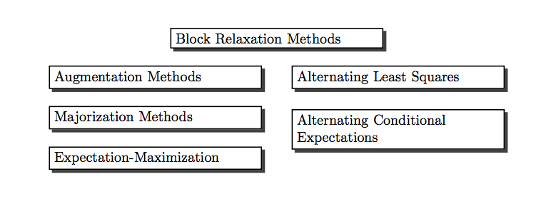

<style type="text/css">

body{ /* Normal  */
   font-size: 18px;
}
td {  /* Table  */
   font-size: 18px;
}
h1 { /* Header 1 */
 font-size: 28px;
 color: DarkBlue;
}
h2 { /* Header 2 */
 font-size: 22px;
 color: DarkBlue;
}
h3 { /* Header 3 */
 font-size: 18px;
 color: DarkBlue;
}
code.r{ /* Code block */
  font-size: 18px;
}
pre { /* Code block */
  font-size: 18px
}
</style>

```{r packages, echo = FALSE}
options (digits = 10) 
suppressPackageStartupMessages(library(captioner, quietly = TRUE))
suppressPackageStartupMessages(library(knitr, quietly = TRUE))
suppressPackageStartupMessages(library(microbenchmark, quietly = TRUE))
suppressPackageStartupMessages(library(numDeriv, quietly = TRUE))
```

```{r exec_code, eval = FALSE, echo = FALSE}
mprint <- function (x,
                    d = 6,
                    w = 8,
                    f = "") {
  print (noquote (formatC (
    x,
    di = d,
    wi = w,
    fo = "f",
    flag = f
  )))
}

blockRelax <-
  function (f,
            x,
            g,
            itmax = 100,
            eps = 1e-8,
            verbose = TRUE) {
    k <- split (1:length (x), g)
    m <- length (k)
    fold <- f (x)
    itel <- 1
    blockFun <- function (z,  g,  y, i) {
      y[i] <- z
      return (g (y))
    }
    repeat {
      for (i in 1:m) {
        kk <- k[[i]]
        o <-
          optim (
            x[kk],
            blockFun,
            gr = NULL,
            g = f,
            y = x,
            i = kk,
            method = "BFGS"
          )
        x[kk] <- o$par
        fnew <- o$value
      }
      if (verbose)
        cat(
          "Iteration: ",
          formatC (itel, width = 3, format = "d"),
          "fold: ",
          formatC (
            fold,
            digits = 8,
            width = 12,
            format = "f"
          ),
          "fnew: ",
          formatC (
            fnew,
            digits = 8,
            width = 12,
            format = "f"
          ),
          "\n"
        )
      if ((itel == itmax) || ((fold - fnew) < eps))
        break
      itel <- itel + 1
      fold <- fnew
    }
    return (list (x = x, f = fnew))
  }

blockRate <- function (f, x, blocks = as.list (1:length(x)), numerical = FALSE, product_form = FALSE) {
    if (numerical) {
        h <- hessian (f, x)
    } else {
        h <- f (x)
    }
    nvar <- length (x)
    nblocks <- length (blocks)
    nb <- 1:nblocks
    nn <- 1:nvar
    g <- sapply (nn, function (i) which (sapply (blocks, function (x) any (i==x))))
    if (product_form) {
        sder <- diag (nvar)
        for (i in nb) {
            bi <- blocks [[i]]
            ei <- ifelse (outer(nn, bi, "=="), 1, 0)
            sder <- (diag(nvar) - ei %*% solve (h[bi,bi], h[bi, , drop=FALSE])) %*% sder
            }
        } else {
            alow <- h * ifelse (outer (g, g, ">="), 1, 0)
            sder <- - solve (alow, h - alow)
        }
    return (sder)
}

cobwebPlotter <- function (xold, func, lowx = 0, hghx = 1, lowy = lowx, hghy = hghx,
                     eps = 1e-10, itmax = 25, ...) {
    x <- seq (lowx, hghx, length = 100)
    y <- sapply (x, function (x) func (x, ...))
    plot (x, y, xlim = c(lowx ,hghx), ylim = c(lowy,hghy),
          type = "l", col = "RED", lwd = 2)
    abline (0, 1, col = "BLUE")
    base <- 0
    itel <- 1
    repeat {
        xnew <- func (xold, ...)
        if (itel > 1) {
            lines (matrix(c(xold,xold,base,xnew),2,2))
        }
        lines (matrix(c(xold,xnew,xnew,xnew),2,2))
        if ((abs (xnew - xold) < eps) || (itel == itmax)) {
            break ()
        }
        base <- xnew
        xold <- xnew
        itel <- itel + 1
    }
}
```

```{r captioner, echo = FALSE}
figure_nums <- captioner (prefix = "Figure")
table_nums <- captioner (prefix = "Table")
lemma_nums <- captioner (prefix = "Lemma")
theorem_nums <- captioner (prefix = "Theorem")
corollary_nums <- captioner (prefix = "Corollary")
code_nums <- captioner (prefix = "Code Segment")
code_nums(name = "blockrelax", caption = "Block Relaxation", display = FALSE)
code_nums(name = "mls", caption = "Block Least Squares", display = FALSE)
code_nums(name = "blockrate", caption = "Block Rate", display = FALSE)
code_nums(name = "cobwebplotter", caption = "Cobweb Plotter", display = FALSE)
```

\newcommand{\ul}[1]{\underline{#1}}
\newcommand{\ol}[1]{\overline{#1}}
\newcommand{\bb}[1]{\mathbb{#1}}
\newcommand{\mc}[1]{\mathcal{#1}}
\newcommand{\df}{=:}
\newcommand{\am}[1]{\mathop{\text{argmin}}_{#1}}
\newcommand{\ls}[2]{\mathop{\sum\sum}_{#1}^{#2}}
\newcommand{\ijs}{\mathop{\sum\sum}_{1\leq i<j\leq n}}
\newcommand{\jis}{\mathop{\sum\sum}_{1\leq j<i\leq n}}
\newcommand{\sij}{\sum_{i=1}^n\sum_{j=1}^n}

# Note {-}

This book will be expanded/updated frequently and unpredictably. 
The directory [deleeuwpdx.net/pubfolders/stress](http://deleeuwpdx.net/pubfolders/stress) has a pdf version, the bib file, the complete Rmd file with the code chunks, the R and C source code, and whatever else is needed for perfect reproducibility.  Suggestions for improvement of text and code are welcome. All text and code are in the public domain and can be copied and used by anybody in any way they like. Attribution will be appreciated, but is not required. 

Just as an aside: "above" in the text refers to anything that comes earlier in the book and "below" refers to anything that comes later. This always confuses me, so I had to write it down. I also number *all* displayed equations. Equations are displayed if and only if they are important, are referred to in the text, or mess up the line spacing.

# Preface {-}

Many recent algorithms in computational statistics
are variations on a common theme. In this book we discuss four such classes of algorithms. Or, more precisely, we discuss a single large class of algorithms, and we show how various well-known classes of statistical algorithms fit into
this common framework. The types of algorithms we consider are, in logical order,

```{r bookfig1, fig.align = "center", fig.cap = "Algorithm Types", echo = FALSE}

```

There is not much statistics, in the sense of data analysis or inference, in this book. It is almost exclusively about deterministic optimization problems
(although we shall optimize a likelihood function or
two). Some of our results have been derived in the statistical literature in the context of maximizing a multinomial or multinormal likelihood function. In most cases statisticians have developed their own results, not relying on the more comprehensive results in the optimization literature. We will try, from the start, to use existing results and apply them to our specific optimization methods.

There are many, many excellent books on optimization and mathematical programming. Without a doubt the canonical reference for statisticians is, and will be for many years to come, the book by @lange_13. In particular his chapters 7,8, 9, and 12 have substantial overlap with this book. There is even more overlap with the book in progress _MM Optimization Algorithms_ [@lange_16].

For the record, the books that have been most useful to me throughout my personal optimization career are @ortega_rheinboldt_70b,
@ostrowski_66, @rockafellar_70, and, above all,  @zangwill_69. They were all published in a five year interval, at the end of the sixties. Around that time also started the ten-year period of my greatest intellectual curiosity and creativity.

Throughout the book we try to present our results in three different languages: the language of mathematics, the language of graphics, and the programming language `R`. We use `R` for all computations, tables, and figures [@r_core_16].
In fact, all figures and tables are dynamically generated by chunks of `R` code using `knitr` [@xie_15] and `bookdown` [@xie_16] .

There are many examples throughout the book. They are usually presented in considerable and sometimes exasperating detail, with code, computations, and figures. I like to work on such examples, so please indulge me. It is nice to have an infinite number of pages available. The examples are mostly in separate subsections, so if you do not like them you can easily skip them.

In many cases the examples are simple one-dimensional optimization problems, which is maybe surprising, because the techniques
we discuss are largely intended for high-dimensional problems. To further simplify the examples the functions involved are often cubic or quartic polynomials. Thus these small examples are not particularly representative for the types of applications we are interested in, but they are used to produce nice graphs, a more complete analysis, and illustrations of various general principles and properties. Also it sometimes makes sense to think of the polynomial examples as _models_, in the same sense in which the quadratic is a model for Newton's method.

Many of the remaining examples are taken from multivariate statistical analysis, which we define in the broadest possible sense. It includes data analysis using linear and bilinear algebra, and in particular it includes multidimensional scaling and cluster analysis. Given my history, it is probably not surprising that many examples have their origin in psychometrics, and more  specifically in publications of researchers directly or loosely associated with the Data Theory group at Leiden University, starting in 1968. See @vanderheijden_sijtsma_96.

We take the point of view in this book that having global convergence of an iterative algorithm, i.e. convergence from an arbitrary starting point, is a desirable property. But it is neither necessary nor sufficient for the usefulness of the algorithm, because in addition one needs information about its speed of convergence. We try to give as much information as possible about _convergence speed_ and _complexity_ in our presentation of the examples.

It should be noted that this book is a corrected, updated, and expanded version of a twenty-five year old chapter in a conference proceedings volume [@deleeuw_C_94c]. It will not be possible to erase all the traces of these humble beginnings. Specifically, references will often be to material from before 1994, and more recent work will probably be less completely covered.

Much of the material in this book is pasted together from published and unpublished papers and reports. This may lead to inconsistencies in the notation and to annoying duplications. Over time I will eliminate these blemishes as much as possible.

Items in the bibliography freely available on the
internet are hyperlinked by title to external pdf files. This includes all published and unpublished works authored or co-authored by me. They can also be found in my bibliography of about 750 items, most of them linked to pdf files, on my server [gifi.stat.ucla.edu](http://gifi.stat.ucla.edu/janspubs/0_bib_material/index.html).

